# Repository Call Graph Analysis

Comprehensive structural call graph and runtime entry point trace for NetVisor, covering:
- **Backend**: `backend/` (API routers, services, engines, middleware, core, db, utils)
- **Agent Bundle**: `agent/` (core daemon, device detection, DPI interception, security transport)
- **Shared Modules**: `packet_engine/`, `intel/`, `security/`

All call edges reflect intra-repository function and method invocations, omitting external 3rd-party libraries.

## Table of Contents
1. [Runtime Entry Point Traces](#1-runtime-entry-point-traces)
   - [Trace 1: Agent Packet Capture -> Flow Upload](#trace-1-agent-mainpy---process_packet---flow-upload)
   - [Trace 2: DPI Interception Hook -> Redaction & Ingestion](#trace-2-agentdpimitm_addonpy---response---redaction--ingestion)
   - [Trace 3: Agent Secure Transport -> Signing & TLS Pin Enforcement](#trace-3-agentsecuritytransportpy---agentapiclientrequest---signing--tls-pin-enforcement)
2. [Structural Call Graph by Subsystem & Module](#2-structural-call-graph-by-subsystem--module)
   - [Agent Core](#agent-core)
   - [Agent DPI & Web Inspection](#agent-dpi-web-inspection)
   - [Agent Security & Cryptography](#agent-security-cryptography)
   - [Backend Root & Lifespan](#backend-root-lifespan)
   - [Backend Core Configuration & Security](#backend-core-configuration-security)
   - [Backend REST API Routers](#backend-rest-api-routers)
   - [Backend Core Services](#backend-core-services)
   - [Backend Detection & Correlation Engines](#backend-detection-correlation-engines)
   - [Backend Database & Cache Access](#backend-database-cache-access)
   - [Backend Middleware & Protection](#backend-middleware-protection)
   - [Backend Machine Learning](#backend-machine-learning)
   - [Backend Data Schemas](#backend-data-schemas)
   - [Backend Utilities](#backend-utilities)
   - [Shared Packet Engine](#shared-packet-engine)
   - [Shared Threat & App Intelligence](#shared-threat-app-intelligence)
   - [Shared Cryptography & Auth Protocols](#shared-cryptography-auth-protocols)

## 1. Runtime Entry Point Traces

Detailed leaf-by-leaf runtime execution call chains for critical system paths.

### Trace 1: `agent/main.py` -> `process_packet()` -> Flow Upload

```mermaid
sequenceDiagram
    autonumber
    participant Sniffer as Capture Backend (Scapy/Raw)
    participant Agent as NetworkAgent (agent/main.py)
    participant Parser as PacketObservation (packet_engine/metadata.py)
    participant FlowMgr as FlowManager (packet_engine/flow_aggregator.py)
    participant UploadWorker as NetworkAgent._upload_worker
    participant Transport as AgentApiClient (agent/security/transport.py)
    participant API as Flows API (backend/api/flows.py)
    participant FlowSvc as FlowService (backend/services/flow_service.py)
    participant Sanitizer as FlowSanitizationService

    Sniffer->>Agent: process_packet(packet)
    Agent->>Parser: PacketObservation.from_packet(packet, domain_cache)
    Parser-->>Agent: observation
    Agent->>FlowMgr: update_from_observation(observation)
    Note over FlowMgr: Update ActiveFlow stats;<br/>Check flush/timeout thresholds
    FlowMgr->>Agent: on_flow_expired(summary) [Callback]
    Agent->>Agent: self.upload_q.put(summary.__dict__)
    Note over UploadWorker: Async thread drains upload_q
    UploadWorker->>Transport: request('POST', flow_url, json_body=batch)
    Transport->>API: POST /api/v1/collect/flow/batch
    API->>FlowSvc: buffer_flows(flows)
    Note over FlowSvc: Queued into durable SQL batch table
    FlowSvc->>Sanitizer: sanitize_flow(flow, org_id)
    Sanitizer-->>FlowSvc: SanitizedFlow (deduped by ingest_hash)
```

**Exact Call Chain:**
1. `agent/main.py::NetworkAgent.process_packet(packet)` [Line 583]
   - Calls `packet_engine/metadata.py::PacketObservation.from_packet(packet, source_type='agent', metadata_only=False, domain_cache=self.domain_cache)`
     - Calls `packet_engine/metadata.py::extract_flow_hints(packet, domain_cache)`
       - Calls `packet_engine/metadata.py::extract_ja4_fingerprint(packet)` for TLS ClientHello
       - Calls `packet_engine/metadata.py::DomainHintCache.observe_dns()` / `lookup()`
   - Calls `packet_engine/flow_aggregator.py::FlowManager.update_from_observation(observation)` [Line 233]
     - Calls `packet_engine/parser.py::PacketObservation.flow_key()` to derive 5-tuple key
     - Calls `packet_engine/flow_aggregator.py::ActiveFlow.update(observation)`
     - When flow expires or is flushed: calls `packet_engine/flow_aggregator.py::FlowManager._flush_flow(key)`
       - Dispatches to callback: `agent/main.py::NetworkAgent._on_flow_expired(summary)` [Line 574]
         - Puts payload into `self.upload_q.put(summary.__dict__, block=False)`
2. `agent/main.py::NetworkAgent._upload_worker()` [Background Thread, Line 615]
   - Pulls batches from `self.upload_q.get(timeout=1.0)`
   - Calls `agent/security/transport.py::AgentApiClient.request('POST', self.flow_url, json_body=batch)` [Line 633]
3. `backend/api/flows.py::ingest_batch(flows)` [Line 41]
   - Authenticated via FastAPI dependency: `backend/api/agents.py::validate_agent_key`
   - Calls `backend/services/flow_service.py::FlowService.buffer_flows(flows)` [Line 1152]
   - In background batch processing worker `FlowService._process_batch()` [Line 1270]:
     - Calls `backend/services/flow_sanitization_service.py::FlowSanitizationService.sanitize_flow(flow, organization_id)` [Line 1297]
     - Classifies network scope via `backend/utils/network.py::classify_ip_scope()`
     - Computes SHA1 hash via `backend/services/flow_sanitization_service.py::SanitizedFlow.ingest_hash`
     - Persists to DB, updates device inventory, and evaluates threat/risk engines.

### Trace 2: `agent/dpi/mitm_addon.py` -> `response()` -> Redaction & Ingestion

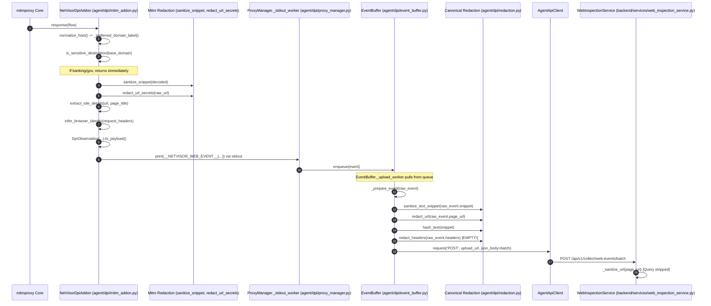

**Exact Call Chain:**
1. Intercepted HTTP response fires hook: `agent/dpi/mitm_addon.py::NetVisorDpiAddon.response(flow)` [Line 458]
   - Calls `intel/domain_utils.py::normalize_host()`
   - Calls `agent/dpi/mitm_addon.py::_preferred_domain_label(host)` [Line 140]
     - Calls `intel/domain_utils.py::get_base_domain()`
     - Calls `intel/app_classifier.py::get_service_info()`
   - Calls `intel/domain_intelligence.py::is_sensitive_destination(base_domain)` [Line 468] -> **Early exit if sensitive**
   - If response is textual:
     - Calls `agent/dpi/mitm_addon.py::sanitize_snippet(decoded)` [Line 223] -> **Local regex redacting passwords/bearer tokens**
     - Calls `agent/dpi/mitm_addon.py::extract_page_title(raw_content)` [Line 153]
   - Calls `agent/dpi/mitm_addon.py::redact_url_secrets(raw_url)` [Line 231] -> **Local regex redacting URL secret keys**
   - Calls `agent/dpi/mitm_addon.py::extract_site_details(url, page_title)` [Line 176]
   - Calls `agent/dpi/mitm_addon.py::infer_browser_identity(request_headers)` [Line 90]
     - Calls `agent/dpi/mitm_addon.py::_find_header(headers, name)` [Line 41]
   - Instantiates `packet_engine/parser.py::DpiObservation` and calls `.to_payload()` [Line 509]
     - *NOTE: `headers` are omitted from DpiObservation*
   - Emits serialized JSON with prefix `__NETVISOR_WEB_EVENT__` to stdout [Line 528]
2. `agent/dpi/proxy_manager.py::ProxyManager._stdout_worker()` [Line 256]
   - Reads line from stdout, strips prefix, deserializes JSON
   - Invokes callback `on_event`: `agent/dpi/event_buffer.py::EventBuffer.enqueue(event)` [Line 127]
3. `agent/dpi/event_buffer.py::EventBuffer._upload_worker()` [Line 258]
   - Calls `agent/dpi/event_buffer.py::EventBuffer._prepare_event(raw_event)` [Line 164]
     - Calls `agent/dpi/redaction.py::sanitize_text_snippet(snippet)` [Line 197]
     - Calls `agent/dpi/redaction.py::redact_url(page_url)` [Line 207] -> **Second pass URL redaction (UUID/JWT/path)**
     - Calls `agent/dpi/redaction.py::hash_text(snippet)` [Line 219] -> SHA256 of snippet
     - Calls `agent/dpi/redaction.py::redact_headers(raw_event.get('headers') or {})` [Line 222] -> **Evaluates on empty dict `{}`**
   - Dispatches batch via `agent/security/transport.py::AgentApiClient.request('POST', upload_url, json_body=batch)`
   - Or if offline, spools locally: calls `agent/security/dpapi.py::DataProtector.protect()` -> writes to `web_events.spool.dpapi`
4. Backend Ingestion: `backend/services/web_inspection_service.py::WebInspectionService._coerce_event()` [Line 672]
   - Calls `backend/services/web_inspection_service.py::_sanitize_url()` [Line 658] -> Strips all query params and fragments

### Trace 3: `agent/security/transport.py` -> `AgentApiClient.request()` -> Signing & TLS Pin Enforcement

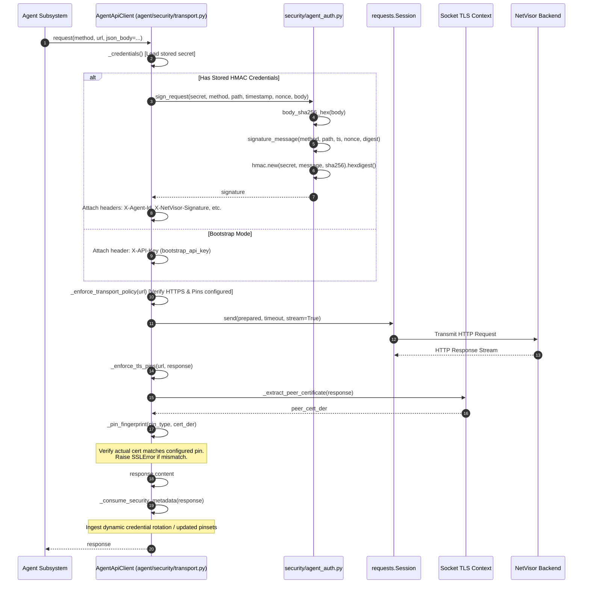

**Exact Call Chain:**
1. `agent/security/transport.py::AgentApiClient.request(method, url, json_body, params, timeout)` [Line 265]
   - Checks stored state: `agent/security/transport.py::AgentApiClient._credentials()` [Line 152]
   - If credentials present:
     - Generates timestamp `time.time()` and nonce `uuid.uuid4().hex`
     - Prepares request: `self.session.prepare_request(request_obj)`
     - Calls `security/agent_auth.py::sign_request(secret, method, path, timestamp, nonce, body)` [Line 56]
       - Calls `security/agent_auth.py::body_sha256_hex(body)` [Line 27]
       - Calls `security/agent_auth.py::signature_message(...)` [Line 37]
       - Computes HMAC-SHA256 signature
     - Injects HMAC headers: `X-Agent-Id`, `X-NetVisor-Key-Version`, `X-NetVisor-Timestamp`, `X-NetVisor-Nonce`, `X-NetVisor-Signature`
   - If bootstrap mode: injects `X-API-Key: self.bootstrap_api_key`
   - Calls `agent/security/transport.py::AgentApiClient._enforce_transport_policy(url)` [Line 233]
     - Calls `_is_local_url(url)` / `_is_private_lan_url(url)`
     - Asserts remote URL uses `https` and configured pins exist in `self._pinset()`
   - Executes request: `self.session.send(prepared, timeout=timeout, stream=True)`
   - Calls `agent/security/transport.py::AgentApiClient._enforce_tls_pins(url, response)` [Line 428]
     - Calls `_extract_peer_certificate(response)` [Line 408] -> reads `sock.getpeercert(binary_form=True)`
     - Iterates through active pins and calls `_pin_fingerprint(pin_type, certificate_der)` [Line 418]
       - Computes SHA256 of SubjectPublicKeyInfo (SPKI) or certificate DER
       - If no configured pin matches: closes response stream and raises `requests.exceptions.SSLError('Backend TLS pin mismatch.')`
   - Reads payload: `response.content`
   - Calls `agent/security/transport.py::AgentApiClient._consume_security_metadata(response)` [Line 323]
     - Parses response JSON for `agent_credentials` and `backend_tls_pins`
     - Persists changes locally via `self.store.save(...)` (DPAPI encrypted)
   - Returns response to caller.

## 2. Structural Call Graph by Subsystem & Module

Every module defines a Mermaid call flow diagram (intra-repo edges only) followed by an exhaustive inventory of functions/methods, their callers, and their callees.

### Agent Core

#### Module: `agent/device_detector.py`

```mermaid
graph TD
    agent_device_detector_py_enumerate_local_interfaces["enumerate_local_interfaces()"] --> agent_device_detector_py_normalize_mac["normalize_mac()"]
    agent_device_detector_py_enumerate_local_interfaces["enumerate_local_interfaces()"] --> agent_device_detector_py_is_loopback_interface["is_loopback_interface()"]
    agent_device_detector_py_DeviceDetector_arp_scan["arp_scan()"] --> agent_device_detector_py_DeviceDetector__is_candidate_device["_is_candidate_device()"]
    agent_device_detector_py_DeviceDetector_parse_arp_table["parse_arp_table()"] --> agent_device_detector_py_DeviceDetector__is_unicast_entry["_is_unicast_entry()"]
    agent_device_detector_py_DeviceDetector__is_candidate_device["_is_candidate_device()"] --> agent_device_detector_py_DeviceDetector__is_unicast_entry["_is_unicast_entry()"]
    agent_device_detector_py_DeviceDetector_collect_arp_candidates["collect_arp_candidates()"] --> agent_device_detector_py_DeviceDetector__is_candidate_device["_is_candidate_device()"]
    agent_device_detector_py_DeviceDetector_collect_arp_candidates["collect_arp_candidates()"] --> agent_device_detector_py_DeviceDetector_parse_arp_table["parse_arp_table()"]
    agent_device_detector_py_DeviceDetector_collect_arp_candidates["collect_arp_candidates()"] --> agent_device_detector_py_DeviceDetector_arp_scan["arp_scan()"]
    agent_device_detector_py_DeviceDetector_get_netbios_name["get_netbios_name()"] --> agent_device_detector_py_DeviceDetector__normalize_hostname["_normalize_hostname()"]
    agent_device_detector_py_DeviceDetector_get_dns_name["get_dns_name()"] --> agent_device_detector_py_DeviceDetector__normalize_hostname["_normalize_hostname()"]
    agent_device_detector_py_DeviceDetector_get_nbtstat_name["get_nbtstat_name()"] --> agent_device_detector_py_DeviceDetector__normalize_hostname["_normalize_hostname()"]
    agent_device_detector_py_DeviceDetector_get_ping_name["get_ping_name()"] --> agent_device_detector_py_DeviceDetector__parse_ping_hostname["_parse_ping_hostname()"]
    agent_device_detector_py_DeviceDetector__extract_xml_name["_extract_xml_name()"] --> agent_device_detector_py_DeviceDetector__normalize_hostname["_normalize_hostname()"]
    agent_device_detector_py_DeviceDetector_get_roku_name["get_roku_name()"] --> agent_device_detector_py_DeviceDetector__extract_xml_name["_extract_xml_name()"]
    agent_device_detector_py_DeviceDetector_get_roku_name["get_roku_name()"] --> agent_device_detector_py_DeviceDetector__http_get_text["_http_get_text()"]
    agent_device_detector_py_DeviceDetector_get_chromecast_name["get_chromecast_name()"] --> agent_device_detector_py_DeviceDetector__normalize_hostname["_normalize_hostname()"]
    agent_device_detector_py_DeviceDetector_get_chromecast_name["get_chromecast_name()"] --> agent_device_detector_py_DeviceDetector__http_get_text["_http_get_text()"]
    agent_device_detector_py_DeviceDetector__discover_upnp_locations["_discover_upnp_locations()"] --> agent_device_detector_py_DeviceDetector__parse_ssdp_location["_parse_ssdp_location()"]
    agent_device_detector_py_DeviceDetector_get_upnp_name["get_upnp_name()"] --> agent_device_detector_py_DeviceDetector__extract_xml_name["_extract_xml_name()"]
    agent_device_detector_py_DeviceDetector_get_upnp_name["get_upnp_name()"] --> agent_device_detector_py_DeviceDetector__discover_upnp_locations["_discover_upnp_locations()"]
    agent_device_detector_py_DeviceDetector_get_upnp_name["get_upnp_name()"] --> agent_device_detector_py_DeviceDetector__http_get_text["_http_get_text()"]
    agent_device_detector_py_DeviceDetector__parse_ping_hostname["_parse_ping_hostname()"] --> agent_device_detector_py_DeviceDetector__normalize_hostname["_normalize_hostname()"]
    agent_device_detector_py_DeviceDetector_infer_device_type["infer_device_type()"] --> agent_device_detector_py_DeviceDetector_resolve_vendor["resolve_vendor()"]
    agent_device_detector_py_DeviceDetector_infer_device_type["infer_device_type()"] --> agent_device_detector_py_DeviceDetector_detect_device_type["detect_device_type()"]
    agent_device_detector_py_DeviceDetector_identity_confidence["identity_confidence()"] --> agent_device_detector_py_DeviceDetector__is_unicast_entry["_is_unicast_entry()"]
    agent_device_detector_py_DeviceDetector_identity_confidence["identity_confidence()"] --> agent_device_detector_py_DeviceDetector__normalize_hostname["_normalize_hostname()"]
    agent_device_detector_py_DeviceDetector_full_scan["full_scan()"] --> agent_device_detector_py_DeviceDetector_collect_arp_candidates["collect_arp_candidates()"]
    agent_device_detector_py_DeviceDetector_resolve_device["resolve_device()"] --> agent_device_detector_py_DeviceDetector_resolve_hostname["resolve_hostname()"]
    agent_device_detector_py_DeviceDetector_resolve_device["resolve_device()"] --> agent_device_detector_py_DeviceDetector_detect_virtual_mac["detect_virtual_mac()"]
    agent_device_detector_py_DeviceDetector_resolve_device["resolve_device()"] --> agent_device_detector_py_DeviceDetector_detect_device_type["detect_device_type()"]
    agent_device_detector_py_device_compatibility_wrapper["device_compatibility_wrapper()"] --> agent_device_detector_py_DeviceDetector_infer_device_type["infer_device_type()"]
    agent_device_detector_py_device_compatibility_wrapper["device_compatibility_wrapper()"] --> agent_device_detector_py_DeviceDetector_resolve_vendor["resolve_vendor()"]
    agent_device_detector_py_device_compatibility_wrapper["device_compatibility_wrapper()"] --> agent_device_detector_py_DeviceDetector___init__["__init__()"]
    agent_device_detector_py_device_compatibility_wrapper["device_compatibility_wrapper()"] --> agent_device_detector_py_DeviceDetector_resolve_hostname["resolve_hostname()"]
    agent_device_detector_py_device_compatibility_wrapper["device_compatibility_wrapper()"] --> agent_device_detector_py_DeviceDetector_identity_confidence["identity_confidence()"]
```

| Function / Method | Line | Incoming Callers (Called By) | Outgoing Calls (Calls) |
| :--- | :--- | :--- | :--- |
| **`normalize_mac`** | 80 | `agent/device_detector.py::enumerate_local_interfaces` | *None* |
| **`is_loopback_interface`** | 106 | `agent/device_detector.py::enumerate_local_interfaces` | *None* |
| **`enumerate_local_interfaces`** | 118 | `agent/main.py::NetworkAgent._detect_interfaces` | `agent/device_detector.py::normalize_mac`<br/>`agent/device_detector.py::is_loopback_interface` |
| **`DeviceDetector.__init__`** | 226 | `agent/device_detector.py::device_compatibility_wrapper`<br/>`agent/main.py::NetworkAgent.__init__` | *None* |
| **`DeviceDetector.set_network`** | 233 | `agent/main.py::NetworkAgent.__init__` | *None* |
| **`DeviceDetector.infer_local_network`** | 236 | `agent/main.py::NetworkAgent.__init__` | *None* |
| **`DeviceDetector.arp_scan`** | 261 | `agent/device_detector.py::DeviceDetector.collect_arp_candidates` | `agent/device_detector.py::DeviceDetector._is_candidate_device` |
| **`DeviceDetector.parse_arp_table`** | 287 | `agent/device_detector.py::DeviceDetector.collect_arp_candidates` | `agent/device_detector.py::DeviceDetector._is_unicast_entry` |
| **`DeviceDetector._is_unicast_entry`** | 306 | `agent/device_detector.py::DeviceDetector._is_candidate_device`<br/>`agent/device_detector.py::DeviceDetector.parse_arp_table`<br/>`agent/device_detector.py::DeviceDetector.identity_confidence` | *None* |
| **`DeviceDetector._is_candidate_device`** | 325 | `agent/device_detector.py::DeviceDetector.collect_arp_candidates`<br/>`agent/device_detector.py::DeviceDetector.arp_scan` | `agent/device_detector.py::DeviceDetector._is_unicast_entry` |
| **`DeviceDetector.collect_arp_candidates`** | 342 | `agent/device_detector.py::DeviceDetector.full_scan`<br/>`agent/main.py::NetworkAgent._discovery_engine` | `agent/device_detector.py::DeviceDetector._is_candidate_device`<br/>`agent/device_detector.py::DeviceDetector.parse_arp_table`<br/>`agent/device_detector.py::DeviceDetector.arp_scan` |
| **`DeviceDetector.get_netbios_name`** | 358 | *None (0 incoming)* | `agent/device_detector.py::DeviceDetector._normalize_hostname` |
| **`DeviceDetector.get_dns_name`** | 387 | *None (0 incoming)* | `agent/device_detector.py::DeviceDetector._normalize_hostname` |
| **`DeviceDetector.get_nbtstat_name`** | 394 | *None (0 incoming)* | `agent/device_detector.py::DeviceDetector._normalize_hostname` |
| **`DeviceDetector.get_ping_name`** | 414 | *None (0 incoming)* | `agent/device_detector.py::DeviceDetector._parse_ping_hostname` |
| **`DeviceDetector._http_get_text`** | 433 | `agent/device_detector.py::DeviceDetector.get_roku_name`<br/>`agent/device_detector.py::DeviceDetector.get_upnp_name`<br/>`agent/device_detector.py::DeviceDetector.get_chromecast_name` | *None* |
| **`DeviceDetector._extract_xml_name`** | 442 | `agent/device_detector.py::DeviceDetector.get_roku_name`<br/>`agent/device_detector.py::DeviceDetector.get_upnp_name` | `agent/device_detector.py::DeviceDetector._normalize_hostname` |
| **`DeviceDetector.get_roku_name`** | 466 | *None (0 incoming)* | `agent/device_detector.py::DeviceDetector._extract_xml_name`<br/>`agent/device_detector.py::DeviceDetector._http_get_text` |
| **`DeviceDetector.get_chromecast_name`** | 470 | *None (0 incoming)* | `agent/device_detector.py::DeviceDetector._normalize_hostname`<br/>`agent/device_detector.py::DeviceDetector._http_get_text` |
| **`DeviceDetector._parse_ssdp_location`** | 489 | `agent/device_detector.py::DeviceDetector._discover_upnp_locations` | *None* |
| **`DeviceDetector._discover_upnp_locations`** | 500 | `agent/device_detector.py::DeviceDetector.get_upnp_name` | `agent/device_detector.py::DeviceDetector._parse_ssdp_location` |
| **`DeviceDetector.get_upnp_name`** | 547 | *None (0 incoming)* | `agent/device_detector.py::DeviceDetector._extract_xml_name`<br/>`agent/device_detector.py::DeviceDetector._discover_upnp_locations`<br/>`agent/device_detector.py::DeviceDetector._http_get_text` |
| **`DeviceDetector.resolve_hostname`** | 557 | `agent/device_detector.py::DeviceDetector.resolve_device`<br/>`agent/device_detector.py::device_compatibility_wrapper`<br/>`agent/main.py::NetworkAgent._resolve_discovered_device` | *None* |
| **`DeviceDetector._parse_ping_hostname`** | 580 | `agent/device_detector.py::DeviceDetector.get_ping_name` | `agent/device_detector.py::DeviceDetector._normalize_hostname` |
| **`DeviceDetector._normalize_hostname`** | 591 | `agent/device_detector.py::DeviceDetector.get_dns_name`<br/>`agent/device_detector.py::DeviceDetector.get_nbtstat_name`<br/>`agent/device_detector.py::DeviceDetector._parse_ping_hostname`<br/>`agent/device_detector.py::DeviceDetector._extract_xml_name`<br/>`agent/device_detector.py::DeviceDetector.get_netbios_name`<br/>`agent/device_detector.py::DeviceDetector.get_chromecast_name`<br/>`agent/device_detector.py::DeviceDetector.identity_confidence` | *None* |
| **`DeviceDetector.detect_device_type`** | 610 | `agent/device_detector.py::DeviceDetector.resolve_device`<br/>`agent/device_detector.py::DeviceDetector.infer_device_type`<br/>`agent/main.py::NetworkAgent._resolve_discovered_device` | *None* |
| **`DeviceDetector.resolve_vendor`** | 644 | `agent/device_detector.py::device_compatibility_wrapper`<br/>`agent/device_detector.py::DeviceDetector.infer_device_type` | *None* |
| **`DeviceDetector.infer_device_type`** | 656 | `agent/device_detector.py::device_compatibility_wrapper` | `agent/device_detector.py::DeviceDetector.resolve_vendor`<br/>`agent/device_detector.py::DeviceDetector.detect_device_type` |
| **`DeviceDetector.identity_confidence`** | 679 | `agent/device_detector.py::device_compatibility_wrapper` | `agent/device_detector.py::DeviceDetector._is_unicast_entry`<br/>`agent/device_detector.py::DeviceDetector._normalize_hostname` |
| **`DeviceDetector.detect_virtual_mac`** | 696 | `agent/device_detector.py::DeviceDetector.resolve_device` | *None* |
| **`DeviceDetector.full_scan`** | 702 | *None (0 incoming)* | `agent/device_detector.py::DeviceDetector.collect_arp_candidates` |
| **`DeviceDetector.resolve_device`** | 721 | *None (0 incoming)* | `agent/device_detector.py::DeviceDetector.resolve_hostname`<br/>`agent/device_detector.py::DeviceDetector.detect_virtual_mac`<br/>`agent/device_detector.py::DeviceDetector.detect_device_type` |
| **`device_compatibility_wrapper`** | 740 | *None (0 incoming)* | `agent/device_detector.py::DeviceDetector.infer_device_type`<br/>`agent/device_detector.py::DeviceDetector.resolve_vendor`<br/>`agent/device_detector.py::DeviceDetector.__init__`<br/>`agent/device_detector.py::DeviceDetector.resolve_hostname`<br/>`agent/device_detector.py::DeviceDetector.identity_confidence` |

#### Module: `agent/main.py`

```mermaid
graph TD
    agent_main_py_DeviceInventory___init__["__init__()"] --> agent_main_py_DeviceInventory_load_inventory["load_inventory()"]
    agent_main_py_DeviceInventory___init__["__init__()"] --> agent_main_py_DeviceInventory__auto_save_worker["_auto_save_worker()"]
    agent_main_py_DeviceInventory__auto_save_worker["_auto_save_worker()"] --> agent_main_py_DeviceInventory_save_inventory["save_inventory()"]
    agent_main_py_NetworkAgent___init__["__init__()"] --> packet_engine_backend_py_build_capture_backend["backend.build_capture_backend()"]
    agent_main_py_NetworkAgent___init__["__init__()"] --> agent_main_py_NetworkAgent__assert_hardening_ready["_assert_hardening_ready()"]
    agent_main_py_NetworkAgent___init__["__init__()"] --> agent_device_detector_py_DeviceDetector_infer_local_network["device_detector.infer_local_network()"]
    agent_main_py_NetworkAgent___init__["__init__()"] --> agent_main_py_NetworkAgent__on_flow_expired["_on_flow_expired()"]
    agent_main_py_NetworkAgent___init__["__init__()"] --> agent_main_py_NetworkAgent__load_config["_load_config()"]
    agent_main_py_NetworkAgent___init__["__init__()"] --> packet_engine_flow_aggregator_py_FlowManager___init__["flow_aggregator.__init__()"]
    agent_main_py_NetworkAgent___init__["__init__()"] --> agent_traffic_metadata_py_DomainHintCache___init__["traffic_metadata.__init__()"]
    agent_main_py_NetworkAgent___init__["__init__()"] --> agent_security_transport_py_AgentApiClient_has_credentials["transport.has_credentials()"]
    agent_main_py_NetworkAgent___init__["__init__()"] --> agent_main_py_DeviceInventory___init__["__init__()"]
    agent_main_py_NetworkAgent___init__["__init__()"] --> agent_main_py_NetworkAgent__init_agent_id["_init_agent_id()"]
    agent_main_py_NetworkAgent___init__["__init__()"] --> agent_device_detector_py_DeviceDetector___init__["device_detector.__init__()"]
    agent_main_py_NetworkAgent___init__["__init__()"] --> packet_engine_metadata_py_DomainHintCache___init__["metadata.__init__()"]
    agent_main_py_NetworkAgent___init__["__init__()"] --> agent_dpi_quic_guard_py_QuicGuard___init__["quic_guard.__init__()"]
    agent_main_py_NetworkAgent___init__["__init__()"] --> agent_main_py_NetworkAgent__resolve_initial_organization_id["_resolve_initial_organization_id()"]
    agent_main_py_NetworkAgent___init__["__init__()"] --> agent_device_detector_py_DeviceDetector_set_network["device_detector.set_network()"]
    agent_main_py_NetworkAgent___init__["__init__()"] --> agent_main_py_NetworkAgent__init_device_uuid["_init_device_uuid()"]
    agent_main_py_NetworkAgent___init__["__init__()"] --> agent_main_py_NetworkAgent__detect_local_ip["_detect_local_ip()"]
    agent_main_py_NetworkAgent___init__["__init__()"] --> agent_main_py_NetworkAgent__start_operational_workers["_start_operational_workers()"]
    agent_main_py_NetworkAgent___init__["__init__()"] --> agent_dpi_quic_guard_py_QuicGuard_cleanup_orphaned_rules["quic_guard.cleanup_orphaned_rules()"]
    agent_main_py_NetworkAgent___init__["__init__()"] --> agent_security_transport_py_AgentApiClient___init__["transport.__init__()"]
    agent_main_py_NetworkAgent___init__["__init__()"] --> agent_security_integrity_py_verify_agent_code_integrity["integrity.verify_agent_code_integrity()"]
    agent_main_py_NetworkAgent___init__["__init__()"] --> agent_main_py_NetworkAgent__detect_interfaces["_detect_interfaces()"]
    agent_main_py_NetworkAgent___init__["__init__()"] --> agent_main_py_NetworkAgent__register_agent["_register_agent()"]
    agent_main_py_NetworkAgent___init__["__init__()"] --> agent_main_py_NetworkAgent__load_initial_backend_pins["_load_initial_backend_pins()"]
    agent_main_py_NetworkAgent__hardening_findings["_hardening_findings()"] --> agent_security_transport_py_AgentApiClient_has_credentials["transport.has_credentials()"]
    agent_main_py_NetworkAgent__hardening_findings["_hardening_findings()"] --> agent_security_transport_py_AgentApiClient_status_snapshot["transport.status_snapshot()"]
    agent_main_py_NetworkAgent_status_snapshot["status_snapshot()"] --> agent_dpi_controller_py_WebInspectionController_status_snapshot["controller.status_snapshot()"]
    agent_main_py_NetworkAgent_status_snapshot["status_snapshot()"] --> packet_engine_flow_aggregator_py_FlowManager_status_snapshot["flow_aggregator.status_snapshot()"]
    agent_main_py_NetworkAgent_status_snapshot["status_snapshot()"] --> agent_security_transport_py_AgentApiClient_status_snapshot["transport.status_snapshot()"]
    agent_main_py_NetworkAgent_status_snapshot["status_snapshot()"] --> agent_main_py_NetworkAgent__hardening_findings["_hardening_findings()"]
    agent_main_py_NetworkAgent__assert_hardening_ready["_assert_hardening_ready()"] --> agent_main_py_NetworkAgent_status_snapshot["status_snapshot()"]
    agent_main_py_NetworkAgent__start_operational_workers["_start_operational_workers()"] --> agent_main_py_NetworkAgent__upload_worker["_upload_worker()"]
    agent_main_py_NetworkAgent__start_operational_workers["_start_operational_workers()"] --> agent_main_py_NetworkAgent__discovery_engine["_discovery_engine()"]
    agent_main_py_NetworkAgent__start_operational_workers["_start_operational_workers()"] --> agent_main_py_NetworkAgent__heartbeat_worker["_heartbeat_worker()"]
    agent_main_py_NetworkAgent__start_operational_workers["_start_operational_workers()"] --> agent_dpi_controller_py_WebInspectionController_start["controller.start()"]
    agent_main_py_NetworkAgent__start_operational_workers["_start_operational_workers()"] --> agent_dpi_controller_py_WebInspectionController_status_snapshot["controller.status_snapshot()"]
    agent_main_py_NetworkAgent__start_operational_workers["_start_operational_workers()"] --> agent_dpi_controller_py_WebInspectionController___init__["controller.__init__()"]
    agent_main_py_NetworkAgent__start_operational_workers["_start_operational_workers()"] --> agent_main_py_NetworkAgent__stats_reporter_worker["_stats_reporter_worker()"]
    agent_main_py_NetworkAgent__stats_reporter_worker["_stats_reporter_worker()"] --> agent_main_py_NetworkAgent_status_snapshot["status_snapshot()"]
    agent_main_py_NetworkAgent__register_agent["_register_agent()"] --> agent_security_transport_py_AgentApiClient_bootstrap_post["transport.bootstrap_post()"]
    agent_main_py_NetworkAgent__register_agent["_register_agent()"] --> agent_security_transport_py_AgentApiClient_has_credentials["transport.has_credentials()"]
    agent_main_py_NetworkAgent__register_agent["_register_agent()"] --> agent_dpi_controller_py_WebInspectionController_update_context["controller.update_context()"]
    agent_main_py_NetworkAgent__await_enrollment["_await_enrollment()"] --> agent_main_py_NetworkAgent__register_agent["_register_agent()"]
    agent_main_py_NetworkAgent__await_enrollment["_await_enrollment()"] --> agent_security_transport_py_AgentApiClient_has_credentials["transport.has_credentials()"]
    agent_main_py_NetworkAgent_process_packet["process_packet()"] --> packet_engine_flow_aggregator_py_FlowManager_update_from_observation["flow_aggregator.update_from_observation()"]
    agent_main_py_NetworkAgent_process_packet["process_packet()"] --> packet_engine_parser_py_PacketObservation_from_packet["parser.from_packet()"]
    agent_main_py_NetworkAgent__handle_auth_rejection["_handle_auth_rejection()"] --> agent_security_transport_py_AgentApiClient_reset_enrollment["transport.reset_enrollment()"]
    agent_main_py_NetworkAgent__handle_auth_rejection["_handle_auth_rejection()"] --> agent_main_py_NetworkAgent__register_agent["_register_agent()"]
    agent_main_py_NetworkAgent__upload_worker["_upload_worker()"] --> agent_security_transport_py_AgentApiClient_request["transport.request()"]
    agent_main_py_NetworkAgent__upload_worker["_upload_worker()"] --> agent_main_py_NetworkAgent__handle_auth_rejection["_handle_auth_rejection()"]
    agent_main_py_NetworkAgent__heartbeat_worker["_heartbeat_worker()"] --> agent_security_transport_py_AgentApiClient_request["transport.request()"]
    agent_main_py_NetworkAgent__heartbeat_worker["_heartbeat_worker()"] --> agent_security_transport_py_AgentApiClient_has_credentials["transport.has_credentials()"]
    agent_main_py_NetworkAgent__heartbeat_worker["_heartbeat_worker()"] --> agent_main_py_NetworkAgent__handle_auth_rejection["_handle_auth_rejection()"]
    agent_main_py_NetworkAgent__heartbeat_worker["_heartbeat_worker()"] --> agent_dpi_controller_py_WebInspectionController_status_snapshot["controller.status_snapshot()"]
    agent_main_py_NetworkAgent__heartbeat_worker["_heartbeat_worker()"] --> agent_main_py_NetworkAgent__register_agent["_register_agent()"]
    agent_main_py_NetworkAgent__heartbeat_worker["_heartbeat_worker()"] --> agent_dpi_controller_py_WebInspectionController_update_context["controller.update_context()"]
    agent_main_py_NetworkAgent__detect_interfaces["_detect_interfaces()"] --> agent_device_detector_py_enumerate_local_interfaces["device_detector.enumerate_local_interfaces()"]
```

| Function / Method | Line | Incoming Callers (Called By) | Outgoing Calls (Calls) |
| :--- | :--- | :--- | :--- |
| **`DeviceInventory.__init__`** | 59 | `agent/main.py::NetworkAgent.__init__` | `agent/main.py::DeviceInventory.load_inventory`<br/>`agent/main.py::DeviceInventory._auto_save_worker` |
| **`DeviceInventory.load_inventory`** | 69 | `agent/main.py::DeviceInventory.__init__` | *None* |
| **`DeviceInventory._auto_save_worker`** | 78 | `agent/main.py::DeviceInventory.__init__` | `agent/main.py::DeviceInventory.save_inventory` |
| **`DeviceInventory.save_inventory`** | 84 | `agent/main.py::DeviceInventory._auto_save_worker`<br/>`agent/main.py::NetworkAgent.stop` | *None* |
| **`DeviceInventory.update`** | 94 | `agent/main.py::NetworkAgent._discovery_engine` | *None* |
| **`DeviceInventory.get`** | 114 | `agent/main.py::NetworkAgent._resolve_discovered_device` | *None* |
| **`NetworkAgent.__init__`** | 124 | `agent/main.py::main` | `packet_engine/backend.py::build_capture_backend`<br/>`agent/main.py::NetworkAgent._assert_hardening_ready`<br/>`agent/device_detector.py::DeviceDetector.infer_local_network`<br/>`agent/main.py::NetworkAgent._on_flow_expired`<br/>`agent/main.py::NetworkAgent._load_config`<br/>`packet_engine/flow_aggregator.py::FlowManager.__init__`<br/>`agent/traffic_metadata.py::DomainHintCache.__init__`<br/>`agent/security/transport.py::AgentApiClient.has_credentials`<br/>*+ 16 more...* |
| **`NetworkAgent._init_agent_id`** | 245 | `agent/main.py::NetworkAgent.__init__` | *None* |
| **`NetworkAgent._init_device_uuid`** | 257 | `agent/main.py::NetworkAgent.__init__` | *None* |
| **`NetworkAgent._load_config`** | 277 | `agent/main.py::NetworkAgent.__init__` | *None* |
| **`NetworkAgent._resolve_initial_organization_id`** | 287 | `agent/main.py::NetworkAgent.__init__` | *None* |
| **`NetworkAgent._load_initial_backend_pins`** | 295 | `agent/main.py::NetworkAgent.__init__` | *None* |
| **`NetworkAgent._hardening_findings`** | 309 | `agent/main.py::NetworkAgent.status_snapshot` | `agent/security/transport.py::AgentApiClient.has_credentials`<br/>`agent/security/transport.py::AgentApiClient.status_snapshot` |
| **`NetworkAgent.status_snapshot`** | 360 | `agent/main.py::NetworkAgent._stats_reporter_worker`<br/>`agent/main.py::NetworkAgent._assert_hardening_ready`<br/>`agent/main.py::main` | `agent/dpi/controller.py::WebInspectionController.status_snapshot`<br/>`packet_engine/flow_aggregator.py::FlowManager.status_snapshot`<br/>`agent/security/transport.py::AgentApiClient.status_snapshot`<br/>`agent/main.py::NetworkAgent._hardening_findings` |
| **`NetworkAgent._assert_hardening_ready`** | 396 | `agent/main.py::NetworkAgent.start`<br/>`agent/main.py::NetworkAgent.__init__` | `agent/main.py::NetworkAgent.status_snapshot` |
| **`NetworkAgent._start_operational_workers`** | 412 | `agent/main.py::NetworkAgent.start`<br/>`agent/main.py::NetworkAgent.__init__` | `agent/main.py::NetworkAgent._upload_worker`<br/>`agent/main.py::NetworkAgent._discovery_engine`<br/>`agent/main.py::NetworkAgent._heartbeat_worker`<br/>`agent/dpi/controller.py::WebInspectionController.start`<br/>`agent/dpi/controller.py::WebInspectionController.status_snapshot`<br/>`agent/dpi/controller.py::WebInspectionController.__init__`<br/>`agent/main.py::NetworkAgent._stats_reporter_worker` |
| **`NetworkAgent._stats_reporter_worker`** | 449 | `agent/main.py::NetworkAgent._start_operational_workers` | `agent/main.py::NetworkAgent.status_snapshot` |
| **`NetworkAgent._register_agent`** | 482 | `agent/main.py::NetworkAgent._await_enrollment`<br/>`agent/main.py::NetworkAgent.__init__`<br/>`agent/main.py::NetworkAgent._handle_auth_rejection`<br/>`agent/main.py::NetworkAgent._heartbeat_worker` | `agent/security/transport.py::AgentApiClient.bootstrap_post`<br/>`agent/security/transport.py::AgentApiClient.has_credentials`<br/>`agent/dpi/controller.py::WebInspectionController.update_context` |
| **`NetworkAgent._await_enrollment`** | 560 | `agent/main.py::NetworkAgent.start` | `agent/main.py::NetworkAgent._register_agent`<br/>`agent/security/transport.py::AgentApiClient.has_credentials` |
| **`NetworkAgent._on_flow_expired`** | 574 | `agent/main.py::NetworkAgent.__init__` | *None* |
| **`NetworkAgent.process_packet`** | 583 | *None (0 incoming)* | `packet_engine/flow_aggregator.py::FlowManager.update_from_observation`<br/>`packet_engine/parser.py::PacketObservation.from_packet` |
| **`NetworkAgent._handle_auth_rejection`** | 605 | `agent/main.py::NetworkAgent._upload_worker`<br/>`agent/main.py::NetworkAgent._heartbeat_worker` | `agent/security/transport.py::AgentApiClient.reset_enrollment`<br/>`agent/main.py::NetworkAgent._register_agent` |
| **`NetworkAgent._upload_worker`** | 615 | `agent/main.py::NetworkAgent._start_operational_workers` | `agent/security/transport.py::AgentApiClient.request`<br/>`agent/main.py::NetworkAgent._handle_auth_rejection` |
| **`NetworkAgent._heartbeat_worker`** | 658 | `agent/main.py::NetworkAgent._start_operational_workers` | `agent/security/transport.py::AgentApiClient.request`<br/>`agent/security/transport.py::AgentApiClient.has_credentials`<br/>`agent/main.py::NetworkAgent._handle_auth_rejection`<br/>`agent/dpi/controller.py::WebInspectionController.status_snapshot`<br/>`agent/main.py::NetworkAgent._register_agent`<br/>`agent/dpi/controller.py::WebInspectionController.update_context` |
| **`NetworkAgent._detect_local_ip`** | 698 | `agent/main.py::NetworkAgent.__init__` | *None* |
| **`NetworkAgent._detect_interfaces`** | 711 | `agent/main.py::NetworkAgent._detect_local_mac`<br/>`agent/main.py::NetworkAgent.__init__` | `agent/device_detector.py::enumerate_local_interfaces` |
| **`NetworkAgent._detect_local_mac`** | 716 | *None (0 incoming)* | `agent/main.py::NetworkAgent._detect_interfaces` |
| **`NetworkAgent._infer_os_family`** | 729 | `agent/main.py::NetworkAgent._resolve_discovered_device` | *None* |
| **`NetworkAgent._resolve_discovered_device`** | 743 | *None (0 incoming)* | `agent/main.py::NetworkAgent._resolve_vendor`<br/>`agent/main.py::DeviceInventory.get`<br/>`agent/main.py::NetworkAgent._infer_os_family`<br/>`agent/device_detector.py::DeviceDetector.resolve_hostname`<br/>`agent/device_detector.py::DeviceDetector.detect_device_type` |
| **`NetworkAgent._sync_discovered_devices`** | 776 | `agent/main.py::NetworkAgent._discovery_engine` | `agent/security/transport.py::AgentApiClient.request` |
| **`NetworkAgent._discovery_engine`** | 791 | `agent/main.py::NetworkAgent._start_operational_workers` | `agent/device_detector.py::DeviceDetector.collect_arp_candidates`<br/>`agent/main.py::DeviceInventory.update`<br/>`agent/main.py::NetworkAgent._sync_discovered_devices` |
| **`NetworkAgent._resolve_vendor`** | 831 | `agent/main.py::NetworkAgent._resolve_discovered_device` | *None* |
| **`NetworkAgent.stop`** | 836 | `agent/main.py::main` | `agent/main.py::DeviceInventory.save_inventory`<br/>`agent/dpi/controller.py::WebInspectionController.stop`<br/>`packet_engine/flow_aggregator.py::FlowManager.stop` |
| **`NetworkAgent.start`** | 846 | `agent/main.py::main` | `packet_engine/backend.py::build_capture_backend`<br/>`agent/main.py::NetworkAgent._assert_hardening_ready`<br/>`agent/security/transport.py::AgentApiClient.has_credentials`<br/>`agent/main.py::NetworkAgent._await_enrollment`<br/>`agent/main.py::NetworkAgent._start_operational_workers` |
| **`main`** | 871 | *None (0 incoming)* | `agent/main.py::NetworkAgent.start`<br/>`agent/main.py::NetworkAgent.stop`<br/>`packet_engine/diagnostics.py::print_preflight_report`<br/>`packet_engine/diagnostics.py::run_preflight`<br/>`agent/main.py::NetworkAgent.status_snapshot`<br/>`agent/main.py::NetworkAgent.__init__`<br/>`packet_engine/diagnostics.py::serialize_preflight_results` |

#### Module: `agent/traffic_metadata.py`

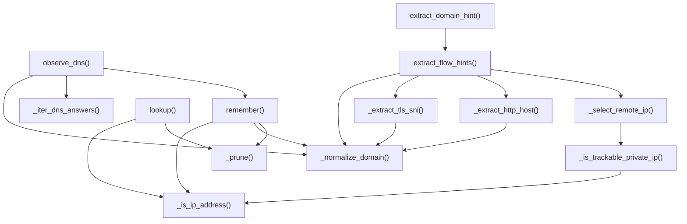

| Function / Method | Line | Incoming Callers (Called By) | Outgoing Calls (Calls) |
| :--- | :--- | :--- | :--- |
| **`_normalize_domain`** | 17 | `agent/traffic_metadata.py::DomainHintCache.remember`<br/>`agent/traffic_metadata.py::_extract_http_host`<br/>`agent/traffic_metadata.py::_extract_tls_sni`<br/>`agent/traffic_metadata.py::extract_flow_hints`<br/>`agent/traffic_metadata.py::DomainHintCache.observe_dns` | *None* |
| **`_is_ip_address`** | 27 | `agent/traffic_metadata.py::_is_trackable_private_ip`<br/>`agent/traffic_metadata.py::DomainHintCache.lookup`<br/>`agent/traffic_metadata.py::DomainHintCache.remember` | *None* |
| **`_is_trackable_private_ip`** | 37 | `agent/traffic_metadata.py::_select_remote_ip` | `agent/traffic_metadata.py::_is_ip_address` |
| **`_select_remote_ip`** | 53 | `agent/traffic_metadata.py::extract_flow_hints` | `agent/traffic_metadata.py::_is_trackable_private_ip` |
| **`_iter_dns_answers`** | 69 | `agent/traffic_metadata.py::DomainHintCache.observe_dns` | *None* |
| **`DomainHintCache.__init__`** | 107 | `agent/main.py::NetworkAgent.__init__` | *None* |
| **`DomainHintCache._prune`** | 112 | `agent/traffic_metadata.py::DomainHintCache.remember`<br/>`agent/traffic_metadata.py::DomainHintCache.lookup` | *None* |
| **`DomainHintCache.remember`** | 128 | `agent/traffic_metadata.py::DomainHintCache.observe_dns` | `agent/traffic_metadata.py::_is_ip_address`<br/>`agent/traffic_metadata.py::_normalize_domain`<br/>`agent/traffic_metadata.py::DomainHintCache._prune` |
| **`DomainHintCache.lookup`** | 139 | *None (0 incoming)* | `agent/traffic_metadata.py::_is_ip_address`<br/>`agent/traffic_metadata.py::DomainHintCache._prune` |
| **`DomainHintCache.observe_dns`** | 156 | *None (0 incoming)* | `agent/traffic_metadata.py::_normalize_domain`<br/>`agent/traffic_metadata.py::_iter_dns_answers`<br/>`agent/traffic_metadata.py::DomainHintCache.remember` |
| **`_extract_tls_sni`** | 199 | `agent/traffic_metadata.py::extract_flow_hints` | `agent/traffic_metadata.py::_normalize_domain` |
| **`_extract_http_host`** | 271 | `agent/traffic_metadata.py::extract_flow_hints` | `agent/traffic_metadata.py::_normalize_domain` |
| **`extract_flow_hints`** | 325 | `agent/traffic_metadata.py::extract_domain_hint` | `agent/traffic_metadata.py::_normalize_domain`<br/>`agent/traffic_metadata.py::_extract_tls_sni`<br/>`agent/traffic_metadata.py::_extract_http_host`<br/>`agent/traffic_metadata.py::_select_remote_ip` |
| **`extract_domain_hint`** | 355 | *None (0 incoming)* | `agent/traffic_metadata.py::extract_flow_hints` |

### Agent DPI & Web Inspection

#### Module: `agent/dpi/aia_chaser.py`

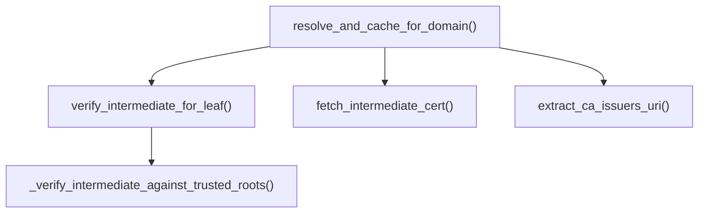

| Function / Method | Line | Incoming Callers (Called By) | Outgoing Calls (Calls) |
| :--- | :--- | :--- | :--- |
| **`AiaChaser.__init__`** | 39 | `agent/dpi/mitm_addon.py::NetVisorDpiAddon.__init__` | *None* |
| **`AiaChaser.extract_ca_issuers_uri`** | 45 | `agent/dpi/aia_chaser.py::AiaChaser.resolve_and_cache_for_domain` | *None* |
| **`AiaChaser.fetch_intermediate_cert`** | 59 | `agent/dpi/aia_chaser.py::AiaChaser.resolve_and_cache_for_domain` | *None* |
| **`AiaChaser.verify_intermediate_for_leaf`** | 83 | `agent/dpi/aia_chaser.py::AiaChaser.resolve_and_cache_for_domain` | `agent/dpi/aia_chaser.py::AiaChaser._verify_intermediate_against_trusted_roots` |
| **`AiaChaser._verify_intermediate_against_trusted_roots`** | 127 | `agent/dpi/aia_chaser.py::AiaChaser.verify_intermediate_for_leaf` | *None* |
| **`AiaChaser.resolve_and_cache_for_domain`** | 177 | `agent/dpi/mitm_addon.py::NetVisorDpiAddon._async_chase_aia` | `agent/dpi/aia_chaser.py::AiaChaser.fetch_intermediate_cert`<br/>`agent/dpi/aia_chaser.py::AiaChaser.verify_intermediate_for_leaf`<br/>`agent/dpi/aia_chaser.py::AiaChaser.extract_ca_issuers_uri` |
| **`AiaChaser.get_cached_intermediate_pem`** | 209 | *None (0 incoming)* | *None* |
| **`AiaChaser.get_cached_domains`** | 213 | `agent/dpi/mitm_addon.py::NetVisorDpiAddon._emit_telemetry_snapshot` | *None* |

#### Module: `agent/dpi/browser_launcher.py`

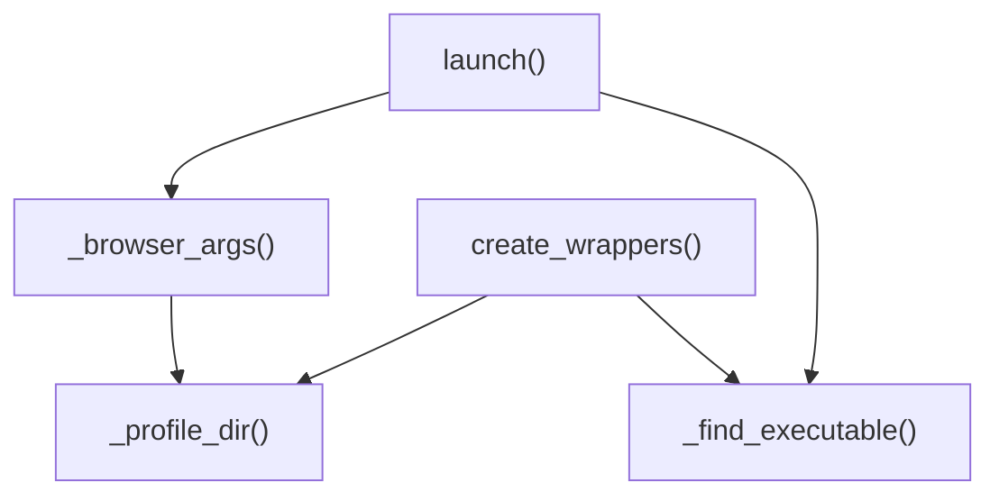

| Function / Method | Line | Incoming Callers (Called By) | Outgoing Calls (Calls) |
| :--- | :--- | :--- | :--- |
| **`BrowserLauncher.__init__`** | 32 | `agent/dpi/controller.py::WebInspectionController.__init__` | *None* |
| **`BrowserLauncher._profile_dir`** | 37 | `agent/dpi/browser_launcher.py::BrowserLauncher._browser_args`<br/>`agent/dpi/browser_launcher.py::BrowserLauncher.create_wrappers` | *None* |
| **`BrowserLauncher._find_executable`** | 42 | `agent/dpi/browser_launcher.py::BrowserLauncher.launch`<br/>`agent/dpi/controller.py::WebInspectionController._apply_policy`<br/>`agent/dpi/browser_launcher.py::BrowserLauncher.create_wrappers` | *None* |
| **`BrowserLauncher._browser_args`** | 48 | `agent/dpi/browser_launcher.py::BrowserLauncher.launch` | `agent/dpi/browser_launcher.py::BrowserLauncher._profile_dir` |
| **`BrowserLauncher.create_wrappers`** | 56 | `agent/dpi/controller.py::WebInspectionController.start`<br/>`agent/dpi/controller.py::WebInspectionController._apply_policy` | `agent/dpi/browser_launcher.py::BrowserLauncher._profile_dir`<br/>`agent/dpi/browser_launcher.py::BrowserLauncher._find_executable` |
| **`BrowserLauncher.launch`** | 101 | *None (0 incoming)* | `agent/dpi/browser_launcher.py::BrowserLauncher._browser_args`<br/>`agent/dpi/browser_launcher.py::BrowserLauncher._find_executable` |

#### Module: `agent/dpi/cert_manager.py`

```mermaid
graph TD
    agent_dpi_cert_manager_py_CertificateManager___init__["__init__()"] --> agent_security_dpapi_py_WindowsCurrentUserProtector___init__["dpapi.__init__()"]
    agent_dpi_cert_manager_py_CertificateManager__certificate_metadata["_certificate_metadata()"] --> agent_dpi_cert_manager_py_CertificateManager__not_valid_before["_not_valid_before()"]
    agent_dpi_cert_manager_py_CertificateManager__certificate_metadata["_certificate_metadata()"] --> agent_dpi_cert_manager_py_CertificateManager__not_valid_after["_not_valid_after()"]
    agent_dpi_cert_manager_py_CertificateManager__certificate_metadata["_certificate_metadata()"] --> agent_dpi_cert_manager_py_CertificateManager__as_utc["_as_utc()"]
    agent_dpi_cert_manager_py_CertificateManager__certificate_metadata["_certificate_metadata()"] --> agent_dpi_cert_manager_py_CertificateManager__utc_now["_utc_now()"]
    agent_dpi_cert_manager_py_CertificateManager__load_metadata["_load_metadata()"] --> agent_dpi_cert_manager_py_CertificateManager__certificate_metadata["_certificate_metadata()"]
    agent_dpi_cert_manager_py_CertificateManager__load_metadata["_load_metadata()"] --> agent_dpi_cert_manager_py_CertificateManager__load_certificate["_load_certificate()"]
    agent_dpi_cert_manager_py_CertificateManager_ensure_ca_files["ensure_ca_files()"] --> agent_dpi_cert_manager_py_CertificateManager__certificate_metadata["_certificate_metadata()"]
    agent_dpi_cert_manager_py_CertificateManager_ensure_ca_files["ensure_ca_files()"] --> agent_dpi_cert_manager_py_CertificateManager__write_metadata["_write_metadata()"]
    agent_dpi_cert_manager_py_CertificateManager_ensure_ca_files["ensure_ca_files()"] --> agent_dpi_cert_manager_py_CertificateManager__load_certificate["_load_certificate()"]
    agent_dpi_cert_manager_py_CertificateManager_ensure_ca_files["ensure_ca_files()"] --> agent_dpi_cert_manager_py_CertificateManager__utc_now["_utc_now()"]
    agent_dpi_cert_manager_py_CertificateManager_certificate_thumbprint_sha256["certificate_thumbprint_sha256()"] --> agent_dpi_cert_manager_py_CertificateManager__load_certificate["_load_certificate()"]
    agent_dpi_cert_manager_py_CertificateManager_load_private_key_bytes["load_private_key_bytes()"] --> agent_dpi_cert_manager_py_CertificateManager_ensure_ca_files["ensure_ca_files()"]
    agent_dpi_cert_manager_py_CertificateManager__is_store_match["_is_store_match()"] --> agent_dpi_cert_manager_py_CertificateManager__find_powershell["_find_powershell()"]
    agent_dpi_cert_manager_py_CertificateManager__is_currentuser_root_match["_is_currentuser_root_match()"] --> agent_dpi_cert_manager_py_CertificateManager__is_store_match["_is_store_match()"]
    agent_dpi_cert_manager_py_CertificateManager_is_installed["is_installed()"] --> agent_dpi_cert_manager_py_CertificateManager_certificate_thumbprint_sha256["certificate_thumbprint_sha256()"]
    agent_dpi_cert_manager_py_CertificateManager_is_installed["is_installed()"] --> agent_dpi_cert_manager_py_CertificateManager__is_store_match["_is_store_match()"]
    agent_dpi_cert_manager_py_CertificateManager_cleanup_stale_certificates["cleanup_stale_certificates()"] --> agent_dpi_cert_manager_py_CertificateManager_certificate_thumbprint_sha256["certificate_thumbprint_sha256()"]
    agent_dpi_cert_manager_py_CertificateManager_cleanup_stale_certificates["cleanup_stale_certificates()"] --> agent_dpi_cert_manager_py_CertificateManager__find_powershell["_find_powershell()"]
    agent_dpi_cert_manager_py_CertificateManager_install_if_needed["install_if_needed()"] --> agent_dpi_cert_manager_py_CertificateManager_cleanup_stale_certificates["cleanup_stale_certificates()"]
    agent_dpi_cert_manager_py_CertificateManager_install_if_needed["install_if_needed()"] --> agent_dpi_cert_manager_py_CertificateManager__write_metadata["_write_metadata()"]
    agent_dpi_cert_manager_py_CertificateManager_install_if_needed["install_if_needed()"] --> agent_dpi_cert_manager_py_CertificateManager__load_metadata["_load_metadata()"]
    agent_dpi_cert_manager_py_CertificateManager_install_if_needed["install_if_needed()"] --> agent_dpi_cert_manager_py_CertificateManager_ensure_ca_files["ensure_ca_files()"]
    agent_dpi_cert_manager_py_CertificateManager_install_if_needed["install_if_needed()"] --> agent_dpi_cert_manager_py_CertificateManager_is_installed["is_installed()"]
    agent_dpi_cert_manager_py_CertificateManager_install_if_needed["install_if_needed()"] --> agent_dpi_cert_manager_py_CertificateManager__utc_now["_utc_now()"]
    agent_dpi_cert_manager_py_CertificateManager__apply_user_only_acl["_apply_user_only_acl()"] --> agent_dpi_cert_manager_py_CertificateManager__find_icacls["_find_icacls()"]
    agent_dpi_cert_manager_py_CertificateManager_prepare_runtime_bundle["prepare_runtime_bundle()"] --> agent_dpi_cert_manager_py_CertificateManager_ensure_ca_files["ensure_ca_files()"]
    agent_dpi_cert_manager_py_CertificateManager_prepare_runtime_bundle["prepare_runtime_bundle()"] --> agent_dpi_cert_manager_py_CertificateManager__apply_user_only_acl["_apply_user_only_acl()"]
    agent_dpi_cert_manager_py_CertificateManager_prepare_runtime_bundle["prepare_runtime_bundle()"] --> agent_dpi_cert_manager_py_CertificateManager_cleanup_runtime_bundle["cleanup_runtime_bundle()"]
    agent_dpi_cert_manager_py_CertificateManager_prepare_runtime_bundle["prepare_runtime_bundle()"] --> agent_dpi_cert_manager_py_CertificateManager_load_private_key_bytes["load_private_key_bytes()"]
    agent_dpi_cert_manager_py_CertificateManager_status["status()"] --> agent_dpi_cert_manager_py_CertificateManager__write_metadata["_write_metadata()"]
    agent_dpi_cert_manager_py_CertificateManager_status["status()"] --> agent_dpi_cert_manager_py_CertificateManager_certificate_thumbprint_sha256["certificate_thumbprint_sha256()"]
    agent_dpi_cert_manager_py_CertificateManager_status["status()"] --> agent_dpi_cert_manager_py_CertificateManager__not_valid_before["_not_valid_before()"]
    agent_dpi_cert_manager_py_CertificateManager_status["status()"] --> agent_dpi_cert_manager_py_CertificateManager__load_metadata["_load_metadata()"]
    agent_dpi_cert_manager_py_CertificateManager_status["status()"] --> agent_dpi_cert_manager_py_CertificateManager__load_certificate["_load_certificate()"]
    agent_dpi_cert_manager_py_CertificateManager_status["status()"] --> agent_dpi_cert_manager_py_CertificateManager_ensure_ca_files["ensure_ca_files()"]
    agent_dpi_cert_manager_py_CertificateManager_status["status()"] --> agent_dpi_cert_manager_py_CertificateManager__not_valid_after["_not_valid_after()"]
    agent_dpi_cert_manager_py_CertificateManager_status["status()"] --> agent_dpi_cert_manager_py_CertificateManager_is_installed["is_installed()"]
    agent_dpi_cert_manager_py_CertificateManager_status["status()"] --> agent_dpi_cert_manager_py_CertificateManager__as_utc["_as_utc()"]
    agent_dpi_cert_manager_py_CertificateManager_status["status()"] --> agent_dpi_cert_manager_py_CertificateManager__utc_now["_utc_now()"]
```

| Function / Method | Line | Incoming Callers (Called By) | Outgoing Calls (Calls) |
| :--- | :--- | :--- | :--- |
| **`CertificateManager.__init__`** | 29 | `agent/dpi/controller.py::WebInspectionController.__init__` | `agent/security/dpapi.py::WindowsCurrentUserProtector.__init__` |
| **`CertificateManager._utc_now`** | 43 | `agent/dpi/cert_manager.py::CertificateManager.ensure_ca_files`<br/>`agent/dpi/cert_manager.py::CertificateManager._certificate_metadata`<br/>`agent/dpi/cert_manager.py::CertificateManager.install_if_needed`<br/>`agent/dpi/cert_manager.py::CertificateManager.status` | *None* |
| **`CertificateManager._find_powershell`** | 46 | `agent/dpi/cert_manager.py::CertificateManager.cleanup_stale_certificates`<br/>`agent/dpi/cert_manager.py::CertificateManager._is_store_match` | *None* |
| **`CertificateManager._find_icacls`** | 56 | `agent/dpi/cert_manager.py::CertificateManager._apply_user_only_acl` | *None* |
| **`CertificateManager._load_certificate`** | 60 | `agent/dpi/cert_manager.py::CertificateManager.ensure_ca_files`<br/>`agent/dpi/cert_manager.py::CertificateManager._load_metadata`<br/>`agent/dpi/cert_manager.py::CertificateManager.certificate_thumbprint_sha256`<br/>`agent/dpi/cert_manager.py::CertificateManager.status` | *None* |
| **`CertificateManager._as_utc`** | 65 | `agent/dpi/cert_manager.py::CertificateManager.status`<br/>`agent/dpi/cert_manager.py::CertificateManager._certificate_metadata` | *None* |
| **`CertificateManager._not_valid_before`** | 70 | `agent/dpi/cert_manager.py::CertificateManager.status`<br/>`agent/dpi/cert_manager.py::CertificateManager._certificate_metadata` | *None* |
| **`CertificateManager._not_valid_after`** | 74 | `agent/dpi/cert_manager.py::CertificateManager.status`<br/>`agent/dpi/cert_manager.py::CertificateManager._certificate_metadata` | *None* |
| **`CertificateManager._certificate_metadata`** | 78 | `agent/dpi/cert_manager.py::CertificateManager.ensure_ca_files`<br/>`agent/dpi/cert_manager.py::CertificateManager._load_metadata` | `agent/dpi/cert_manager.py::CertificateManager._not_valid_before`<br/>`agent/dpi/cert_manager.py::CertificateManager._not_valid_after`<br/>`agent/dpi/cert_manager.py::CertificateManager._as_utc`<br/>`agent/dpi/cert_manager.py::CertificateManager._utc_now` |
| **`CertificateManager._write_metadata`** | 103 | `agent/dpi/cert_manager.py::CertificateManager.ensure_ca_files`<br/>`agent/dpi/cert_manager.py::CertificateManager.install_if_needed`<br/>`agent/dpi/cert_manager.py::CertificateManager.status` | *None* |
| **`CertificateManager._load_metadata`** | 106 | `agent/dpi/cert_manager.py::CertificateManager.status`<br/>`agent/dpi/cert_manager.py::CertificateManager.install_if_needed` | `agent/dpi/cert_manager.py::CertificateManager._certificate_metadata`<br/>`agent/dpi/cert_manager.py::CertificateManager._load_certificate` |
| **`CertificateManager.ensure_ca_files`** | 116 | `agent/dpi/cert_manager.py::CertificateManager.status`<br/>`agent/dpi/cert_manager.py::CertificateManager.install_if_needed`<br/>`agent/dpi/cert_manager.py::CertificateManager.prepare_runtime_bundle`<br/>`agent/dpi/controller.py::WebInspectionController._apply_policy`<br/>`agent/dpi/cert_manager.py::CertificateManager.load_private_key_bytes` | `agent/dpi/cert_manager.py::CertificateManager._certificate_metadata`<br/>`agent/dpi/cert_manager.py::CertificateManager._write_metadata`<br/>`agent/dpi/cert_manager.py::CertificateManager._load_certificate`<br/>`agent/dpi/cert_manager.py::CertificateManager._utc_now` |
| **`CertificateManager.certificate_thumbprint_sha256`** | 169 | `agent/dpi/cert_manager.py::CertificateManager.cleanup_stale_certificates`<br/>`agent/dpi/cert_manager.py::CertificateManager.is_installed`<br/>`agent/dpi/cert_manager.py::CertificateManager.status` | `agent/dpi/cert_manager.py::CertificateManager._load_certificate` |
| **`CertificateManager.load_private_key_bytes`** | 175 | `agent/dpi/cert_manager.py::CertificateManager.prepare_runtime_bundle` | `agent/dpi/cert_manager.py::CertificateManager.ensure_ca_files` |
| **`CertificateManager._is_store_match`** | 179 | `agent/dpi/cert_manager.py::CertificateManager.is_installed`<br/>`agent/dpi/cert_manager.py::CertificateManager._is_currentuser_root_match` | `agent/dpi/cert_manager.py::CertificateManager._find_powershell` |
| **`CertificateManager._is_currentuser_root_match`** | 207 | *None (0 incoming)* | `agent/dpi/cert_manager.py::CertificateManager._is_store_match` |
| **`CertificateManager.is_installed`** | 210 | `agent/dpi/cert_manager.py::CertificateManager.status`<br/>`agent/dpi/cert_manager.py::CertificateManager.install_if_needed` | `agent/dpi/cert_manager.py::CertificateManager.certificate_thumbprint_sha256`<br/>`agent/dpi/cert_manager.py::CertificateManager._is_store_match` |
| **`CertificateManager.cleanup_stale_certificates`** | 216 | `agent/dpi/cert_manager.py::CertificateManager.install_if_needed` | `agent/dpi/cert_manager.py::CertificateManager.certificate_thumbprint_sha256`<br/>`agent/dpi/cert_manager.py::CertificateManager._find_powershell` |
| **`CertificateManager.install_if_needed`** | 252 | `agent/dpi/controller.py::WebInspectionController._apply_policy` | `agent/dpi/cert_manager.py::CertificateManager.cleanup_stale_certificates`<br/>`agent/dpi/cert_manager.py::CertificateManager._write_metadata`<br/>`agent/dpi/cert_manager.py::CertificateManager._load_metadata`<br/>`agent/dpi/cert_manager.py::CertificateManager.ensure_ca_files`<br/>`agent/dpi/cert_manager.py::CertificateManager.is_installed`<br/>`agent/dpi/cert_manager.py::CertificateManager._utc_now` |
| **`CertificateManager._apply_user_only_acl`** | 305 | `agent/dpi/cert_manager.py::CertificateManager.prepare_runtime_bundle` | `agent/dpi/cert_manager.py::CertificateManager._find_icacls` |
| **`CertificateManager.prepare_runtime_bundle`** | 329 | *None (0 incoming)* | `agent/dpi/cert_manager.py::CertificateManager.ensure_ca_files`<br/>`agent/dpi/cert_manager.py::CertificateManager._apply_user_only_acl`<br/>`agent/dpi/cert_manager.py::CertificateManager.cleanup_runtime_bundle`<br/>`agent/dpi/cert_manager.py::CertificateManager.load_private_key_bytes` |
| **`CertificateManager.cleanup_runtime_bundle`** | 360 | `agent/dpi/cert_manager.py::CertificateManager.prepare_runtime_bundle` | *None* |
| **`CertificateManager.status`** | 368 | `agent/dpi/controller.py::WebInspectionController._live_metrics`<br/>`agent/dpi/controller.py::WebInspectionController._apply_policy` | `agent/dpi/cert_manager.py::CertificateManager._write_metadata`<br/>`agent/dpi/cert_manager.py::CertificateManager.certificate_thumbprint_sha256`<br/>`agent/dpi/cert_manager.py::CertificateManager._not_valid_before`<br/>`agent/dpi/cert_manager.py::CertificateManager._load_metadata`<br/>`agent/dpi/cert_manager.py::CertificateManager._load_certificate`<br/>`agent/dpi/cert_manager.py::CertificateManager.ensure_ca_files`<br/>`agent/dpi/cert_manager.py::CertificateManager._not_valid_after`<br/>`agent/dpi/cert_manager.py::CertificateManager.is_installed`<br/>*+ 2 more...* |

#### Module: `agent/dpi/controller.py`

```mermaid
graph TD
    agent_dpi_controller_py_WebInspectionController___init__["__init__()"] --> agent_dpi_event_buffer_py_EventBuffer_enqueue["event_buffer.enqueue()"]
    agent_dpi_controller_py_WebInspectionController___init__["__init__()"] --> agent_dpi_quic_guard_py_QuicGuard___init__["quic_guard.__init__()"]
    agent_dpi_controller_py_WebInspectionController___init__["__init__()"] --> agent_dpi_cert_manager_py_CertificateManager___init__["cert_manager.__init__()"]
    agent_dpi_controller_py_WebInspectionController___init__["__init__()"] --> agent_dpi_policy_py_InspectionPolicy_from_payload["policy.from_payload()"]
    agent_dpi_controller_py_WebInspectionController___init__["__init__()"] --> agent_dpi_controller_py_WebInspectionController__policy_worker["_policy_worker()"]
    agent_dpi_controller_py_WebInspectionController___init__["__init__()"] --> agent_dpi_event_buffer_py_EventBuffer___init__["event_buffer.__init__()"]
    agent_dpi_controller_py_WebInspectionController___init__["__init__()"] --> agent_dpi_proxy_manager_py_ProxyManager___init__["proxy_manager.__init__()"]
    agent_dpi_controller_py_WebInspectionController___init__["__init__()"] --> agent_dpi_browser_launcher_py_BrowserLauncher___init__["browser_launcher.__init__()"]
    agent_dpi_controller_py_WebInspectionController_start["start()"] --> agent_dpi_event_buffer_py_EventBuffer_start["event_buffer.start()"]
    agent_dpi_controller_py_WebInspectionController_start["start()"] --> agent_dpi_browser_launcher_py_BrowserLauncher_create_wrappers["browser_launcher.create_wrappers()"]
    agent_dpi_controller_py_WebInspectionController_start["start()"] --> agent_dpi_controller_py_WebInspectionController_refresh_policy["refresh_policy()"]
    agent_dpi_controller_py_WebInspectionController_stop["stop()"] --> agent_dpi_proxy_manager_py_ProxyManager_stop["proxy_manager.stop()"]
    agent_dpi_controller_py_WebInspectionController_stop["stop()"] --> agent_dpi_quic_guard_py_QuicGuard_remove_block["quic_guard.remove_block()"]
    agent_dpi_controller_py_WebInspectionController_stop["stop()"] --> agent_dpi_event_buffer_py_EventBuffer_stop["event_buffer.stop()"]
    agent_dpi_controller_py_WebInspectionController_refresh_policy["refresh_policy()"] --> agent_dpi_controller_py_WebInspectionController__apply_policy["_apply_policy()"]
    agent_dpi_controller_py_WebInspectionController_refresh_policy["refresh_policy()"] --> agent_dpi_policy_py_InspectionPolicy_from_payload["policy.from_payload()"]
    agent_dpi_controller_py_WebInspectionController_refresh_policy["refresh_policy()"] --> agent_dpi_controller_py_WebInspectionController__set_status["_set_status()"]
    agent_dpi_controller_py_WebInspectionController__live_metrics["_live_metrics()"] --> agent_dpi_cert_manager_py_CertificateManager_status["cert_manager.status()"]
    agent_dpi_controller_py_WebInspectionController__live_metrics["_live_metrics()"] --> agent_dpi_proxy_manager_py_ProxyManager_status["proxy_manager.status()"]
    agent_dpi_controller_py_WebInspectionController__live_metrics["_live_metrics()"] --> agent_dpi_quic_guard_py_QuicGuard_status["quic_guard.status()"]
    agent_dpi_controller_py_WebInspectionController__live_metrics["_live_metrics()"] --> agent_dpi_event_buffer_py_EventBuffer_metrics_snapshot["event_buffer.metrics_snapshot()"]
    agent_dpi_controller_py_WebInspectionController__apply_policy["_apply_policy()"] --> agent_dpi_cert_manager_py_CertificateManager_status["cert_manager.status()"]
    agent_dpi_controller_py_WebInspectionController__apply_policy["_apply_policy()"] --> agent_dpi_cert_manager_py_CertificateManager_install_if_needed["cert_manager.install_if_needed()"]
    agent_dpi_controller_py_WebInspectionController__apply_policy["_apply_policy()"] --> agent_dpi_proxy_manager_py_ProxyManager_stop["proxy_manager.stop()"]
    agent_dpi_controller_py_WebInspectionController__apply_policy["_apply_policy()"] --> agent_dpi_proxy_manager_py_ProxyManager_start["proxy_manager.start()"]
    agent_dpi_controller_py_WebInspectionController__apply_policy["_apply_policy()"] --> agent_dpi_browser_launcher_py_BrowserLauncher_create_wrappers["browser_launcher.create_wrappers()"]
    agent_dpi_controller_py_WebInspectionController__apply_policy["_apply_policy()"] --> agent_dpi_quic_guard_py_QuicGuard_is_admin["quic_guard.is_admin()"]
    agent_dpi_controller_py_WebInspectionController__apply_policy["_apply_policy()"] --> agent_dpi_quic_guard_py_QuicGuard_remove_block["quic_guard.remove_block()"]
    agent_dpi_controller_py_WebInspectionController__apply_policy["_apply_policy()"] --> agent_dpi_controller_py_WebInspectionController__live_metrics["_live_metrics()"]
    agent_dpi_controller_py_WebInspectionController__apply_policy["_apply_policy()"] --> agent_dpi_cert_manager_py_CertificateManager_ensure_ca_files["cert_manager.ensure_ca_files()"]
    agent_dpi_controller_py_WebInspectionController__apply_policy["_apply_policy()"] --> agent_dpi_quic_guard_py_QuicGuard_apply_block["quic_guard.apply_block()"]
    agent_dpi_controller_py_WebInspectionController__apply_policy["_apply_policy()"] --> agent_dpi_browser_launcher_py_BrowserLauncher__find_executable["browser_launcher._find_executable()"]
    agent_dpi_controller_py_WebInspectionController__apply_policy["_apply_policy()"] --> agent_dpi_controller_py_WebInspectionController__set_status["_set_status()"]
    agent_dpi_controller_py_WebInspectionController__policy_worker["_policy_worker()"] --> agent_dpi_controller_py_WebInspectionController_refresh_policy["refresh_policy()"]
    agent_dpi_controller_py_WebInspectionController_status_snapshot["status_snapshot()"] --> agent_dpi_controller_py_WebInspectionController__live_metrics["_live_metrics()"]
```

| Function / Method | Line | Incoming Callers (Called By) | Outgoing Calls (Calls) |
| :--- | :--- | :--- | :--- |
| **`WebInspectionController.__init__`** | 20 | `agent/main.py::NetworkAgent._start_operational_workers` | `agent/dpi/event_buffer.py::EventBuffer.enqueue`<br/>`agent/dpi/quic_guard.py::QuicGuard.__init__`<br/>`agent/dpi/cert_manager.py::CertificateManager.__init__`<br/>`agent/dpi/policy.py::InspectionPolicy.from_payload`<br/>`agent/dpi/controller.py::WebInspectionController._policy_worker`<br/>`agent/dpi/event_buffer.py::EventBuffer.__init__`<br/>`agent/dpi/proxy_manager.py::ProxyManager.__init__`<br/>`agent/dpi/browser_launcher.py::BrowserLauncher.__init__` |
| **`WebInspectionController._context_snapshot`** | 105 | *None (0 incoming)* | *None* |
| **`WebInspectionController.update_context`** | 112 | `agent/main.py::NetworkAgent._register_agent`<br/>`agent/main.py::NetworkAgent._heartbeat_worker` | *None* |
| **`WebInspectionController.start`** | 119 | `agent/main.py::NetworkAgent._start_operational_workers` | `agent/dpi/event_buffer.py::EventBuffer.start`<br/>`agent/dpi/browser_launcher.py::BrowserLauncher.create_wrappers`<br/>`agent/dpi/controller.py::WebInspectionController.refresh_policy` |
| **`WebInspectionController.stop`** | 138 | `agent/main.py::NetworkAgent.stop` | `agent/dpi/proxy_manager.py::ProxyManager.stop`<br/>`agent/dpi/quic_guard.py::QuicGuard.remove_block`<br/>`agent/dpi/event_buffer.py::EventBuffer.stop` |
| **`WebInspectionController.refresh_policy`** | 144 | `agent/dpi/controller.py::WebInspectionController.start`<br/>`agent/dpi/controller.py::WebInspectionController._policy_worker` | `agent/dpi/controller.py::WebInspectionController._apply_policy`<br/>`agent/dpi/policy.py::InspectionPolicy.from_payload`<br/>`agent/dpi/controller.py::WebInspectionController._set_status` |
| **`WebInspectionController._live_metrics`** | 169 | `agent/dpi/controller.py::WebInspectionController.status_snapshot`<br/>`agent/dpi/controller.py::WebInspectionController._apply_policy` | `agent/dpi/cert_manager.py::CertificateManager.status`<br/>`agent/dpi/proxy_manager.py::ProxyManager.status`<br/>`agent/dpi/quic_guard.py::QuicGuard.status`<br/>`agent/dpi/event_buffer.py::EventBuffer.metrics_snapshot` |
| **`WebInspectionController._apply_policy`** | 215 | `agent/dpi/controller.py::WebInspectionController.refresh_policy` | `agent/dpi/cert_manager.py::CertificateManager.status`<br/>`agent/dpi/cert_manager.py::CertificateManager.install_if_needed`<br/>`agent/dpi/proxy_manager.py::ProxyManager.stop`<br/>`agent/dpi/proxy_manager.py::ProxyManager.start`<br/>`agent/dpi/browser_launcher.py::BrowserLauncher.create_wrappers`<br/>`agent/dpi/quic_guard.py::QuicGuard.is_admin`<br/>`agent/dpi/quic_guard.py::QuicGuard.remove_block`<br/>`agent/dpi/controller.py::WebInspectionController._live_metrics`<br/>*+ 4 more...* |
| **`WebInspectionController._set_status`** | 332 | `agent/dpi/controller.py::WebInspectionController._apply_policy`<br/>`agent/dpi/controller.py::WebInspectionController.refresh_policy` | *None* |
| **`WebInspectionController._policy_worker`** | 336 | `agent/dpi/controller.py::WebInspectionController.__init__` | `agent/dpi/controller.py::WebInspectionController.refresh_policy` |
| **`WebInspectionController.status_snapshot`** | 344 | `agent/main.py::NetworkAgent.status_snapshot`<br/>`agent/main.py::NetworkAgent._heartbeat_worker`<br/>`agent/main.py::NetworkAgent._start_operational_workers` | `agent/dpi/controller.py::WebInspectionController._live_metrics` |

#### Module: `agent/dpi/event_buffer.py`

```mermaid
graph TD
    agent_dpi_event_buffer_py__preferred_domain_label["_preferred_domain_label()"] --> intel_domain_utils_py_get_base_domain["domain_utils.get_base_domain()"]
    agent_dpi_event_buffer_py__preferred_domain_label["_preferred_domain_label()"] --> intel_domain_utils_py_normalize_host["domain_utils.normalize_host()"]
    agent_dpi_event_buffer_py_EventBuffer___init__["__init__()"] --> agent_security_dpapi_py_WindowsCurrentUserProtector___init__["dpapi.__init__()"]
    agent_dpi_event_buffer_py_EventBuffer_start["start()"] --> agent_dpi_event_buffer_py_EventBuffer__upload_worker["_upload_worker()"]
    agent_dpi_event_buffer_py_EventBuffer_start["start()"] --> agent_dpi_event_buffer_py_EventBuffer__refresh_spool_count["_refresh_spool_count()"]
    agent_dpi_event_buffer_py_EventBuffer_enqueue["enqueue()"] --> agent_dpi_event_buffer_py_EventBuffer__set_metric["_set_metric()"]
    agent_dpi_event_buffer_py_EventBuffer_enqueue["enqueue()"] --> agent_dpi_event_buffer_py_EventBuffer__spool_events["_spool_events()"]
    agent_dpi_event_buffer_py_EventBuffer_enqueue["enqueue()"] --> agent_dpi_event_buffer_py_EventBuffer__utc_now["_utc_now()"]
    agent_dpi_event_buffer_py_EventBuffer_enqueue["enqueue()"] --> agent_dpi_event_buffer_py_EventBuffer__prepare_event["_prepare_event()"]
    agent_dpi_event_buffer_py_EventBuffer__refresh_spool_count["_refresh_spool_count()"] --> agent_dpi_event_buffer_py_EventBuffer__set_metric["_set_metric()"]
    agent_dpi_event_buffer_py_EventBuffer__prepare_event["_prepare_event()"] --> agent_dpi_event_buffer_py__preferred_domain_label["_preferred_domain_label()"]
    agent_dpi_event_buffer_py_EventBuffer__prepare_event["_prepare_event()"] --> intel_domain_utils_py_get_base_domain["domain_utils.get_base_domain()"]
    agent_dpi_event_buffer_py_EventBuffer__prepare_event["_prepare_event()"] --> agent_dpi_event_buffer_py__normalize_browser_label["_normalize_browser_label()"]
    agent_dpi_event_buffer_py_EventBuffer__prepare_event["_prepare_event()"] --> intel_domain_utils_py_normalize_host["domain_utils.normalize_host()"]
    agent_dpi_event_buffer_py_EventBuffer__prepare_event["_prepare_event()"] --> agent_dpi_redaction_py_hash_text["redaction.hash_text()"]
    agent_dpi_event_buffer_py_EventBuffer__prepare_event["_prepare_event()"] --> agent_dpi_event_buffer_py_EventBuffer__record_drop["_record_drop()"]
    agent_dpi_event_buffer_py_EventBuffer__prepare_event["_prepare_event()"] --> agent_dpi_event_buffer_py_EventBuffer__confidence_for_event["_confidence_for_event()"]
    agent_dpi_event_buffer_py_EventBuffer__prepare_event["_prepare_event()"] --> agent_dpi_redaction_py_sanitize_text_snippet["redaction.sanitize_text_snippet()"]
    agent_dpi_event_buffer_py_EventBuffer__prepare_event["_prepare_event()"] --> agent_dpi_event_buffer_py_EventBuffer__utc_now["_utc_now()"]
    agent_dpi_event_buffer_py_EventBuffer__prepare_event["_prepare_event()"] --> agent_dpi_redaction_py_redact_url["redaction.redact_url()"]
    agent_dpi_event_buffer_py_EventBuffer__prepare_event["_prepare_event()"] --> agent_dpi_redaction_py_redact_headers["redaction.redact_headers()"]
    agent_dpi_event_buffer_py_EventBuffer__spool_events["_spool_events()"] --> agent_dpi_event_buffer_py_EventBuffer__set_metric["_set_metric()"]
    agent_dpi_event_buffer_py_EventBuffer__spool_events["_spool_events()"] --> agent_dpi_event_buffer_py_EventBuffer__utc_now["_utc_now()"]
    agent_dpi_event_buffer_py_EventBuffer__spool_events["_spool_events()"] --> agent_dpi_event_buffer_py_EventBuffer__increment_metric["_increment_metric()"]
    agent_dpi_event_buffer_py_EventBuffer__pull_spooled_events["_pull_spooled_events()"] --> agent_dpi_event_buffer_py_EventBuffer__set_metric["_set_metric()"]
    agent_dpi_event_buffer_py_EventBuffer__pull_spooled_events["_pull_spooled_events()"] --> agent_dpi_event_buffer_py_EventBuffer__record_drop["_record_drop()"]
    agent_dpi_event_buffer_py_EventBuffer__upload_worker["_upload_worker()"] --> agent_dpi_event_buffer_py_EventBuffer__pull_spooled_events["_pull_spooled_events()"]
    agent_dpi_event_buffer_py_EventBuffer__upload_worker["_upload_worker()"] --> agent_dpi_event_buffer_py_EventBuffer__upload_batch["_upload_batch()"]
    agent_dpi_event_buffer_py_EventBuffer__upload_worker["_upload_worker()"] --> agent_dpi_event_buffer_py_EventBuffer__set_metric["_set_metric()"]
    agent_dpi_event_buffer_py_EventBuffer__upload_worker["_upload_worker()"] --> agent_dpi_event_buffer_py_EventBuffer__increment_metric["_increment_metric()"]
    agent_dpi_event_buffer_py_EventBuffer__upload_worker["_upload_worker()"] --> agent_dpi_event_buffer_py_EventBuffer__utc_now["_utc_now()"]
    agent_dpi_event_buffer_py_EventBuffer__upload_worker["_upload_worker()"] --> agent_dpi_event_buffer_py_EventBuffer__spool_events["_spool_events()"]
    agent_dpi_event_buffer_py_EventBuffer__upload_worker["_upload_worker()"] --> agent_dpi_event_buffer_py_EventBuffer__prepare_event["_prepare_event()"]
```

| Function / Method | Line | Incoming Callers (Called By) | Outgoing Calls (Calls) |
| :--- | :--- | :--- | :--- |
| **`_normalize_browser_label`** | 22 | `agent/dpi/event_buffer.py::EventBuffer._prepare_event` | *None* |
| **`_preferred_domain_label`** | 40 | `agent/dpi/event_buffer.py::EventBuffer._prepare_event` | `intel/domain_utils.py::get_base_domain`<br/>`intel/domain_utils.py::normalize_host` |
| **`EventBuffer.__init__`** | 49 | `agent/dpi/controller.py::WebInspectionController.__init__` | `agent/security/dpapi.py::WindowsCurrentUserProtector.__init__` |
| **`EventBuffer._utc_now`** | 87 | `agent/dpi/event_buffer.py::EventBuffer._upload_worker`<br/>`agent/dpi/event_buffer.py::EventBuffer.enqueue`<br/>`agent/dpi/event_buffer.py::EventBuffer._spool_events`<br/>`agent/dpi/event_buffer.py::EventBuffer._prepare_event` | *None* |
| **`EventBuffer.start`** | 90 | `agent/dpi/controller.py::WebInspectionController.start` | `agent/dpi/event_buffer.py::EventBuffer._upload_worker`<br/>`agent/dpi/event_buffer.py::EventBuffer._refresh_spool_count` |
| **`EventBuffer.stop`** | 98 | `agent/dpi/controller.py::WebInspectionController.stop` | *None* |
| **`EventBuffer.enqueue`** | 103 | `agent/dpi/controller.py::WebInspectionController.__init__` | `agent/dpi/event_buffer.py::EventBuffer._set_metric`<br/>`agent/dpi/event_buffer.py::EventBuffer._spool_events`<br/>`agent/dpi/event_buffer.py::EventBuffer._utc_now`<br/>`agent/dpi/event_buffer.py::EventBuffer._prepare_event` |
| **`EventBuffer._set_metric`** | 113 | `agent/dpi/event_buffer.py::EventBuffer.enqueue`<br/>`agent/dpi/event_buffer.py::EventBuffer._pull_spooled_events`<br/>`agent/dpi/event_buffer.py::EventBuffer._upload_worker`<br/>`agent/dpi/event_buffer.py::EventBuffer._spool_events`<br/>`agent/dpi/event_buffer.py::EventBuffer._refresh_spool_count` | *None* |
| **`EventBuffer._increment_metric`** | 121 | `agent/dpi/event_buffer.py::EventBuffer._upload_worker`<br/>`agent/dpi/event_buffer.py::EventBuffer._spool_events` | *None* |
| **`EventBuffer._record_drop`** | 125 | `agent/dpi/event_buffer.py::EventBuffer._prepare_event`<br/>`agent/dpi/event_buffer.py::EventBuffer._pull_spooled_events` | *None* |
| **`EventBuffer._refresh_spool_count`** | 133 | `agent/dpi/event_buffer.py::EventBuffer.start` | `agent/dpi/event_buffer.py::EventBuffer._set_metric` |
| **`EventBuffer._confidence_for_event`** | 144 | `agent/dpi/event_buffer.py::EventBuffer._prepare_event` | *None* |
| **`EventBuffer._prepare_event`** | 164 | `agent/dpi/event_buffer.py::EventBuffer._upload_worker`<br/>`agent/dpi/event_buffer.py::EventBuffer.enqueue` | `agent/dpi/event_buffer.py::_preferred_domain_label`<br/>`intel/domain_utils.py::get_base_domain`<br/>`agent/dpi/event_buffer.py::_normalize_browser_label`<br/>`intel/domain_utils.py::normalize_host`<br/>`agent/dpi/redaction.py::hash_text`<br/>`agent/dpi/event_buffer.py::EventBuffer._record_drop`<br/>`agent/dpi/event_buffer.py::EventBuffer._confidence_for_event`<br/>`agent/dpi/redaction.py::sanitize_text_snippet`<br/>*+ 3 more...* |
| **`EventBuffer._spool_events`** | 227 | `agent/dpi/event_buffer.py::EventBuffer._upload_worker`<br/>`agent/dpi/event_buffer.py::EventBuffer.enqueue` | `agent/dpi/event_buffer.py::EventBuffer._set_metric`<br/>`agent/dpi/event_buffer.py::EventBuffer._utc_now`<br/>`agent/dpi/event_buffer.py::EventBuffer._increment_metric` |
| **`EventBuffer._pull_spooled_events`** | 240 | `agent/dpi/event_buffer.py::EventBuffer._upload_worker` | `agent/dpi/event_buffer.py::EventBuffer._set_metric`<br/>`agent/dpi/event_buffer.py::EventBuffer._record_drop` |
| **`EventBuffer._upload_batch`** | 278 | `agent/dpi/event_buffer.py::EventBuffer._upload_worker` | *None* |
| **`EventBuffer._upload_worker`** | 283 | `agent/dpi/event_buffer.py::EventBuffer.start` | `agent/dpi/event_buffer.py::EventBuffer._pull_spooled_events`<br/>`agent/dpi/event_buffer.py::EventBuffer._upload_batch`<br/>`agent/dpi/event_buffer.py::EventBuffer._set_metric`<br/>`agent/dpi/event_buffer.py::EventBuffer._increment_metric`<br/>`agent/dpi/event_buffer.py::EventBuffer._utc_now`<br/>`agent/dpi/event_buffer.py::EventBuffer._spool_events`<br/>`agent/dpi/event_buffer.py::EventBuffer._prepare_event` |
| **`EventBuffer.metrics_snapshot`** | 319 | `agent/dpi/controller.py::WebInspectionController._live_metrics` | *None* |

#### Module: `agent/dpi/mitm_addon.py`

```mermaid
graph TD
    agent_dpi_mitm_addon_py_infer_browser_identity["infer_browser_identity()"] --> agent_dpi_mitm_addon_py__find_header["_find_header()"]
    agent_dpi_mitm_addon_py__preferred_domain_label["_preferred_domain_label()"] --> intel_domain_utils_py_get_base_domain["domain_utils.get_base_domain()"]
    agent_dpi_mitm_addon_py__preferred_domain_label["_preferred_domain_label()"] --> intel_domain_utils_py_normalize_host["domain_utils.normalize_host()"]
    agent_dpi_mitm_addon_py__preferred_domain_label["_preferred_domain_label()"] --> intel_domain_intelligence_py_get_service_info["domain_intelligence.get_service_info()"]
    agent_dpi_mitm_addon_py_extract_site_details["extract_site_details()"] --> intel_domain_utils_py_get_base_domain["domain_utils.get_base_domain()"]
    agent_dpi_mitm_addon_py_extract_site_details["extract_site_details()"] --> intel_domain_utils_py_normalize_host["domain_utils.normalize_host()"]
    agent_dpi_mitm_addon_py_extract_site_details["extract_site_details()"] --> intel_domain_intelligence_py_get_service_info["domain_intelligence.get_service_info()"]
    agent_dpi_mitm_addon_py_NetVisorDpiAddon___init__["__init__()"] --> agent_dpi_aia_chaser_py_AiaChaser___init__["aia_chaser.__init__()"]
    agent_dpi_mitm_addon_py_NetVisorDpiAddon__emit_telemetry_snapshot["_emit_telemetry_snapshot()"] --> agent_dpi_aia_chaser_py_AiaChaser_get_cached_domains["aia_chaser.get_cached_domains()"]
    agent_dpi_mitm_addon_py_NetVisorDpiAddon_tls_failed_server["tls_failed_server()"] --> agent_dpi_mitm_addon_py_NetVisorDpiAddon__async_chase_aia["_async_chase_aia()"]
    agent_dpi_mitm_addon_py_NetVisorDpiAddon_tls_failed_server["tls_failed_server()"] --> agent_dpi_mitm_addon_py_NetVisorDpiAddon__emit_telemetry_snapshot["_emit_telemetry_snapshot()"]
    agent_dpi_mitm_addon_py_NetVisorDpiAddon_tls_failed_server["tls_failed_server()"] --> agent_dpi_mitm_addon_py_NetVisorDpiAddon__get_backoff_ttl["_get_backoff_ttl()"]
    agent_dpi_mitm_addon_py_NetVisorDpiAddon_server_connect_error["server_connect_error()"] --> agent_dpi_mitm_addon_py_NetVisorDpiAddon__emit_telemetry_snapshot["_emit_telemetry_snapshot()"]
    agent_dpi_mitm_addon_py_NetVisorDpiAddon_server_connect_error["server_connect_error()"] --> agent_dpi_mitm_addon_py_NetVisorDpiAddon__get_backoff_ttl["_get_backoff_ttl()"]
    agent_dpi_mitm_addon_py_NetVisorDpiAddon__async_chase_aia["_async_chase_aia()"] --> agent_dpi_mitm_addon_py_NetVisorDpiAddon__emit_telemetry_snapshot["_emit_telemetry_snapshot()"]
    agent_dpi_mitm_addon_py_NetVisorDpiAddon__async_chase_aia["_async_chase_aia()"] --> agent_dpi_aia_chaser_py_AiaChaser_resolve_and_cache_for_domain["aia_chaser.resolve_and_cache_for_domain()"]
    agent_dpi_mitm_addon_py_NetVisorDpiAddon_response["response()"] --> agent_dpi_mitm_addon_py_split_url_label["split_url_label()"]
    agent_dpi_mitm_addon_py_NetVisorDpiAddon_response["response()"] --> intel_domain_utils_py_normalize_host["domain_utils.normalize_host()"]
    agent_dpi_mitm_addon_py_NetVisorDpiAddon_response["response()"] --> agent_dpi_mitm_addon_py__preferred_domain_label["_preferred_domain_label()"]
    agent_dpi_mitm_addon_py_NetVisorDpiAddon_response["response()"] --> intel_domain_intelligence_py_is_sensitive_destination["domain_intelligence.is_sensitive_destination()"]
    agent_dpi_mitm_addon_py_NetVisorDpiAddon_response["response()"] --> agent_dpi_mitm_addon_py_extract_page_title["extract_page_title()"]
    agent_dpi_mitm_addon_py_NetVisorDpiAddon_response["response()"] --> agent_dpi_mitm_addon_py_sanitize_snippet["sanitize_snippet()"]
    agent_dpi_mitm_addon_py_NetVisorDpiAddon_response["response()"] --> agent_dpi_mitm_addon_py_infer_browser_identity["infer_browser_identity()"]
    agent_dpi_mitm_addon_py_NetVisorDpiAddon_response["response()"] --> agent_dpi_mitm_addon_py_redact_url_secrets["redact_url_secrets()"]
    agent_dpi_mitm_addon_py_NetVisorDpiAddon_response["response()"] --> agent_dpi_mitm_addon_py_extract_site_details["extract_site_details()"]
    agent_dpi_mitm_addon_py_NetVisorDpiAddon_response["response()"] --> packet_engine_parser_py_DpiObservation_to_payload["parser.to_payload()"]
```

| Function / Method | Line | Incoming Callers (Called By) | Outgoing Calls (Calls) |
| :--- | :--- | :--- | :--- |
| **`_find_header`** | 41 | `agent/dpi/mitm_addon.py::infer_browser_identity` | *None* |
| **`_browser_from_name`** | 49 | *None (0 incoming)* | *None* |
| **`infer_browser_identity`** | 90 | `agent/dpi/mitm_addon.py::NetVisorDpiAddon.response` | `agent/dpi/mitm_addon.py::_find_header` |
| **`_preferred_domain_label`** | 140 | `agent/dpi/mitm_addon.py::NetVisorDpiAddon.response` | `intel/domain_utils.py::get_base_domain`<br/>`intel/domain_utils.py::normalize_host`<br/>`intel/domain_intelligence.py::get_service_info` |
| **`extract_page_title`** | 153 | `agent/dpi/mitm_addon.py::NetVisorDpiAddon.response` | *None* |
| **`extract_site_details`** | 176 | `agent/dpi/mitm_addon.py::NetVisorDpiAddon.response` | `intel/domain_utils.py::get_base_domain`<br/>`intel/domain_utils.py::normalize_host`<br/>`intel/domain_intelligence.py::get_service_info` |
| **`sanitize_snippet`** | 223 | `agent/dpi/mitm_addon.py::NetVisorDpiAddon.response` | *None* |
| **`redact_url_secrets`** | 231 | `agent/dpi/mitm_addon.py::NetVisorDpiAddon.response` | *None* |
| **`split_url_label`** | 237 | `agent/dpi/mitm_addon.py::NetVisorDpiAddon.response` | *None* |
| **`NetVisorDpiAddon.__init__`** | 250 | *None (0 incoming)* | `agent/dpi/aia_chaser.py::AiaChaser.__init__` |
| **`NetVisorDpiAddon._get_backoff_ttl`** | 258 | `agent/dpi/mitm_addon.py::NetVisorDpiAddon.tls_failed_server`<br/>`agent/dpi/mitm_addon.py::NetVisorDpiAddon.server_connect_error` | *None* |
| **`NetVisorDpiAddon._emit_telemetry_snapshot`** | 262 | `agent/dpi/mitm_addon.py::NetVisorDpiAddon._async_chase_aia`<br/>`agent/dpi/mitm_addon.py::NetVisorDpiAddon.tls_failed_server`<br/>`agent/dpi/mitm_addon.py::NetVisorDpiAddon.server_connect_error` | `agent/dpi/aia_chaser.py::AiaChaser.get_cached_domains` |
| **`NetVisorDpiAddon.tls_clienthello`** | 302 | *None (0 incoming)* | *None* |
| **`NetVisorDpiAddon.tls_failed_server`** | 327 | *None (0 incoming)* | `agent/dpi/mitm_addon.py::NetVisorDpiAddon._async_chase_aia`<br/>`agent/dpi/mitm_addon.py::NetVisorDpiAddon._emit_telemetry_snapshot`<br/>`agent/dpi/mitm_addon.py::NetVisorDpiAddon._get_backoff_ttl` |
| **`NetVisorDpiAddon.server_connect_error`** | 392 | *None (0 incoming)* | `agent/dpi/mitm_addon.py::NetVisorDpiAddon._emit_telemetry_snapshot`<br/>`agent/dpi/mitm_addon.py::NetVisorDpiAddon._get_backoff_ttl` |
| **`NetVisorDpiAddon._async_chase_aia`** | 420 | `agent/dpi/mitm_addon.py::NetVisorDpiAddon.tls_failed_server` | `agent/dpi/mitm_addon.py::NetVisorDpiAddon._emit_telemetry_snapshot`<br/>`agent/dpi/aia_chaser.py::AiaChaser.resolve_and_cache_for_domain` |
| **`NetVisorDpiAddon.response`** | 458 | *None (0 incoming)* | `agent/dpi/mitm_addon.py::split_url_label`<br/>`intel/domain_utils.py::normalize_host`<br/>`agent/dpi/mitm_addon.py::_preferred_domain_label`<br/>`intel/domain_intelligence.py::is_sensitive_destination`<br/>`agent/dpi/mitm_addon.py::extract_page_title`<br/>`agent/dpi/mitm_addon.py::sanitize_snippet`<br/>`agent/dpi/mitm_addon.py::infer_browser_identity`<br/>`agent/dpi/mitm_addon.py::redact_url_secrets`<br/>*+ 2 more...* |

#### Module: `agent/dpi/policy.py`

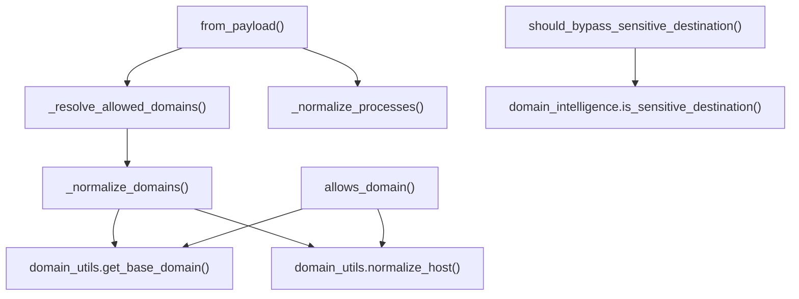

| Function / Method | Line | Incoming Callers (Called By) | Outgoing Calls (Calls) |
| :--- | :--- | :--- | :--- |
| **`_normalize_processes`** | 24 | `agent/dpi/policy.py::InspectionPolicy.from_payload` | *None* |
| **`_normalize_domains`** | 33 | `agent/dpi/policy.py::_resolve_allowed_domains` | `intel/domain_utils.py::get_base_domain`<br/>`intel/domain_utils.py::normalize_host` |
| **`_resolve_allowed_domains`** | 50 | `agent/dpi/policy.py::InspectionPolicy.from_payload` | `agent/dpi/policy.py::_normalize_domains` |
| **`InspectionPolicy.from_payload`** | 73 | `agent/dpi/controller.py::WebInspectionController.__init__`<br/>`agent/dpi/controller.py::WebInspectionController.refresh_policy` | `agent/dpi/policy.py::_normalize_processes`<br/>`agent/dpi/policy.py::_resolve_allowed_domains` |
| **`InspectionPolicy.allows_process`** | 113 | *None (0 incoming)* | *None* |
| **`InspectionPolicy.allows_domain`** | 121 | *None (0 incoming)* | `intel/domain_utils.py::get_base_domain`<br/>`intel/domain_utils.py::normalize_host` |
| **`InspectionPolicy.should_bypass_sensitive_destination`** | 138 | *None (0 incoming)* | `intel/domain_intelligence.py::is_sensitive_destination` |
| **`InspectionPolicy.to_payload`** | 143 | *None (0 incoming)* | *None* |

#### Module: `agent/dpi/proxy_manager.py`

```mermaid
graph TD
    agent_dpi_proxy_manager_py_ProxyManager_start["start()"] --> agent_dpi_proxy_manager_py_ProxyManager_is_running["is_running()"]
    agent_dpi_proxy_manager_py_ProxyManager_start["start()"] --> agent_dpi_proxy_manager_py_SystemProxyManager_enable_proxy["enable_proxy()"]
    agent_dpi_proxy_manager_py_ProxyManager_start["start()"] --> agent_dpi_proxy_manager_py_ProxyManager__utc_now["_utc_now()"]
    agent_dpi_proxy_manager_py_ProxyManager_start["start()"] --> agent_dpi_proxy_manager_py_ProxyManager__stderr_worker["_stderr_worker()"]
    agent_dpi_proxy_manager_py_ProxyManager_start["start()"] --> agent_dpi_proxy_manager_py_ProxyManager__mitmdump_path["_mitmdump_path()"]
    agent_dpi_proxy_manager_py_ProxyManager_start["start()"] --> agent_dpi_proxy_manager_py_ProxyManager__build_env["_build_env()"]
    agent_dpi_proxy_manager_py_ProxyManager_start["start()"] --> agent_dpi_proxy_manager_py_ProxyManager__prepare_mitm_certs["_prepare_mitm_certs()"]
    agent_dpi_proxy_manager_py_ProxyManager_start["start()"] --> agent_dpi_proxy_manager_py_ProxyManager__stdout_worker["_stdout_worker()"]
    agent_dpi_proxy_manager_py_ProxyManager_start["start()"] --> agent_dpi_proxy_manager_py_ProxyManager_stop["stop()"]
    agent_dpi_proxy_manager_py_ProxyManager_stop["stop()"] --> agent_dpi_proxy_manager_py_SystemProxyManager_disable_proxy["disable_proxy()"]
    agent_dpi_proxy_manager_py_ProxyManager__stdout_worker["_stdout_worker()"] --> agent_dpi_proxy_manager_py_ProxyManager__utc_now["_utc_now()"]
    agent_dpi_proxy_manager_py_ProxyManager__stderr_worker["_stderr_worker()"] --> agent_dpi_proxy_manager_py_ProxyManager__utc_now["_utc_now()"]
    agent_dpi_proxy_manager_py_ProxyManager_status["status()"] --> agent_dpi_proxy_manager_py_ProxyManager_is_running["is_running()"]
```

| Function / Method | Line | Incoming Callers (Called By) | Outgoing Calls (Calls) |
| :--- | :--- | :--- | :--- |
| **`_verify_port_listening`** | 23 | *None (0 incoming)* | *None* |
| **`SystemProxyManager.enable_proxy`** | 36 | `agent/dpi/proxy_manager.py::ProxyManager.start` | *None* |
| **`SystemProxyManager.disable_proxy`** | 59 | `agent/dpi/proxy_manager.py::ProxyManager.stop` | *None* |
| **`ProxyManager.__init__`** | 84 | `agent/dpi/controller.py::WebInspectionController.__init__` | *None* |
| **`ProxyManager._utc_now`** | 120 | `agent/dpi/proxy_manager.py::ProxyManager._stderr_worker`<br/>`agent/dpi/proxy_manager.py::ProxyManager.start`<br/>`agent/dpi/proxy_manager.py::ProxyManager._stdout_worker` | *None* |
| **`ProxyManager._mitmdump_path`** | 123 | `agent/dpi/proxy_manager.py::ProxyManager.start` | *None* |
| **`ProxyManager._build_env`** | 141 | `agent/dpi/proxy_manager.py::ProxyManager.start` | *None* |
| **`ProxyManager._prepare_mitm_certs`** | 147 | `agent/dpi/proxy_manager.py::ProxyManager.start` | *None* |
| **`ProxyManager.is_running`** | 150 | `agent/dpi/proxy_manager.py::ProxyManager.status`<br/>`agent/dpi/proxy_manager.py::ProxyManager.start` | *None* |
| **`ProxyManager.start`** | 153 | `agent/dpi/controller.py::WebInspectionController._apply_policy` | `agent/dpi/proxy_manager.py::ProxyManager.is_running`<br/>`agent/dpi/proxy_manager.py::SystemProxyManager.enable_proxy`<br/>`agent/dpi/proxy_manager.py::ProxyManager._utc_now`<br/>`agent/dpi/proxy_manager.py::ProxyManager._stderr_worker`<br/>`agent/dpi/proxy_manager.py::ProxyManager._mitmdump_path`<br/>`agent/dpi/proxy_manager.py::ProxyManager._build_env`<br/>`agent/dpi/proxy_manager.py::ProxyManager._prepare_mitm_certs`<br/>`agent/dpi/proxy_manager.py::ProxyManager._stdout_worker`<br/>*+ 1 more...* |
| **`ProxyManager.stop`** | 242 | `agent/dpi/proxy_manager.py::ProxyManager.start`<br/>`agent/dpi/controller.py::WebInspectionController._apply_policy`<br/>`agent/dpi/controller.py::WebInspectionController.stop` | `agent/dpi/proxy_manager.py::SystemProxyManager.disable_proxy` |
| **`ProxyManager._stdout_worker`** | 256 | `agent/dpi/proxy_manager.py::ProxyManager.start` | `agent/dpi/proxy_manager.py::ProxyManager._utc_now` |
| **`ProxyManager._stderr_worker`** | 299 | `agent/dpi/proxy_manager.py::ProxyManager.start` | `agent/dpi/proxy_manager.py::ProxyManager._utc_now` |
| **`ProxyManager.status`** | 319 | `agent/dpi/controller.py::WebInspectionController._live_metrics` | `agent/dpi/proxy_manager.py::ProxyManager.is_running` |

#### Module: `agent/dpi/quic_guard.py`

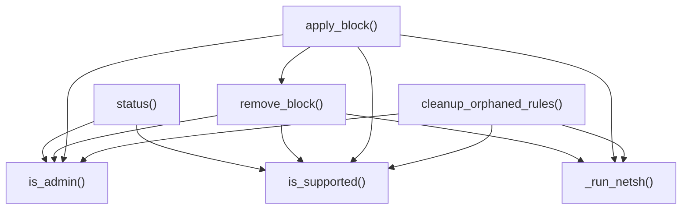

| Function / Method | Line | Incoming Callers (Called By) | Outgoing Calls (Calls) |
| :--- | :--- | :--- | :--- |
| **`QuicGuard.__init__`** | 23 | `agent/dpi/controller.py::WebInspectionController.__init__`<br/>`agent/main.py::NetworkAgent.__init__` | *None* |
| **`QuicGuard.is_admin`** | 33 | `agent/dpi/quic_guard.py::QuicGuard.status`<br/>`agent/dpi/quic_guard.py::QuicGuard.remove_block`<br/>`agent/dpi/controller.py::WebInspectionController._apply_policy`<br/>`agent/dpi/quic_guard.py::QuicGuard.cleanup_orphaned_rules`<br/>`agent/dpi/quic_guard.py::QuicGuard.apply_block` | *None* |
| **`QuicGuard.is_supported`** | 42 | `agent/dpi/quic_guard.py::QuicGuard.remove_block`<br/>`agent/dpi/quic_guard.py::QuicGuard.cleanup_orphaned_rules`<br/>`agent/dpi/quic_guard.py::QuicGuard.status`<br/>`agent/dpi/quic_guard.py::QuicGuard.apply_block` | *None* |
| **`QuicGuard._run_netsh`** | 46 | `agent/dpi/quic_guard.py::QuicGuard.remove_block`<br/>`agent/dpi/quic_guard.py::QuicGuard.cleanup_orphaned_rules`<br/>`agent/dpi/quic_guard.py::QuicGuard.apply_block` | *None* |
| **`QuicGuard.cleanup_orphaned_rules`** | 66 | `agent/main.py::NetworkAgent.__init__` | `agent/dpi/quic_guard.py::QuicGuard.is_admin`<br/>`agent/dpi/quic_guard.py::QuicGuard.is_supported`<br/>`agent/dpi/quic_guard.py::QuicGuard._run_netsh` |
| **`QuicGuard.apply_block`** | 86 | `agent/dpi/controller.py::WebInspectionController._apply_policy` | `agent/dpi/quic_guard.py::QuicGuard.is_admin`<br/>`agent/dpi/quic_guard.py::QuicGuard.remove_block`<br/>`agent/dpi/quic_guard.py::QuicGuard.is_supported`<br/>`agent/dpi/quic_guard.py::QuicGuard._run_netsh` |
| **`QuicGuard.remove_block`** | 146 | `agent/dpi/quic_guard.py::QuicGuard.apply_block`<br/>`agent/dpi/controller.py::WebInspectionController._apply_policy`<br/>`agent/dpi/controller.py::WebInspectionController.stop` | `agent/dpi/quic_guard.py::QuicGuard.is_admin`<br/>`agent/dpi/quic_guard.py::QuicGuard.is_supported`<br/>`agent/dpi/quic_guard.py::QuicGuard._run_netsh` |
| **`QuicGuard.status`** | 162 | `agent/dpi/controller.py::WebInspectionController._live_metrics` | `agent/dpi/quic_guard.py::QuicGuard.is_admin`<br/>`agent/dpi/quic_guard.py::QuicGuard.is_supported` |

#### Module: `agent/dpi/redaction.py`

*No outgoing repo-internal call edges originate from this module.*

| Function / Method | Line | Incoming Callers (Called By) | Outgoing Calls (Calls) |
| :--- | :--- | :--- | :--- |
| **`redact_headers`** | 20 | `agent/dpi/event_buffer.py::EventBuffer._prepare_event` | *None* |
| **`redact_url`** | 32 | `agent/dpi/event_buffer.py::EventBuffer._prepare_event` | *None* |
| **`sanitize_text_snippet`** | 88 | `agent/dpi/event_buffer.py::EventBuffer._prepare_event` | *None* |
| **`hash_text`** | 104 | `agent/dpi/event_buffer.py::EventBuffer._prepare_event` | *None* |

### Agent Security & Cryptography

#### Module: `agent/security/dpapi.py`

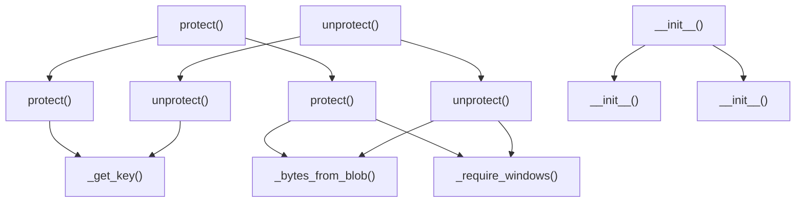

| Function / Method | Line | Incoming Callers (Called By) | Outgoing Calls (Calls) |
| :--- | :--- | :--- | :--- |
| **`DataProtector.protect`** | 13 | *None (0 incoming)* | *None* |
| **`DataProtector.unprotect`** | 16 | *None (0 incoming)* | *None* |
| **`WindowsCurrentUserProtector.__init__`** | 28 | `agent/security/transport.py::AgentApiClient.__init__`<br/>`agent/security/dpapi.py::DynamicProtector.__init__`<br/>`agent/dpi/cert_manager.py::CertificateManager.__init__`<br/>`agent/dpi/event_buffer.py::EventBuffer.__init__` | *None* |
| **`WindowsCurrentUserProtector._require_windows`** | 34 | `agent/security/dpapi.py::WindowsCurrentUserProtector.protect`<br/>`agent/security/dpapi.py::WindowsCurrentUserProtector.unprotect` | *None* |
| **`WindowsCurrentUserProtector._bytes_from_blob`** | 38 | `agent/security/dpapi.py::WindowsCurrentUserProtector.protect`<br/>`agent/security/dpapi.py::WindowsCurrentUserProtector.unprotect` | *None* |
| **`WindowsCurrentUserProtector.protect`** | 45 | `agent/security/dpapi.py::DynamicProtector.protect` | `agent/security/dpapi.py::WindowsCurrentUserProtector._bytes_from_blob`<br/>`agent/security/dpapi.py::WindowsCurrentUserProtector._require_windows` |
| **`WindowsCurrentUserProtector.unprotect`** | 67 | `agent/security/dpapi.py::DynamicProtector.unprotect` | `agent/security/dpapi.py::WindowsCurrentUserProtector._bytes_from_blob`<br/>`agent/security/dpapi.py::WindowsCurrentUserProtector._require_windows` |
| **`FileProtector.__init__`** | 90 | `agent/security/dpapi.py::DynamicProtector.__init__` | *None* |
| **`FileProtector._get_key`** | 97 | `agent/security/dpapi.py::FileProtector.protect`<br/>`agent/security/dpapi.py::FileProtector.unprotect` | *None* |
| **`FileProtector.protect`** | 127 | `agent/security/dpapi.py::DynamicProtector.protect` | `agent/security/dpapi.py::FileProtector._get_key` |
| **`FileProtector.unprotect`** | 136 | `agent/security/dpapi.py::DynamicProtector.unprotect` | `agent/security/dpapi.py::FileProtector._get_key` |
| **`DynamicProtector.__init__`** | 159 | `agent/security/state.py::ProtectedStateStore.__init__` | `agent/security/dpapi.py::WindowsCurrentUserProtector.__init__`<br/>`agent/security/dpapi.py::FileProtector.__init__` |
| **`DynamicProtector.protect`** | 164 | *None (0 incoming)* | `agent/security/dpapi.py::FileProtector.protect`<br/>`agent/security/dpapi.py::WindowsCurrentUserProtector.protect` |
| **`DynamicProtector.unprotect`** | 172 | *None (0 incoming)* | `agent/security/dpapi.py::FileProtector.unprotect`<br/>`agent/security/dpapi.py::WindowsCurrentUserProtector.unprotect` |

#### Module: `agent/security/integrity.py`

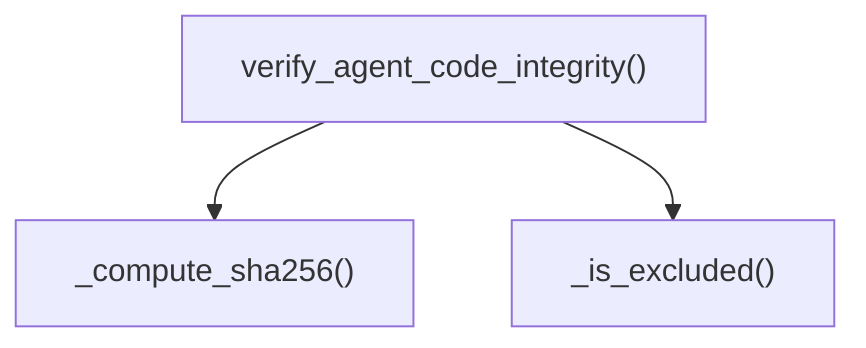

| Function / Method | Line | Incoming Callers (Called By) | Outgoing Calls (Calls) |
| :--- | :--- | :--- | :--- |
| **`_compute_sha256`** | 28 | `agent/security/integrity.py::verify_agent_code_integrity` | *None* |
| **`_is_excluded`** | 36 | `agent/security/integrity.py::verify_agent_code_integrity` | *None* |
| **`verify_agent_code_integrity`** | 48 | `agent/main.py::NetworkAgent.__init__`<br/>`agent/security/transport.py::AgentApiClient.status_snapshot` | `agent/security/integrity.py::_compute_sha256`<br/>`agent/security/integrity.py::_is_excluded` |

#### Module: `agent/security/mtls.py`

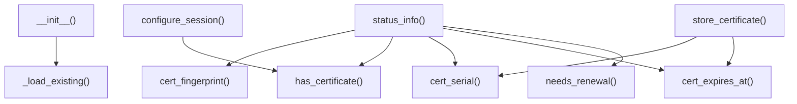

| Function / Method | Line | Incoming Callers (Called By) | Outgoing Calls (Calls) |
| :--- | :--- | :--- | :--- |
| **`AgentMTLS.__init__`** | 30 | `agent/security/transport.py::AgentApiClient.__init__` | `agent/security/mtls.py::AgentMTLS._load_existing` |
| **`AgentMTLS.has_certificate`** | 52 | `agent/security/mtls.py::AgentMTLS.configure_session`<br/>`agent/security/transport.py::AgentApiClient.enroll_certificate`<br/>`agent/security/mtls.py::AgentMTLS.status_info` | *None* |
| **`AgentMTLS.needs_renewal`** | 59 | `agent/security/transport.py::AgentApiClient.enroll_certificate`<br/>`agent/security/transport.py::AgentApiClient.check_certificate_renewal`<br/>`agent/security/mtls.py::AgentMTLS.status_info` | *None* |
| **`AgentMTLS.cert_fingerprint`** | 67 | `agent/security/mtls.py::AgentMTLS.status_info` | *None* |
| **`AgentMTLS.cert_serial`** | 74 | `agent/security/mtls.py::AgentMTLS.store_certificate`<br/>`agent/security/mtls.py::AgentMTLS.status_info` | *None* |
| **`AgentMTLS.cert_expires_at`** | 79 | `agent/security/mtls.py::AgentMTLS.store_certificate`<br/>`agent/security/mtls.py::AgentMTLS.status_info` | *None* |
| **`AgentMTLS.status_info`** | 84 | `agent/security/transport.py::AgentApiClient.status_snapshot` | `agent/security/mtls.py::AgentMTLS.cert_fingerprint`<br/>`agent/security/mtls.py::AgentMTLS.has_certificate`<br/>`agent/security/mtls.py::AgentMTLS.cert_serial`<br/>`agent/security/mtls.py::AgentMTLS.cert_expires_at`<br/>`agent/security/mtls.py::AgentMTLS.needs_renewal` |
| **`AgentMTLS.generate_csr`** | 98 | `agent/security/transport.py::AgentApiClient.enroll_certificate` | *None* |
| **`AgentMTLS.store_certificate`** | 136 | `agent/security/transport.py::AgentApiClient.enroll_certificate` | `agent/security/mtls.py::AgentMTLS.cert_serial`<br/>`agent/security/mtls.py::AgentMTLS.cert_expires_at` |
| **`AgentMTLS.configure_session`** | 156 | `agent/security/transport.py::AgentApiClient.__init__`<br/>`agent/security/transport.py::AgentApiClient.enroll_certificate` | `agent/security/mtls.py::AgentMTLS.has_certificate` |
| **`AgentMTLS._load_existing`** | 176 | `agent/security/mtls.py::AgentMTLS.__init__` | *None* |

#### Module: `agent/security/state.py`

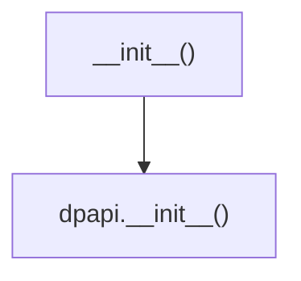

| Function / Method | Line | Incoming Callers (Called By) | Outgoing Calls (Calls) |
| :--- | :--- | :--- | :--- |
| **`ProtectedStateStore.__init__`** | 14 | `agent/security/transport.py::AgentApiClient.__init__` | `agent/security/dpapi.py::DynamicProtector.__init__` |
| **`ProtectedStateStore.load`** | 26 | `agent/security/transport.py::AgentApiClient.__init__` | *None* |
| **`ProtectedStateStore.save`** | 49 | `agent/security/transport.py::AgentApiClient._persist` | *None* |

#### Module: `agent/security/transport.py`

```mermaid
graph TD
    agent_security_transport_py_AgentApiClient___init__["__init__()"] --> agent_security_state_py_ProtectedStateStore_load["state.load()"]
    agent_security_transport_py_AgentApiClient___init__["__init__()"] --> agent_security_transport_py_AgentApiClient__normalize_pinset["_normalize_pinset()"]
    agent_security_transport_py_AgentApiClient___init__["__init__()"] --> agent_security_state_py_ProtectedStateStore___init__["state.__init__()"]
    agent_security_transport_py_AgentApiClient___init__["__init__()"] --> agent_security_dpapi_py_WindowsCurrentUserProtector___init__["dpapi.__init__()"]
    agent_security_transport_py_AgentApiClient___init__["__init__()"] --> agent_security_transport_py_AgentApiClient__normalize_credentials["_normalize_credentials()"]
    agent_security_transport_py_AgentApiClient___init__["__init__()"] --> agent_security_transport_py_AgentApiClient__persist["_persist()"]
    agent_security_transport_py_AgentApiClient___init__["__init__()"] --> agent_security_mtls_py_AgentMTLS___init__["mtls.__init__()"]
    agent_security_transport_py_AgentApiClient___init__["__init__()"] --> agent_security_mtls_py_AgentMTLS_configure_session["mtls.configure_session()"]
    agent_security_transport_py_AgentApiClient__persist["_persist()"] --> agent_security_state_py_ProtectedStateStore_save["state.save()"]
    agent_security_transport_py_AgentApiClient__normalize_pinset["_normalize_pinset()"] --> agent_security_transport_py_AgentApiClient__normalize_pin["_normalize_pin()"]
    agent_security_transport_py_AgentApiClient_seed_pins["seed_pins()"] --> agent_security_transport_py_AgentApiClient__persist["_persist()"]
    agent_security_transport_py_AgentApiClient_seed_pins["seed_pins()"] --> agent_security_transport_py_AgentApiClient__normalize_pinset["_normalize_pinset()"]
    agent_security_transport_py_AgentApiClient_has_credentials["has_credentials()"] --> agent_security_transport_py_AgentApiClient__credentials["_credentials()"]
    agent_security_transport_py_AgentApiClient_status_snapshot["status_snapshot()"] --> agent_security_integrity_py_verify_agent_code_integrity["integrity.verify_agent_code_integrity()"]
    agent_security_transport_py_AgentApiClient_status_snapshot["status_snapshot()"] --> agent_security_transport_py_AgentApiClient__credentials["_credentials()"]
    agent_security_transport_py_AgentApiClient_status_snapshot["status_snapshot()"] --> agent_security_transport_py_AgentApiClient_has_credentials["has_credentials()"]
    agent_security_transport_py_AgentApiClient_status_snapshot["status_snapshot()"] --> agent_security_mtls_py_AgentMTLS_status_info["mtls.status_info()"]
    agent_security_transport_py_AgentApiClient_status_snapshot["status_snapshot()"] --> agent_security_transport_py_AgentApiClient__pinset["_pinset()"]
    agent_security_transport_py_AgentApiClient_reset_enrollment["reset_enrollment()"] --> agent_security_transport_py_AgentApiClient__persist["_persist()"]
    agent_security_transport_py_AgentApiClient__pinset["_pinset()"] --> agent_security_transport_py_AgentApiClient__normalize_pinset["_normalize_pinset()"]
    agent_security_transport_py_AgentApiClient__enforce_transport_policy["_enforce_transport_policy()"] --> agent_security_transport_py_AgentApiClient__pinset["_pinset()"]
    agent_security_transport_py_AgentApiClient__enforce_transport_policy["_enforce_transport_policy()"] --> agent_security_transport_py_AgentApiClient__is_local_url["_is_local_url()"]
    agent_security_transport_py_AgentApiClient__enforce_transport_policy["_enforce_transport_policy()"] --> agent_security_transport_py_AgentApiClient__is_private_lan_url["_is_private_lan_url()"]
    agent_security_transport_py_AgentApiClient_bootstrap_post["bootstrap_post()"] --> agent_security_transport_py_AgentApiClient__enforce_tls_pins["_enforce_tls_pins()"]
    agent_security_transport_py_AgentApiClient_bootstrap_post["bootstrap_post()"] --> agent_security_transport_py_AgentApiClient__consume_security_metadata["_consume_security_metadata()"]
    agent_security_transport_py_AgentApiClient_bootstrap_post["bootstrap_post()"] --> agent_security_transport_py_AgentApiClient__enforce_transport_policy["_enforce_transport_policy()"]
    agent_security_transport_py_AgentApiClient_request["request()"] --> agent_security_transport_py_AgentApiClient__consume_security_metadata["_consume_security_metadata()"]
    agent_security_transport_py_AgentApiClient_request["request()"] --> agent_security_transport_py_AgentApiClient__credentials["_credentials()"]
    agent_security_transport_py_AgentApiClient_request["request()"] --> agent_security_transport_py_AgentApiClient__enforce_tls_pins["_enforce_tls_pins()"]
    agent_security_transport_py_AgentApiClient_request["request()"] --> security_agent_auth_py_sign_request["agent_auth.sign_request()"]
    agent_security_transport_py_AgentApiClient_request["request()"] --> agent_security_transport_py_AgentApiClient__enforce_transport_policy["_enforce_transport_policy()"]
    agent_security_transport_py_AgentApiClient__consume_security_metadata["_consume_security_metadata()"] --> agent_security_transport_py_AgentApiClient__normalize_pinset["_normalize_pinset()"]
    agent_security_transport_py_AgentApiClient__consume_security_metadata["_consume_security_metadata()"] --> agent_security_transport_py_AgentApiClient__persist["_persist()"]
    agent_security_transport_py_AgentApiClient__consume_security_metadata["_consume_security_metadata()"] --> agent_security_transport_py_AgentApiClient__normalize_credentials["_normalize_credentials()"]
    agent_security_transport_py_AgentApiClient_enroll_certificate["enroll_certificate()"] --> agent_security_transport_py_AgentApiClient_request["request()"]
    agent_security_transport_py_AgentApiClient_enroll_certificate["enroll_certificate()"] --> agent_security_transport_py_AgentApiClient_has_credentials["has_credentials()"]
    agent_security_transport_py_AgentApiClient_enroll_certificate["enroll_certificate()"] --> agent_security_mtls_py_AgentMTLS_has_certificate["mtls.has_certificate()"]
    agent_security_transport_py_AgentApiClient_enroll_certificate["enroll_certificate()"] --> agent_security_mtls_py_AgentMTLS_generate_csr["mtls.generate_csr()"]
    agent_security_transport_py_AgentApiClient_enroll_certificate["enroll_certificate()"] --> agent_security_mtls_py_AgentMTLS_store_certificate["mtls.store_certificate()"]
    agent_security_transport_py_AgentApiClient_enroll_certificate["enroll_certificate()"] --> agent_security_mtls_py_AgentMTLS_configure_session["mtls.configure_session()"]
    agent_security_transport_py_AgentApiClient_enroll_certificate["enroll_certificate()"] --> agent_security_mtls_py_AgentMTLS_needs_renewal["mtls.needs_renewal()"]
    agent_security_transport_py_AgentApiClient_check_certificate_renewal["check_certificate_renewal()"] --> agent_security_transport_py_AgentApiClient_enroll_certificate["enroll_certificate()"]
    agent_security_transport_py_AgentApiClient_check_certificate_renewal["check_certificate_renewal()"] --> agent_security_mtls_py_AgentMTLS_needs_renewal["mtls.needs_renewal()"]
    agent_security_transport_py_AgentApiClient__enforce_tls_pins["_enforce_tls_pins()"] --> agent_security_transport_py_AgentApiClient__pin_fingerprint["_pin_fingerprint()"]
    agent_security_transport_py_AgentApiClient__enforce_tls_pins["_enforce_tls_pins()"] --> agent_security_transport_py_AgentApiClient__extract_peer_certificate["_extract_peer_certificate()"]
    agent_security_transport_py_AgentApiClient__enforce_tls_pins["_enforce_tls_pins()"] --> agent_security_transport_py_AgentApiClient__pinset["_pinset()"]
```

| Function / Method | Line | Incoming Callers (Called By) | Outgoing Calls (Calls) |
| :--- | :--- | :--- | :--- |
| **`AgentApiClient.__init__`** | 41 | `agent/main.py::NetworkAgent.__init__` | `agent/security/state.py::ProtectedStateStore.load`<br/>`agent/security/transport.py::AgentApiClient._normalize_pinset`<br/>`agent/security/state.py::ProtectedStateStore.__init__`<br/>`agent/security/dpapi.py::WindowsCurrentUserProtector.__init__`<br/>`agent/security/transport.py::AgentApiClient._normalize_credentials`<br/>`agent/security/transport.py::AgentApiClient._persist`<br/>`agent/security/mtls.py::AgentMTLS.__init__`<br/>`agent/security/mtls.py::AgentMTLS.configure_session` |
| **`AgentApiClient._persist`** | 79 | `agent/security/transport.py::AgentApiClient.seed_pins`<br/>`agent/security/transport.py::AgentApiClient.__init__`<br/>`agent/security/transport.py::AgentApiClient.reset_enrollment`<br/>`agent/security/transport.py::AgentApiClient._consume_security_metadata` | `agent/security/state.py::ProtectedStateStore.save` |
| **`AgentApiClient._normalize_pin`** | 82 | `agent/security/transport.py::AgentApiClient._normalize_pinset` | *None* |
| **`AgentApiClient._normalize_pinset`** | 104 | `agent/security/transport.py::AgentApiClient.seed_pins`<br/>`agent/security/transport.py::AgentApiClient.__init__`<br/>`agent/security/transport.py::AgentApiClient._consume_security_metadata`<br/>`agent/security/transport.py::AgentApiClient._pinset` | `agent/security/transport.py::AgentApiClient._normalize_pin` |
| **`AgentApiClient._normalize_credentials`** | 127 | `agent/security/transport.py::AgentApiClient.__init__`<br/>`agent/security/transport.py::AgentApiClient._consume_security_metadata` | *None* |
| **`AgentApiClient.seed_pins`** | 145 | *None (0 incoming)* | `agent/security/transport.py::AgentApiClient._persist`<br/>`agent/security/transport.py::AgentApiClient._normalize_pinset` |
| **`AgentApiClient._credentials`** | 152 | `agent/security/transport.py::AgentApiClient.request`<br/>`agent/security/transport.py::AgentApiClient.has_credentials`<br/>`agent/security/transport.py::AgentApiClient.status_snapshot` | *None* |
| **`AgentApiClient.has_credentials`** | 156 | `agent/main.py::NetworkAgent.start`<br/>`agent/main.py::NetworkAgent._heartbeat_worker`<br/>`agent/main.py::NetworkAgent._hardening_findings`<br/>`agent/main.py::NetworkAgent._await_enrollment`<br/>`agent/main.py::NetworkAgent._register_agent`<br/>`agent/security/transport.py::AgentApiClient.enroll_certificate`<br/>`agent/main.py::NetworkAgent.__init__`<br/>`agent/security/transport.py::AgentApiClient.status_snapshot` | `agent/security/transport.py::AgentApiClient._credentials` |
| **`AgentApiClient.status_snapshot`** | 160 | `agent/main.py::NetworkAgent._hardening_findings`<br/>`agent/main.py::NetworkAgent.status_snapshot` | `agent/security/integrity.py::verify_agent_code_integrity`<br/>`agent/security/transport.py::AgentApiClient._credentials`<br/>`agent/security/transport.py::AgentApiClient.has_credentials`<br/>`agent/security/mtls.py::AgentMTLS.status_info`<br/>`agent/security/transport.py::AgentApiClient._pinset` |
| **`AgentApiClient.reset_enrollment`** | 206 | `agent/main.py::NetworkAgent._handle_auth_rejection` | `agent/security/transport.py::AgentApiClient._persist` |
| **`AgentApiClient._pinset`** | 212 | `agent/security/transport.py::AgentApiClient._enforce_tls_pins`<br/>`agent/security/transport.py::AgentApiClient.status_snapshot`<br/>`agent/security/transport.py::AgentApiClient._enforce_transport_policy` | `agent/security/transport.py::AgentApiClient._normalize_pinset` |
| **`AgentApiClient._is_local_url`** | 216 | `agent/security/transport.py::AgentApiClient._enforce_transport_policy` | *None* |
| **`AgentApiClient._is_private_lan_url`** | 221 | `agent/security/transport.py::AgentApiClient._enforce_transport_policy` | *None* |
| **`AgentApiClient._enforce_transport_policy`** | 233 | `agent/security/transport.py::AgentApiClient.bootstrap_post`<br/>`agent/security/transport.py::AgentApiClient.request` | `agent/security/transport.py::AgentApiClient._pinset`<br/>`agent/security/transport.py::AgentApiClient._is_local_url`<br/>`agent/security/transport.py::AgentApiClient._is_private_lan_url` |
| **`AgentApiClient.bootstrap_post`** | 247 | `agent/main.py::NetworkAgent._register_agent` | `agent/security/transport.py::AgentApiClient._enforce_tls_pins`<br/>`agent/security/transport.py::AgentApiClient._consume_security_metadata`<br/>`agent/security/transport.py::AgentApiClient._enforce_transport_policy` |
| **`AgentApiClient.request`** | 265 | `agent/main.py::NetworkAgent._upload_worker`<br/>`agent/security/transport.py::AgentApiClient.enroll_certificate`<br/>`agent/main.py::NetworkAgent._heartbeat_worker`<br/>`agent/main.py::NetworkAgent._sync_discovered_devices` | `agent/security/transport.py::AgentApiClient._consume_security_metadata`<br/>`agent/security/transport.py::AgentApiClient._credentials`<br/>`agent/security/transport.py::AgentApiClient._enforce_tls_pins`<br/>`security/agent_auth.py::sign_request`<br/>`agent/security/transport.py::AgentApiClient._enforce_transport_policy` |
| **`AgentApiClient._consume_security_metadata`** | 323 | `agent/security/transport.py::AgentApiClient.bootstrap_post`<br/>`agent/security/transport.py::AgentApiClient.request` | `agent/security/transport.py::AgentApiClient._normalize_pinset`<br/>`agent/security/transport.py::AgentApiClient._persist`<br/>`agent/security/transport.py::AgentApiClient._normalize_credentials` |
| **`AgentApiClient.enroll_certificate`** | 346 | `agent/security/transport.py::AgentApiClient.check_certificate_renewal` | `agent/security/transport.py::AgentApiClient.request`<br/>`agent/security/transport.py::AgentApiClient.has_credentials`<br/>`agent/security/mtls.py::AgentMTLS.has_certificate`<br/>`agent/security/mtls.py::AgentMTLS.generate_csr`<br/>`agent/security/mtls.py::AgentMTLS.store_certificate`<br/>`agent/security/mtls.py::AgentMTLS.configure_session`<br/>`agent/security/mtls.py::AgentMTLS.needs_renewal` |
| **`AgentApiClient.check_certificate_renewal`** | 401 | *None (0 incoming)* | `agent/security/transport.py::AgentApiClient.enroll_certificate`<br/>`agent/security/mtls.py::AgentMTLS.needs_renewal` |
| **`AgentApiClient._extract_peer_certificate`** | 408 | `agent/security/transport.py::AgentApiClient._enforce_tls_pins` | *None* |
| **`AgentApiClient._pin_fingerprint`** | 418 | `agent/security/transport.py::AgentApiClient._enforce_tls_pins` | *None* |
| **`AgentApiClient._enforce_tls_pins`** | 428 | `agent/security/transport.py::AgentApiClient.bootstrap_post`<br/>`agent/security/transport.py::AgentApiClient.request` | `agent/security/transport.py::AgentApiClient._pin_fingerprint`<br/>`agent/security/transport.py::AgentApiClient._extract_peer_certificate`<br/>`agent/security/transport.py::AgentApiClient._pinset` |

### Backend Root & Lifespan

#### Module: `backend/correlation_engine/benchmark_coordinator.py`

*No outgoing repo-internal call edges originate from this module.*

| Function / Method | Line | Incoming Callers (Called By) | Outgoing Calls (Calls) |
| :--- | :--- | :--- | :--- |
| **`run_benchmarks`** | 6 | *None (0 incoming)* | *None* |

#### Module: `backend/correlation_engine/python/engine.py`

```mermaid
graph TD
    backend_correlation_engine_python_engine_py_PythonCorrelationEngine___init__["__init__()"] --> backend_correlation_engine_python_engine_py_TimeWheel___init__["__init__()"]
    backend_correlation_engine_python_engine_py_PythonCorrelationEngine_add_node["add_node()"] --> backend_correlation_engine_python_engine_py_Node___init__["__init__()"]
    backend_correlation_engine_python_engine_py_PythonCorrelationEngine_add_edge["add_edge()"] --> backend_correlation_engine_python_engine_py_Edge___init__["__init__()"]
    backend_correlation_engine_python_engine_py_PythonCorrelationEngine_add_edge["add_edge()"] --> backend_correlation_engine_python_engine_py_PythonCorrelationEngine_add_node["add_node()"]
    backend_correlation_engine_python_engine_py_PythonCorrelationEngine_add_edge["add_edge()"] --> backend_correlation_engine_python_engine_py_TimeWheel_add_edge["add_edge()"]
    backend_correlation_engine_python_engine_py_PythonCorrelationEngine_expire_edges["expire_edges()"] --> backend_correlation_engine_python_engine_py_TimeWheel_tick["tick()"]
    backend_correlation_engine_python_engine_py_run_workload["run_workload()"] --> backend_correlation_engine_python_engine_py_PythonCorrelationEngine_add_edge["add_edge()"]
    backend_correlation_engine_python_engine_py_run_workload["run_workload()"] --> backend_correlation_engine_python_engine_py_PythonCorrelationEngine_expire_edges["expire_edges()"]
    backend_correlation_engine_python_engine_py_run_workload["run_workload()"] --> backend_correlation_engine_python_engine_py_PythonCorrelationEngine___init__["__init__()"]
    backend_correlation_engine_python_engine_py_run_workload["run_workload()"] --> backend_correlation_engine_python_engine_py_PythonCorrelationEngine_traverse["traverse()"]
```

| Function / Method | Line | Incoming Callers (Called By) | Outgoing Calls (Calls) |
| :--- | :--- | :--- | :--- |
| **`Node.__init__`** | 6 | `backend/correlation_engine/python/engine.py::PythonCorrelationEngine.add_node` | *None* |
| **`Edge.__init__`** | 12 | `backend/correlation_engine/python/engine.py::PythonCorrelationEngine.add_edge` | *None* |
| **`TimeWheel.__init__`** | 18 | `backend/correlation_engine/python/engine.py::PythonCorrelationEngine.__init__` | *None* |
| **`TimeWheel.add_edge`** | 24 | `backend/correlation_engine/python/engine.py::PythonCorrelationEngine.add_edge` | *None* |
| **`TimeWheel.tick`** | 30 | `backend/correlation_engine/python/engine.py::PythonCorrelationEngine.expire_edges` | *None* |
| **`PythonCorrelationEngine.__init__`** | 42 | `backend/correlation_engine/python/engine.py::run_workload` | `backend/correlation_engine/python/engine.py::TimeWheel.__init__` |
| **`PythonCorrelationEngine.add_node`** | 47 | `backend/correlation_engine/python/engine.py::PythonCorrelationEngine.add_edge` | `backend/correlation_engine/python/engine.py::Node.__init__` |
| **`PythonCorrelationEngine.add_edge`** | 51 | `backend/correlation_engine/python/engine.py::run_workload` | `backend/correlation_engine/python/engine.py::Edge.__init__`<br/>`backend/correlation_engine/python/engine.py::PythonCorrelationEngine.add_node`<br/>`backend/correlation_engine/python/engine.py::TimeWheel.add_edge` |
| **`PythonCorrelationEngine.traverse`** | 65 | `backend/correlation_engine/python/engine.py::run_workload` | *None* |
| **`PythonCorrelationEngine.expire_edges`** | 82 | `backend/correlation_engine/python/engine.py::run_workload` | `backend/correlation_engine/python/engine.py::TimeWheel.tick` |
| **`run_workload`** | 103 | *None (0 incoming)* | `backend/correlation_engine/python/engine.py::PythonCorrelationEngine.add_edge`<br/>`backend/correlation_engine/python/engine.py::PythonCorrelationEngine.expire_edges`<br/>`backend/correlation_engine/python/engine.py::PythonCorrelationEngine.__init__`<br/>`backend/correlation_engine/python/engine.py::PythonCorrelationEngine.traverse` |

#### Module: `backend/main.py`

```mermaid
graph TD
    backend_main_py_lifespan["lifespan()"] --> backend_services_agent_enrollment_service_py_AgentEnrollmentService_ensure_schema["agent_enrollment_service.ensure_schema()"]
    backend_main_py_lifespan["lifespan()"] --> backend_services_web_inspection_service_py_WebInspectionService_ensure_schema["web_inspection_service.ensure_schema()"]
    backend_main_py_lifespan["lifespan()"] --> backend_services_vpn_detector_py_VPNDetector_shutdown["vpn_detector.shutdown()"]
    backend_main_py_lifespan["lifespan()"] --> backend_services_live_telemetry_store_py_LiveTelemetryStore_initialize_from_db["live_telemetry_store.initialize_from_db()"]
    backend_main_py_lifespan["lifespan()"] --> backend_services_event_dispatcher_py_EventDispatcher_stop["event_dispatcher.stop()"]
    backend_main_py_lifespan["lifespan()"] --> backend_services_flow_service_py_FlowService_shutdown["flow_service.shutdown()"]
    backend_main_py_lifespan["lifespan()"] --> backend_main_py__validate_runtime_config["_validate_runtime_config()"]
    backend_main_py_lifespan["lifespan()"] --> backend_db_session_py_ensure_bootstrap_state["session.ensure_bootstrap_state()"]
    backend_main_py_lifespan["lifespan()"] --> backend_db_session_py_get_db_connection["session.get_db_connection()"]
    backend_main_py_lifespan["lifespan()"] --> backend_services_broadcast_scheduler_py_BroadcastScheduler_start["broadcast_scheduler.start()"]
    backend_main_py_lifespan["lifespan()"] --> backend_services_system_service_py_SystemService_prepare_clean_runtime["system_service.prepare_clean_runtime()"]
    backend_main_py_lifespan["lifespan()"] --> backend_core_sentry_py_init_sentry["sentry.init_sentry()"]
    backend_main_py_lifespan["lifespan()"] --> backend_services_flow_service_py_FlowService__ensure_flow_log_schema["flow_service._ensure_flow_log_schema()"]
    backend_main_py_lifespan["lifespan()"] --> backend_services_worker_supervisor_py_WorkerSupervisor_stop_all["worker_supervisor.stop_all()"]
    backend_main_py_lifespan["lifespan()"] --> backend_services_application_service_py_ApplicationService_ensure_schema["application_service.ensure_schema()"]
    backend_main_py_lifespan["lifespan()"] --> backend_services_worker_supervisor_py_WorkerSupervisor_register["worker_supervisor.register()"]
    backend_main_py_lifespan["lifespan()"] --> backend_services_correlation_worker_py_CorrelationWorker_stop["correlation_worker.stop()"]
    backend_main_py_lifespan["lifespan()"] --> backend_services_event_dispatcher_py_EventDispatcher_start["event_dispatcher.start()"]
    backend_main_py_lifespan["lifespan()"] --> backend_services_broadcast_scheduler_py_BroadcastScheduler_stop["broadcast_scheduler.stop()"]
    backend_main_py_lifespan["lifespan()"] --> backend_services_worker_supervisor_py_WorkerSupervisor_start_all["worker_supervisor.start_all()"]
    backend_main_py_lifespan__do_shutdown_export["_do_shutdown_export()"] --> backend_services_system_service_py_SystemService_export_all_tables_to_db_dump["system_service.export_all_tables_to_db_dump()"]
    backend_main_py_lifespan__do_shutdown_export["_do_shutdown_export()"] --> backend_db_session_py_get_db_connection["session.get_db_connection()"]
    backend_main_py_lifespan__do_shutdown_backup["_do_shutdown_backup()"] --> backend_services_system_service_py_SystemService_backup_and_reset_runtime_data["system_service.backup_and_reset_runtime_data()"]
    backend_main_py_lifespan__do_shutdown_backup["_do_shutdown_backup()"] --> backend_db_session_py_get_db_connection["session.get_db_connection()"]
    backend_main_py_global_exception_handler["global_exception_handler()"] --> backend_main_py_redact_secrets_from_string["redact_secrets_from_string()"]
    backend_main_py_metrics["metrics()"] --> backend_middleware_prometheus_middleware_py_metrics_endpoint_handler["prometheus_middleware.metrics_endpoint_handler()"]
    backend_main_py_connect["connect()"] --> backend_realtime_py_socket_room_for_organization["realtime.socket_room_for_organization()"]
```

| Function / Method | Line | Incoming Callers (Called By) | Outgoing Calls (Calls) |
| :--- | :--- | :--- | :--- |
| **`_resolve_log_level`** | 33 | *None (0 incoming)* | *None* |
| **`_allowed_origins`** | 46 | *None (0 incoming)* | *None* |
| **`_validate_runtime_config`** | 52 | `backend/main.py::lifespan` | *None* |
| **`lifespan`** | 91 | *None (0 incoming)* | `backend/services/agent_enrollment_service.py::AgentEnrollmentService.ensure_schema`<br/>`backend/services/web_inspection_service.py::WebInspectionService.ensure_schema`<br/>`backend/services/vpn_detector.py::VPNDetector.shutdown`<br/>`backend/services/live_telemetry_store.py::LiveTelemetryStore.initialize_from_db`<br/>`backend/services/event_dispatcher.py::EventDispatcher.stop`<br/>`backend/services/flow_service.py::FlowService.shutdown`<br/>`backend/main.py::_validate_runtime_config`<br/>`backend/db/session.py::ensure_bootstrap_state`<br/>*+ 12 more...* |
| **`lifespan._do_shutdown_export`** | 168 | *None (0 incoming)* | `backend/services/system_service.py::SystemService.export_all_tables_to_db_dump`<br/>`backend/db/session.py::get_db_connection` |
| **`lifespan._do_shutdown_backup`** | 187 | *None (0 incoming)* | `backend/services/system_service.py::SystemService.backup_and_reset_runtime_data`<br/>`backend/db/session.py::get_db_connection` |
| **`direct_ping`** | 241 | *None (0 incoming)* | *None* |
| **`redact_secrets_from_string`** | 244 | `backend/main.py::global_exception_handler` | *None* |
| **`global_exception_handler`** | 268 | *None (0 incoming)* | `backend/main.py::redact_secrets_from_string` |
| **`ping`** | 283 | *None (0 incoming)* | *None* |
| **`metrics`** | 287 | *None (0 incoming)* | `backend/middleware/prometheus_middleware.py::metrics_endpoint_handler` |
| **`connect`** | 292 | *None (0 incoming)* | `backend/realtime.py::socket_room_for_organization` |
| **`disconnect`** | 322 | *None (0 incoming)* | *None* |
| **`serve_react_app`** | 334 | *None (0 incoming)* | *None* |

#### Module: `backend/realtime.py`

```mermaid
graph TD
    backend_realtime_py_authenticate_socket_connection["authenticate_socket_connection()"] --> backend_services_metrics_service_py_MetricsService_increment["metrics_service.increment()"]
    backend_realtime_py_authenticate_socket_connection["authenticate_socket_connection()"] --> backend_core_security_py_verify_access_token["security.verify_access_token()"]
    backend_realtime_py_authenticate_socket_connection["authenticate_socket_connection()"] --> backend_realtime_py__parse_cookie_token["_parse_cookie_token()"]
    backend_realtime_py_authenticate_socket_connection["authenticate_socket_connection()"] --> backend_services_auth_service_py_AuthService_get_user_by_id["auth_service.get_user_by_id()"]
    backend_realtime_py_authenticate_socket_connection["authenticate_socket_connection()"] --> backend_db_session_py_get_db_connection["session.get_db_connection()"]
    backend_realtime_py_emit_event["emit_event()"] --> backend_realtime_py_socket_room_for_organization["socket_room_for_organization()"]
```

| Function / Method | Line | Incoming Callers (Called By) | Outgoing Calls (Calls) |
| :--- | :--- | :--- | :--- |
| **`configure_socket_server`** | 27 | *None (0 incoming)* | *None* |
| **`socket_room_for_organization`** | 32 | `backend/realtime.py::emit_event`<br/>`backend/main.py::connect` | *None* |
| **`_parse_cookie_token`** | 39 | `backend/realtime.py::authenticate_socket_connection` | *None* |
| **`authenticate_socket_connection`** | 58 | *None (0 incoming)* | `backend/services/metrics_service.py::MetricsService.increment`<br/>`backend/core/security.py::verify_access_token`<br/>`backend/realtime.py::_parse_cookie_token`<br/>`backend/services/auth_service.py::AuthService.get_user_by_id`<br/>`backend/db/session.py::get_db_connection` |
| **`emit_event`** | 99 | `backend/services/flow_service.py::FlowService._emit_realtime_events`<br/>`backend/services/correlation_worker.py::CorrelationWorker.start`<br/>`backend/api/dpi.py::DpiEventEmitter.emit`<br/>`backend/services/broadcast_scheduler.py::BroadcastScheduler.broadcast_all` | `backend/realtime.py::socket_room_for_organization` |

### Backend Core Configuration & Security

#### Module: `backend/core/config.py`

```mermaid
graph TD
    backend_core_config_py_validate_secret_strength["validate_secret_strength()"] --> backend_core_config_py__shannon_entropy_bits["_shannon_entropy_bits()"]
    backend_core_config_py_validate_secret_strength["validate_secret_strength()"] --> backend_core_config_py__min_entropy_bits["_min_entropy_bits()"]
    backend_core_config_py_Settings_validate_config["validate_config()"] --> backend_core_config_py_validate_secret_strength["validate_secret_strength()"]
```

| Function / Method | Line | Incoming Callers (Called By) | Outgoing Calls (Calls) |
| :--- | :--- | :--- | :--- |
| **`_shannon_entropy_bits`** | 40 | `backend/core/config.py::validate_secret_strength` | *None* |
| **`_min_entropy_bits`** | 56 | `backend/core/config.py::validate_secret_strength` | *None* |
| **`validate_secret_strength`** | 69 | `backend/core/config.py::Settings.validate_config` | `backend/core/config.py::_shannon_entropy_bits`<br/>`backend/core/config.py::_min_entropy_bits` |
| **`Settings.validate_config`** | 276 | *None (0 incoming)* | `backend/core/config.py::validate_secret_strength` |
| **`get_settings`** | 327 | `backend/core/security.py::_get_signing_key`<br/>`backend/core/security.py::_load_private_key`<br/>`backend/core/security.py::verify_access_token`<br/>`backend/core/security.py::_load_public_key`<br/>`backend/core/security.py::_get_verification_key`<br/>`backend/core/security.py::create_access_token` | *None* |
| **`set_settings`** | 336 | *None (0 incoming)* | *None* |

#### Module: `backend/core/dependencies.py`

```mermaid
graph TD
    backend_core_dependencies_py_get_current_user["get_current_user()"] --> backend_core_dependencies_py__resolve_request_token["_resolve_request_token()"]
    backend_core_dependencies_py_get_current_user["get_current_user()"] --> backend_core_dependencies_py_SecurityContext___init__["__init__()"]
    backend_core_dependencies_py_get_current_user["get_current_user()"] --> backend_core_security_py_verify_access_token["security.verify_access_token()"]
    backend_core_dependencies_py_get_current_user["get_current_user()"] --> backend_db_session_py_get_db["session.get_db()"]
    backend_core_dependencies_py_get_current_user["get_current_user()"] --> backend_services_auth_service_py_AuthService_get_user_by_id["auth_service.get_user_by_id()"]
    backend_core_dependencies_py_get_current_user["get_current_user()"] --> backend_db_session_py_get_db_connection["session.get_db_connection()"]
    backend_core_dependencies_py_require_org_scoped_role_dependency["dependency()"] --> backend_core_dependencies_py_get_current_user["get_current_user()"]
    backend_core_dependencies_py_require_super_admin["require_super_admin()"] --> backend_core_dependencies_py_get_current_user["get_current_user()"]
    backend_core_dependencies_py_require_org_admin["require_org_admin()"] --> backend_core_dependencies_py_get_current_user["get_current_user()"]
    backend_core_dependencies_py_admin_required["admin_required()"] --> backend_core_dependencies_py_get_current_user["get_current_user()"]
    backend_core_dependencies_py__default_rate_limit_identity["_default_rate_limit_identity()"] --> backend_utils_network_py_resolve_source_ip["network.resolve_source_ip()"]
    backend_core_dependencies_py_request_rate_limit_dependency["dependency()"] --> backend_services_metrics_service_py_MetricsService_increment["metrics_service.increment()"]
    backend_core_dependencies_py_request_rate_limit_dependency["dependency()"] --> backend_db_redis_client_py_get_redis_connection["redis_client.get_redis_connection()"]
    backend_core_dependencies_py_request_rate_limit_dependency["dependency()"] --> backend_services_metrics_service_py_MetricsService_set_gauge["metrics_service.set_gauge()"]
    backend_core_dependencies_py_rate_limit["rate_limit()"] --> backend_core_dependencies_py_request_rate_limit["request_rate_limit()"]
```

| Function / Method | Line | Incoming Callers (Called By) | Outgoing Calls (Calls) |
| :--- | :--- | :--- | :--- |
| **`_resolve_request_token`** | 17 | `backend/core/dependencies.py::get_current_user` | *None* |
| **`SecurityContext.__init__`** | 30 | `backend/core/dependencies.py::get_current_user` | *None* |
| **`SecurityContext.id`** | 54 | *None (0 incoming)* | *None* |
| **`SecurityContext.user_id`** | 58 | *None (0 incoming)* | *None* |
| **`SecurityContext.organization_id`** | 62 | *None (0 incoming)* | *None* |
| **`SecurityContext.role`** | 66 | *None (0 incoming)* | *None* |
| **`SecurityContext.permissions`** | 70 | *None (0 incoming)* | *None* |
| **`SecurityContext.username`** | 74 | *None (0 incoming)* | *None* |
| **`SecurityContext.email`** | 78 | *None (0 incoming)* | *None* |
| **`get_current_user`** | 82 | `backend/core/dependencies.py::require_super_admin`<br/>`backend/core/dependencies.py::require_org_admin`<br/>`backend/core/dependencies.py::require_org_scoped_role.dependency`<br/>`backend/api/auth.py::get_me`<br/>`backend/core/dependencies.py::admin_required` | `backend/core/dependencies.py::_resolve_request_token`<br/>`backend/core/dependencies.py::SecurityContext.__init__`<br/>`backend/core/security.py::verify_access_token`<br/>`backend/db/session.py::get_db`<br/>`backend/services/auth_service.py::AuthService.get_user_by_id`<br/>`backend/db/session.py::get_db_connection` |
| **`require_org_scoped_role`** | 155 | `backend/api/certificates.py::list_revocations`<br/>`backend/api/certificates.py::get_ca_certificate`<br/>`backend/api/certificates.py::list_certificates`<br/>`backend/api/certificates.py::revoke_certificate` | *None* |
| **`require_org_scoped_role.dependency`** | 159 | *None (0 incoming)* | `backend/core/dependencies.py::get_current_user` |
| **`require_super_admin`** | 171 | `backend/api/system.py::reset_platform_data` | `backend/core/dependencies.py::get_current_user` |
| **`require_org_admin`** | 177 | `backend/api/dashboard.py::get_dashboard_overview`<br/>`backend/api/agent_monitoring.py::list_enrollment_requests`<br/>`backend/api/logs.py::get_flows`<br/>`backend/api/web_inspection.py::get_global_web_activity_groups`<br/>`backend/api/dashboard.py::get_dashboard_activity`<br/>`backend/api/dashboard.py::get_device_stats`<br/>`backend/api/apps.py::get_apps_summary`<br/>`backend/api/dashboard.py::get_traffic_history`<br/>*+ 34 more...* | `backend/core/dependencies.py::get_current_user` |
| **`admin_required`** | 183 | `backend/api/system.py::reset_data` | `backend/core/dependencies.py::get_current_user` |
| **`_default_rate_limit_identity`** | 197 | *None (0 incoming)* | `backend/utils/network.py::resolve_source_ip` |
| **`request_rate_limit`** | 203 | `backend/core/dependencies.py::rate_limit` | *None* |
| **`request_rate_limit.dependency`** | 213 | *None (0 incoming)* | `backend/services/metrics_service.py::MetricsService.increment`<br/>`backend/db/redis_client.py::get_redis_connection`<br/>`backend/services/metrics_service.py::MetricsService.set_gauge` |
| **`rate_limit`** | 281 | *None (0 incoming)* | `backend/core/dependencies.py::request_rate_limit` |

#### Module: `backend/core/security.py`

```mermaid
graph TD
    backend_core_security_py__load_private_key["_load_private_key()"] --> backend_core_config_py_get_settings["config.get_settings()"]
    backend_core_security_py__load_public_key["_load_public_key()"] --> backend_core_config_py_get_settings["config.get_settings()"]
    backend_core_security_py__get_signing_key["_get_signing_key()"] --> backend_core_security_py__load_private_key["_load_private_key()"]
    backend_core_security_py__get_signing_key["_get_signing_key()"] --> backend_core_config_py_get_settings["config.get_settings()"]
    backend_core_security_py__get_verification_key["_get_verification_key()"] --> backend_core_security_py__load_public_key["_load_public_key()"]
    backend_core_security_py__get_verification_key["_get_verification_key()"] --> backend_core_config_py_get_settings["config.get_settings()"]
    backend_core_security_py_create_access_token["create_access_token()"] --> backend_core_security_py__get_signing_key["_get_signing_key()"]
    backend_core_security_py_create_access_token["create_access_token()"] --> backend_core_config_py_get_settings["config.get_settings()"]
    backend_core_security_py_verify_access_token["verify_access_token()"] --> backend_core_security_py__get_verification_key["_get_verification_key()"]
    backend_core_security_py_verify_access_token["verify_access_token()"] --> backend_core_config_py_get_settings["config.get_settings()"]
```

| Function / Method | Line | Incoming Callers (Called By) | Outgoing Calls (Calls) |
| :--- | :--- | :--- | :--- |
| **`_load_private_key`** | 14 | `backend/core/security.py::_get_signing_key` | `backend/core/config.py::get_settings` |
| **`_load_public_key`** | 30 | `backend/core/security.py::_get_verification_key` | `backend/core/config.py::get_settings` |
| **`_get_signing_key`** | 47 | `backend/core/security.py::create_access_token` | `backend/core/security.py::_load_private_key`<br/>`backend/core/config.py::get_settings` |
| **`_get_verification_key`** | 61 | `backend/core/security.py::verify_access_token` | `backend/core/security.py::_load_public_key`<br/>`backend/core/config.py::get_settings` |
| **`create_access_token`** | 75 | `backend/api/auth.py::login`<br/>`backend/api/auth.py::refresh_session` | `backend/core/security.py::_get_signing_key`<br/>`backend/core/config.py::get_settings` |
| **`verify_access_token`** | 109 | `backend/realtime.py::authenticate_socket_connection`<br/>`backend/api/auth.py::logout`<br/>`backend/core/dependencies.py::get_current_user` | `backend/core/security.py::_get_verification_key`<br/>`backend/core/config.py::get_settings` |
| **`verify_password`** | 128 | `backend/services/auth_service.py::AuthService.authenticate` | *None* |
| **`get_password_hash`** | 135 | `backend/db/session.py::ensure_bootstrap_state`<br/>`backend/services/auth_service.py::AuthService.create_user` | *None* |

#### Module: `backend/core/sentry.py`

*No outgoing repo-internal call edges originate from this module.*

| Function / Method | Line | Incoming Callers (Called By) | Outgoing Calls (Calls) |
| :--- | :--- | :--- | :--- |
| **`init_sentry`** | 23 | `backend/main.py::lifespan` | *None* |
| **`capture_sample_event`** | 63 | `backend/api/health.py::trigger_sentry_test` | *None* |

### Backend REST API Routers

#### Module: `backend/api/agent_monitoring.py`

```mermaid
graph TD
    backend_api_agent_monitoring_py__resolve_source_ip["_resolve_source_ip()"] --> backend_utils_network_py_resolve_source_ip["network.resolve_source_ip()"]
    backend_api_agent_monitoring_py_list_agents["list_agents()"] --> backend_db_session_py_get_db["session.get_db()"]
    backend_api_agent_monitoring_py_list_agents["list_agents()"] --> backend_services_agent_service_py_AgentService_get_agents["agent_service.get_agents()"]
    backend_api_agent_monitoring_py_list_agents["list_agents()"] --> backend_core_dependencies_py_require_org_admin["dependencies.require_org_admin()"]
    backend_api_agent_monitoring_py_list_enrollment_requests["list_enrollment_requests()"] --> backend_db_session_py_get_db["session.get_db()"]
    backend_api_agent_monitoring_py_list_enrollment_requests["list_enrollment_requests()"] --> backend_services_agent_enrollment_service_py_AgentEnrollmentService_list_requests["agent_enrollment_service.list_requests()"]
    backend_api_agent_monitoring_py_list_enrollment_requests["list_enrollment_requests()"] --> backend_core_dependencies_py_require_org_admin["dependencies.require_org_admin()"]
    backend_api_agent_monitoring_py_approve_enrollment_request["approve_enrollment_request()"] --> backend_services_agent_enrollment_service_py_AgentEnrollmentService_approve_request["agent_enrollment_service.approve_request()"]
    backend_api_agent_monitoring_py_approve_enrollment_request["approve_enrollment_request()"] --> backend_api_agent_monitoring_py__resolve_source_ip["_resolve_source_ip()"]
    backend_api_agent_monitoring_py_approve_enrollment_request["approve_enrollment_request()"] --> backend_core_dependencies_py_require_org_admin["dependencies.require_org_admin()"]
    backend_api_agent_monitoring_py_approve_enrollment_request["approve_enrollment_request()"] --> backend_services_audit_service_py_AuditService_log_agent_registration["audit_service.log_agent_registration()"]
    backend_api_agent_monitoring_py_approve_enrollment_request["approve_enrollment_request()"] --> backend_db_session_py_get_db["session.get_db()"]
    backend_api_agent_monitoring_py_reject_enrollment_request["reject_enrollment_request()"] --> backend_api_agent_monitoring_py__resolve_source_ip["_resolve_source_ip()"]
    backend_api_agent_monitoring_py_reject_enrollment_request["reject_enrollment_request()"] --> backend_core_dependencies_py_require_org_admin["dependencies.require_org_admin()"]
    backend_api_agent_monitoring_py_reject_enrollment_request["reject_enrollment_request()"] --> backend_services_audit_service_py_AuditService_log_agent_registration["audit_service.log_agent_registration()"]
    backend_api_agent_monitoring_py_reject_enrollment_request["reject_enrollment_request()"] --> backend_db_session_py_get_db["session.get_db()"]
    backend_api_agent_monitoring_py_reject_enrollment_request["reject_enrollment_request()"] --> backend_services_agent_enrollment_service_py_AgentEnrollmentService_reject_request["agent_enrollment_service.reject_request()"]
    backend_api_agent_monitoring_py_revoke_agent_enrollment["revoke_agent_enrollment()"] --> backend_api_agent_monitoring_py__resolve_source_ip["_resolve_source_ip()"]
    backend_api_agent_monitoring_py_revoke_agent_enrollment["revoke_agent_enrollment()"] --> backend_core_dependencies_py_require_org_admin["dependencies.require_org_admin()"]
    backend_api_agent_monitoring_py_revoke_agent_enrollment["revoke_agent_enrollment()"] --> backend_services_audit_service_py_AuditService_log_agent_registration["audit_service.log_agent_registration()"]
    backend_api_agent_monitoring_py_revoke_agent_enrollment["revoke_agent_enrollment()"] --> backend_services_agent_auth_service_py_AgentAuthService_revoke_credential["agent_auth_service.revoke_credential()"]
    backend_api_agent_monitoring_py_revoke_agent_enrollment["revoke_agent_enrollment()"] --> backend_services_agent_enrollment_service_py_AgentEnrollmentService_get_request_by_agent_id["agent_enrollment_service.get_request_by_agent_id()"]
    backend_api_agent_monitoring_py_revoke_agent_enrollment["revoke_agent_enrollment()"] --> backend_services_agent_enrollment_service_py_AgentEnrollmentService_revoke_request["agent_enrollment_service.revoke_request()"]
    backend_api_agent_monitoring_py_revoke_agent_enrollment["revoke_agent_enrollment()"] --> backend_db_session_py_get_db["session.get_db()"]
    backend_api_agent_monitoring_py_get_agent_details["get_agent_details()"] --> backend_db_session_py_get_db["session.get_db()"]
    backend_api_agent_monitoring_py_get_agent_details["get_agent_details()"] --> backend_services_agent_service_py_AgentService_get_agent_details["agent_service.get_agent_details()"]
    backend_api_agent_monitoring_py_get_agent_details["get_agent_details()"] --> backend_core_dependencies_py_require_org_admin["dependencies.require_org_admin()"]
```

| Function / Method | Line | Incoming Callers (Called By) | Outgoing Calls (Calls) |
| :--- | :--- | :--- | :--- |
| **`_resolve_source_ip`** | 16 | `backend/api/agent_monitoring.py::approve_enrollment_request`<br/>`backend/api/agent_monitoring.py::reject_enrollment_request`<br/>`backend/api/agent_monitoring.py::revoke_agent_enrollment` | `backend/utils/network.py::resolve_source_ip` |
| **`list_agents`** | 23 | *None (0 incoming)* | `backend/db/session.py::get_db`<br/>`backend/services/agent_service.py::AgentService.get_agents`<br/>`backend/core/dependencies.py::require_org_admin` |
| **`list_enrollment_requests`** | 32 | *None (0 incoming)* | `backend/db/session.py::get_db`<br/>`backend/services/agent_enrollment_service.py::AgentEnrollmentService.list_requests`<br/>`backend/core/dependencies.py::require_org_admin` |
| **`approve_enrollment_request`** | 41 | *None (0 incoming)* | `backend/services/agent_enrollment_service.py::AgentEnrollmentService.approve_request`<br/>`backend/api/agent_monitoring.py::_resolve_source_ip`<br/>`backend/core/dependencies.py::require_org_admin`<br/>`backend/services/audit_service.py::AuditService.log_agent_registration`<br/>`backend/db/session.py::get_db` |
| **`reject_enrollment_request`** | 73 | *None (0 incoming)* | `backend/api/agent_monitoring.py::_resolve_source_ip`<br/>`backend/core/dependencies.py::require_org_admin`<br/>`backend/services/audit_service.py::AuditService.log_agent_registration`<br/>`backend/db/session.py::get_db`<br/>`backend/services/agent_enrollment_service.py::AgentEnrollmentService.reject_request` |
| **`revoke_agent_enrollment`** | 105 | *None (0 incoming)* | `backend/api/agent_monitoring.py::_resolve_source_ip`<br/>`backend/core/dependencies.py::require_org_admin`<br/>`backend/services/audit_service.py::AuditService.log_agent_registration`<br/>`backend/services/agent_auth_service.py::AgentAuthService.revoke_credential`<br/>`backend/services/agent_enrollment_service.py::AgentEnrollmentService.get_request_by_agent_id`<br/>`backend/services/agent_enrollment_service.py::AgentEnrollmentService.revoke_request`<br/>`backend/db/session.py::get_db` |
| **`get_agent_details`** | 143 | *None (0 incoming)* | `backend/db/session.py::get_db`<br/>`backend/services/agent_service.py::AgentService.get_agent_details`<br/>`backend/core/dependencies.py::require_org_admin` |

#### Module: `backend/api/agents.py`

```mermaid
graph TD
    backend_api_agents_py__collect_response["_collect_response()"] --> backend_services_agent_auth_service_py_AgentAuthService_transport_pins["agent_auth_service.transport_pins()"]
    backend_api_agents_py_validate_agent_bootstrap_key["validate_agent_bootstrap_key()"] --> backend_services_metrics_service_py_MetricsService_increment["metrics_service.increment()"]
    backend_api_agents_py_validate_agent_key__authenticate["_authenticate()"] --> backend_services_agent_auth_service_py_AgentAuthService_authenticate_request["agent_auth_service.authenticate_request()"]
    backend_api_agents_py_validate_agent_key__authenticate["_authenticate()"] --> backend_db_session_py_get_db_connection["session.get_db_connection()"]
    backend_api_agents_py__resolve_source_ip["_resolve_source_ip()"] --> backend_utils_network_py_resolve_source_ip["network.resolve_source_ip()"]
    backend_api_agents_py_register_agent["register_agent()"] --> backend_services_metrics_service_py_MetricsService_increment["metrics_service.increment()"]
    backend_api_agents_py_register_agent["register_agent()"] --> backend_api_agents_py_validate_agent_bootstrap_key["validate_agent_bootstrap_key()"]
    backend_api_agents_py_register_agent["register_agent()"] --> backend_api_agents_py__resolve_source_ip["_resolve_source_ip()"]
    backend_api_agents_py_register_agent["register_agent()"] --> backend_services_agent_enrollment_service_py_AgentEnrollmentService_record_request["agent_enrollment_service.record_request()"]
    backend_api_agents_py_register_agent["register_agent()"] --> backend_services_agent_auth_service_py_AgentAuthService_rotate_credential["agent_auth_service.rotate_credential()"]
    backend_api_agents_py_register_agent["register_agent()"] --> backend_services_agent_service_py_AgentService_upsert_agent["agent_service.upsert_agent()"]
    backend_api_agents_py_register_agent["register_agent()"] --> backend_services_agent_enrollment_service_py_AgentEnrollmentService_mark_credential_issued["agent_enrollment_service.mark_credential_issued()"]
    backend_api_agents_py_register_agent["register_agent()"] --> backend_api_agents_py__collect_response["_collect_response()"]
    backend_api_agents_py_register_agent["register_agent()"] --> backend_services_audit_service_py_AuditService_log_agent_registration["audit_service.log_agent_registration()"]
    backend_api_agents_py_register_agent["register_agent()"] --> backend_api_agents_py__resolve_org_id["_resolve_org_id()"]
    backend_api_agents_py_register_agent["register_agent()"] --> backend_services_agent_auth_service_py_AgentAuthService_get_active_credential["agent_auth_service.get_active_credential()"]
    backend_api_agents_py_register_agent["register_agent()"] --> backend_services_managed_device_service_py_ManagedDeviceService_upsert_device["managed_device_service.upsert_device()"]
    backend_api_agents_py_register_agent["register_agent()"] --> backend_services_agent_auth_service_py_AgentAuthService_issue_initial_credential["agent_auth_service.issue_initial_credential()"]
    backend_api_agents_py_register_agent["register_agent()"] --> backend_services_device_service_py_DeviceService_touch_device_seen["device_service.touch_device_seen()"]
    backend_api_agents_py_register_agent["register_agent()"] --> backend_db_session_py_get_db_connection["session.get_db_connection()"]
    backend_api_agents_py_agent_heartbeat["agent_heartbeat()"] --> backend_api_agents_py__require_authenticated_agent_id["_require_authenticated_agent_id()"]
    backend_api_agents_py_agent_heartbeat["agent_heartbeat()"] --> backend_services_agent_service_py_AgentService_upsert_agent["agent_service.upsert_agent()"]
    backend_api_agents_py_agent_heartbeat["agent_heartbeat()"] --> backend_api_agents_py__collect_response["_collect_response()"]
    backend_api_agents_py_agent_heartbeat["agent_heartbeat()"] --> backend_api_agents_py__resolve_org_id["_resolve_org_id()"]
    backend_api_agents_py_agent_heartbeat["agent_heartbeat()"] --> backend_services_managed_device_service_py_ManagedDeviceService_upsert_device["managed_device_service.upsert_device()"]
    backend_api_agents_py_agent_heartbeat["agent_heartbeat()"] --> backend_api_agents_py_validate_agent_key["validate_agent_key()"]
    backend_api_agents_py_agent_heartbeat["agent_heartbeat()"] --> backend_services_device_service_py_DeviceService_touch_device_seen["device_service.touch_device_seen()"]
    backend_api_agents_py_agent_heartbeat["agent_heartbeat()"] --> backend_db_session_py_get_db_connection["session.get_db_connection()"]
    backend_api_agents_py_get_web_policy["get_web_policy()"] --> backend_api_agents_py__require_authenticated_agent_id["_require_authenticated_agent_id()"]
    backend_api_agents_py_get_web_policy["get_web_policy()"] --> backend_api_agents_py__collect_response["_collect_response()"]
    backend_api_agents_py_get_web_policy["get_web_policy()"] --> backend_api_agents_py__resolve_org_id["_resolve_org_id()"]
    backend_api_agents_py_get_web_policy["get_web_policy()"] --> backend_api_agents_py_validate_agent_key["validate_agent_key()"]
    backend_api_agents_py_get_web_policy["get_web_policy()"] --> backend_services_web_inspection_service_py_WebInspectionService_get_policy["web_inspection_service.get_policy()"]
    backend_api_agents_py_get_web_policy["get_web_policy()"] --> backend_db_session_py_get_db_connection["session.get_db_connection()"]
    backend_api_agents_py_receive_web_events["receive_web_events()"] --> backend_services_web_inspection_service_py_WebInspectionService_store_events["web_inspection_service.store_events()"]
    backend_api_agents_py_receive_web_events["receive_web_events()"] --> backend_api_agents_py__require_authenticated_agent_id["_require_authenticated_agent_id()"]
    backend_api_agents_py_receive_web_events["receive_web_events()"] --> backend_api_dpi_py_DpiEventEmitter_emit["dpi.emit()"]
    backend_api_agents_py_receive_web_events["receive_web_events()"] --> backend_api_agents_py__collect_response["_collect_response()"]
    backend_api_agents_py_receive_web_events["receive_web_events()"] --> backend_api_agents_py_validate_agent_key["validate_agent_key()"]
    backend_api_agents_py_receive_web_events["receive_web_events()"] --> backend_db_session_py_get_db_connection["session.get_db_connection()"]
    backend_api_agents_py_rotate_agent_credential["rotate_agent_credential()"] --> backend_api_agents_py__require_authenticated_agent_id["_require_authenticated_agent_id()"]
    backend_api_agents_py_rotate_agent_credential["rotate_agent_credential()"] --> backend_api_agents_py__resolve_source_ip["_resolve_source_ip()"]
    backend_api_agents_py_rotate_agent_credential["rotate_agent_credential()"] --> backend_services_agent_auth_service_py_AgentAuthService_rotate_credential["agent_auth_service.rotate_credential()"]
    backend_api_agents_py_rotate_agent_credential["rotate_agent_credential()"] --> backend_api_agents_py__lookup_agent_organization_id["_lookup_agent_organization_id()"]
    backend_api_agents_py_rotate_agent_credential["rotate_agent_credential()"] --> backend_api_agents_py__collect_response["_collect_response()"]
    backend_api_agents_py_rotate_agent_credential["rotate_agent_credential()"] --> backend_services_audit_service_py_AuditService_log_credential_rotation["audit_service.log_credential_rotation()"]
    backend_api_agents_py_rotate_agent_credential["rotate_agent_credential()"] --> backend_api_agents_py__require_signed_agent_auth["_require_signed_agent_auth()"]
    backend_api_agents_py_rotate_agent_credential["rotate_agent_credential()"] --> backend_api_agents_py_validate_agent_key["validate_agent_key()"]
    backend_api_agents_py_rotate_agent_credential["rotate_agent_credential()"] --> backend_db_session_py_get_db_connection["session.get_db_connection()"]
    backend_api_agents_py_receive_devices["receive_devices()"] --> backend_api_agents_py__require_authenticated_agent_id["_require_authenticated_agent_id()"]
    backend_api_agents_py_receive_devices["receive_devices()"] --> backend_api_agents_py__resolve_source_ip["_resolve_source_ip()"]
    backend_api_agents_py_receive_devices["receive_devices()"] --> backend_api_agents_py__collect_response["_collect_response()"]
    backend_api_agents_py_receive_devices["receive_devices()"] --> backend_api_agents_py__resolve_org_id["_resolve_org_id()"]
    backend_api_agents_py_receive_devices["receive_devices()"] --> backend_api_agents_py_validate_agent_key["validate_agent_key()"]
    backend_api_agents_py_receive_devices["receive_devices()"] --> backend_services_device_service_py_DeviceService_touch_device_seen["device_service.touch_device_seen()"]
    backend_api_agents_py_receive_devices["receive_devices()"] --> backend_db_session_py_get_db_connection["session.get_db_connection()"]
    backend_api_agents_py_get_ca_certificate["get_ca_certificate()"] --> backend_services_ca_py_CertificateAuthority_get_ca_cert_pem["ca.get_ca_cert_pem()"]
    backend_api_agents_py_get_ca_certificate["get_ca_certificate()"] --> backend_services_ca_py_CertificateAuthority___init__["ca.__init__()"]
    backend_api_agents_py_get_ca_certificate["get_ca_certificate()"] --> backend_services_ca_py_CertificateAuthority_get_ca_cert_fingerprint["ca.get_ca_cert_fingerprint()"]
    backend_api_agents_py_get_ca_certificate["get_ca_certificate()"] --> backend_services_ca_py_CertificateAuthority_ensure_ca["ca.ensure_ca()"]
```

| Function / Method | Line | Incoming Callers (Called By) | Outgoing Calls (Calls) |
| :--- | :--- | :--- | :--- |
| **`_collect_response`** | 48 | `backend/api/flows.py::ingest_batch`<br/>`backend/api/agents.py::rotate_agent_credential`<br/>`backend/api/agents.py::agent_heartbeat`<br/>`backend/api/agents.py::receive_devices`<br/>`backend/api/agents.py::ingest_collect_batch`<br/>`backend/api/agents.py::receive_web_events`<br/>`backend/api/agents.py::get_web_policy`<br/>`backend/api/flows.py::ingest_flow`<br/>*+ 1 more...* | `backend/services/agent_auth_service.py::AgentAuthService.transport_pins` |
| **`validate_agent_bootstrap_key`** | 74 | `backend/api/agents.py::register_agent` | `backend/services/metrics_service.py::MetricsService.increment` |
| **`validate_agent_key`** | 83 | `backend/api/flows.py::ingest_batch`<br/>`backend/api/agents.py::rotate_agent_credential`<br/>`backend/api/agents.py::agent_heartbeat`<br/>`backend/api/agents.py::receive_devices`<br/>`backend/api/agents.py::ingest_collect_batch`<br/>`backend/api/agents.py::receive_web_events`<br/>`backend/api/agents.py::get_web_policy`<br/>`backend/api/flows.py::ingest_flow` | *None* |
| **`validate_agent_key._authenticate`** | 90 | *None (0 incoming)* | `backend/services/agent_auth_service.py::AgentAuthService.authenticate_request`<br/>`backend/db/session.py::get_db_connection` |
| **`_require_authenticated_agent_id`** | 109 | `backend/api/flows.py::ingest_batch`<br/>`backend/api/agents.py::rotate_agent_credential`<br/>`backend/api/agents.py::agent_heartbeat`<br/>`backend/api/agents.py::receive_devices`<br/>`backend/api/agents.py::receive_web_events`<br/>`backend/api/agents.py::get_web_policy`<br/>`backend/api/flows.py::ingest_flow` | *None* |
| **`_require_signed_agent_auth`** | 127 | `backend/api/agents.py::rotate_agent_credential` | *None* |
| **`_resolve_org_id`** | 135 | `backend/api/agents.py::agent_heartbeat`<br/>`backend/api/agents.py::ingest_collect_batch`<br/>`backend/api/agents.py::receive_devices`<br/>`backend/api/agents.py::get_web_policy`<br/>`backend/api/agents.py::register_agent` | *None* |
| **`_resolve_source_ip`** | 167 | `backend/api/agents.py::receive_devices`<br/>`backend/api/agents.py::rotate_agent_credential`<br/>`backend/api/agents.py::register_agent` | `backend/utils/network.py::resolve_source_ip` |
| **`_lookup_agent_organization_id`** | 173 | `backend/api/agents.py::rotate_agent_credential` | *None* |
| **`register_agent`** | 188 | *None (0 incoming)* | `backend/services/metrics_service.py::MetricsService.increment`<br/>`backend/api/agents.py::validate_agent_bootstrap_key`<br/>`backend/api/agents.py::_resolve_source_ip`<br/>`backend/services/agent_enrollment_service.py::AgentEnrollmentService.record_request`<br/>`backend/services/agent_auth_service.py::AgentAuthService.rotate_credential`<br/>`backend/services/agent_service.py::AgentService.upsert_agent`<br/>`backend/services/agent_enrollment_service.py::AgentEnrollmentService.mark_credential_issued`<br/>`backend/api/agents.py::_collect_response`<br/>*+ 7 more...* |
| **`agent_heartbeat`** | 356 | *None (0 incoming)* | `backend/api/agents.py::_require_authenticated_agent_id`<br/>`backend/services/agent_service.py::AgentService.upsert_agent`<br/>`backend/api/agents.py::_collect_response`<br/>`backend/api/agents.py::_resolve_org_id`<br/>`backend/services/managed_device_service.py::ManagedDeviceService.upsert_device`<br/>`backend/api/agents.py::validate_agent_key`<br/>`backend/services/device_service.py::DeviceService.touch_device_seen`<br/>`backend/db/session.py::get_db_connection` |
| **`get_web_policy`** | 446 | *None (0 incoming)* | `backend/api/agents.py::_require_authenticated_agent_id`<br/>`backend/api/agents.py::_collect_response`<br/>`backend/api/agents.py::_resolve_org_id`<br/>`backend/api/agents.py::validate_agent_key`<br/>`backend/services/web_inspection_service.py::WebInspectionService.get_policy`<br/>`backend/db/session.py::get_db_connection` |
| **`receive_web_events`** | 481 | *None (0 incoming)* | `backend/services/web_inspection_service.py::WebInspectionService.store_events`<br/>`backend/api/agents.py::_require_authenticated_agent_id`<br/>`backend/api/dpi.py::DpiEventEmitter.emit`<br/>`backend/api/agents.py::_collect_response`<br/>`backend/api/agents.py::validate_agent_key`<br/>`backend/db/session.py::get_db_connection` |
| **`rotate_agent_credential`** | 535 | *None (0 incoming)* | `backend/api/agents.py::_require_authenticated_agent_id`<br/>`backend/api/agents.py::_resolve_source_ip`<br/>`backend/services/agent_auth_service.py::AgentAuthService.rotate_credential`<br/>`backend/api/agents.py::_lookup_agent_organization_id`<br/>`backend/api/agents.py::_collect_response`<br/>`backend/services/audit_service.py::AuditService.log_credential_rotation`<br/>`backend/api/agents.py::_require_signed_agent_auth`<br/>`backend/api/agents.py::validate_agent_key`<br/>*+ 1 more...* |
| **`receive_devices`** | 584 | *None (0 incoming)* | `backend/api/agents.py::_require_authenticated_agent_id`<br/>`backend/api/agents.py::_resolve_source_ip`<br/>`backend/api/agents.py::_collect_response`<br/>`backend/api/agents.py::_resolve_org_id`<br/>`backend/api/agents.py::validate_agent_key`<br/>`backend/services/device_service.py::DeviceService.touch_device_seen`<br/>`backend/db/session.py::get_db_connection` |
| **`get_ca_certificate`** | 671 | *None (0 incoming)* | `backend/services/ca.py::CertificateAuthority.get_ca_cert_pem`<br/>`backend/services/ca.py::CertificateAuthority.__init__`<br/>`backend/services/ca.py::CertificateAuthority.get_ca_cert_fingerprint`<br/>`backend/services/ca.py::CertificateAuthority.ensure_ca` |
| **`enroll_certificate`** | 684 | *None (0 incoming)* | `backend/services/ca.py::CertificateAuthority.issue_client_cert`<br/>`backend/services/ca.py::CertificateAuthority.get_ca_cert_pem`<br/>`backend/services/ca.py::CertificateAuthority.__init__`<br/>`backend/services/agent_auth_service.py::AgentAuthService.authenticate_request`<br/>`backend/db/session.py::get_db_connection` |
| **`renew_certificate`** | 767 | *None (0 incoming)* | `backend/services/ca.py::CertificateAuthority.issue_client_cert`<br/>`backend/services/ca.py::CertificateAuthority.get_ca_cert_pem`<br/>`backend/services/ca.py::CertificateAuthority.__init__`<br/>`backend/services/agent_auth_service.py::AgentAuthService.authenticate_request`<br/>`backend/services/ca.py::CertificateAuthority.revoke_cert`<br/>`backend/db/session.py::get_db_connection` |
| **`ingest_collect_batch`** | 873 | *None (0 incoming)* | `backend/api/agents.py::_collect_response`<br/>`backend/api/agents.py::_resolve_org_id`<br/>`backend/services/flow_service.py::FlowService.buffer_flows`<br/>`backend/api/agents.py::validate_agent_key`<br/>`backend/db/session.py::get_db_connection` |

#### Module: `backend/api/alerts.py`

```mermaid
graph TD
    backend_api_alerts_py_list_alerts["list_alerts()"] --> backend_db_session_py_get_db["session.get_db()"]
    backend_api_alerts_py_list_alerts["list_alerts()"] --> backend_services_alert_service_py_AlertService_get_alerts["alert_service.get_alerts()"]
    backend_api_alerts_py_list_alerts["list_alerts()"] --> backend_core_dependencies_py_require_org_admin["dependencies.require_org_admin()"]
    backend_api_alerts_py_get_risk_ranking["get_risk_ranking()"] --> backend_services_alert_service_py_AlertService_get_risk_ranking["alert_service.get_risk_ranking()"]
    backend_api_alerts_py_get_risk_ranking["get_risk_ranking()"] --> backend_db_session_py_get_db["session.get_db()"]
    backend_api_alerts_py_get_risk_ranking["get_risk_ranking()"] --> backend_core_dependencies_py_require_org_admin["dependencies.require_org_admin()"]
```

| Function / Method | Line | Incoming Callers (Called By) | Outgoing Calls (Calls) |
| :--- | :--- | :--- | :--- |
| **`list_alerts`** | 11 | *None (0 incoming)* | `backend/db/session.py::get_db`<br/>`backend/services/alert_service.py::AlertService.get_alerts`<br/>`backend/core/dependencies.py::require_org_admin` |
| **`get_risk_ranking`** | 37 | *None (0 incoming)* | `backend/services/alert_service.py::AlertService.get_risk_ranking`<br/>`backend/db/session.py::get_db`<br/>`backend/core/dependencies.py::require_org_admin` |

#### Module: `backend/api/analytics.py`

```mermaid
graph TD
    backend_api_analytics_py_get_analytics_overview["get_analytics_overview()"] --> backend_db_session_py_get_db["session.get_db()"]
    backend_api_analytics_py_get_analytics_overview["get_analytics_overview()"] --> backend_utils_cache_py_cached_response["cache.cached_response()"]
    backend_api_analytics_py_get_analytics_overview["get_analytics_overview()"] --> backend_services_analytics_service_py_AnalyticsService_get_overview["analytics_service.get_overview()"]
    backend_api_analytics_py_get_analytics_overview["get_analytics_overview()"] --> backend_core_dependencies_py_require_org_admin["dependencies.require_org_admin()"]
    backend_api_analytics_py_export_analytics_report["export_analytics_report()"] --> backend_services_analytics_service_py_AnalyticsService_export_dataset["analytics_service.export_dataset()"]
    backend_api_analytics_py_export_analytics_report["export_analytics_report()"] --> backend_db_session_py_get_db["session.get_db()"]
    backend_api_analytics_py_export_analytics_report["export_analytics_report()"] --> backend_core_dependencies_py_require_org_admin["dependencies.require_org_admin()"]
```

| Function / Method | Line | Incoming Callers (Called By) | Outgoing Calls (Calls) |
| :--- | :--- | :--- | :--- |
| **`get_analytics_overview`** | 13 | *None (0 incoming)* | `backend/db/session.py::get_db`<br/>`backend/utils/cache.py::cached_response`<br/>`backend/services/analytics_service.py::AnalyticsService.get_overview`<br/>`backend/core/dependencies.py::require_org_admin` |
| **`export_analytics_report`** | 29 | *None (0 incoming)* | `backend/services/analytics_service.py::AnalyticsService.export_dataset`<br/>`backend/db/session.py::get_db`<br/>`backend/core/dependencies.py::require_org_admin` |

#### Module: `backend/api/apps.py`

```mermaid
graph TD
    backend_api_apps_py_get_apps_summary["get_apps_summary()"] --> backend_services_application_service_py_ApplicationService_get_application_summary["application_service.get_application_summary()"]
    backend_api_apps_py_get_apps_summary["get_apps_summary()"] --> backend_db_session_py_get_db["session.get_db()"]
    backend_api_apps_py_get_apps_summary["get_apps_summary()"] --> backend_core_dependencies_py_require_org_admin["dependencies.require_org_admin()"]
    backend_api_apps_py_list_app_overrides["list_app_overrides()"] --> backend_db_session_py_get_db["session.get_db()"]
    backend_api_apps_py_list_app_overrides["list_app_overrides()"] --> backend_services_application_service_py_ApplicationService_get_admin_overrides["application_service.get_admin_overrides()"]
    backend_api_apps_py_list_app_overrides["list_app_overrides()"] --> backend_core_dependencies_py_require_org_admin["dependencies.require_org_admin()"]
    backend_api_apps_py_create_or_update_app_override["create_or_update_app_override()"] --> backend_db_session_py_get_db["session.get_db()"]
    backend_api_apps_py_create_or_update_app_override["create_or_update_app_override()"] --> backend_services_application_service_py_ApplicationService_set_admin_override["application_service.set_admin_override()"]
    backend_api_apps_py_create_or_update_app_override["create_or_update_app_override()"] --> backend_core_dependencies_py_require_org_admin["dependencies.require_org_admin()"]
    backend_api_apps_py_delete_app_override["delete_app_override()"] --> backend_services_application_service_py_ApplicationService_delete_admin_override["application_service.delete_admin_override()"]
    backend_api_apps_py_delete_app_override["delete_app_override()"] --> backend_db_session_py_get_db["session.get_db()"]
    backend_api_apps_py_delete_app_override["delete_app_override()"] --> backend_core_dependencies_py_require_org_admin["dependencies.require_org_admin()"]
    backend_api_apps_py_get_app_devices["get_app_devices()"] --> backend_db_session_py_get_db["session.get_db()"]
    backend_api_apps_py_get_app_devices["get_app_devices()"] --> backend_services_application_service_py_ApplicationService_get_application_devices["application_service.get_application_devices()"]
    backend_api_apps_py_get_app_devices["get_app_devices()"] --> backend_core_dependencies_py_require_org_admin["dependencies.require_org_admin()"]
    backend_api_apps_py_get_app_workspace["get_app_workspace()"] --> backend_db_session_py_get_db["session.get_db()"]
    backend_api_apps_py_get_app_workspace["get_app_workspace()"] --> backend_services_application_service_py_ApplicationService_get_application_workspace["application_service.get_application_workspace()"]
    backend_api_apps_py_get_app_workspace["get_app_workspace()"] --> backend_core_dependencies_py_require_org_admin["dependencies.require_org_admin()"]
```

| Function / Method | Line | Incoming Callers (Called By) | Outgoing Calls (Calls) |
| :--- | :--- | :--- | :--- |
| **`get_apps_summary`** | 20 | *None (0 incoming)* | `backend/services/application_service.py::ApplicationService.get_application_summary`<br/>`backend/db/session.py::get_db`<br/>`backend/core/dependencies.py::require_org_admin` |
| **`list_app_overrides`** | 29 | *None (0 incoming)* | `backend/db/session.py::get_db`<br/>`backend/services/application_service.py::ApplicationService.get_admin_overrides`<br/>`backend/core/dependencies.py::require_org_admin` |
| **`create_or_update_app_override`** | 38 | *None (0 incoming)* | `backend/db/session.py::get_db`<br/>`backend/services/application_service.py::ApplicationService.set_admin_override`<br/>`backend/core/dependencies.py::require_org_admin` |
| **`delete_app_override`** | 57 | *None (0 incoming)* | `backend/services/application_service.py::ApplicationService.delete_admin_override`<br/>`backend/db/session.py::get_db`<br/>`backend/core/dependencies.py::require_org_admin` |
| **`get_app_devices`** | 75 | *None (0 incoming)* | `backend/db/session.py::get_db`<br/>`backend/services/application_service.py::ApplicationService.get_application_devices`<br/>`backend/core/dependencies.py::require_org_admin` |
| **`get_app_workspace`** | 93 | *None (0 incoming)* | `backend/db/session.py::get_db`<br/>`backend/services/application_service.py::ApplicationService.get_application_workspace`<br/>`backend/core/dependencies.py::require_org_admin` |

#### Module: `backend/api/audit_integrity.py`

```mermaid
graph TD
    backend_api_audit_integrity_py_verify_audit_chain["verify_audit_chain()"] --> backend_db_session_py_get_db["session.get_db()"]
    backend_api_audit_integrity_py_verify_audit_chain["verify_audit_chain()"] --> backend_services_audit_chain_service_py_AuditChainService_verify_chain["audit_chain_service.verify_chain()"]
    backend_api_audit_integrity_py_verify_audit_chain["verify_audit_chain()"] --> backend_core_dependencies_py_require_org_admin["dependencies.require_org_admin()"]
    backend_api_audit_integrity_py_get_chain_tip["get_chain_tip()"] --> backend_db_session_py_get_db["session.get_db()"]
    backend_api_audit_integrity_py_get_chain_tip["get_chain_tip()"] --> backend_services_audit_chain_service_py_AuditChainService_get_chain_tip["audit_chain_service.get_chain_tip()"]
    backend_api_audit_integrity_py_get_chain_tip["get_chain_tip()"] --> backend_core_dependencies_py_require_org_admin["dependencies.require_org_admin()"]
    backend_api_audit_integrity_py_get_audit_logs["get_audit_logs()"] --> backend_db_session_py_get_db["session.get_db()"]
    backend_api_audit_integrity_py_get_audit_logs["get_audit_logs()"] --> backend_core_dependencies_py_require_org_admin["dependencies.require_org_admin()"]
```

| Function / Method | Line | Incoming Callers (Called By) | Outgoing Calls (Calls) |
| :--- | :--- | :--- | :--- |
| **`verify_audit_chain`** | 9 | *None (0 incoming)* | `backend/db/session.py::get_db`<br/>`backend/services/audit_chain_service.py::AuditChainService.verify_chain`<br/>`backend/core/dependencies.py::require_org_admin` |
| **`get_chain_tip`** | 22 | *None (0 incoming)* | `backend/db/session.py::get_db`<br/>`backend/services/audit_chain_service.py::AuditChainService.get_chain_tip`<br/>`backend/core/dependencies.py::require_org_admin` |
| **`get_audit_logs`** | 35 | *None (0 incoming)* | `backend/db/session.py::get_db`<br/>`backend/core/dependencies.py::require_org_admin` |

#### Module: `backend/api/auth.py`

```mermaid
graph TD
    backend_api_auth_py__resolve_source_ip["_resolve_source_ip()"] --> backend_utils_network_py_resolve_source_ip["network.resolve_source_ip()"]
    backend_api_auth_py_login["login()"] --> backend_api_auth_py__set_csrf_cookie["_set_csrf_cookie()"]
    backend_api_auth_py_login["login()"] --> backend_services_metrics_service_py_MetricsService_increment["metrics_service.increment()"]
    backend_api_auth_py_login["login()"] --> backend_api_auth_py__resolve_source_ip["_resolve_source_ip()"]
    backend_api_auth_py_login["login()"] --> backend_api_auth_py__build_session_payload["_build_session_payload()"]
    backend_api_auth_py_login["login()"] --> backend_services_auth_service_py_AuthService_authenticate["auth_service.authenticate()"]
    backend_api_auth_py_login["login()"] --> backend_services_auth_service_py_AuthService_create_refresh_token["auth_service.create_refresh_token()"]
    backend_api_auth_py_login["login()"] --> backend_api_auth_py__set_auth_cookie["_set_auth_cookie()"]
    backend_api_auth_py_login["login()"] --> backend_db_session_py_get_db_connection["session.get_db_connection()"]
    backend_api_auth_py_login["login()"] --> backend_api_auth_py__set_refresh_cookie["_set_refresh_cookie()"]
    backend_api_auth_py_login["login()"] --> backend_core_security_py_create_access_token["security.create_access_token()"]
    backend_api_auth_py_login["login()"] --> backend_services_audit_service_py_AuditService_log_auth_attempt["audit_service.log_auth_attempt()"]
    backend_api_auth_py_register["register()"] --> backend_services_metrics_service_py_MetricsService_increment["metrics_service.increment()"]
    backend_api_auth_py_register["register()"] --> backend_api_auth_py__resolve_source_ip["_resolve_source_ip()"]
    backend_api_auth_py_register["register()"] --> backend_services_auth_service_py_AuthService_create_user["auth_service.create_user()"]
    backend_api_auth_py_register["register()"] --> backend_db_session_py_get_db_connection["session.get_db_connection()"]
    backend_api_auth_py_register["register()"] --> backend_services_auth_service_py_AuthService_count_users["auth_service.count_users()"]
    backend_api_auth_py_register["register()"] --> backend_services_audit_service_py_AuditService_log_auth_attempt["audit_service.log_auth_attempt()"]
    backend_api_auth_py_logout["logout()"] --> backend_api_auth_py__clear_csrf_cookie["_clear_csrf_cookie()"]
    backend_api_auth_py_logout["logout()"] --> backend_api_auth_py__resolve_source_ip["_resolve_source_ip()"]
    backend_api_auth_py_logout["logout()"] --> backend_core_security_py_verify_access_token["security.verify_access_token()"]
    backend_api_auth_py_logout["logout()"] --> backend_api_auth_py__clear_refresh_cookie["_clear_refresh_cookie()"]
    backend_api_auth_py_logout["logout()"] --> backend_services_audit_service_py_AuditService_log_auth_attempt["audit_service.log_auth_attempt()"]
    backend_api_auth_py_logout["logout()"] --> backend_api_auth_py__clear_auth_cookie["_clear_auth_cookie()"]
    backend_api_auth_py_logout["logout()"] --> backend_services_auth_service_py_AuthService_revoke_refresh_token["auth_service.revoke_refresh_token()"]
    backend_api_auth_py_logout["logout()"] --> backend_db_session_py_get_db_connection["session.get_db_connection()"]
    backend_api_auth_py_get_me["get_me()"] --> backend_core_dependencies_py_get_current_user["dependencies.get_current_user()"]
    backend_api_auth_py_get_me["get_me()"] --> backend_api_auth_py__build_session_payload["_build_session_payload()"]
    backend_api_auth_py_refresh_session["refresh_session()"] --> backend_api_auth_py__resolve_source_ip["_resolve_source_ip()"]
    backend_api_auth_py_refresh_session["refresh_session()"] --> backend_services_auth_service_py_AuthService_rotate_refresh_token["auth_service.rotate_refresh_token()"]
    backend_api_auth_py_refresh_session["refresh_session()"] --> backend_core_security_py_create_access_token["security.create_access_token()"]
    backend_api_auth_py_refresh_session["refresh_session()"] --> backend_api_auth_py__set_auth_cookie["_set_auth_cookie()"]
    backend_api_auth_py_refresh_session["refresh_session()"] --> backend_services_auth_service_py_AuthService_cleanup_expired_tokens["auth_service.cleanup_expired_tokens()"]
    backend_api_auth_py_refresh_session["refresh_session()"] --> backend_db_session_py_get_db_connection["session.get_db_connection()"]
    backend_api_auth_py_refresh_session["refresh_session()"] --> backend_api_auth_py__set_refresh_cookie["_set_refresh_cookie()"]
    backend_api_auth_py_refresh_session["refresh_session()"] --> backend_services_auth_service_py_AuthService_get_user_by_id["auth_service.get_user_by_id()"]
    backend_api_auth_py_refresh_session["refresh_session()"] --> backend_services_audit_service_py_AuditService_log_auth_attempt["audit_service.log_auth_attempt()"]
```

| Function / Method | Line | Incoming Callers (Called By) | Outgoing Calls (Calls) |
| :--- | :--- | :--- | :--- |
| **`_resolve_source_ip`** | 18 | `backend/api/auth.py::login`<br/>`backend/api/auth.py::register`<br/>`backend/api/auth.py::logout`<br/>`backend/api/auth.py::refresh_session` | `backend/utils/network.py::resolve_source_ip` |
| **`_build_session_payload`** | 34 | `backend/api/auth.py::login`<br/>`backend/api/auth.py::get_me` | *None* |
| **`_set_auth_cookie`** | 46 | `backend/api/auth.py::login`<br/>`backend/api/auth.py::refresh_session` | *None* |
| **`_clear_auth_cookie`** | 61 | `backend/api/auth.py::logout` | *None* |
| **`_set_refresh_cookie`** | 74 | `backend/api/auth.py::login`<br/>`backend/api/auth.py::refresh_session` | *None* |
| **`_clear_refresh_cookie`** | 89 | `backend/api/auth.py::logout` | *None* |
| **`_set_csrf_cookie`** | 102 | `backend/api/auth.py::login` | *None* |
| **`_clear_csrf_cookie`** | 119 | `backend/api/auth.py::logout` | *None* |
| **`login`** | 133 | *None (0 incoming)* | `backend/api/auth.py::_set_csrf_cookie`<br/>`backend/services/metrics_service.py::MetricsService.increment`<br/>`backend/api/auth.py::_resolve_source_ip`<br/>`backend/api/auth.py::_build_session_payload`<br/>`backend/services/auth_service.py::AuthService.authenticate`<br/>`backend/services/auth_service.py::AuthService.create_refresh_token`<br/>`backend/api/auth.py::_set_auth_cookie`<br/>`backend/db/session.py::get_db_connection`<br/>*+ 3 more...* |
| **`register`** | 206 | *None (0 incoming)* | `backend/services/metrics_service.py::MetricsService.increment`<br/>`backend/api/auth.py::_resolve_source_ip`<br/>`backend/services/auth_service.py::AuthService.create_user`<br/>`backend/db/session.py::get_db_connection`<br/>`backend/services/auth_service.py::AuthService.count_users`<br/>`backend/services/audit_service.py::AuditService.log_auth_attempt` |
| **`logout`** | 240 | *None (0 incoming)* | `backend/api/auth.py::_clear_csrf_cookie`<br/>`backend/api/auth.py::_resolve_source_ip`<br/>`backend/core/security.py::verify_access_token`<br/>`backend/api/auth.py::_clear_refresh_cookie`<br/>`backend/services/audit_service.py::AuditService.log_auth_attempt`<br/>`backend/api/auth.py::_clear_auth_cookie`<br/>`backend/services/auth_service.py::AuthService.revoke_refresh_token`<br/>`backend/db/session.py::get_db_connection` |
| **`get_me`** | 293 | *None (0 incoming)* | `backend/core/dependencies.py::get_current_user`<br/>`backend/api/auth.py::_build_session_payload` |
| **`refresh_session`** | 298 | *None (0 incoming)* | `backend/api/auth.py::_resolve_source_ip`<br/>`backend/services/auth_service.py::AuthService.rotate_refresh_token`<br/>`backend/core/security.py::create_access_token`<br/>`backend/api/auth.py::_set_auth_cookie`<br/>`backend/services/auth_service.py::AuthService.cleanup_expired_tokens`<br/>`backend/db/session.py::get_db_connection`<br/>`backend/api/auth.py::_set_refresh_cookie`<br/>`backend/services/auth_service.py::AuthService.get_user_by_id`<br/>*+ 1 more...* |

#### Module: `backend/api/certificates.py`

```mermaid
graph TD
    backend_api_certificates_py__get_ca["_get_ca()"] --> backend_services_ca_py_CertificateAuthority___init__["ca.__init__()"]
    backend_api_certificates_py__get_ca["_get_ca()"] --> backend_services_ca_py_CertificateAuthority_ensure_ca["ca.ensure_ca()"]
    backend_api_certificates_py_list_certificates["list_certificates()"] --> backend_db_session_py_get_db["session.get_db()"]
    backend_api_certificates_py_list_certificates["list_certificates()"] --> backend_core_dependencies_py_require_org_scoped_role["dependencies.require_org_scoped_role()"]
    backend_api_certificates_py_get_ca_certificate["get_ca_certificate()"] --> backend_api_certificates_py__get_ca["_get_ca()"]
    backend_api_certificates_py_get_ca_certificate["get_ca_certificate()"] --> backend_core_dependencies_py_require_org_scoped_role["dependencies.require_org_scoped_role()"]
    backend_api_certificates_py_list_revocations["list_revocations()"] --> backend_db_session_py_get_db["session.get_db()"]
    backend_api_certificates_py_list_revocations["list_revocations()"] --> backend_api_certificates_py__get_ca["_get_ca()"]
    backend_api_certificates_py_list_revocations["list_revocations()"] --> backend_core_dependencies_py_require_org_scoped_role["dependencies.require_org_scoped_role()"]
    backend_api_certificates_py_revoke_certificate["revoke_certificate()"] --> backend_db_session_py_get_db["session.get_db()"]
    backend_api_certificates_py_revoke_certificate["revoke_certificate()"] --> backend_api_certificates_py__get_ca["_get_ca()"]
    backend_api_certificates_py_revoke_certificate["revoke_certificate()"] --> backend_core_dependencies_py_require_org_scoped_role["dependencies.require_org_scoped_role()"]
```

| Function / Method | Line | Incoming Callers (Called By) | Outgoing Calls (Calls) |
| :--- | :--- | :--- | :--- |
| **`_get_ca`** | 27 | `backend/api/certificates.py::list_revocations`<br/>`backend/api/certificates.py::get_ca_certificate`<br/>`backend/api/certificates.py::revoke_certificate` | `backend/services/ca.py::CertificateAuthority.__init__`<br/>`backend/services/ca.py::CertificateAuthority.ensure_ca` |
| **`list_certificates`** | 34 | *None (0 incoming)* | `backend/db/session.py::get_db`<br/>`backend/core/dependencies.py::require_org_scoped_role` |
| **`get_ca_certificate`** | 82 | *None (0 incoming)* | `backend/api/certificates.py::_get_ca`<br/>`backend/core/dependencies.py::require_org_scoped_role` |
| **`list_revocations`** | 95 | *None (0 incoming)* | `backend/db/session.py::get_db`<br/>`backend/api/certificates.py::_get_ca`<br/>`backend/core/dependencies.py::require_org_scoped_role` |
| **`revoke_certificate`** | 110 | *None (0 incoming)* | `backend/db/session.py::get_db`<br/>`backend/api/certificates.py::_get_ca`<br/>`backend/core/dependencies.py::require_org_scoped_role` |

#### Module: `backend/api/dashboard.py`

```mermaid
graph TD
    backend_api_dashboard_py_get_dashboard_overview["get_dashboard_overview()"] --> backend_services_live_telemetry_store_py_LiveTelemetryStore_get_overview_stats["live_telemetry_store.get_overview_stats()"]
    backend_api_dashboard_py_get_dashboard_overview["get_dashboard_overview()"] --> backend_db_session_py_get_db["session.get_db()"]
    backend_api_dashboard_py_get_dashboard_overview["get_dashboard_overview()"] --> backend_utils_cache_py_cached_response["cache.cached_response()"]
    backend_api_dashboard_py_get_dashboard_overview["get_dashboard_overview()"] --> backend_core_dependencies_py_require_org_admin["dependencies.require_org_admin()"]
    backend_api_dashboard_py_get_dashboard_activity["get_dashboard_activity()"] --> backend_db_session_py_get_db["session.get_db()"]
    backend_api_dashboard_py_get_dashboard_activity["get_dashboard_activity()"] --> backend_utils_cache_py_cached_response["cache.cached_response()"]
    backend_api_dashboard_py_get_dashboard_activity["get_dashboard_activity()"] --> backend_services_dashboard_service_py_DashboardService_get_recent_activity["dashboard_service.get_recent_activity()"]
    backend_api_dashboard_py_get_dashboard_activity["get_dashboard_activity()"] --> backend_core_dependencies_py_require_org_admin["dependencies.require_org_admin()"]
    backend_api_dashboard_py_get_traffic_history["get_traffic_history()"] --> backend_db_session_py_get_db["session.get_db()"]
    backend_api_dashboard_py_get_traffic_history["get_traffic_history()"] --> backend_services_dashboard_service_py_DashboardService_get_traffic_history["dashboard_service.get_traffic_history()"]
    backend_api_dashboard_py_get_traffic_history["get_traffic_history()"] --> backend_utils_cache_py_cached_response["cache.cached_response()"]
    backend_api_dashboard_py_get_traffic_history["get_traffic_history()"] --> backend_core_dependencies_py_require_org_admin["dependencies.require_org_admin()"]
    backend_api_dashboard_py_get_device_stats["get_device_stats()"] --> backend_db_session_py_get_db["session.get_db()"]
    backend_api_dashboard_py_get_device_stats["get_device_stats()"] --> backend_services_dashboard_service_py_DashboardService_get_device_activity_stats["dashboard_service.get_device_activity_stats()"]
    backend_api_dashboard_py_get_device_stats["get_device_stats()"] --> backend_utils_cache_py_cached_response["cache.cached_response()"]
    backend_api_dashboard_py_get_device_stats["get_device_stats()"] --> backend_core_dependencies_py_require_org_admin["dependencies.require_org_admin()"]
    backend_api_dashboard_py_get_dashboard_bundle["get_dashboard_bundle()"] --> backend_db_session_py_get_db["session.get_db()"]
    backend_api_dashboard_py_get_dashboard_bundle["get_dashboard_bundle()"] --> backend_utils_cache_py_cached_response["cache.cached_response()"]
    backend_api_dashboard_py_get_dashboard_bundle["get_dashboard_bundle()"] --> backend_core_dependencies_py_require_org_admin["dependencies.require_org_admin()"]
    backend_api_dashboard_py_get_dashboard_bundle__fetch_bundle["_fetch_bundle()"] --> backend_services_application_service_py_ApplicationService_get_application_summary["application_service.get_application_summary()"]
    backend_api_dashboard_py_get_dashboard_bundle__fetch_bundle["_fetch_bundle()"] --> backend_services_device_service_py_DeviceService_get_devices["device_service.get_devices()"]
    backend_api_dashboard_py_get_dashboard_bundle__fetch_bundle["_fetch_bundle()"] --> backend_services_dashboard_service_py_DashboardService_get_recent_activity["dashboard_service.get_recent_activity()"]
    backend_api_dashboard_py_get_dashboard_bundle__fetch_bundle["_fetch_bundle()"] --> backend_services_live_telemetry_store_py_LiveTelemetryStore_get_overview_stats["live_telemetry_store.get_overview_stats()"]
    backend_api_dashboard_py_get_dashboard_bundle__fetch_bundle["_fetch_bundle()"] --> backend_services_dashboard_service_py_DashboardService_get_traffic_history["dashboard_service.get_traffic_history()"]
    backend_api_dashboard_py_get_dashboard_bundle__fetch_bundle["_fetch_bundle()"] --> backend_services_live_telemetry_store_py_LiveTelemetryStore_get_recent_alerts["live_telemetry_store.get_recent_alerts()"]
```

| Function / Method | Line | Incoming Callers (Called By) | Outgoing Calls (Calls) |
| :--- | :--- | :--- | :--- |
| **`get_dashboard_overview`** | 14 | *None (0 incoming)* | `backend/services/live_telemetry_store.py::LiveTelemetryStore.get_overview_stats`<br/>`backend/db/session.py::get_db`<br/>`backend/utils/cache.py::cached_response`<br/>`backend/core/dependencies.py::require_org_admin` |
| **`get_dashboard_activity`** | 28 | *None (0 incoming)* | `backend/db/session.py::get_db`<br/>`backend/utils/cache.py::cached_response`<br/>`backend/services/dashboard_service.py::DashboardService.get_recent_activity`<br/>`backend/core/dependencies.py::require_org_admin` |
| **`get_traffic_history`** | 43 | *None (0 incoming)* | `backend/db/session.py::get_db`<br/>`backend/services/dashboard_service.py::DashboardService.get_traffic_history`<br/>`backend/utils/cache.py::cached_response`<br/>`backend/core/dependencies.py::require_org_admin` |
| **`get_device_stats`** | 66 | *None (0 incoming)* | `backend/db/session.py::get_db`<br/>`backend/services/dashboard_service.py::DashboardService.get_device_activity_stats`<br/>`backend/utils/cache.py::cached_response`<br/>`backend/core/dependencies.py::require_org_admin` |
| **`get_dashboard_bundle`** | 81 | *None (0 incoming)* | `backend/db/session.py::get_db`<br/>`backend/utils/cache.py::cached_response`<br/>`backend/core/dependencies.py::require_org_admin` |
| **`get_dashboard_bundle._fetch_bundle`** | 89 | *None (0 incoming)* | `backend/services/application_service.py::ApplicationService.get_application_summary`<br/>`backend/services/device_service.py::DeviceService.get_devices`<br/>`backend/services/dashboard_service.py::DashboardService.get_recent_activity`<br/>`backend/services/live_telemetry_store.py::LiveTelemetryStore.get_overview_stats`<br/>`backend/services/dashboard_service.py::DashboardService.get_traffic_history`<br/>`backend/services/live_telemetry_store.py::LiveTelemetryStore.get_recent_alerts` |

#### Module: `backend/api/devices.py`

```mermaid
graph TD
    backend_api_devices_py_list_devices["list_devices()"] --> backend_db_session_py_get_db["session.get_db()"]
    backend_api_devices_py_list_devices["list_devices()"] --> backend_services_device_service_py_DeviceService_get_devices["device_service.get_devices()"]
    backend_api_devices_py_list_devices["list_devices()"] --> backend_core_dependencies_py_require_org_admin["dependencies.require_org_admin()"]
    backend_api_devices_py_get_device_risk["get_device_risk()"] --> backend_services_device_service_py_DeviceService_get_device_risk["device_service.get_device_risk()"]
    backend_api_devices_py_get_device_risk["get_device_risk()"] --> backend_db_session_py_get_db["session.get_db()"]
    backend_api_devices_py_get_device_risk["get_device_risk()"] --> backend_core_dependencies_py_require_org_admin["dependencies.require_org_admin()"]
```

| Function / Method | Line | Incoming Callers (Called By) | Outgoing Calls (Calls) |
| :--- | :--- | :--- | :--- |
| **`list_devices`** | 12 | *None (0 incoming)* | `backend/db/session.py::get_db`<br/>`backend/services/device_service.py::DeviceService.get_devices`<br/>`backend/core/dependencies.py::require_org_admin` |
| **`get_device_risk`** | 29 | *None (0 incoming)* | `backend/services/device_service.py::DeviceService.get_device_risk`<br/>`backend/db/session.py::get_db`<br/>`backend/core/dependencies.py::require_org_admin` |

#### Module: `backend/api/dpi.py`

```mermaid
graph TD
    backend_api_dpi_py__build_group_key["_build_group_key()"] --> backend_api_dpi_py__normalize_text["_normalize_text()"]
    backend_api_dpi_py__group_app_events["_group_app_events()"] --> backend_api_dpi_py__build_group_key["_build_group_key()"]
    backend_api_dpi_py__group_app_events["_group_app_events()"] --> backend_api_dpi_py__normalize_text["_normalize_text()"]
    backend_api_dpi_py_get_dpi_events["get_dpi_events()"] --> backend_db_session_py_get_db["session.get_db()"]
    backend_api_dpi_py_get_dpi_events["get_dpi_events()"] --> backend_services_web_inspection_service_py_WebInspectionService_get_global_activity["web_inspection_service.get_global_activity()"]
    backend_api_dpi_py_get_dpi_events_by_app["get_dpi_events_by_app()"] --> backend_api_dpi_py__group_app_events["_group_app_events()"]
    backend_api_dpi_py_get_dpi_events_by_app["get_dpi_events_by_app()"] --> intel_domain_intelligence_py_get_service_info["domain_intelligence.get_service_info()"]
    backend_api_dpi_py_get_dpi_events_by_app["get_dpi_events_by_app()"] --> backend_db_session_py_get_db["session.get_db()"]
    backend_api_dpi_py_get_dpi_events_by_app["get_dpi_events_by_app()"] --> backend_services_application_service_py_ApplicationService_classify_by_domain["application_service.classify_by_domain()"]
    backend_api_dpi_py_get_dpi_events_by_app["get_dpi_events_by_app()"] --> backend_services_web_inspection_service_py_WebInspectionService_get_global_activity["web_inspection_service.get_global_activity()"]
    backend_api_dpi_py_get_dpi_status["get_dpi_status()"] --> backend_db_session_py_get_db["session.get_db()"]
    backend_api_dpi_py_DpiEventEmitter_emit["emit()"] --> backend_api_dpi_py_extract_search_query["extract_search_query()"]
    backend_api_dpi_py_DpiEventEmitter_emit["emit()"] --> backend_realtime_py_emit_event["realtime.emit_event()"]
```

| Function / Method | Line | Incoming Callers (Called By) | Outgoing Calls (Calls) |
| :--- | :--- | :--- | :--- |
| **`_normalize_text`** | 16 | `backend/api/dpi.py::_build_group_key`<br/>`backend/api/dpi.py::_group_app_events` | *None* |
| **`_build_group_key`** | 20 | `backend/api/dpi.py::_group_app_events` | `backend/api/dpi.py::_normalize_text` |
| **`_group_app_events`** | 30 | `backend/api/dpi.py::get_dpi_events_by_app` | `backend/api/dpi.py::_build_group_key`<br/>`backend/api/dpi.py::_normalize_text` |
| **`get_dpi_events`** | 96 | *None (0 incoming)* | `backend/db/session.py::get_db`<br/>`backend/services/web_inspection_service.py::WebInspectionService.get_global_activity` |
| **`get_dpi_events_by_app`** | 113 | *None (0 incoming)* | `backend/api/dpi.py::_group_app_events`<br/>`intel/domain_intelligence.py::get_service_info`<br/>`backend/db/session.py::get_db`<br/>`backend/services/application_service.py::ApplicationService.classify_by_domain`<br/>`backend/services/web_inspection_service.py::WebInspectionService.get_global_activity` |
| **`get_dpi_status`** | 131 | *None (0 incoming)* | `backend/db/session.py::get_db` |
| **`DpiEventEmitter.__init__`** | 177 | *None (0 incoming)* | *None* |
| **`DpiEventEmitter.emit`** | 182 | `backend/api/agents.py::receive_web_events` | `backend/api/dpi.py::extract_search_query`<br/>`backend/realtime.py::emit_event` |
| **`extract_search_query`** | 228 | `backend/api/dpi.py::DpiEventEmitter.emit` | *None* |

#### Module: `backend/api/flows.py`

```mermaid
graph TD
    backend_api_flows_py_ingest_flow["ingest_flow()"] --> backend_api_agents_py__require_authenticated_agent_id["agents._require_authenticated_agent_id()"]
    backend_api_flows_py_ingest_flow["ingest_flow()"] --> backend_api_agents_py__collect_response["agents._collect_response()"]
    backend_api_flows_py_ingest_flow["ingest_flow()"] --> backend_services_flow_service_py_FlowService_metrics_snapshot["flow_service.metrics_snapshot()"]
    backend_api_flows_py_ingest_flow["ingest_flow()"] --> backend_api_agents_py_validate_agent_key["agents.validate_agent_key()"]
    backend_api_flows_py_ingest_flow["ingest_flow()"] --> backend_services_flow_service_py_FlowService_buffer_flow["flow_service.buffer_flow()"]
    backend_api_flows_py_ingest_batch["ingest_batch()"] --> backend_api_agents_py__require_authenticated_agent_id["agents._require_authenticated_agent_id()"]
    backend_api_flows_py_ingest_batch["ingest_batch()"] --> backend_api_agents_py__collect_response["agents._collect_response()"]
    backend_api_flows_py_ingest_batch["ingest_batch()"] --> backend_services_flow_service_py_FlowService_metrics_snapshot["flow_service.metrics_snapshot()"]
    backend_api_flows_py_ingest_batch["ingest_batch()"] --> backend_services_flow_service_py_FlowService_buffer_flows["flow_service.buffer_flows()"]
    backend_api_flows_py_ingest_batch["ingest_batch()"] --> backend_api_agents_py_validate_agent_key["agents.validate_agent_key()"]
```

| Function / Method | Line | Incoming Callers (Called By) | Outgoing Calls (Calls) |
| :--- | :--- | :--- | :--- |
| **`ingest_flow`** | 22 | *None (0 incoming)* | `backend/api/agents.py::_require_authenticated_agent_id`<br/>`backend/api/agents.py::_collect_response`<br/>`backend/services/flow_service.py::FlowService.metrics_snapshot`<br/>`backend/api/agents.py::validate_agent_key`<br/>`backend/services/flow_service.py::FlowService.buffer_flow` |
| **`ingest_batch`** | 41 | *None (0 incoming)* | `backend/api/agents.py::_require_authenticated_agent_id`<br/>`backend/api/agents.py::_collect_response`<br/>`backend/services/flow_service.py::FlowService.metrics_snapshot`<br/>`backend/services/flow_service.py::FlowService.buffer_flows`<br/>`backend/api/agents.py::validate_agent_key` |

#### Module: `backend/api/gateway.py`

```mermaid
graph TD
    backend_api_gateway_py__collect_response["_collect_response()"] --> backend_services_gateway_auth_service_py_GatewayAuthService_transport_pins["gateway_auth_service.transport_pins()"]
    backend_api_gateway_py__resolve_source_ip["_resolve_source_ip()"] --> backend_utils_network_py_resolve_source_ip["network.resolve_source_ip()"]
    backend_api_gateway_py_validate_gateway_bootstrap_key["validate_gateway_bootstrap_key()"] --> backend_services_metrics_service_py_MetricsService_increment["metrics_service.increment()"]
    backend_api_gateway_py_validate_gateway_request["validate_gateway_request()"] --> backend_services_gateway_auth_service_py_GatewayAuthService_authenticate_request["gateway_auth_service.authenticate_request()"]
    backend_api_gateway_py_validate_gateway_request["validate_gateway_request()"] --> backend_db_session_py_get_db_connection["session.get_db_connection()"]
    backend_api_gateway_py_register_gateway["register_gateway()"] --> backend_services_metrics_service_py_MetricsService_increment["metrics_service.increment()"]
    backend_api_gateway_py_register_gateway["register_gateway()"] --> backend_services_gateway_service_py_GatewayService_upsert_gateway["gateway_service.upsert_gateway()"]
    backend_api_gateway_py_register_gateway["register_gateway()"] --> backend_api_gateway_py__collect_response["_collect_response()"]
    backend_api_gateway_py_register_gateway["register_gateway()"] --> backend_api_gateway_py__resolve_org_id["_resolve_org_id()"]
    backend_api_gateway_py_register_gateway["register_gateway()"] --> backend_api_gateway_py_validate_gateway_bootstrap_key["validate_gateway_bootstrap_key()"]
    backend_api_gateway_py_register_gateway["register_gateway()"] --> backend_services_gateway_auth_service_py_GatewayAuthService_get_active_credential["gateway_auth_service.get_active_credential()"]
    backend_api_gateway_py_register_gateway["register_gateway()"] --> backend_services_audit_service_py_AuditService_log_agent_registration["audit_service.log_agent_registration()"]
    backend_api_gateway_py_register_gateway["register_gateway()"] --> backend_api_gateway_py__resolve_source_ip["_resolve_source_ip()"]
    backend_api_gateway_py_register_gateway["register_gateway()"] --> backend_services_gateway_auth_service_py_GatewayAuthService_rotate_credential["gateway_auth_service.rotate_credential()"]
    backend_api_gateway_py_register_gateway["register_gateway()"] --> backend_services_gateway_auth_service_py_GatewayAuthService_issue_initial_credential["gateway_auth_service.issue_initial_credential()"]
    backend_api_gateway_py_register_gateway["register_gateway()"] --> backend_db_session_py_get_db_connection["session.get_db_connection()"]
    backend_api_gateway_py_gateway_heartbeat["gateway_heartbeat()"] --> backend_api_gateway_py__require_authenticated_gateway_id["_require_authenticated_gateway_id()"]
    backend_api_gateway_py_gateway_heartbeat["gateway_heartbeat()"] --> backend_services_gateway_service_py_GatewayService_upsert_gateway["gateway_service.upsert_gateway()"]
    backend_api_gateway_py_gateway_heartbeat["gateway_heartbeat()"] --> backend_api_gateway_py__collect_response["_collect_response()"]
    backend_api_gateway_py_gateway_heartbeat["gateway_heartbeat()"] --> backend_api_gateway_py__resolve_org_id["_resolve_org_id()"]
    backend_api_gateway_py_gateway_heartbeat["gateway_heartbeat()"] --> backend_api_gateway_py__lookup_gateway_organization_id["_lookup_gateway_organization_id()"]
    backend_api_gateway_py_gateway_heartbeat["gateway_heartbeat()"] --> backend_api_gateway_py_validate_gateway_request["validate_gateway_request()"]
    backend_api_gateway_py_gateway_heartbeat["gateway_heartbeat()"] --> backend_db_session_py_get_db_connection["session.get_db_connection()"]
    backend_api_gateway_py_receive_gateway_devices["receive_gateway_devices()"] --> backend_api_gateway_py__require_authenticated_gateway_id["_require_authenticated_gateway_id()"]
    backend_api_gateway_py_receive_gateway_devices["receive_gateway_devices()"] --> backend_api_gateway_py__collect_response["_collect_response()"]
    backend_api_gateway_py_receive_gateway_devices["receive_gateway_devices()"] --> backend_api_gateway_py__resolve_org_id["_resolve_org_id()"]
    backend_api_gateway_py_receive_gateway_devices["receive_gateway_devices()"] --> backend_api_gateway_py__lookup_gateway_organization_id["_lookup_gateway_organization_id()"]
    backend_api_gateway_py_receive_gateway_devices["receive_gateway_devices()"] --> backend_api_gateway_py_validate_gateway_request["validate_gateway_request()"]
    backend_api_gateway_py_receive_gateway_devices["receive_gateway_devices()"] --> backend_services_device_service_py_DeviceService_touch_device_seen["device_service.touch_device_seen()"]
    backend_api_gateway_py_receive_gateway_devices["receive_gateway_devices()"] --> backend_db_session_py_get_db_connection["session.get_db_connection()"]
    backend_api_gateway_py_ingest_gateway_batch["ingest_gateway_batch()"] --> backend_api_gateway_py__require_authenticated_gateway_id["_require_authenticated_gateway_id()"]
    backend_api_gateway_py_ingest_gateway_batch["ingest_gateway_batch()"] --> backend_api_gateway_py__collect_response["_collect_response()"]
    backend_api_gateway_py_ingest_gateway_batch["ingest_gateway_batch()"] --> backend_api_gateway_py__resolve_org_id["_resolve_org_id()"]
    backend_api_gateway_py_ingest_gateway_batch["ingest_gateway_batch()"] --> backend_api_gateway_py__lookup_gateway_organization_id["_lookup_gateway_organization_id()"]
    backend_api_gateway_py_ingest_gateway_batch["ingest_gateway_batch()"] --> backend_services_flow_service_py_FlowService_buffer_flows["flow_service.buffer_flows()"]
    backend_api_gateway_py_ingest_gateway_batch["ingest_gateway_batch()"] --> backend_api_gateway_py_validate_gateway_request["validate_gateway_request()"]
    backend_api_gateway_py_ingest_gateway_batch["ingest_gateway_batch()"] --> backend_db_session_py_get_db_connection["session.get_db_connection()"]
    backend_api_gateway_py_rotate_gateway_credential["rotate_gateway_credential()"] --> backend_api_gateway_py__require_authenticated_gateway_id["_require_authenticated_gateway_id()"]
    backend_api_gateway_py_rotate_gateway_credential["rotate_gateway_credential()"] --> backend_api_gateway_py__collect_response["_collect_response()"]
    backend_api_gateway_py_rotate_gateway_credential["rotate_gateway_credential()"] --> backend_api_gateway_py__lookup_gateway_organization_id["_lookup_gateway_organization_id()"]
    backend_api_gateway_py_rotate_gateway_credential["rotate_gateway_credential()"] --> backend_services_audit_service_py_AuditService_log_credential_rotation["audit_service.log_credential_rotation()"]
    backend_api_gateway_py_rotate_gateway_credential["rotate_gateway_credential()"] --> backend_api_gateway_py__require_signed_gateway_auth["_require_signed_gateway_auth()"]
    backend_api_gateway_py_rotate_gateway_credential["rotate_gateway_credential()"] --> backend_services_gateway_auth_service_py_GatewayAuthService_rotate_credential["gateway_auth_service.rotate_credential()"]
    backend_api_gateway_py_rotate_gateway_credential["rotate_gateway_credential()"] --> backend_api_gateway_py__resolve_source_ip["_resolve_source_ip()"]
    backend_api_gateway_py_rotate_gateway_credential["rotate_gateway_credential()"] --> backend_api_gateway_py_validate_gateway_request["validate_gateway_request()"]
    backend_api_gateway_py_rotate_gateway_credential["rotate_gateway_credential()"] --> backend_db_session_py_get_db_connection["session.get_db_connection()"]
```

| Function / Method | Line | Incoming Callers (Called By) | Outgoing Calls (Calls) |
| :--- | :--- | :--- | :--- |
| **`_collect_response`** | 53 | `backend/api/gateway.py::ingest_gateway_batch`<br/>`backend/api/gateway.py::rotate_gateway_credential`<br/>`backend/api/gateway.py::gateway_heartbeat`<br/>`backend/api/gateway.py::receive_gateway_devices`<br/>`backend/api/gateway.py::register_gateway` | `backend/services/gateway_auth_service.py::GatewayAuthService.transport_pins` |
| **`_resolve_source_ip`** | 79 | `backend/api/gateway.py::rotate_gateway_credential`<br/>`backend/api/gateway.py::register_gateway` | `backend/utils/network.py::resolve_source_ip` |
| **`validate_gateway_bootstrap_key`** | 87 | `backend/api/gateway.py::register_gateway` | `backend/services/metrics_service.py::MetricsService.increment` |
| **`validate_gateway_request`** | 96 | `backend/api/gateway.py::rotate_gateway_credential`<br/>`backend/api/gateway.py::receive_gateway_devices`<br/>`backend/api/gateway.py::gateway_heartbeat`<br/>`backend/api/gateway.py::ingest_gateway_batch` | `backend/services/gateway_auth_service.py::GatewayAuthService.authenticate_request`<br/>`backend/db/session.py::get_db_connection` |
| **`_require_authenticated_gateway_id`** | 114 | `backend/api/gateway.py::rotate_gateway_credential`<br/>`backend/api/gateway.py::receive_gateway_devices`<br/>`backend/api/gateway.py::gateway_heartbeat`<br/>`backend/api/gateway.py::ingest_gateway_batch` | *None* |
| **`_require_signed_gateway_auth`** | 132 | `backend/api/gateway.py::rotate_gateway_credential` | *None* |
| **`_resolve_org_id`** | 140 | `backend/api/gateway.py::receive_gateway_devices`<br/>`backend/api/gateway.py::gateway_heartbeat`<br/>`backend/api/gateway.py::ingest_gateway_batch`<br/>`backend/api/gateway.py::register_gateway` | *None* |
| **`_lookup_gateway_organization_id`** | 172 | `backend/api/gateway.py::rotate_gateway_credential`<br/>`backend/api/gateway.py::receive_gateway_devices`<br/>`backend/api/gateway.py::gateway_heartbeat`<br/>`backend/api/gateway.py::ingest_gateway_batch` | *None* |
| **`register_gateway`** | 187 | *None (0 incoming)* | `backend/services/metrics_service.py::MetricsService.increment`<br/>`backend/services/gateway_service.py::GatewayService.upsert_gateway`<br/>`backend/api/gateway.py::_collect_response`<br/>`backend/api/gateway.py::_resolve_org_id`<br/>`backend/api/gateway.py::validate_gateway_bootstrap_key`<br/>`backend/services/gateway_auth_service.py::GatewayAuthService.get_active_credential`<br/>`backend/services/audit_service.py::AuditService.log_agent_registration`<br/>`backend/api/gateway.py::_resolve_source_ip`<br/>*+ 3 more...* |
| **`gateway_heartbeat`** | 263 | *None (0 incoming)* | `backend/api/gateway.py::_require_authenticated_gateway_id`<br/>`backend/services/gateway_service.py::GatewayService.upsert_gateway`<br/>`backend/api/gateway.py::_collect_response`<br/>`backend/api/gateway.py::_resolve_org_id`<br/>`backend/api/gateway.py::_lookup_gateway_organization_id`<br/>`backend/api/gateway.py::validate_gateway_request`<br/>`backend/db/session.py::get_db_connection` |
| **`receive_gateway_devices`** | 318 | *None (0 incoming)* | `backend/api/gateway.py::_require_authenticated_gateway_id`<br/>`backend/api/gateway.py::_collect_response`<br/>`backend/api/gateway.py::_resolve_org_id`<br/>`backend/api/gateway.py::_lookup_gateway_organization_id`<br/>`backend/api/gateway.py::validate_gateway_request`<br/>`backend/services/device_service.py::DeviceService.touch_device_seen`<br/>`backend/db/session.py::get_db_connection` |
| **`ingest_gateway_batch`** | 394 | *None (0 incoming)* | `backend/api/gateway.py::_require_authenticated_gateway_id`<br/>`backend/api/gateway.py::_collect_response`<br/>`backend/api/gateway.py::_resolve_org_id`<br/>`backend/api/gateway.py::_lookup_gateway_organization_id`<br/>`backend/services/flow_service.py::FlowService.buffer_flows`<br/>`backend/api/gateway.py::validate_gateway_request`<br/>`backend/db/session.py::get_db_connection` |
| **`rotate_gateway_credential`** | 453 | *None (0 incoming)* | `backend/api/gateway.py::_require_authenticated_gateway_id`<br/>`backend/api/gateway.py::_collect_response`<br/>`backend/api/gateway.py::_lookup_gateway_organization_id`<br/>`backend/services/audit_service.py::AuditService.log_credential_rotation`<br/>`backend/api/gateway.py::_require_signed_gateway_auth`<br/>`backend/services/gateway_auth_service.py::GatewayAuthService.rotate_credential`<br/>`backend/api/gateway.py::_resolve_source_ip`<br/>`backend/api/gateway.py::validate_gateway_request`<br/>*+ 1 more...* |

#### Module: `backend/api/health.py`

```mermaid
graph TD
    backend_api_health_py_get_status["get_status()"] --> backend_services_agent_auth_service_py_AgentAuthService_transport_pins["agent_auth_service.transport_pins()"]
    backend_api_health_py_get_status["get_status()"] --> backend_services_agent_service_py_AgentService_get_inspection_observability["agent_service.get_inspection_observability()"]
    backend_api_health_py_get_status["get_status()"] --> backend_db_session_py_runtime_schema_status["session.runtime_schema_status()"]
    backend_api_health_py_get_status["get_status()"] --> backend_services_flow_service_py_FlowService_metrics_snapshot["flow_service.metrics_snapshot()"]
    backend_api_health_py_get_status["get_status()"] --> backend_services_system_service_py_SystemService_latest_backup_status["system_service.latest_backup_status()"]
    backend_api_health_py_get_status["get_status()"] --> backend_db_session_py_security_schema_status["session.security_schema_status()"]
    backend_api_health_py_get_status["get_status()"] --> backend_services_metrics_service_py_MetricsService_snapshot["metrics_service.snapshot()"]
    backend_api_health_py_get_status["get_status()"] --> backend_services_system_service_py_SystemService_backup_retention_status["system_service.backup_retention_status()"]
    backend_api_health_py_get_status["get_status()"] --> backend_services_release_service_py_ReleaseService_snapshot["release_service.snapshot()"]
    backend_api_health_py_get_status["get_status()"] --> backend_db_session_py_get_db["session.get_db()"]
    backend_api_health_py_readiness_check["readiness_check()"] --> backend_services_agent_auth_service_py_AgentAuthService_transport_pins["agent_auth_service.transport_pins()"]
    backend_api_health_py_readiness_check["readiness_check()"] --> backend_db_session_py_runtime_schema_status["session.runtime_schema_status()"]
    backend_api_health_py_readiness_check["readiness_check()"] --> backend_services_gateway_auth_service_py_GatewayAuthService_transport_pins["gateway_auth_service.transport_pins()"]
    backend_api_health_py_readiness_check["readiness_check()"] --> backend_db_session_py_security_schema_status["session.security_schema_status()"]
    backend_api_health_py_readiness_check["readiness_check()"] --> backend_services_release_service_py_ReleaseService_snapshot["release_service.snapshot()"]
    backend_api_health_py_readiness_check["readiness_check()"] --> backend_db_session_py_get_db["session.get_db()"]
    backend_api_health_py_metrics_snapshot["metrics_snapshot()"] --> backend_services_agent_service_py_AgentService_get_inspection_observability["agent_service.get_inspection_observability()"]
    backend_api_health_py_metrics_snapshot["metrics_snapshot()"] --> backend_services_flow_service_py_FlowService_metrics_snapshot["flow_service.metrics_snapshot()"]
    backend_api_health_py_metrics_snapshot["metrics_snapshot()"] --> backend_services_system_service_py_SystemService_latest_backup_status["system_service.latest_backup_status()"]
    backend_api_health_py_metrics_snapshot["metrics_snapshot()"] --> backend_services_metrics_service_py_MetricsService_snapshot["metrics_service.snapshot()"]
    backend_api_health_py_metrics_snapshot["metrics_snapshot()"] --> backend_services_system_service_py_SystemService_backup_retention_status["system_service.backup_retention_status()"]
    backend_api_health_py_prometheus_metrics["prometheus_metrics()"] --> backend_services_metrics_service_py_MetricsService_prometheus_text["metrics_service.prometheus_text()"]
    backend_api_health_py_prometheus_metrics["prometheus_metrics()"] --> backend_services_flow_service_py_FlowService_metrics_snapshot["flow_service.metrics_snapshot()"]
    backend_api_health_py_prometheus_metrics["prometheus_metrics()"] --> backend_services_system_service_py_SystemService_backup_retention_status["system_service.backup_retention_status()"]
    backend_api_health_py_trigger_sentry_test["trigger_sentry_test()"] --> backend_core_sentry_py_capture_sample_event["sentry.capture_sample_event()"]
    backend_api_health_py_get_worker_health["get_worker_health()"] --> backend_services_worker_supervisor_py_WorkerSupervisor_get_status["worker_supervisor.get_status()"]
```

| Function / Method | Line | Incoming Callers (Called By) | Outgoing Calls (Calls) |
| :--- | :--- | :--- | :--- |
| **`ping`** | 19 | *None (0 incoming)* | *None* |
| **`get_status`** | 24 | *None (0 incoming)* | `backend/services/agent_auth_service.py::AgentAuthService.transport_pins`<br/>`backend/services/agent_service.py::AgentService.get_inspection_observability`<br/>`backend/db/session.py::runtime_schema_status`<br/>`backend/services/flow_service.py::FlowService.metrics_snapshot`<br/>`backend/services/system_service.py::SystemService.latest_backup_status`<br/>`backend/db/session.py::security_schema_status`<br/>`backend/services/metrics_service.py::MetricsService.snapshot`<br/>`backend/services/system_service.py::SystemService.backup_retention_status`<br/>*+ 2 more...* |
| **`readiness_check`** | 61 | *None (0 incoming)* | `backend/services/agent_auth_service.py::AgentAuthService.transport_pins`<br/>`backend/db/session.py::runtime_schema_status`<br/>`backend/services/gateway_auth_service.py::GatewayAuthService.transport_pins`<br/>`backend/db/session.py::security_schema_status`<br/>`backend/services/release_service.py::ReleaseService.snapshot`<br/>`backend/db/session.py::get_db` |
| **`metrics_snapshot`** | 111 | *None (0 incoming)* | `backend/services/agent_service.py::AgentService.get_inspection_observability`<br/>`backend/services/flow_service.py::FlowService.metrics_snapshot`<br/>`backend/services/system_service.py::SystemService.latest_backup_status`<br/>`backend/services/metrics_service.py::MetricsService.snapshot`<br/>`backend/services/system_service.py::SystemService.backup_retention_status` |
| **`prometheus_metrics`** | 134 | *None (0 incoming)* | `backend/services/metrics_service.py::MetricsService.prometheus_text`<br/>`backend/services/flow_service.py::FlowService.metrics_snapshot`<br/>`backend/services/system_service.py::SystemService.backup_retention_status` |
| **`trigger_sentry_test`** | 150 | *None (0 incoming)* | `backend/core/sentry.py::capture_sample_event` |
| **`get_worker_health`** | 162 | *None (0 incoming)* | `backend/services/worker_supervisor.py::WorkerSupervisor.get_status` |

#### Module: `backend/api/logs.py`

```mermaid
graph TD
    backend_api_logs_py_get_flows["get_flows()"] --> backend_services_flow_service_py_FlowService_get_flow_logs["flow_service.get_flow_logs()"]
    backend_api_logs_py_get_flows["get_flows()"] --> backend_db_session_py_get_db["session.get_db()"]
    backend_api_logs_py_get_flows["get_flows()"] --> backend_core_dependencies_py_require_org_admin["dependencies.require_org_admin()"]
    backend_api_logs_py_get_log_stats["get_log_stats()"] --> backend_services_flow_service_py_FlowService_get_log_stats["flow_service.get_log_stats()"]
    backend_api_logs_py_get_log_stats["get_log_stats()"] --> backend_db_session_py_get_db["session.get_db()"]
    backend_api_logs_py_get_log_stats["get_log_stats()"] --> backend_core_dependencies_py_require_org_admin["dependencies.require_org_admin()"]
```

| Function / Method | Line | Incoming Callers (Called By) | Outgoing Calls (Calls) |
| :--- | :--- | :--- | :--- |
| **`get_flows`** | 10 | *None (0 incoming)* | `backend/services/flow_service.py::FlowService.get_flow_logs`<br/>`backend/db/session.py::get_db`<br/>`backend/core/dependencies.py::require_org_admin` |
| **`get_log_stats`** | 33 | *None (0 incoming)* | `backend/services/flow_service.py::FlowService.get_log_stats`<br/>`backend/db/session.py::get_db`<br/>`backend/core/dependencies.py::require_org_admin` |

#### Module: `backend/api/system.py`

```mermaid
graph TD
    backend_api_system_py__resolve_source_ip["_resolve_source_ip()"] --> backend_utils_network_py_resolve_source_ip["network.resolve_source_ip()"]
    backend_api_system_py_get_admin_stats["get_admin_stats()"] --> backend_db_session_py_get_db["session.get_db()"]
    backend_api_system_py_get_admin_stats["get_admin_stats()"] --> backend_services_system_service_py_SystemService_get_admin_stats["system_service.get_admin_stats()"]
    backend_api_system_py_get_admin_stats["get_admin_stats()"] --> backend_core_dependencies_py_require_org_admin["dependencies.require_org_admin()"]
    backend_api_system_py_get_system_status["get_system_status()"] --> backend_services_system_service_py_SystemService_get_runtime_status["system_service.get_runtime_status()"]
    backend_api_system_py_get_system_status["get_system_status()"] --> backend_core_dependencies_py_require_org_admin["dependencies.require_org_admin()"]
    backend_api_system_py_get_system_status["get_system_status()"] --> backend_services_system_service_py_SystemService_latest_backup_status["system_service.latest_backup_status()"]
    backend_api_system_py_get_system_status["get_system_status()"] --> backend_services_release_service_py_ReleaseService_snapshot["release_service.snapshot()"]
    backend_api_system_py_get_system_status["get_system_status()"] --> backend_services_system_service_py_SystemService_backup_retention_status["system_service.backup_retention_status()"]
    backend_api_system_py_get_system_status["get_system_status()"] --> backend_db_session_py_get_db["session.get_db()"]
    backend_api_system_py_get_release_status["get_release_status()"] --> backend_services_system_service_py_SystemService_latest_backup_status["system_service.latest_backup_status()"]
    backend_api_system_py_get_release_status["get_release_status()"] --> backend_services_release_service_py_ReleaseService_snapshot["release_service.snapshot()"]
    backend_api_system_py_get_release_status["get_release_status()"] --> backend_services_system_service_py_SystemService_backup_retention_status["system_service.backup_retention_status()"]
    backend_api_system_py_get_release_status["get_release_status()"] --> backend_core_dependencies_py_require_org_admin["dependencies.require_org_admin()"]
    backend_api_system_py_get_system_logs["get_system_logs()"] --> backend_services_system_service_py_SystemService_list_logs["system_service.list_logs()"]
    backend_api_system_py_get_system_logs["get_system_logs()"] --> backend_db_session_py_get_db["session.get_db()"]
    backend_api_system_py_get_system_logs["get_system_logs()"] --> backend_services_alert_service_py_AlertService_get_alerts["alert_service.get_alerts()"]
    backend_api_system_py_get_system_logs["get_system_logs()"] --> backend_core_dependencies_py_require_org_admin["dependencies.require_org_admin()"]
    backend_api_system_py_set_maintenance_mode["set_maintenance_mode()"] --> backend_api_system_py__resolve_source_ip["_resolve_source_ip()"]
    backend_api_system_py_set_maintenance_mode["set_maintenance_mode()"] --> backend_db_session_py_get_db["session.get_db()"]
    backend_api_system_py_set_maintenance_mode["set_maintenance_mode()"] --> backend_services_system_service_py_SystemService_set_maintenance["system_service.set_maintenance()"]
    backend_api_system_py_set_maintenance_mode["set_maintenance_mode()"] --> backend_core_dependencies_py_require_org_admin["dependencies.require_org_admin()"]
    backend_api_system_py_set_monitoring_state["set_monitoring_state()"] --> backend_api_system_py__resolve_source_ip["_resolve_source_ip()"]
    backend_api_system_py_set_monitoring_state["set_monitoring_state()"] --> backend_db_session_py_get_db["session.get_db()"]
    backend_api_system_py_set_monitoring_state["set_monitoring_state()"] --> backend_services_system_service_py_SystemService_set_monitoring["system_service.set_monitoring()"]
    backend_api_system_py_set_monitoring_state["set_monitoring_state()"] --> backend_core_dependencies_py_require_org_admin["dependencies.require_org_admin()"]
    backend_api_system_py_trigger_scan["trigger_scan()"] --> backend_api_system_py__resolve_source_ip["_resolve_source_ip()"]
    backend_api_system_py_trigger_scan["trigger_scan()"] --> backend_db_session_py_get_db["session.get_db()"]
    backend_api_system_py_trigger_scan["trigger_scan()"] --> backend_services_system_service_py_SystemService_trigger_scan["system_service.trigger_scan()"]
    backend_api_system_py_trigger_scan["trigger_scan()"] --> backend_core_dependencies_py_require_org_admin["dependencies.require_org_admin()"]
    backend_api_system_py_reset_tenant_data["reset_tenant_data()"] --> backend_api_system_py__resolve_source_ip["_resolve_source_ip()"]
    backend_api_system_py_reset_tenant_data["reset_tenant_data()"] --> backend_services_system_service_py_SystemService_reset_operational_data["system_service.reset_operational_data()"]
    backend_api_system_py_reset_tenant_data["reset_tenant_data()"] --> backend_db_session_py_get_db["session.get_db()"]
    backend_api_system_py_reset_tenant_data["reset_tenant_data()"] --> backend_core_dependencies_py_require_org_admin["dependencies.require_org_admin()"]
    backend_api_system_py_reset_platform_data["reset_platform_data()"] --> backend_api_system_py__resolve_source_ip["_resolve_source_ip()"]
    backend_api_system_py_reset_platform_data["reset_platform_data()"] --> backend_services_system_service_py_SystemService_reset_operational_data["system_service.reset_operational_data()"]
    backend_api_system_py_reset_platform_data["reset_platform_data()"] --> backend_db_session_py_get_db["session.get_db()"]
    backend_api_system_py_reset_platform_data["reset_platform_data()"] --> backend_core_dependencies_py_require_super_admin["dependencies.require_super_admin()"]
    backend_api_system_py_reset_data["reset_data()"] --> backend_api_system_py__resolve_source_ip["_resolve_source_ip()"]
    backend_api_system_py_reset_data["reset_data()"] --> backend_services_system_service_py_SystemService_reset_operational_data["system_service.reset_operational_data()"]
    backend_api_system_py_reset_data["reset_data()"] --> backend_db_session_py_get_db["session.get_db()"]
    backend_api_system_py_reset_data["reset_data()"] --> backend_core_dependencies_py_admin_required["dependencies.admin_required()"]
```

| Function / Method | Line | Incoming Callers (Called By) | Outgoing Calls (Calls) |
| :--- | :--- | :--- | :--- |
| **`_resolve_source_ip`** | 20 | `backend/api/system.py::reset_data`<br/>`backend/api/system.py::trigger_scan`<br/>`backend/api/system.py::reset_platform_data`<br/>`backend/api/system.py::reset_tenant_data`<br/>`backend/api/system.py::set_monitoring_state`<br/>`backend/api/system.py::set_maintenance_mode` | `backend/utils/network.py::resolve_source_ip` |
| **`get_admin_stats`** | 32 | *None (0 incoming)* | `backend/db/session.py::get_db`<br/>`backend/services/system_service.py::SystemService.get_admin_stats`<br/>`backend/core/dependencies.py::require_org_admin` |
| **`get_system_status`** | 40 | *None (0 incoming)* | `backend/services/system_service.py::SystemService.get_runtime_status`<br/>`backend/core/dependencies.py::require_org_admin`<br/>`backend/services/system_service.py::SystemService.latest_backup_status`<br/>`backend/services/release_service.py::ReleaseService.snapshot`<br/>`backend/services/system_service.py::SystemService.backup_retention_status`<br/>`backend/db/session.py::get_db` |
| **`get_release_status`** | 56 | *None (0 incoming)* | `backend/services/system_service.py::SystemService.latest_backup_status`<br/>`backend/services/release_service.py::ReleaseService.snapshot`<br/>`backend/services/system_service.py::SystemService.backup_retention_status`<br/>`backend/core/dependencies.py::require_org_admin` |
| **`get_system_logs`** | 65 | *None (0 incoming)* | `backend/services/system_service.py::SystemService.list_logs`<br/>`backend/db/session.py::get_db`<br/>`backend/services/alert_service.py::AlertService.get_alerts`<br/>`backend/core/dependencies.py::require_org_admin` |
| **`set_maintenance_mode`** | 85 | *None (0 incoming)* | `backend/api/system.py::_resolve_source_ip`<br/>`backend/db/session.py::get_db`<br/>`backend/services/system_service.py::SystemService.set_maintenance`<br/>`backend/core/dependencies.py::require_org_admin` |
| **`set_monitoring_state`** | 103 | *None (0 incoming)* | `backend/api/system.py::_resolve_source_ip`<br/>`backend/db/session.py::get_db`<br/>`backend/services/system_service.py::SystemService.set_monitoring`<br/>`backend/core/dependencies.py::require_org_admin` |
| **`trigger_scan`** | 121 | *None (0 incoming)* | `backend/api/system.py::_resolve_source_ip`<br/>`backend/db/session.py::get_db`<br/>`backend/services/system_service.py::SystemService.trigger_scan`<br/>`backend/core/dependencies.py::require_org_admin` |
| **`reset_tenant_data`** | 145 | *None (0 incoming)* | `backend/api/system.py::_resolve_source_ip`<br/>`backend/services/system_service.py::SystemService.reset_operational_data`<br/>`backend/db/session.py::get_db`<br/>`backend/core/dependencies.py::require_org_admin` |
| **`reset_platform_data`** | 169 | *None (0 incoming)* | `backend/api/system.py::_resolve_source_ip`<br/>`backend/services/system_service.py::SystemService.reset_operational_data`<br/>`backend/db/session.py::get_db`<br/>`backend/core/dependencies.py::require_super_admin` |
| **`reset_data`** | 192 | *None (0 incoming)* | `backend/api/system.py::_resolve_source_ip`<br/>`backend/services/system_service.py::SystemService.reset_operational_data`<br/>`backend/db/session.py::get_db`<br/>`backend/core/dependencies.py::admin_required` |

#### Module: `backend/api/web_inspection.py`

```mermaid
graph TD
    backend_api_web_inspection_py_get_device_web_activity["get_device_web_activity()"] --> backend_services_web_inspection_service_py_WebInspectionService_get_device_activity["web_inspection_service.get_device_activity()"]
    backend_api_web_inspection_py_get_device_web_activity["get_device_web_activity()"] --> backend_db_session_py_get_db["session.get_db()"]
    backend_api_web_inspection_py_get_device_web_activity["get_device_web_activity()"] --> backend_core_dependencies_py_require_org_admin["dependencies.require_org_admin()"]
    backend_api_web_inspection_py_get_global_web_activity["get_global_web_activity()"] --> backend_db_session_py_get_db["session.get_db()"]
    backend_api_web_inspection_py_get_global_web_activity["get_global_web_activity()"] --> backend_services_web_inspection_service_py_WebInspectionService_get_global_activity["web_inspection_service.get_global_activity()"]
    backend_api_web_inspection_py_get_global_web_activity["get_global_web_activity()"] --> backend_core_dependencies_py_require_org_admin["dependencies.require_org_admin()"]
    backend_api_web_inspection_py_get_device_web_activity_groups["get_device_web_activity_groups()"] --> backend_db_session_py_get_db["session.get_db()"]
    backend_api_web_inspection_py_get_device_web_activity_groups["get_device_web_activity_groups()"] --> backend_services_web_inspection_service_py_WebInspectionService_get_device_evidence_groups["web_inspection_service.get_device_evidence_groups()"]
    backend_api_web_inspection_py_get_device_web_activity_groups["get_device_web_activity_groups()"] --> backend_core_dependencies_py_require_org_admin["dependencies.require_org_admin()"]
    backend_api_web_inspection_py_get_global_web_activity_groups["get_global_web_activity_groups()"] --> backend_db_session_py_get_db["session.get_db()"]
    backend_api_web_inspection_py_get_global_web_activity_groups["get_global_web_activity_groups()"] --> backend_services_web_inspection_service_py_WebInspectionService_get_global_evidence_groups["web_inspection_service.get_global_evidence_groups()"]
    backend_api_web_inspection_py_get_global_web_activity_groups["get_global_web_activity_groups()"] --> backend_core_dependencies_py_require_org_admin["dependencies.require_org_admin()"]
    backend_api_web_inspection_py_get_device_inspection_status["get_device_inspection_status()"] --> backend_db_session_py_get_db["session.get_db()"]
    backend_api_web_inspection_py_get_device_inspection_status["get_device_inspection_status()"] --> backend_services_web_inspection_service_py_WebInspectionService_get_device_status["web_inspection_service.get_device_status()"]
    backend_api_web_inspection_py_get_device_inspection_status["get_device_inspection_status()"] --> backend_core_dependencies_py_require_org_admin["dependencies.require_org_admin()"]
    backend_api_web_inspection_py_update_inspection_policy["update_inspection_policy()"] --> backend_db_session_py_get_db["session.get_db()"]
    backend_api_web_inspection_py_update_inspection_policy["update_inspection_policy()"] --> backend_services_audit_service_py_AuditService_log_inspection_toggle["audit_service.log_inspection_toggle()"]
    backend_api_web_inspection_py_update_inspection_policy["update_inspection_policy()"] --> backend_services_web_inspection_service_py_WebInspectionService_set_policy["web_inspection_service.set_policy()"]
    backend_api_web_inspection_py_update_inspection_policy["update_inspection_policy()"] --> backend_core_dependencies_py_require_org_admin["dependencies.require_org_admin()"]
```

| Function / Method | Line | Incoming Callers (Called By) | Outgoing Calls (Calls) |
| :--- | :--- | :--- | :--- |
| **`get_device_web_activity`** | 21 | *None (0 incoming)* | `backend/services/web_inspection_service.py::WebInspectionService.get_device_activity`<br/>`backend/db/session.py::get_db`<br/>`backend/core/dependencies.py::require_org_admin` |
| **`get_global_web_activity`** | 39 | *None (0 incoming)* | `backend/db/session.py::get_db`<br/>`backend/services/web_inspection_service.py::WebInspectionService.get_global_activity`<br/>`backend/core/dependencies.py::require_org_admin` |
| **`get_device_web_activity_groups`** | 56 | *None (0 incoming)* | `backend/db/session.py::get_db`<br/>`backend/services/web_inspection_service.py::WebInspectionService.get_device_evidence_groups`<br/>`backend/core/dependencies.py::require_org_admin` |
| **`get_global_web_activity_groups`** | 76 | *None (0 incoming)* | `backend/db/session.py::get_db`<br/>`backend/services/web_inspection_service.py::WebInspectionService.get_global_evidence_groups`<br/>`backend/core/dependencies.py::require_org_admin` |
| **`get_device_inspection_status`** | 93 | *None (0 incoming)* | `backend/db/session.py::get_db`<br/>`backend/services/web_inspection_service.py::WebInspectionService.get_device_status`<br/>`backend/core/dependencies.py::require_org_admin` |
| **`update_inspection_policy`** | 107 | *None (0 incoming)* | `backend/db/session.py::get_db`<br/>`backend/services/audit_service.py::AuditService.log_inspection_toggle`<br/>`backend/services/web_inspection_service.py::WebInspectionService.set_policy`<br/>`backend/core/dependencies.py::require_org_admin` |

### Backend Core Services

#### Module: `backend/services/agent_auth_service.py`

```mermaid
graph TD
    backend_services_agent_auth_service_py_AgentAuthService__raise_auth_error["_raise_auth_error()"] --> backend_services_metrics_service_py_MetricsService_increment["metrics_service.increment()"]
    backend_services_agent_auth_service_py_AgentAuthService__row_to_credential["_row_to_credential()"] --> backend_services_agent_auth_service_py_AgentAuthService__derive_secret["_derive_secret()"]
    backend_services_agent_auth_service_py_AgentAuthService_get_active_credential["get_active_credential()"] --> backend_services_agent_auth_service_py_AgentAuthService__row_to_credential["_row_to_credential()"]
    backend_services_agent_auth_service_py_AgentAuthService_get_active_credential["get_active_credential()"] --> backend_services_agent_auth_service_py_AgentAuthService__fetch_active_credential_row["_fetch_active_credential_row()"]
    backend_services_agent_auth_service_py_AgentAuthService__insert_credential["_insert_credential()"] --> backend_services_agent_auth_service_py_AgentAuthService__secret_hash["_secret_hash()"]
    backend_services_agent_auth_service_py_AgentAuthService__insert_credential["_insert_credential()"] --> backend_services_agent_auth_service_py_AgentAuthService__derive_secret["_derive_secret()"]
    backend_services_agent_auth_service_py_AgentAuthService__fetch_credential_by_version["_fetch_credential_by_version()"] --> backend_services_agent_auth_service_py_AgentAuthService__row_to_credential["_row_to_credential()"]
    backend_services_agent_auth_service_py_AgentAuthService_issue_initial_credential["issue_initial_credential()"] --> backend_services_agent_auth_service_py_AgentAuthService__next_key_version["_next_key_version()"]
    backend_services_agent_auth_service_py_AgentAuthService_issue_initial_credential["issue_initial_credential()"] --> backend_services_agent_auth_service_py_AgentAuthService__fetch_active_credential_row["_fetch_active_credential_row()"]
    backend_services_agent_auth_service_py_AgentAuthService_issue_initial_credential["issue_initial_credential()"] --> backend_services_agent_auth_service_py_AgentAuthService__insert_credential["_insert_credential()"]
    backend_services_agent_auth_service_py_AgentAuthService_issue_initial_credential["issue_initial_credential()"] --> backend_services_agent_auth_service_py_AgentAuthService__fetch_credential_by_version["_fetch_credential_by_version()"]
    backend_services_agent_auth_service_py_AgentAuthService_rotate_credential["rotate_credential()"] --> backend_services_agent_auth_service_py_AgentAuthService__next_key_version["_next_key_version()"]
    backend_services_agent_auth_service_py_AgentAuthService_rotate_credential["rotate_credential()"] --> backend_services_agent_auth_service_py_AgentAuthService__insert_credential["_insert_credential()"]
    backend_services_agent_auth_service_py_AgentAuthService_rotate_credential["rotate_credential()"] --> backend_services_agent_auth_service_py_AgentAuthService__fetch_credential_by_version["_fetch_credential_by_version()"]
    backend_services_agent_auth_service_py_AgentAuthService_transport_pins["transport_pins()"] --> backend_services_agent_auth_service_py_AgentAuthService__normalize_transport_pin["_normalize_transport_pin()"]
    backend_services_agent_auth_service_py_AgentAuthService_authenticate_request["authenticate_request()"] --> backend_services_metrics_service_py_MetricsService_increment["metrics_service.increment()"]
    backend_services_agent_auth_service_py_AgentAuthService_authenticate_request["authenticate_request()"] --> backend_services_agent_auth_service_py_AgentAuthService__nonce_seen["_nonce_seen()"]
    backend_services_agent_auth_service_py_AgentAuthService_authenticate_request["authenticate_request()"] --> security_agent_auth_py_verify_signature["agent_auth.verify_signature()"]
    backend_services_agent_auth_service_py_AgentAuthService_authenticate_request["authenticate_request()"] --> backend_services_agent_auth_service_py_AgentAuthService__derive_secret["_derive_secret()"]
    backend_services_agent_auth_service_py_AgentAuthService_authenticate_request["authenticate_request()"] --> backend_services_agent_auth_service_py_AgentAuthService__raise_auth_error["_raise_auth_error()"]
```

| Function / Method | Line | Incoming Callers (Called By) | Outgoing Calls (Calls) |
| :--- | :--- | :--- | :--- |
| **`IssuedAgentCredential.as_response`** | 39 | *None (0 incoming)* | *None* |
| **`AgentAuthService._raise_auth_error`** | 49 | `backend/services/agent_auth_service.py::AgentAuthService.authenticate_request` | `backend/services/metrics_service.py::MetricsService.increment` |
| **`AgentAuthService._normalize_transport_pin`** | 53 | `backend/services/agent_auth_service.py::AgentAuthService.transport_pins` | *None* |
| **`AgentAuthService._derive_secret`** | 75 | `backend/services/agent_auth_service.py::AgentAuthService.authenticate_request`<br/>`backend/services/agent_auth_service.py::AgentAuthService._row_to_credential`<br/>`backend/services/agent_auth_service.py::AgentAuthService._insert_credential` | *None* |
| **`AgentAuthService._secret_hash`** | 80 | `backend/services/agent_auth_service.py::AgentAuthService._insert_credential` | *None* |
| **`AgentAuthService._row_to_credential`** | 83 | `backend/services/agent_auth_service.py::AgentAuthService._fetch_credential_by_version`<br/>`backend/services/agent_auth_service.py::AgentAuthService.get_active_credential` | `backend/services/agent_auth_service.py::AgentAuthService._derive_secret` |
| **`AgentAuthService._fetch_active_credential_row`** | 99 | `backend/services/agent_auth_service.py::AgentAuthService.issue_initial_credential`<br/>`backend/services/agent_auth_service.py::AgentAuthService.get_active_credential` | *None* |
| **`AgentAuthService.get_active_credential`** | 116 | `backend/api/agents.py::register_agent` | `backend/services/agent_auth_service.py::AgentAuthService._row_to_credential`<br/>`backend/services/agent_auth_service.py::AgentAuthService._fetch_active_credential_row` |
| **`AgentAuthService._next_key_version`** | 120 | `backend/services/agent_auth_service.py::AgentAuthService.rotate_credential`<br/>`backend/services/agent_auth_service.py::AgentAuthService.issue_initial_credential` | *None* |
| **`AgentAuthService._insert_credential`** | 139 | `backend/services/agent_auth_service.py::AgentAuthService.rotate_credential`<br/>`backend/services/agent_auth_service.py::AgentAuthService.issue_initial_credential` | `backend/services/agent_auth_service.py::AgentAuthService._secret_hash`<br/>`backend/services/agent_auth_service.py::AgentAuthService._derive_secret` |
| **`AgentAuthService._fetch_credential_by_version`** | 172 | `backend/services/agent_auth_service.py::AgentAuthService.rotate_credential`<br/>`backend/services/agent_auth_service.py::AgentAuthService.issue_initial_credential` | `backend/services/agent_auth_service.py::AgentAuthService._row_to_credential` |
| **`AgentAuthService.issue_initial_credential`** | 191 | `backend/api/agents.py::register_agent` | `backend/services/agent_auth_service.py::AgentAuthService._next_key_version`<br/>`backend/services/agent_auth_service.py::AgentAuthService._fetch_active_credential_row`<br/>`backend/services/agent_auth_service.py::AgentAuthService._insert_credential`<br/>`backend/services/agent_auth_service.py::AgentAuthService._fetch_credential_by_version` |
| **`AgentAuthService.rotate_credential`** | 205 | `backend/api/agents.py::rotate_agent_credential`<br/>`backend/api/agents.py::register_agent` | `backend/services/agent_auth_service.py::AgentAuthService._next_key_version`<br/>`backend/services/agent_auth_service.py::AgentAuthService._insert_credential`<br/>`backend/services/agent_auth_service.py::AgentAuthService._fetch_credential_by_version` |
| **`AgentAuthService.revoke_credential`** | 239 | `backend/api/agent_monitoring.py::revoke_agent_enrollment` | *None* |
| **`AgentAuthService.transport_pins`** | 254 | `backend/api/health.py::readiness_check`<br/>`backend/api/agents.py::_collect_response`<br/>`backend/api/health.py::get_status` | `backend/services/agent_auth_service.py::AgentAuthService._normalize_transport_pin` |
| **`AgentAuthService._extract_agent_id`** | 277 | *None (0 incoming)* | *None* |
| **`AgentAuthService._nonce_seen`** | 297 | `backend/services/agent_auth_service.py::AgentAuthService.authenticate_request` | *None* |
| **`AgentAuthService.authenticate_request`** | 320 | `backend/api/agents.py::validate_agent_key._authenticate`<br/>`backend/api/agents.py::enroll_certificate`<br/>`backend/api/agents.py::renew_certificate` | `backend/services/metrics_service.py::MetricsService.increment`<br/>`backend/services/agent_auth_service.py::AgentAuthService._nonce_seen`<br/>`security/agent_auth.py::verify_signature`<br/>`backend/services/agent_auth_service.py::AgentAuthService._derive_secret`<br/>`backend/services/agent_auth_service.py::AgentAuthService._raise_auth_error` |

#### Module: `backend/services/agent_enrollment_service.py`

```mermaid
graph TD
    backend_services_agent_enrollment_service_py_AgentEnrollmentService__row_to_request["_row_to_request()"] --> backend_services_agent_enrollment_service_py_AgentEnrollmentService__format_timestamp["_format_timestamp()"]
    backend_services_agent_enrollment_service_py_AgentEnrollmentService_record_request["record_request()"] --> backend_services_agent_enrollment_service_py_AgentEnrollmentService_ensure_schema["ensure_schema()"]
    backend_services_agent_enrollment_service_py_AgentEnrollmentService_record_request["record_request()"] --> backend_services_agent_enrollment_service_py_AgentEnrollmentService__machine_fingerprint["_machine_fingerprint()"]
    backend_services_agent_enrollment_service_py_AgentEnrollmentService_record_request["record_request()"] --> backend_services_agent_enrollment_service_py_AgentEnrollmentService__expire_pending_requests["_expire_pending_requests()"]
    backend_services_agent_enrollment_service_py_AgentEnrollmentService_record_request["record_request()"] --> backend_services_agent_enrollment_service_py_AgentEnrollmentService__normalize_ip["_normalize_ip()"]
    backend_services_agent_enrollment_service_py_AgentEnrollmentService_record_request["record_request()"] --> backend_services_agent_enrollment_service_py_AgentEnrollmentService__row_to_request["_row_to_request()"]
    backend_services_agent_enrollment_service_py_AgentEnrollmentService_record_request["record_request()"] --> backend_services_agent_enrollment_service_py_AgentEnrollmentService__normalize_text["_normalize_text()"]
    backend_services_agent_enrollment_service_py_AgentEnrollmentService_record_request["record_request()"] --> backend_services_agent_enrollment_service_py_AgentEnrollmentService__fetch_request_by_agent["_fetch_request_by_agent()"]
    backend_services_agent_enrollment_service_py_AgentEnrollmentService_list_requests["list_requests()"] --> backend_services_agent_enrollment_service_py_AgentEnrollmentService__expire_pending_requests["_expire_pending_requests()"]
    backend_services_agent_enrollment_service_py_AgentEnrollmentService_list_requests["list_requests()"] --> backend_services_agent_enrollment_service_py_AgentEnrollmentService_ensure_schema["ensure_schema()"]
    backend_services_agent_enrollment_service_py_AgentEnrollmentService_list_requests["list_requests()"] --> backend_services_agent_enrollment_service_py_AgentEnrollmentService__row_to_request["_row_to_request()"]
    backend_services_agent_enrollment_service_py_AgentEnrollmentService_approve_request["approve_request()"] --> backend_services_agent_enrollment_service_py_AgentEnrollmentService_ensure_schema["ensure_schema()"]
    backend_services_agent_enrollment_service_py_AgentEnrollmentService_approve_request["approve_request()"] --> backend_services_agent_enrollment_service_py_AgentEnrollmentService_get_request_by_id["get_request_by_id()"]
    backend_services_agent_enrollment_service_py_AgentEnrollmentService_reject_request["reject_request()"] --> backend_services_agent_enrollment_service_py_AgentEnrollmentService_ensure_schema["ensure_schema()"]
    backend_services_agent_enrollment_service_py_AgentEnrollmentService_reject_request["reject_request()"] --> backend_services_agent_enrollment_service_py_AgentEnrollmentService_get_request_by_id["get_request_by_id()"]
    backend_services_agent_enrollment_service_py_AgentEnrollmentService_revoke_request["revoke_request()"] --> backend_services_agent_enrollment_service_py_AgentEnrollmentService_ensure_schema["ensure_schema()"]
    backend_services_agent_enrollment_service_py_AgentEnrollmentService_revoke_request["revoke_request()"] --> backend_services_agent_enrollment_service_py_AgentEnrollmentService_get_request_by_agent_id["get_request_by_agent_id()"]
    backend_services_agent_enrollment_service_py_AgentEnrollmentService_mark_credential_issued["mark_credential_issued()"] --> backend_services_agent_enrollment_service_py_AgentEnrollmentService_ensure_schema["ensure_schema()"]
    backend_services_agent_enrollment_service_py_AgentEnrollmentService_get_request_by_id["get_request_by_id()"] --> backend_services_agent_enrollment_service_py_AgentEnrollmentService__fetch_request_by_agent["_fetch_request_by_agent()"]
    backend_services_agent_enrollment_service_py_AgentEnrollmentService_get_request_by_id["get_request_by_id()"] --> backend_services_agent_enrollment_service_py_AgentEnrollmentService_ensure_schema["ensure_schema()"]
    backend_services_agent_enrollment_service_py_AgentEnrollmentService_get_request_by_id["get_request_by_id()"] --> backend_services_agent_enrollment_service_py_AgentEnrollmentService__fetch_request_by_id["_fetch_request_by_id()"]
    backend_services_agent_enrollment_service_py_AgentEnrollmentService_get_request_by_id["get_request_by_id()"] --> backend_services_agent_enrollment_service_py_AgentEnrollmentService__row_to_request["_row_to_request()"]
    backend_services_agent_enrollment_service_py_AgentEnrollmentService_get_request_by_agent_id["get_request_by_agent_id()"] --> backend_services_agent_enrollment_service_py_AgentEnrollmentService__fetch_request_by_agent["_fetch_request_by_agent()"]
    backend_services_agent_enrollment_service_py_AgentEnrollmentService_get_request_by_agent_id["get_request_by_agent_id()"] --> backend_services_agent_enrollment_service_py_AgentEnrollmentService_ensure_schema["ensure_schema()"]
    backend_services_agent_enrollment_service_py_AgentEnrollmentService_get_request_by_agent_id["get_request_by_agent_id()"] --> backend_services_agent_enrollment_service_py_AgentEnrollmentService__row_to_request["_row_to_request()"]
```

| Function / Method | Line | Incoming Callers (Called By) | Outgoing Calls (Calls) |
| :--- | :--- | :--- | :--- |
| **`AgentEnrollmentService.__init__`** | 15 | *None (0 incoming)* | *None* |
| **`AgentEnrollmentService.ensure_schema`** | 18 | `backend/services/agent_enrollment_service.py::AgentEnrollmentService.approve_request`<br/>`backend/main.py::lifespan`<br/>`backend/services/agent_enrollment_service.py::AgentEnrollmentService.record_request`<br/>`backend/services/agent_enrollment_service.py::AgentEnrollmentService.mark_credential_issued`<br/>`backend/services/agent_enrollment_service.py::AgentEnrollmentService.get_request_by_id`<br/>`backend/services/agent_enrollment_service.py::AgentEnrollmentService.get_request_by_agent_id`<br/>`backend/services/agent_enrollment_service.py::AgentEnrollmentService.revoke_request`<br/>`backend/services/agent_enrollment_service.py::AgentEnrollmentService.list_requests`<br/>*+ 1 more...* | *None* |
| **`AgentEnrollmentService._format_timestamp`** | 60 | `backend/services/agent_enrollment_service.py::AgentEnrollmentService._row_to_request` | *None* |
| **`AgentEnrollmentService._normalize_text`** | 67 | `backend/services/agent_enrollment_service.py::AgentEnrollmentService.record_request` | *None* |
| **`AgentEnrollmentService._normalize_ip`** | 71 | `backend/services/agent_enrollment_service.py::AgentEnrollmentService.record_request` | *None* |
| **`AgentEnrollmentService._machine_fingerprint`** | 75 | `backend/services/agent_enrollment_service.py::AgentEnrollmentService.record_request` | *None* |
| **`AgentEnrollmentService._row_to_request`** | 99 | `backend/services/agent_enrollment_service.py::AgentEnrollmentService.record_request`<br/>`backend/services/agent_enrollment_service.py::AgentEnrollmentService.list_requests`<br/>`backend/services/agent_enrollment_service.py::AgentEnrollmentService.get_request_by_id`<br/>`backend/services/agent_enrollment_service.py::AgentEnrollmentService.get_request_by_agent_id` | `backend/services/agent_enrollment_service.py::AgentEnrollmentService._format_timestamp` |
| **`AgentEnrollmentService._fetch_request_by_agent`** | 125 | `backend/services/agent_enrollment_service.py::AgentEnrollmentService.record_request`<br/>`backend/services/agent_enrollment_service.py::AgentEnrollmentService.get_request_by_id`<br/>`backend/services/agent_enrollment_service.py::AgentEnrollmentService.get_request_by_agent_id` | *None* |
| **`AgentEnrollmentService._fetch_request_by_id`** | 143 | `backend/services/agent_enrollment_service.py::AgentEnrollmentService.get_request_by_id` | *None* |
| **`AgentEnrollmentService._expire_pending_requests`** | 161 | `backend/services/agent_enrollment_service.py::AgentEnrollmentService.record_request`<br/>`backend/services/agent_enrollment_service.py::AgentEnrollmentService.list_requests` | *None* |
| **`AgentEnrollmentService.record_request`** | 185 | `backend/api/agents.py::register_agent` | `backend/services/agent_enrollment_service.py::AgentEnrollmentService.ensure_schema`<br/>`backend/services/agent_enrollment_service.py::AgentEnrollmentService._machine_fingerprint`<br/>`backend/services/agent_enrollment_service.py::AgentEnrollmentService._expire_pending_requests`<br/>`backend/services/agent_enrollment_service.py::AgentEnrollmentService._normalize_ip`<br/>`backend/services/agent_enrollment_service.py::AgentEnrollmentService._row_to_request`<br/>`backend/services/agent_enrollment_service.py::AgentEnrollmentService._normalize_text`<br/>`backend/services/agent_enrollment_service.py::AgentEnrollmentService._fetch_request_by_agent` |
| **`AgentEnrollmentService.list_requests`** | 351 | `backend/api/agent_monitoring.py::list_enrollment_requests` | `backend/services/agent_enrollment_service.py::AgentEnrollmentService._expire_pending_requests`<br/>`backend/services/agent_enrollment_service.py::AgentEnrollmentService.ensure_schema`<br/>`backend/services/agent_enrollment_service.py::AgentEnrollmentService._row_to_request` |
| **`AgentEnrollmentService.approve_request`** | 385 | `backend/api/agent_monitoring.py::approve_enrollment_request` | `backend/services/agent_enrollment_service.py::AgentEnrollmentService.ensure_schema`<br/>`backend/services/agent_enrollment_service.py::AgentEnrollmentService.get_request_by_id` |
| **`AgentEnrollmentService.reject_request`** | 418 | `backend/api/agent_monitoring.py::reject_enrollment_request` | `backend/services/agent_enrollment_service.py::AgentEnrollmentService.ensure_schema`<br/>`backend/services/agent_enrollment_service.py::AgentEnrollmentService.get_request_by_id` |
| **`AgentEnrollmentService.revoke_request`** | 451 | `backend/api/agent_monitoring.py::revoke_agent_enrollment` | `backend/services/agent_enrollment_service.py::AgentEnrollmentService.ensure_schema`<br/>`backend/services/agent_enrollment_service.py::AgentEnrollmentService.get_request_by_agent_id` |
| **`AgentEnrollmentService.mark_credential_issued`** | 483 | `backend/api/agents.py::register_agent` | `backend/services/agent_enrollment_service.py::AgentEnrollmentService.ensure_schema` |
| **`AgentEnrollmentService.get_request_by_id`** | 511 | `backend/services/agent_enrollment_service.py::AgentEnrollmentService.approve_request`<br/>`backend/services/agent_enrollment_service.py::AgentEnrollmentService.reject_request` | `backend/services/agent_enrollment_service.py::AgentEnrollmentService._fetch_request_by_agent`<br/>`backend/services/agent_enrollment_service.py::AgentEnrollmentService.ensure_schema`<br/>`backend/services/agent_enrollment_service.py::AgentEnrollmentService._fetch_request_by_id`<br/>`backend/services/agent_enrollment_service.py::AgentEnrollmentService._row_to_request` |
| **`AgentEnrollmentService.get_request_by_agent_id`** | 518 | `backend/services/agent_enrollment_service.py::AgentEnrollmentService.revoke_request`<br/>`backend/api/agent_monitoring.py::revoke_agent_enrollment` | `backend/services/agent_enrollment_service.py::AgentEnrollmentService._fetch_request_by_agent`<br/>`backend/services/agent_enrollment_service.py::AgentEnrollmentService.ensure_schema`<br/>`backend/services/agent_enrollment_service.py::AgentEnrollmentService._row_to_request` |

#### Module: `backend/services/agent_service.py`

```mermaid
graph TD
    backend_services_agent_service_py_AgentService_ensure_schema["ensure_schema()"] --> backend_db_session_py_require_runtime_schema["session.require_runtime_schema()"]
    backend_services_agent_service_py_AgentService_upsert_agent["upsert_agent()"] --> backend_services_agent_service_py_AgentService_ensure_schema["ensure_schema()"]
    backend_services_agent_service_py_AgentService_upsert_agent["upsert_agent()"] --> backend_services_audit_service_py_AuditService_log_ca_operation["audit_service.log_ca_operation()"]
    backend_services_agent_service_py_AgentService_upsert_agent["upsert_agent()"] --> backend_services_agent_service_py_AgentService__invalidate_inspection_cache["_invalidate_inspection_cache()"]
    backend_services_agent_service_py_AgentService__build_agent_entry["_build_agent_entry()"] --> backend_services_agent_service_py_AgentService__json_list["_json_list()"]
    backend_services_agent_service_py_AgentService__build_agent_entry["_build_agent_entry()"] --> backend_services_agent_service_py_AgentService__json_object["_json_object()"]
    backend_services_agent_service_py_AgentService__build_agent_entry["_build_agent_entry()"] --> backend_services_agent_service_py_AgentService__heartbeat_age_seconds["_heartbeat_age_seconds()"]
    backend_services_agent_service_py_AgentService__build_agent_entry["_build_agent_entry()"] --> backend_services_agent_service_py_AgentService__format_timestamp["_format_timestamp()"]
    backend_services_agent_service_py_AgentService__filter_placeholder_agents["_filter_placeholder_agents()"] --> backend_services_agent_service_py_AgentService__is_placeholder_agent_row["_is_placeholder_agent_row()"]
    backend_services_agent_service_py_AgentService__fetch_agents["_fetch_agents()"] --> backend_services_agent_service_py_AgentService_ensure_schema["ensure_schema()"]
    backend_services_agent_service_py_AgentService__fetch_agents["_fetch_agents()"] --> backend_services_agent_service_py_AgentService__filter_placeholder_agents["_filter_placeholder_agents()"]
    backend_services_agent_service_py_AgentService__fetch_device_counts["_fetch_device_counts()"] --> backend_services_agent_service_py_AgentService_ensure_schema["ensure_schema()"]
    backend_services_agent_service_py_AgentService_get_agents["get_agents()"] --> backend_services_agent_service_py_AgentService__build_agent_entry["_build_agent_entry()"]
    backend_services_agent_service_py_AgentService_get_agents["get_agents()"] --> backend_services_agent_service_py_AgentService__fetch_agents["_fetch_agents()"]
    backend_services_agent_service_py_AgentService_get_agents["get_agents()"] --> backend_services_agent_service_py_AgentService__fetch_device_counts["_fetch_device_counts()"]
    backend_services_agent_service_py_AgentService_get_agents_summary["get_agents_summary()"] --> backend_services_agent_service_py_AgentService_get_agents["get_agents()"]
    backend_services_agent_service_py_AgentService_get_inspection_observability["get_inspection_observability()"] --> backend_services_agent_service_py_AgentService__json_object["_json_object()"]
    backend_services_agent_service_py_AgentService_get_inspection_observability["get_inspection_observability()"] --> backend_services_agent_service_py_AgentService__fetch_agents["_fetch_agents()"]
    backend_services_agent_service_py_AgentService__fetch_agent_devices["_fetch_agent_devices()"] --> backend_services_agent_service_py_AgentService__merge_device_rows["_merge_device_rows()"]
    backend_services_agent_service_py_AgentService__fetch_agent_devices["_fetch_agent_devices()"] --> backend_services_agent_service_py_AgentService_ensure_schema["ensure_schema()"]
    backend_services_agent_service_py_AgentService__fetch_agent_devices["_fetch_agent_devices()"] --> backend_services_agent_service_py_AgentService__format_timestamp["_format_timestamp()"]
    backend_services_agent_service_py_AgentService__fetch_agent_devices["_fetch_agent_devices()"] --> backend_services_device_service_py_DeviceService_get_device_status["device_service.get_device_status()"]
    backend_services_agent_service_py_AgentService_get_agent_details["get_agent_details()"] --> backend_services_agent_service_py_AgentService__fetch_agent_devices["_fetch_agent_devices()"]
    backend_services_agent_service_py_AgentService_get_agent_details["get_agent_details()"] --> backend_services_agent_service_py_AgentService_get_agents["get_agents()"]
```

| Function / Method | Line | Incoming Callers (Called By) | Outgoing Calls (Calls) |
| :--- | :--- | :--- | :--- |
| **`AgentService.__init__`** | 19 | *None (0 incoming)* | *None* |
| **`AgentService._invalidate_inspection_cache`** | 24 | `backend/services/agent_service.py::AgentService.upsert_agent` | *None* |
| **`AgentService._column_exists`** | 30 | *None (0 incoming)* | *None* |
| **`AgentService._index_exists`** | 42 | *None (0 incoming)* | *None* |
| **`AgentService.ensure_schema`** | 54 | `backend/services/agent_service.py::AgentService.upsert_agent`<br/>`backend/services/agent_service.py::AgentService._fetch_agent_devices`<br/>`backend/services/agent_service.py::AgentService._fetch_agents`<br/>`backend/services/agent_service.py::AgentService._fetch_device_counts` | `backend/db/session.py::require_runtime_schema` |
| **`AgentService.upsert_agent`** | 60 | `backend/api/agents.py::agent_heartbeat`<br/>`backend/api/agents.py::register_agent` | `backend/services/agent_service.py::AgentService.ensure_schema`<br/>`backend/services/audit_service.py::AuditService.log_ca_operation`<br/>`backend/services/agent_service.py::AgentService._invalidate_inspection_cache` |
| **`AgentService._format_timestamp`** | 188 | `backend/services/agent_service.py::AgentService._build_agent_entry`<br/>`backend/services/agent_service.py::AgentService._fetch_agent_devices` | *None* |
| **`AgentService._heartbeat_age_seconds`** | 193 | `backend/services/agent_service.py::AgentService._build_agent_entry` | *None* |
| **`AgentService._build_agent_entry`** | 221 | `backend/services/agent_service.py::AgentService.get_agents` | `backend/services/agent_service.py::AgentService._json_list`<br/>`backend/services/agent_service.py::AgentService._json_object`<br/>`backend/services/agent_service.py::AgentService._heartbeat_age_seconds`<br/>`backend/services/agent_service.py::AgentService._format_timestamp` |
| **`AgentService._json_list`** | 340 | `backend/services/agent_service.py::AgentService._build_agent_entry` | *None* |
| **`AgentService._json_object`** | 349 | `backend/services/agent_service.py::AgentService._build_agent_entry`<br/>`backend/services/agent_service.py::AgentService.get_inspection_observability` | *None* |
| **`AgentService._is_placeholder_agent_row`** | 360 | `backend/services/agent_service.py::AgentService._filter_placeholder_agents` | *None* |
| **`AgentService._filter_placeholder_agents`** | 376 | `backend/services/agent_service.py::AgentService._fetch_agents` | `backend/services/agent_service.py::AgentService._is_placeholder_agent_row` |
| **`AgentService._fetch_agents`** | 379 | `backend/services/agent_service.py::AgentService.get_inspection_observability`<br/>`backend/services/agent_service.py::AgentService.get_agents` | `backend/services/agent_service.py::AgentService.ensure_schema`<br/>`backend/services/agent_service.py::AgentService._filter_placeholder_agents` |
| **`AgentService._fetch_device_counts`** | 439 | `backend/services/agent_service.py::AgentService.get_agents` | `backend/services/agent_service.py::AgentService.ensure_schema` |
| **`AgentService.get_agents`** | 481 | `backend/services/agent_service.py::AgentService.get_agent_details`<br/>`backend/services/agent_service.py::AgentService.get_agents_summary`<br/>`backend/api/agent_monitoring.py::list_agents` | `backend/services/agent_service.py::AgentService._build_agent_entry`<br/>`backend/services/agent_service.py::AgentService._fetch_agents`<br/>`backend/services/agent_service.py::AgentService._fetch_device_counts` |
| **`AgentService.get_agents_summary`** | 498 | `backend/services/live_telemetry_store.py::LiveTelemetryStore.get_overview_stats` | `backend/services/agent_service.py::AgentService.get_agents` |
| **`AgentService.get_inspection_observability`** | 556 | `backend/api/health.py::metrics_snapshot`<br/>`backend/api/health.py::get_status` | `backend/services/agent_service.py::AgentService._json_object`<br/>`backend/services/agent_service.py::AgentService._fetch_agents` |
| **`AgentService._merge_device_rows`** | 610 | `backend/services/agent_service.py::AgentService._fetch_agent_devices` | *None* |
| **`AgentService._fetch_agent_devices`** | 625 | `backend/services/agent_service.py::AgentService.get_agent_details` | `backend/services/agent_service.py::AgentService._merge_device_rows`<br/>`backend/services/agent_service.py::AgentService.ensure_schema`<br/>`backend/services/agent_service.py::AgentService._format_timestamp`<br/>`backend/services/device_service.py::DeviceService.get_device_status` |
| **`AgentService.get_agent_details`** | 701 | `backend/api/agent_monitoring.py::get_agent_details` | `backend/services/agent_service.py::AgentService._fetch_agent_devices`<br/>`backend/services/agent_service.py::AgentService.get_agents` |

#### Module: `backend/services/alert_service.py`

*No outgoing repo-internal call edges originate from this module.*

| Function / Method | Line | Incoming Callers (Called By) | Outgoing Calls (Calls) |
| :--- | :--- | :--- | :--- |
| **`AlertService.get_alerts`** | 9 | `backend/api/system.py::get_system_logs`<br/>`backend/api/alerts.py::list_alerts` | *None* |
| **`AlertService.record_risk_event`** | 65 | `backend/services/correlation_worker.py::CorrelationWorker.start._persist_risk` | *None* |
| **`AlertService.get_risk_events`** | 97 | *None (0 incoming)* | *None* |
| **`AlertService.get_risk_ranking`** | 133 | `backend/api/alerts.py::get_risk_ranking` | *None* |

#### Module: `backend/services/analytics_service.py`

```mermaid
graph TD
    backend_services_analytics_service_py_AnalyticsService_ensure_schema["ensure_schema()"] --> backend_db_session_py_require_runtime_schema["session.require_runtime_schema()"]
    backend_services_analytics_service_py_AnalyticsService__device_lookup["_device_lookup()"] --> backend_services_device_service_py_DeviceService_get_devices["device_service.get_devices()"]
    backend_services_analytics_service_py_AnalyticsService_get_overview["get_overview()"] --> backend_services_application_service_py_ApplicationService_get_application_summary["application_service.get_application_summary()"]
    backend_services_analytics_service_py_AnalyticsService_get_overview["get_overview()"] --> backend_services_analytics_service_py_AnalyticsService__fetch_device_application_rollup["_fetch_device_application_rollup()"]
    backend_services_analytics_service_py_AnalyticsService_get_overview["get_overview()"] --> backend_services_analytics_service_py_AnalyticsService__fetch_trend_rollup["_fetch_trend_rollup()"]
    backend_services_analytics_service_py_AnalyticsService_get_overview["get_overview()"] --> backend_services_analytics_service_py_AnalyticsService_ensure_schema["ensure_schema()"]
    backend_services_analytics_service_py_AnalyticsService_get_overview["get_overview()"] --> backend_services_analytics_service_py_AnalyticsService__fetch_scope_rollup["_fetch_scope_rollup()"]
    backend_services_analytics_service_py_AnalyticsService_get_overview["get_overview()"] --> backend_utils_network_py_is_rfc1918_device_ip["network.is_rfc1918_device_ip()"]
    backend_services_analytics_service_py_AnalyticsService_get_overview["get_overview()"] --> backend_services_analytics_service_py_AnalyticsService__device_lookup["_device_lookup()"]
    backend_services_analytics_service_py_AnalyticsService_get_overview["get_overview()"] --> backend_services_analytics_service_py_AnalyticsService__fetch_device_rollup["_fetch_device_rollup()"]
    backend_services_analytics_service_py_AnalyticsService_get_overview["get_overview()"] --> backend_services_application_service_py_ApplicationService_get_top_other_domains["application_service.get_top_other_domains()"]
    backend_services_analytics_service_py_AnalyticsService_get_overview["get_overview()"] --> backend_services_analytics_service_py_AnalyticsService__fetch_conversation_rollup["_fetch_conversation_rollup()"]
    backend_services_analytics_service_py_AnalyticsService_get_overview["get_overview()"] --> backend_services_analytics_service_py_AnalyticsService__format_bytes["_format_bytes()"]
    backend_services_analytics_service_py_AnalyticsService_get_overview["get_overview()"] --> backend_services_analytics_service_py_AnalyticsService__format_timestamp["_format_timestamp()"]
    backend_services_analytics_service_py_AnalyticsService_get_overview["get_overview()"] --> backend_services_analytics_service_py_AnalyticsService__fetch_window_summary["_fetch_window_summary()"]
    backend_services_analytics_service_py_AnalyticsService__render_csv["_render_csv()"] --> backend_services_analytics_service_py_AnalyticsService__format_timestamp["_format_timestamp()"]
    backend_services_analytics_service_py_AnalyticsService_export_dataset["export_dataset()"] --> backend_services_flow_service_py_FlowService_get_flow_logs["flow_service.get_flow_logs()"]
    backend_services_analytics_service_py_AnalyticsService_export_dataset["export_dataset()"] --> backend_services_analytics_service_py_AnalyticsService__render_csv["_render_csv()"]
    backend_services_analytics_service_py_AnalyticsService_export_dataset["export_dataset()"] --> backend_services_analytics_service_py_AnalyticsService_ensure_schema["ensure_schema()"]
    backend_services_analytics_service_py_AnalyticsService_export_dataset["export_dataset()"] --> backend_services_analytics_service_py_AnalyticsService_get_overview["get_overview()"]
```

| Function / Method | Line | Incoming Callers (Called By) | Outgoing Calls (Calls) |
| :--- | :--- | :--- | :--- |
| **`AnalyticsService.__init__`** | 18 | *None (0 incoming)* | *None* |
| **`AnalyticsService.ensure_schema`** | 21 | `backend/services/analytics_service.py::AnalyticsService.export_dataset`<br/>`backend/services/analytics_service.py::AnalyticsService.get_overview` | `backend/db/session.py::require_runtime_schema` |
| **`AnalyticsService._format_bytes`** | 27 | `backend/services/analytics_service.py::AnalyticsService.get_overview` | *None* |
| **`AnalyticsService._format_timestamp`** | 36 | `backend/services/analytics_service.py::AnalyticsService._render_csv`<br/>`backend/services/analytics_service.py::AnalyticsService.get_overview` | *None* |
| **`AnalyticsService._window_cutoff`** | 41 | *None (0 incoming)* | *None* |
| **`AnalyticsService._device_lookup`** | 45 | `backend/services/analytics_service.py::AnalyticsService.get_overview` | `backend/services/device_service.py::DeviceService.get_devices` |
| **`AnalyticsService._fetch_device_rollup`** | 54 | `backend/services/analytics_service.py::AnalyticsService.get_overview` | *None* |
| **`AnalyticsService._fetch_device_application_rollup`** | 83 | `backend/services/analytics_service.py::AnalyticsService.get_overview` | *None* |
| **`AnalyticsService._fetch_conversation_rollup`** | 128 | `backend/services/analytics_service.py::AnalyticsService.get_overview` | *None* |
| **`AnalyticsService._fetch_scope_rollup`** | 160 | `backend/services/analytics_service.py::AnalyticsService.get_overview` | *None* |
| **`AnalyticsService._fetch_trend_rollup`** | 189 | `backend/services/analytics_service.py::AnalyticsService.get_overview` | *None* |
| **`AnalyticsService._fetch_window_summary`** | 215 | `backend/services/analytics_service.py::AnalyticsService.get_overview` | *None* |
| **`AnalyticsService.get_overview`** | 237 | `backend/services/analytics_service.py::AnalyticsService.export_dataset`<br/>`backend/api/analytics.py::get_analytics_overview` | `backend/services/application_service.py::ApplicationService.get_application_summary`<br/>`backend/services/analytics_service.py::AnalyticsService._fetch_device_application_rollup`<br/>`backend/services/analytics_service.py::AnalyticsService._fetch_trend_rollup`<br/>`backend/services/analytics_service.py::AnalyticsService.ensure_schema`<br/>`backend/services/analytics_service.py::AnalyticsService._fetch_scope_rollup`<br/>`backend/utils/network.py::is_rfc1918_device_ip`<br/>`backend/services/analytics_service.py::AnalyticsService._device_lookup`<br/>`backend/services/analytics_service.py::AnalyticsService._fetch_device_rollup`<br/>*+ 5 more...* |
| **`AnalyticsService._render_csv`** | 346 | `backend/services/analytics_service.py::AnalyticsService.export_dataset` | `backend/services/analytics_service.py::AnalyticsService._format_timestamp` |
| **`AnalyticsService.export_dataset`** | 357 | `backend/api/analytics.py::export_analytics_report` | `backend/services/flow_service.py::FlowService.get_flow_logs`<br/>`backend/services/analytics_service.py::AnalyticsService._render_csv`<br/>`backend/services/analytics_service.py::AnalyticsService.ensure_schema`<br/>`backend/services/analytics_service.py::AnalyticsService.get_overview` |

#### Module: `backend/services/application_service.py`

```mermaid
graph TD
    backend_services_application_service_py_ApplicationService__async_persist_discovery__persist_task["_persist_task()"] --> backend_db_session_py_get_db_connection["session.get_db_connection()"]
    backend_services_application_service_py_ApplicationService__normalize_domain["_normalize_domain()"] --> intel_domain_utils_py_normalize_host["domain_utils.normalize_host()"]
    backend_services_application_service_py_ApplicationService__preferred_host["_preferred_host()"] --> backend_services_application_service_py_ApplicationService__row_value["_row_value()"]
    backend_services_application_service_py_ApplicationService__preferred_host["_preferred_host()"] --> backend_services_application_service_py_ApplicationService__normalize_domain["_normalize_domain()"]
    backend_services_application_service_py_ApplicationService__preferred_external_ip["_preferred_external_ip()"] --> backend_utils_network_py_normalize_ip["network.normalize_ip()"]
    backend_services_application_service_py_ApplicationService__preferred_external_ip["_preferred_external_ip()"] --> backend_services_application_service_py_ApplicationService__row_value["_row_value()"]
    backend_services_application_service_py_ApplicationService__preferred_external_ip["_preferred_external_ip()"] --> backend_utils_network_py_is_rfc1918_device_ip["network.is_rfc1918_device_ip()"]
    backend_services_application_service_py_ApplicationService__service_label_from_host["_service_label_from_host()"] --> intel_domain_intelligence_py_get_service_info["domain_intelligence.get_service_info()"]
    backend_services_application_service_py_ApplicationService__service_label_from_host["_service_label_from_host()"] --> backend_services_application_service_py_ApplicationService__normalize_domain["_normalize_domain()"]
    backend_services_application_service_py_ApplicationService__service_label_from_host["_service_label_from_host()"] --> backend_services_application_service_py_ApplicationService_get_base_domain["get_base_domain()"]
    backend_services_application_service_py_ApplicationService__transport_label["_transport_label()"] --> backend_services_application_service_py_ApplicationService__row_value["_row_value()"]
    backend_services_application_service_py_ApplicationService_classify_by_domain["classify_by_domain()"] --> intel_app_classifier_py_clean_domain_to_app_name["app_classifier.clean_domain_to_app_name()"]
    backend_services_application_service_py_ApplicationService_classify_by_domain["classify_by_domain()"] --> intel_app_classifier_py_infer_app_category["app_classifier.infer_app_category()"]
    backend_services_application_service_py_ApplicationService_classify_by_domain["classify_by_domain()"] --> backend_services_application_service_py_ApplicationService__async_persist_discovery["_async_persist_discovery()"]
    backend_services_application_service_py_ApplicationService_classify_by_domain["classify_by_domain()"] --> backend_services_application_service_py_ApplicationService__service_label_from_host["_service_label_from_host()"]
    backend_services_application_service_py_ApplicationService_classify_by_domain["classify_by_domain()"] --> backend_services_application_service_py_ApplicationService__normalize_domain["_normalize_domain()"]
    backend_services_application_service_py_ApplicationService_classify_by_domain["classify_by_domain()"] --> backend_services_application_service_py_ApplicationService_get_base_domain["get_base_domain()"]
    backend_services_application_service_py_ApplicationService_classify_by_asn["classify_by_asn()"] --> backend_utils_asn_lookup_py_ASNLookupService_classify_ip["asn_lookup.classify_ip()"]
    backend_services_application_service_py_ApplicationService_classify_by_tls_fingerprint["classify_by_tls_fingerprint()"] --> backend_engines_application_ja4_signatures_py_lookup_ja4_signature["ja4_signatures.lookup_ja4_signature()"]
    backend_services_application_service_py_ApplicationService_classify_app["classify_app()"] --> backend_services_application_service_py_ApplicationService_classify_by_tls_fingerprint["classify_by_tls_fingerprint()"]
    backend_services_application_service_py_ApplicationService_classify_app["classify_app()"] --> backend_services_application_service_py_ApplicationService_classify_by_asn["classify_by_asn()"]
    backend_services_application_service_py_ApplicationService_classify_app["classify_app()"] --> backend_services_application_service_py_ApplicationService__row_value["_row_value()"]
    backend_services_application_service_py_ApplicationService_classify_app["classify_app()"] --> intel_app_classifier_py_clean_title_to_app_name["app_classifier.clean_title_to_app_name()"]
    backend_services_application_service_py_ApplicationService_classify_app["classify_app()"] --> backend_services_application_service_py_ApplicationService__async_persist_discovery["_async_persist_discovery()"]
    backend_services_application_service_py_ApplicationService_classify_app["classify_app()"] --> intel_app_classifier_py_infer_app_category["app_classifier.infer_app_category()"]
    backend_services_application_service_py_ApplicationService_classify_app["classify_app()"] --> backend_services_application_service_py_ApplicationService__preferred_external_ip["_preferred_external_ip()"]
    backend_services_application_service_py_ApplicationService_classify_app["classify_app()"] --> backend_services_application_service_py_ApplicationService__transport_label["_transport_label()"]
    backend_services_application_service_py_ApplicationService_classify_app["classify_app()"] --> backend_services_application_service_py_ApplicationService__preferred_host["_preferred_host()"]
    backend_services_application_service_py_ApplicationService_classify_app["classify_app()"] --> intel_app_classifier_py_clean_cert_org_to_app_name["app_classifier.clean_cert_org_to_app_name()"]
    backend_services_application_service_py_ApplicationService_classify_app["classify_app()"] --> backend_services_application_service_py_ApplicationService_classify_by_domain["classify_by_domain()"]
    backend_services_application_service_py_ApplicationService_classify_app["classify_app()"] --> intel_app_classifier_py_clean_process_to_app_name["app_classifier.clean_process_to_app_name()"]
    backend_services_application_service_py_ApplicationService_resolve_application_label["resolve_application_label()"] --> backend_services_application_service_py_ApplicationService__row_value["_row_value()"]
    backend_services_application_service_py_ApplicationService_resolve_application_label["resolve_application_label()"] --> backend_services_application_service_py_ApplicationService_classify_app["classify_app()"]
    backend_services_application_service_py_ApplicationService_resolve_application_label["resolve_application_label()"] --> backend_services_application_service_py_ApplicationService_is_generic_transport_application["is_generic_transport_application()"]
    backend_services_application_service_py_ApplicationService__is_trackable_device_ip["_is_trackable_device_ip()"] --> backend_utils_network_py_is_rfc1918_device_ip["network.is_rfc1918_device_ip()"]
    backend_services_application_service_py_ApplicationService__is_noise_flow["_is_noise_flow()"] --> backend_services_application_service_py_ApplicationService__preferred_host["_preferred_host()"]
    backend_services_application_service_py_ApplicationService__select_device_ip["_select_device_ip()"] --> backend_utils_network_py_normalize_ip["network.normalize_ip()"]
    backend_services_application_service_py_ApplicationService__select_device_ip["_select_device_ip()"] --> backend_services_application_service_py_ApplicationService__is_trackable_device_ip["_is_trackable_device_ip()"]
    backend_services_application_service_py_ApplicationService__session_domain_key["_session_domain_key()"] --> backend_services_application_service_py_ApplicationService__preferred_host["_preferred_host()"]
    backend_services_application_service_py_ApplicationService__session_domain_key["_session_domain_key()"] --> backend_services_application_service_py_ApplicationService_get_base_domain["get_base_domain()"]
    backend_services_application_service_py_ApplicationService__is_meaningful_session["_is_meaningful_session()"] --> backend_utils_network_py_normalize_ip["network.normalize_ip()"]
    backend_services_application_service_py_ApplicationService__is_meaningful_session["_is_meaningful_session()"] --> backend_services_application_service_py_ApplicationService__preferred_host["_preferred_host()"]
    backend_services_application_service_py_ApplicationService__is_meaningful_session["_is_meaningful_session()"] --> backend_services_application_service_py_ApplicationService__is_trackable_device_ip["_is_trackable_device_ip()"]
    backend_services_application_service_py_ApplicationService__is_meaningful_session["_is_meaningful_session()"] --> backend_services_application_service_py_ApplicationService__transport_label["_transport_label()"]
    backend_services_application_service_py_ApplicationService__resolve_session_application["_resolve_session_application()"] --> backend_services_application_service_py_ApplicationService_resolve_application_label["resolve_application_label()"]
    backend_services_application_service_py_ApplicationService__matches_application_name["_matches_application_name()"] --> intel_domain_intelligence_py_get_service_info["domain_intelligence.get_service_info()"]
    backend_services_application_service_py_ApplicationService__matches_application_name["_matches_application_name()"] --> backend_services_application_service_py_ApplicationService_classify_by_domain["classify_by_domain()"]
    backend_services_application_service_py_ApplicationService__build_sessions["_build_sessions()"] --> backend_services_application_service_py_ApplicationService__resolve_session_application["_resolve_session_application()"]
    backend_services_application_service_py_ApplicationService__build_sessions["_build_sessions()"] --> backend_utils_network_py_normalize_ip["network.normalize_ip()"]
    backend_services_application_service_py_ApplicationService__build_sessions["_build_sessions()"] --> backend_services_application_service_py_ApplicationService__preferred_host["_preferred_host()"]
    backend_services_application_service_py_ApplicationService__build_sessions["_build_sessions()"] --> backend_services_application_service_py_ApplicationService__fetch_recent_sessions["_fetch_recent_sessions()"]
    backend_services_application_service_py_ApplicationService__build_sessions["_build_sessions()"] --> backend_services_application_service_py_ApplicationService__is_meaningful_session["_is_meaningful_session()"]
    backend_services_application_service_py_ApplicationService__build_sessions["_build_sessions()"] --> backend_services_application_service_py_ApplicationService_get_base_domain["get_base_domain()"]
    backend_services_application_service_py_ApplicationService_ensure_schema["ensure_schema()"] --> backend_db_session_py_require_runtime_schema["session.require_runtime_schema()"]
    backend_services_application_service_py_ApplicationService__runtime_seconds["_runtime_seconds()"] --> backend_services_application_service_py_ApplicationService__coerce_utc_datetime["_coerce_utc_datetime()"]
    backend_services_application_service_py_ApplicationService_get_application_summary["get_application_summary()"] --> backend_services_application_service_py_ApplicationService__fetch_unassigned_flow_logs["_fetch_unassigned_flow_logs()"]
    backend_services_application_service_py_ApplicationService_get_application_summary["get_application_summary()"] --> backend_services_application_service_py_ApplicationService__is_trackable_device_ip["_is_trackable_device_ip()"]
    backend_services_application_service_py_ApplicationService_get_application_summary["get_application_summary()"] --> backend_services_application_service_py_ApplicationService__fetch_recent_web_events["_fetch_recent_web_events()"]
    backend_services_application_service_py_ApplicationService_get_application_summary["get_application_summary()"] --> backend_services_application_service_py_ApplicationService_resolve_application_label["resolve_application_label()"]
    backend_services_application_service_py_ApplicationService_get_application_summary["get_application_summary()"] --> backend_services_application_service_py_ApplicationService_ensure_schema["ensure_schema()"]
```

| Function / Method | Line | Incoming Callers (Called By) | Outgoing Calls (Calls) |
| :--- | :--- | :--- | :--- |
| **`ApplicationService.__init__`** | 149 | *None (0 incoming)* | *None* |
| **`ApplicationService._load_overrides_if_needed`** | 159 | `backend/services/application_service.py::ApplicationService.get_application_summary`<br/>`backend/services/application_service.py::ApplicationService.get_application_devices` | *None* |
| **`ApplicationService._async_persist_discovery`** | 187 | `backend/services/application_service.py::ApplicationService.classify_app`<br/>`backend/services/application_service.py::ApplicationService.classify_by_domain` | *None* |
| **`ApplicationService._async_persist_discovery._persist_task`** | 199 | *None (0 incoming)* | `backend/db/session.py::get_db_connection` |
| **`ApplicationService._row_value`** | 227 | `backend/services/application_service.py::ApplicationService.resolve_application_label`<br/>`backend/services/application_service.py::ApplicationService._preferred_external_ip`<br/>`backend/services/application_service.py::application_compatibility_wrapper`<br/>`backend/services/application_service.py::ApplicationService._transport_label`<br/>`backend/services/application_service.py::ApplicationService._preferred_host`<br/>`backend/services/application_service.py::ApplicationService.classify_app` | *None* |
| **`ApplicationService._normalize_domain`** | 233 | `backend/services/application_service.py::ApplicationService.set_admin_override`<br/>`backend/services/application_service.py::ApplicationService.delete_admin_override`<br/>`backend/services/application_service.py::ApplicationService._service_label_from_host`<br/>`backend/services/application_service.py::ApplicationService._preferred_host`<br/>`backend/services/application_service.py::ApplicationService.classify_by_domain` | `intel/domain_utils.py::normalize_host` |
| **`ApplicationService.get_base_domain`** | 236 | `backend/services/application_service.py::ApplicationService._session_domain_key`<br/>`backend/services/application_service.py::ApplicationService._service_label_from_host`<br/>`backend/services/application_service.py::ApplicationService.get_top_other_domains`<br/>`backend/services/application_service.py::ApplicationService._build_sessions`<br/>`backend/services/application_service.py::ApplicationService.classify_by_domain` | *None* |
| **`ApplicationService._fallback_application_label`** | 239 | *None (0 incoming)* | *None* |
| **`ApplicationService._preferred_host`** | 263 | `backend/services/application_service.py::ApplicationService._session_domain_key`<br/>`backend/services/application_service.py::ApplicationService._is_noise_flow`<br/>`backend/services/application_service.py::ApplicationService._build_sessions`<br/>`backend/services/application_service.py::application_compatibility_wrapper`<br/>`backend/services/application_service.py::ApplicationService.classify_app`<br/>`backend/services/application_service.py::ApplicationService._is_meaningful_session` | `backend/services/application_service.py::ApplicationService._row_value`<br/>`backend/services/application_service.py::ApplicationService._normalize_domain` |
| **`ApplicationService._preferred_external_ip`** | 272 | `backend/services/application_service.py::application_compatibility_wrapper`<br/>`backend/services/application_service.py::ApplicationService.classify_app` | `backend/utils/network.py::normalize_ip`<br/>`backend/services/application_service.py::ApplicationService._row_value`<br/>`backend/utils/network.py::is_rfc1918_device_ip` |
| **`ApplicationService._service_label_from_host`** | 284 | `backend/services/application_service.py::ApplicationService.classify_by_domain` | `intel/domain_intelligence.py::get_service_info`<br/>`backend/services/application_service.py::ApplicationService._normalize_domain`<br/>`backend/services/application_service.py::ApplicationService.get_base_domain` |
| **`ApplicationService._transport_label`** | 300 | `backend/services/application_service.py::ApplicationService.classify_app`<br/>`backend/services/application_service.py::ApplicationService._is_meaningful_session` | `backend/services/application_service.py::ApplicationService._row_value` |
| **`ApplicationService.is_generic_transport_application`** | 345 | `backend/services/application_service.py::ApplicationService.resolve_application_label`<br/>`backend/services/application_service.py::ApplicationService.get_application_summary` | *None* |
| **`ApplicationService.classify_by_domain`** | 351 | `backend/api/dpi.py::get_dpi_events_by_app`<br/>`backend/services/application_service.py::ApplicationService._matches_application_name`<br/>`backend/services/application_service.py::ApplicationService.classify_app` | `intel/app_classifier.py::clean_domain_to_app_name`<br/>`intel/app_classifier.py::infer_app_category`<br/>`backend/services/application_service.py::ApplicationService._async_persist_discovery`<br/>`backend/services/application_service.py::ApplicationService._service_label_from_host`<br/>`backend/services/application_service.py::ApplicationService._normalize_domain`<br/>`backend/services/application_service.py::ApplicationService.get_base_domain` |
| **`ApplicationService.classify_by_asn`** | 453 | `backend/services/application_service.py::ApplicationService.classify_app` | `backend/utils/asn_lookup.py::ASNLookupService.classify_ip` |
| **`ApplicationService.classify_by_tls_fingerprint`** | 456 | `backend/services/application_service.py::application_compatibility_wrapper`<br/>`backend/services/application_service.py::ApplicationService.classify_app` | `backend/engines/application/ja4_signatures.py::lookup_ja4_signature` |
| **`ApplicationService.classify_app`** | 459 | `backend/services/application_service.py::ApplicationService.get_application_summary`<br/>`backend/services/application_service.py::ApplicationService.get_application_devices`<br/>`backend/services/application_service.py::ApplicationService.resolve_application_label`<br/>`backend/services/flow_service.py::FlowService.get_flow_logs`<br/>`backend/services/application_service.py::application_compatibility_wrapper` | `backend/services/application_service.py::ApplicationService.classify_by_tls_fingerprint`<br/>`backend/services/application_service.py::ApplicationService.classify_by_asn`<br/>`backend/services/application_service.py::ApplicationService._row_value`<br/>`intel/app_classifier.py::clean_title_to_app_name`<br/>`backend/services/application_service.py::ApplicationService._async_persist_discovery`<br/>`intel/app_classifier.py::infer_app_category`<br/>`backend/services/application_service.py::ApplicationService._preferred_external_ip`<br/>`backend/services/application_service.py::ApplicationService._transport_label`<br/>*+ 4 more...* |
| **`ApplicationService.resolve_application_label`** | 548 | `backend/services/application_service.py::ApplicationService.get_application_summary`<br/>`backend/services/application_service.py::ApplicationService._resolve_session_application`<br/>`backend/services/dashboard_service.py::DashboardService.get_recent_activity` | `backend/services/application_service.py::ApplicationService._row_value`<br/>`backend/services/application_service.py::ApplicationService.classify_app`<br/>`backend/services/application_service.py::ApplicationService.is_generic_transport_application` |
| **`ApplicationService._is_trackable_device_ip`** | 563 | `backend/services/application_service.py::ApplicationService.get_application_summary`<br/>`backend/services/application_service.py::ApplicationService._is_meaningful_session`<br/>`backend/services/application_service.py::ApplicationService._select_device_ip` | `backend/utils/network.py::is_rfc1918_device_ip` |
| **`ApplicationService._is_noise_flow`** | 566 | *None (0 incoming)* | `backend/services/application_service.py::ApplicationService._preferred_host` |
| **`ApplicationService._select_device_ip`** | 589 | `backend/services/application_service.py::ApplicationService.get_application_summary` | `backend/utils/network.py::normalize_ip`<br/>`backend/services/application_service.py::ApplicationService._is_trackable_device_ip` |
| **`ApplicationService._session_domain_key`** | 607 | *None (0 incoming)* | `backend/services/application_service.py::ApplicationService._preferred_host`<br/>`backend/services/application_service.py::ApplicationService.get_base_domain` |
| **`ApplicationService._fetch_recent_sessions`** | 613 | `backend/services/application_service.py::ApplicationService._build_sessions` | *None* |
| **`ApplicationService._fetch_recent_web_events`** | 647 | `backend/services/application_service.py::ApplicationService.get_application_summary`<br/>`backend/services/application_service.py::ApplicationService.get_application_devices` | *None* |
| **`ApplicationService._fetch_unassigned_flow_logs`** | 683 | `backend/services/application_service.py::ApplicationService.get_application_summary` | *None* |
| **`ApplicationService._is_meaningful_session`** | 723 | `backend/services/application_service.py::ApplicationService._build_sessions` | `backend/utils/network.py::normalize_ip`<br/>`backend/services/application_service.py::ApplicationService._preferred_host`<br/>`backend/services/application_service.py::ApplicationService._is_trackable_device_ip`<br/>`backend/services/application_service.py::ApplicationService._transport_label` |
| **`ApplicationService._resolve_session_application`** | 746 | `backend/services/application_service.py::ApplicationService._build_sessions` | `backend/services/application_service.py::ApplicationService.resolve_application_label` |
| **`ApplicationService._matches_application_name`** | 762 | `backend/services/application_service.py::ApplicationService.get_application_workspace` | `intel/domain_intelligence.py::get_service_info`<br/>`backend/services/application_service.py::ApplicationService.classify_by_domain` |
| **`ApplicationService._build_sessions`** | 780 | `backend/services/application_service.py::ApplicationService.get_application_summary`<br/>`backend/services/application_service.py::ApplicationService.get_application_devices` | `backend/services/application_service.py::ApplicationService._resolve_session_application`<br/>`backend/utils/network.py::normalize_ip`<br/>`backend/services/application_service.py::ApplicationService._preferred_host`<br/>`backend/services/application_service.py::ApplicationService._fetch_recent_sessions`<br/>`backend/services/application_service.py::ApplicationService._is_meaningful_session`<br/>`backend/services/application_service.py::ApplicationService.get_base_domain` |
| **`ApplicationService._column_exists`** | 805 | *None (0 incoming)* | *None* |
| **`ApplicationService._index_exists`** | 817 | *None (0 incoming)* | *None* |
| **`ApplicationService.ensure_schema`** | 829 | `backend/services/application_service.py::ApplicationService.get_application_summary`<br/>`backend/main.py::lifespan`<br/>`backend/services/application_service.py::ApplicationService.get_admin_overrides`<br/>`backend/services/application_service.py::ApplicationService.get_application_devices`<br/>`backend/services/application_service.py::ApplicationService.set_admin_override`<br/>`backend/services/application_service.py::ApplicationService.delete_admin_override`<br/>`backend/services/application_service.py::ApplicationService.get_top_other_domains`<br/>`backend/services/application_service.py::ApplicationService.get_application_workspace` | `backend/db/session.py::require_runtime_schema` |
| **`ApplicationService._format_bytes`** | 835 | `backend/services/application_service.py::ApplicationService.get_application_summary`<br/>`backend/services/application_service.py::ApplicationService.get_application_devices` | *None* |
| **`ApplicationService._format_timestamp`** | 842 | `backend/services/application_service.py::ApplicationService.get_application_summary`<br/>`backend/services/application_service.py::ApplicationService.get_top_other_domains`<br/>`backend/services/application_service.py::ApplicationService.get_application_devices` | *None* |
| **`ApplicationService._coerce_utc_datetime`** | 847 | `backend/services/application_service.py::ApplicationService.get_application_summary`<br/>`backend/services/application_service.py::ApplicationService._runtime_seconds`<br/>`backend/services/application_service.py::ApplicationService.get_application_devices` | *None* |
| **`ApplicationService._runtime_seconds`** | 867 | `backend/services/application_service.py::ApplicationService.get_application_summary`<br/>`backend/services/application_service.py::ApplicationService.get_application_devices` | `backend/services/application_service.py::ApplicationService._coerce_utc_datetime` |
| **`ApplicationService._format_runtime`** | 878 | `backend/services/application_service.py::ApplicationService.get_application_summary`<br/>`backend/services/application_service.py::ApplicationService.get_application_devices` | *None* |
| **`ApplicationService.get_application_summary`** | 888 | `backend/api/apps.py::get_apps_summary`<br/>`backend/api/dashboard.py::get_dashboard_bundle._fetch_bundle`<br/>`backend/services/analytics_service.py::AnalyticsService.get_overview` | `backend/services/application_service.py::ApplicationService._fetch_unassigned_flow_logs`<br/>`backend/services/application_service.py::ApplicationService._is_trackable_device_ip`<br/>`backend/services/application_service.py::ApplicationService._fetch_recent_web_events`<br/>`backend/services/application_service.py::ApplicationService.resolve_application_label`<br/>`backend/services/application_service.py::ApplicationService.ensure_schema`<br/>`backend/services/application_service.py::ApplicationService._format_runtime`<br/>`backend/services/application_service.py::ApplicationService._runtime_seconds`<br/>`backend/services/application_service.py::ApplicationService.is_generic_transport_application`<br/>*+ 8 more...* |
| **`ApplicationService.get_application_devices`** | 1095 | `backend/services/application_service.py::ApplicationService.get_application_workspace`<br/>`backend/api/apps.py::get_app_devices` | `backend/services/device_service.py::DeviceService.get_devices`<br/>`backend/services/application_service.py::ApplicationService._fetch_recent_web_events`<br/>`backend/services/application_service.py::ApplicationService.ensure_schema`<br/>`backend/services/application_service.py::ApplicationService._format_runtime`<br/>`backend/services/application_service.py::ApplicationService._format_timestamp`<br/>`backend/services/application_service.py::ApplicationService._build_sessions`<br/>`backend/services/application_service.py::ApplicationService._format_bytes`<br/>`backend/utils/network.py::normalize_ip`<br/>*+ 4 more...* |
| **`ApplicationService.get_application_workspace`** | 1234 | `backend/api/apps.py::get_app_workspace` | `backend/services/application_service.py::ApplicationService._matches_application_name`<br/>`backend/services/web_inspection_service.py::WebInspectionService.get_global_evidence_groups`<br/>`backend/services/application_service.py::ApplicationService.get_application_devices`<br/>`backend/services/application_service.py::ApplicationService.ensure_schema`<br/>`backend/services/web_inspection_service.py::WebInspectionService.get_global_activity` |
| **`ApplicationService.get_admin_overrides`** | 1289 | `backend/api/apps.py::list_app_overrides` | `backend/services/application_service.py::ApplicationService.ensure_schema` |
| **`ApplicationService.set_admin_override`** | 1308 | `backend/api/apps.py::create_or_update_app_override` | `backend/services/application_service.py::ApplicationService._normalize_domain`<br/>`backend/services/application_service.py::ApplicationService.ensure_schema` |
| **`ApplicationService.delete_admin_override`** | 1365 | `backend/api/apps.py::delete_app_override` | `backend/services/application_service.py::ApplicationService._normalize_domain`<br/>`backend/services/application_service.py::ApplicationService.ensure_schema` |
| **`ApplicationService.get_top_other_domains`** | 1394 | `backend/services/analytics_service.py::AnalyticsService.get_overview` | `backend/services/application_service.py::ApplicationService._format_timestamp`<br/>`backend/services/application_service.py::ApplicationService.ensure_schema`<br/>`backend/services/application_service.py::ApplicationService.get_base_domain` |
| **`application_compatibility_wrapper`** | 1446 | `backend/engines/application/engine.py::ApplicationEngine.analyze` | `backend/services/application_service.py::ApplicationService.classify_by_tls_fingerprint`<br/>`backend/utils/asn_lookup.py::ASNLookupService.lookup_asn_details`<br/>`backend/services/application_service.py::ApplicationService._row_value`<br/>`backend/services/application_service.py::ApplicationService._preferred_external_ip`<br/>`backend/services/application_service.py::ApplicationService._preferred_host`<br/>`backend/services/application_service.py::ApplicationService.classify_app` |

#### Module: `backend/services/audit_chain_service.py`

*No outgoing repo-internal call edges originate from this module.*

| Function / Method | Line | Incoming Callers (Called By) | Outgoing Calls (Calls) |
| :--- | :--- | :--- | :--- |
| **`AuditChainService.verify_chain`** | 6 | `backend/api/audit_integrity.py::verify_audit_chain` | *None* |
| **`AuditChainService.get_chain_tip`** | 102 | `backend/api/audit_integrity.py::get_chain_tip` | *None* |

#### Module: `backend/services/audit_service.py`

```mermaid
graph TD
    backend_services_audit_service_py_AuditService__log_audit_event["_log_audit_event()"] --> backend_db_session_py_get_db_connection["session.get_db_connection()"]
    backend_services_audit_service_py_AuditService_log_agent_registration["log_agent_registration()"] --> backend_services_audit_service_py_AuditService__log_audit_event["_log_audit_event()"]
    backend_services_audit_service_py_AuditService_log_credential_rotation["log_credential_rotation()"] --> backend_services_audit_service_py_AuditService__log_audit_event["_log_audit_event()"]
    backend_services_audit_service_py_AuditService_log_inspection_toggle["log_inspection_toggle()"] --> backend_services_audit_service_py_AuditService__log_audit_event["_log_audit_event()"]
    backend_services_audit_service_py_AuditService_log_ca_operation["log_ca_operation()"] --> backend_services_audit_service_py_AuditService__log_audit_event["_log_audit_event()"]
    backend_services_audit_service_py_AuditService_log_auth_attempt["log_auth_attempt()"] --> backend_services_audit_service_py_AuditService__log_audit_event["_log_audit_event()"]
```

| Function / Method | Line | Incoming Callers (Called By) | Outgoing Calls (Calls) |
| :--- | :--- | :--- | :--- |
| **`AuditService.__init__`** | 17 | *None (0 incoming)* | *None* |
| **`AuditService._log_audit_event`** | 21 | `backend/services/audit_service.py::AuditService.log_ca_operation`<br/>`backend/services/audit_service.py::AuditService.log_inspection_toggle`<br/>`backend/services/audit_service.py::AuditService.log_agent_registration`<br/>`backend/services/audit_service.py::AuditService.log_credential_rotation`<br/>`backend/services/audit_service.py::AuditService.log_auth_attempt` | `backend/db/session.py::get_db_connection` |
| **`AuditService.log_agent_registration`** | 116 | `backend/services/device_service.py::DeviceService.touch_device_seen`<br/>`backend/api/agents.py::register_agent`<br/>`backend/api/agent_monitoring.py::revoke_agent_enrollment`<br/>`backend/api/agent_monitoring.py::approve_enrollment_request`<br/>`backend/api/agent_monitoring.py::reject_enrollment_request`<br/>`backend/api/gateway.py::register_gateway` | `backend/services/audit_service.py::AuditService._log_audit_event` |
| **`AuditService.log_credential_rotation`** | 138 | `backend/api/gateway.py::rotate_gateway_credential`<br/>`backend/api/agents.py::rotate_agent_credential` | `backend/services/audit_service.py::AuditService._log_audit_event` |
| **`AuditService.log_inspection_toggle`** | 156 | `backend/api/web_inspection.py::update_inspection_policy` | `backend/services/audit_service.py::AuditService._log_audit_event` |
| **`AuditService.log_ca_operation`** | 177 | `backend/services/agent_service.py::AgentService.upsert_agent` | `backend/services/audit_service.py::AuditService._log_audit_event` |
| **`AuditService.log_auth_attempt`** | 195 | `backend/api/auth.py::login`<br/>`backend/api/auth.py::register`<br/>`backend/api/auth.py::logout`<br/>`backend/api/auth.py::refresh_session` | `backend/services/audit_service.py::AuditService._log_audit_event` |

#### Module: `backend/services/auth_service.py`

```mermaid
graph TD
    backend_services_auth_service_py_AuthService__is_locked["_is_locked()"] --> backend_services_auth_service_py_AuthService__parse_timestamp["_parse_timestamp()"]
    backend_services_auth_service_py_AuthService_authenticate["authenticate()"] --> backend_services_auth_service_py_AuthService__is_locked["_is_locked()"]
    backend_services_auth_service_py_AuthService_authenticate["authenticate()"] --> backend_services_auth_service_py_AuthService__record_successful_login["_record_successful_login()"]
    backend_services_auth_service_py_AuthService_authenticate["authenticate()"] --> backend_services_auth_service_py_AuthService__record_failed_login["_record_failed_login()"]
    backend_services_auth_service_py_AuthService_authenticate["authenticate()"] --> backend_core_security_py_verify_password["security.verify_password()"]
    backend_services_auth_service_py_AuthService_create_user["create_user()"] --> backend_core_security_py_get_password_hash["security.get_password_hash()"]
    backend_services_auth_service_py_AuthService_rotate_refresh_token["rotate_refresh_token()"] --> backend_services_auth_service_py_AuthService_create_refresh_token["create_refresh_token()"]
```

| Function / Method | Line | Incoming Callers (Called By) | Outgoing Calls (Calls) |
| :--- | :--- | :--- | :--- |
| **`AuthService._parse_timestamp`** | 14 | `backend/services/auth_service.py::AuthService._is_locked` | *None* |
| **`AuthService._is_locked`** | 30 | `backend/services/auth_service.py::AuthService.authenticate` | `backend/services/auth_service.py::AuthService._parse_timestamp` |
| **`AuthService._record_failed_login`** | 34 | `backend/services/auth_service.py::AuthService.authenticate` | *None* |
| **`AuthService._record_successful_login`** | 61 | `backend/services/auth_service.py::AuthService.authenticate` | *None* |
| **`AuthService.authenticate`** | 78 | `backend/api/auth.py::login` | `backend/services/auth_service.py::AuthService._is_locked`<br/>`backend/services/auth_service.py::AuthService._record_successful_login`<br/>`backend/services/auth_service.py::AuthService._record_failed_login`<br/>`backend/core/security.py::verify_password` |
| **`AuthService.create_user`** | 104 | `backend/api/auth.py::register` | `backend/core/security.py::get_password_hash` |
| **`AuthService.get_user_by_id`** | 135 | `backend/realtime.py::authenticate_socket_connection`<br/>`backend/api/auth.py::refresh_session`<br/>`backend/core/dependencies.py::get_current_user` | *None* |
| **`AuthService.count_users`** | 143 | `backend/api/auth.py::register` | *None* |
| **`AuthService.create_refresh_token`** | 152 | `backend/api/auth.py::login`<br/>`backend/services/auth_service.py::AuthService.rotate_refresh_token` | *None* |
| **`AuthService.rotate_refresh_token`** | 179 | `backend/api/auth.py::refresh_session` | `backend/services/auth_service.py::AuthService.create_refresh_token` |
| **`AuthService.revoke_refresh_token`** | 241 | `backend/api/auth.py::logout` | *None* |
| **`AuthService.revoke_token_family_by_user`** | 261 | *None (0 incoming)* | *None* |
| **`AuthService.cleanup_expired_tokens`** | 279 | `backend/api/auth.py::refresh_session` | *None* |

#### Module: `backend/services/broadcast_scheduler.py`

```mermaid
graph TD
    backend_services_broadcast_scheduler_py_BroadcastScheduler_start["start()"] --> backend_services_broadcast_scheduler_py_BroadcastScheduler__loop["_loop()"]
    backend_services_broadcast_scheduler_py_BroadcastScheduler__loop["_loop()"] --> backend_services_broadcast_scheduler_py_BroadcastScheduler_broadcast_all["broadcast_all()"]
    backend_services_broadcast_scheduler_py_BroadcastScheduler_broadcast_all["broadcast_all()"] --> backend_services_live_telemetry_store_py_LiveTelemetryStore_get_overview_stats["live_telemetry_store.get_overview_stats()"]
    backend_services_broadcast_scheduler_py_BroadcastScheduler_broadcast_all["broadcast_all()"] --> backend_realtime_py_emit_event["realtime.emit_event()"]
    backend_services_broadcast_scheduler_py_BroadcastScheduler_broadcast_all["broadcast_all()"] --> backend_services_live_telemetry_store_py_LiveTelemetryStore_get_recent_alerts["live_telemetry_store.get_recent_alerts()"]
```

| Function / Method | Line | Incoming Callers (Called By) | Outgoing Calls (Calls) |
| :--- | :--- | :--- | :--- |
| **`BroadcastScheduler.__init__`** | 10 | *None (0 incoming)* | *None* |
| **`BroadcastScheduler.start`** | 14 | `backend/main.py::lifespan` | `backend/services/broadcast_scheduler.py::BroadcastScheduler._loop` |
| **`BroadcastScheduler.stop`** | 20 | `backend/main.py::lifespan` | *None* |
| **`BroadcastScheduler._loop`** | 26 | `backend/services/broadcast_scheduler.py::BroadcastScheduler.start` | `backend/services/broadcast_scheduler.py::BroadcastScheduler.broadcast_all` |
| **`BroadcastScheduler.broadcast_all`** | 36 | `backend/services/broadcast_scheduler.py::BroadcastScheduler._loop` | `backend/services/live_telemetry_store.py::LiveTelemetryStore.get_overview_stats`<br/>`backend/realtime.py::emit_event`<br/>`backend/services/live_telemetry_store.py::LiveTelemetryStore.get_recent_alerts` |

#### Module: `backend/services/ca.py`

```mermaid
graph TD
    backend_services_ca_py_CertificateAuthority_ensure_ca["ensure_ca()"] --> backend_services_ca_py_CertificateAuthority__load_existing["_load_existing()"]
    backend_services_ca_py_CertificateAuthority_issue_client_cert["issue_client_cert()"] --> backend_services_ca_py_CertificateAuthority_ensure_ca["ensure_ca()"]
    backend_services_ca_py_CertificateAuthority_get_ca_cert_pem["get_ca_cert_pem()"] --> backend_services_ca_py_CertificateAuthority_ensure_ca["ensure_ca()"]
    backend_services_ca_py_CertificateAuthority_get_ca_cert_fingerprint["get_ca_cert_fingerprint()"] --> backend_services_ca_py_CertificateAuthority_ensure_ca["ensure_ca()"]
```

| Function / Method | Line | Incoming Callers (Called By) | Outgoing Calls (Calls) |
| :--- | :--- | :--- | :--- |
| **`CertificateAuthority.__init__`** | 33 | `backend/middleware/mtls_middleware.py::MTLSMiddleware._check_revocation_async._sync_revocation_check`<br/>`backend/api/agents.py::enroll_certificate`<br/>`backend/api/agents.py::get_ca_certificate`<br/>`backend/api/certificates.py::_get_ca`<br/>`backend/api/agents.py::renew_certificate` | *None* |
| **`CertificateAuthority.ensure_ca`** | 42 | `backend/services/ca.py::CertificateAuthority.issue_client_cert`<br/>`backend/api/agents.py::get_ca_certificate`<br/>`backend/services/ca.py::CertificateAuthority.get_ca_cert_pem`<br/>`backend/api/certificates.py::_get_ca`<br/>`backend/services/ca.py::CertificateAuthority.get_ca_cert_fingerprint` | `backend/services/ca.py::CertificateAuthority._load_existing` |
| **`CertificateAuthority._load_existing`** | 106 | `backend/services/ca.py::CertificateAuthority.ensure_ca` | *None* |
| **`CertificateAuthority.issue_client_cert`** | 122 | `backend/api/agents.py::enroll_certificate`<br/>`backend/api/agents.py::renew_certificate` | `backend/services/ca.py::CertificateAuthority.ensure_ca` |
| **`CertificateAuthority.revoke_cert`** | 218 | `backend/api/agents.py::renew_certificate` | *None* |
| **`CertificateAuthority.is_revoked`** | 253 | `backend/middleware/mtls_middleware.py::MTLSMiddleware._check_revocation_async._sync_revocation_check` | *None* |
| **`CertificateAuthority.list_revocations`** | 270 | *None (0 incoming)* | *None* |
| **`CertificateAuthority.get_ca_cert_pem`** | 314 | `backend/api/agents.py::enroll_certificate`<br/>`backend/api/agents.py::get_ca_certificate`<br/>`backend/api/agents.py::renew_certificate` | `backend/services/ca.py::CertificateAuthority.ensure_ca` |
| **`CertificateAuthority.get_ca_cert_fingerprint`** | 320 | `backend/api/agents.py::get_ca_certificate` | `backend/services/ca.py::CertificateAuthority.ensure_ca` |

#### Module: `backend/services/correlation_worker.py`

```mermaid
graph TD
    backend_services_correlation_worker_py_CorrelationWorker__get_infra_assets["_get_infra_assets()"] --> backend_utils_network_py_normalize_ip_v2["network.normalize_ip_v2()"]
    backend_services_correlation_worker_py_CorrelationWorker__is_infrastructure["_is_infrastructure()"] --> backend_services_correlation_worker_py_CorrelationWorker__get_infra_assets["_get_infra_assets()"]
    backend_services_correlation_worker_py_CorrelationWorker__cleanup_old_data["_cleanup_old_data()"] --> backend_services_evidence_cache_py_EvidenceCache_cleanup_expired["evidence_cache.cleanup_expired()"]
    backend_services_correlation_worker_py_CorrelationWorker_analyze_flows["analyze_flows()"] --> backend_services_evidence_cache_py_EvidenceCache_get_active["evidence_cache.get_active()"]
    backend_services_correlation_worker_py_CorrelationWorker_analyze_flows["analyze_flows()"] --> backend_utils_network_py_classify_ip_scope_v2["network.classify_ip_scope_v2()"]
    backend_services_correlation_worker_py_CorrelationWorker_analyze_flows["analyze_flows()"] --> backend_services_correlation_worker_py_CorrelationWorker__should_promote["_should_promote()"]
    backend_services_correlation_worker_py_CorrelationWorker_analyze_flows["analyze_flows()"] --> backend_services_correlation_worker_py_CorrelationWorker__get_org_cidrs["_get_org_cidrs()"]
    backend_services_correlation_worker_py_CorrelationWorker_analyze_flows["analyze_flows()"] --> backend_services_correlation_worker_py_CorrelationWorker__cleanup_old_data["_cleanup_old_data()"]
    backend_services_correlation_worker_py_CorrelationWorker_analyze_flows["analyze_flows()"] --> backend_services_correlation_worker_py_CorrelationWorker__determine_severity_and_confidence["_determine_severity_and_confidence()"]
    backend_services_correlation_worker_py_CorrelationWorker_analyze_flows["analyze_flows()"] --> backend_utils_network_py_normalize_ip_v2["network.normalize_ip_v2()"]
    backend_services_correlation_worker_py_CorrelationWorker_analyze_flows["analyze_flows()"] --> backend_services_correlation_worker_py_CorrelationWorker__get_infra_assets["_get_infra_assets()"]
    backend_services_correlation_worker_py_CorrelationWorker_start["start()"] --> backend_realtime_py_emit_event["realtime.emit_event()"]
    backend_services_correlation_worker_py_CorrelationWorker_start["start()"] --> backend_db_redis_client_py_get_redis_connection["redis_client.get_redis_connection()"]
    backend_services_correlation_worker_py_CorrelationWorker_start["start()"] --> backend_services_correlation_worker_py_CorrelationWorker_analyze_flows["analyze_flows()"]
    backend_services_correlation_worker_py_CorrelationWorker_start__persist_risk["_persist_risk()"] --> backend_services_device_service_py_DeviceService_calculate_rolling_device_risk["device_service.calculate_rolling_device_risk()"]
    backend_services_correlation_worker_py_CorrelationWorker_start__persist_risk["_persist_risk()"] --> backend_services_alert_service_py_AlertService_record_risk_event["alert_service.record_risk_event()"]
    backend_services_correlation_worker_py_CorrelationWorker_start__persist_risk["_persist_risk()"] --> backend_db_session_py_get_db_connection["session.get_db_connection()"]
```

| Function / Method | Line | Incoming Callers (Called By) | Outgoing Calls (Calls) |
| :--- | :--- | :--- | :--- |
| **`TenantState.__init__`** | 24 | *None (0 incoming)* | *None* |
| **`CorrelationWorker.__init__`** | 50 | *None (0 incoming)* | *None* |
| **`CorrelationWorker.stop`** | 66 | `backend/main.py::lifespan` | *None* |
| **`CorrelationWorker._get_org_cidrs`** | 71 | `backend/services/correlation_worker.py::CorrelationWorker.analyze_flows` | *None* |
| **`CorrelationWorker._get_infra_assets`** | 92 | `backend/services/correlation_worker.py::CorrelationWorker._is_infrastructure`<br/>`backend/services/correlation_worker.py::CorrelationWorker.analyze_flows` | `backend/utils/network.py::normalize_ip_v2` |
| **`CorrelationWorker._is_infrastructure`** | 124 | *None (0 incoming)* | `backend/services/correlation_worker.py::CorrelationWorker._get_infra_assets` |
| **`CorrelationWorker._cleanup_old_data`** | 137 | `backend/services/correlation_worker.py::CorrelationWorker.analyze_flows` | `backend/services/evidence_cache.py::EvidenceCache.cleanup_expired` |
| **`CorrelationWorker.cleanup_state`** | 188 | *None (0 incoming)* | *None* |
| **`CorrelationWorker._should_promote`** | 193 | `backend/services/correlation_worker.py::CorrelationWorker.analyze_flows` | *None* |
| **`CorrelationWorker._determine_severity_and_confidence`** | 246 | `backend/services/correlation_worker.py::CorrelationWorker.analyze_flows` | *None* |
| **`CorrelationWorker.analyze_flows`** | 286 | `backend/services/correlation_worker.py::CorrelationWorker.start` | `backend/services/evidence_cache.py::EvidenceCache.get_active`<br/>`backend/utils/network.py::classify_ip_scope_v2`<br/>`backend/services/correlation_worker.py::CorrelationWorker._should_promote`<br/>`backend/services/correlation_worker.py::CorrelationWorker._get_org_cidrs`<br/>`backend/services/correlation_worker.py::CorrelationWorker._cleanup_old_data`<br/>`backend/services/correlation_worker.py::CorrelationWorker._determine_severity_and_confidence`<br/>`backend/utils/network.py::normalize_ip_v2`<br/>`backend/services/correlation_worker.py::CorrelationWorker._get_infra_assets` |
| **`CorrelationWorker.start`** | 459 | *None (0 incoming)* | `backend/realtime.py::emit_event`<br/>`backend/db/redis_client.py::get_redis_connection`<br/>`backend/services/correlation_worker.py::CorrelationWorker.analyze_flows` |
| **`CorrelationWorker.start._persist_risk`** | 605 | *None (0 incoming)* | `backend/services/device_service.py::DeviceService.calculate_rolling_device_risk`<br/>`backend/services/alert_service.py::AlertService.record_risk_event`<br/>`backend/db/session.py::get_db_connection` |

#### Module: `backend/services/dashboard_service.py`

```mermaid
graph TD
    backend_services_dashboard_service_py_DashboardService_get_overview_stats["get_overview_stats()"] --> backend_services_device_service_py_DeviceService_get_devices["device_service.get_devices()"]
    backend_services_dashboard_service_py_DashboardService_get_overview_stats["get_overview_stats()"] --> backend_services_dashboard_service_py_DashboardService__format_bytes["_format_bytes()"]
    backend_services_dashboard_service_py_DashboardService_get_recent_activity["get_recent_activity()"] --> backend_services_application_service_py_ApplicationService_resolve_application_label["application_service.resolve_application_label()"]
    backend_services_dashboard_service_py_DashboardService_get_recent_activity["get_recent_activity()"] --> backend_services_dashboard_service_py_DashboardService__format_timestamp["_format_timestamp()"]
    backend_services_dashboard_service_py_DashboardService_get_recent_activity["get_recent_activity()"] --> backend_services_live_telemetry_store_py_LiveTelemetryStore_get_recent_activity["live_telemetry_store.get_recent_activity()"]
    backend_services_dashboard_service_py_DashboardService_get_recent_activity["get_recent_activity()"] --> backend_services_dashboard_service_py_DashboardService__format_bytes["_format_bytes()"]
```

| Function / Method | Line | Incoming Callers (Called By) | Outgoing Calls (Calls) |
| :--- | :--- | :--- | :--- |
| **`DashboardService._format_timestamp`** | 8 | `backend/services/dashboard_service.py::DashboardService.get_recent_activity` | *None* |
| **`DashboardService._format_bytes`** | 13 | `backend/services/dashboard_service.py::DashboardService.get_recent_activity`<br/>`backend/services/dashboard_service.py::DashboardService.get_overview_stats` | *None* |
| **`DashboardService.get_overview_stats`** | 20 | *None (0 incoming)* | `backend/services/device_service.py::DeviceService.get_devices`<br/>`backend/services/dashboard_service.py::DashboardService._format_bytes` |
| **`DashboardService.get_traffic_history`** | 110 | `backend/api/dashboard.py::get_dashboard_bundle._fetch_bundle`<br/>`backend/api/dashboard.py::get_traffic_history` | *None* |
| **`DashboardService.get_device_activity_stats`** | 212 | `backend/api/dashboard.py::get_device_stats` | *None* |
| **`DashboardService.get_recent_activity`** | 241 | `backend/api/dashboard.py::get_dashboard_bundle._fetch_bundle`<br/>`backend/api/dashboard.py::get_dashboard_activity` | `backend/services/application_service.py::ApplicationService.resolve_application_label`<br/>`backend/services/dashboard_service.py::DashboardService._format_timestamp`<br/>`backend/services/live_telemetry_store.py::LiveTelemetryStore.get_recent_activity`<br/>`backend/services/dashboard_service.py::DashboardService._format_bytes` |

#### Module: `backend/services/device_enrichment_service.py`

```mermaid
graph TD
    backend_services_device_enrichment_service_py_DeviceEnrichmentService_enrich_device["enrich_device()"] --> backend_services_device_enrichment_service_py_DeviceEnrichmentService_resolve_mac_vendor["resolve_mac_vendor()"]
    backend_services_device_enrichment_service_py_DeviceEnrichmentService_enrich_device["enrich_device()"] --> backend_services_device_enrichment_service_py_DeviceEnrichmentService_infer_traffic_identity["infer_traffic_identity()"]
    backend_services_device_enrichment_service_py_DeviceEnrichmentService_enrich_device["enrich_device()"] --> backend_services_device_enrichment_service_py_DeviceEnrichmentService_resolve_reverse_dns["resolve_reverse_dns()"]
    backend_services_device_enrichment_service_py_DeviceEnrichmentService_enrich_all_devices["enrich_all_devices()"] --> backend_services_device_enrichment_service_py_DeviceEnrichmentService_enrich_device["enrich_device()"]
```

| Function / Method | Line | Incoming Callers (Called By) | Outgoing Calls (Calls) |
| :--- | :--- | :--- | :--- |
| **`DeviceEnrichmentService.resolve_mac_vendor`** | 111 | `backend/services/device_enrichment_service.py::DeviceEnrichmentService.enrich_device` | *None* |
| **`DeviceEnrichmentService.resolve_reverse_dns`** | 141 | `backend/services/device_enrichment_service.py::DeviceEnrichmentService.enrich_device` | *None* |
| **`DeviceEnrichmentService.infer_traffic_identity`** | 169 | `backend/services/device_enrichment_service.py::DeviceEnrichmentService.enrich_device` | *None* |
| **`DeviceEnrichmentService.enrich_device`** | 212 | `backend/services/device_service.py::DeviceService._format_device_rows`<br/>`backend/services/device_enrichment_service.py::DeviceEnrichmentService.enrich_all_devices` | `backend/services/device_enrichment_service.py::DeviceEnrichmentService.resolve_mac_vendor`<br/>`backend/services/device_enrichment_service.py::DeviceEnrichmentService.infer_traffic_identity`<br/>`backend/services/device_enrichment_service.py::DeviceEnrichmentService.resolve_reverse_dns` |
| **`DeviceEnrichmentService.enrich_all_devices`** | 244 | *None (0 incoming)* | `backend/services/device_enrichment_service.py::DeviceEnrichmentService.enrich_device` |

#### Module: `backend/services/device_service.py`

```mermaid
graph TD
    backend_services_device_service_py_DeviceService_ensure_schema["ensure_schema()"] --> backend_db_session_py_require_runtime_schema["session.require_runtime_schema()"]
    backend_services_device_service_py_DeviceService_get_devices["get_devices()"] --> backend_services_device_service_py_DeviceService_ensure_schema["ensure_schema()"]
    backend_services_device_service_py_DeviceService_get_devices["get_devices()"] --> backend_services_device_service_py_DeviceService__merge_devices["_merge_devices()"]
    backend_services_device_service_py_DeviceService_get_devices["get_devices()"] --> backend_services_device_service_py_DeviceService__get_observed_devices["_get_observed_devices()"]
    backend_services_device_service_py_DeviceService_get_devices["get_devices()"] --> backend_services_device_service_py_DeviceService__format_device_rows["_format_device_rows()"]
    backend_services_device_service_py_DeviceService_get_devices["get_devices()"] --> backend_services_device_service_py_DeviceService__get_managed_devices["_get_managed_devices()"]
    backend_services_device_service_py_DeviceService__is_trackable_device_ip["_is_trackable_device_ip()"] --> backend_utils_network_py_is_rfc1918_device_ip["network.is_rfc1918_device_ip()"]
    backend_services_device_service_py_DeviceService__device_priority["_device_priority()"] --> backend_utils_network_py_normalize_mac["network.normalize_mac()"]
    backend_services_device_service_py_DeviceService__device_identity_key["_device_identity_key()"] --> backend_utils_network_py_normalize_ip["network.normalize_ip()"]
    backend_services_device_service_py_DeviceService__device_identity_key["_device_identity_key()"] --> backend_utils_network_py_normalize_mac["network.normalize_mac()"]
    backend_services_device_service_py_DeviceService__device_identity_key["_device_identity_key()"] --> backend_services_device_service_py_DeviceService__meaningful_value["_meaningful_value()"]
    backend_services_device_service_py_DeviceService__merge_devices["_merge_devices()"] --> backend_services_device_service_py_DeviceService__device_identity_key["_device_identity_key()"]
    backend_services_device_service_py_DeviceService__merge_devices["_merge_devices()"] --> backend_services_device_service_py_DeviceService__device_priority["_device_priority()"]
    backend_services_device_service_py_DeviceService_get_device_status["get_device_status()"] --> backend_services_device_service_py_DeviceService__parse_timestamp["_parse_timestamp()"]
    backend_services_device_service_py_DeviceService__clean_unicast_mac["_clean_unicast_mac()"] --> backend_utils_network_py_normalize_mac["network.normalize_mac()"]
    backend_services_device_service_py_DeviceService_touch_device_seen["touch_device_seen()"] --> backend_services_device_service_py_DeviceService__find_existing_device["_find_existing_device()"]
    backend_services_device_service_py_DeviceService_touch_device_seen["touch_device_seen()"] --> backend_services_device_service_py_DeviceService_ensure_schema["ensure_schema()"]
    backend_services_device_service_py_DeviceService_touch_device_seen["touch_device_seen()"] --> backend_services_device_service_py_DeviceService__parse_timestamp["_parse_timestamp()"]
    backend_services_device_service_py_DeviceService_touch_device_seen["touch_device_seen()"] --> backend_services_live_telemetry_store_py_LiveTelemetryStore_register_known_ip["live_telemetry_store.register_known_ip()"]
    backend_services_device_service_py_DeviceService_touch_device_seen["touch_device_seen()"] --> backend_services_device_service_py_DeviceService__clean_unicast_mac["_clean_unicast_mac()"]
    backend_services_device_service_py_DeviceService_touch_device_seen["touch_device_seen()"] --> backend_services_device_service_py_DeviceService__meaningful_value["_meaningful_value()"]
    backend_services_device_service_py_DeviceService_touch_device_seen["touch_device_seen()"] --> backend_utils_network_py_normalize_mac["network.normalize_mac()"]
    backend_services_device_service_py_DeviceService_touch_device_seen["touch_device_seen()"] --> backend_services_audit_service_py_AuditService_log_agent_registration["audit_service.log_agent_registration()"]
    backend_services_device_service_py_DeviceService_touch_device_seen["touch_device_seen()"] --> backend_services_live_telemetry_store_py_LiveTelemetryStore_increment_device_count["live_telemetry_store.increment_device_count()"]
    backend_services_device_service_py_DeviceService_touch_device_seen["touch_device_seen()"] --> backend_utils_network_py_normalize_ip["network.normalize_ip()"]
    backend_services_device_service_py_DeviceService_touch_device_seen["touch_device_seen()"] --> backend_services_device_service_py_DeviceService__record_ip_history["_record_ip_history()"]
    backend_services_device_service_py_DeviceService_touch_device_seen["touch_device_seen()"] --> backend_services_device_service_py_DeviceService__is_trackable_device_ip["_is_trackable_device_ip()"]
    backend_services_device_service_py_DeviceService__get_managed_devices["_get_managed_devices()"] --> backend_services_device_service_py_DeviceService__format_device_rows["_format_device_rows()"]
    backend_services_device_service_py_DeviceService__get_managed_devices["_get_managed_devices()"] --> backend_services_managed_device_service_py_ManagedDeviceService_ensure_table["managed_device_service.ensure_table()"]
    backend_services_device_service_py_DeviceService__get_observed_devices["_get_observed_devices()"] --> backend_services_device_service_py_DeviceService__format_device_rows["_format_device_rows()"]
    backend_services_device_service_py_DeviceService__get_observed_devices["_get_observed_devices()"] --> backend_services_managed_device_service_py_ManagedDeviceService_ensure_table["managed_device_service.ensure_table()"]
    backend_services_device_service_py_DeviceService__get_observed_devices["_get_observed_devices()"] --> backend_services_device_service_py_DeviceService__is_trackable_device_ip["_is_trackable_device_ip()"]
    backend_services_device_service_py_DeviceService__format_device_rows["_format_device_rows()"] --> backend_services_device_enrichment_service_py_DeviceEnrichmentService_enrich_device["device_enrichment_service.enrich_device()"]
    backend_services_device_service_py_DeviceService__format_device_rows["_format_device_rows()"] --> backend_services_device_service_py_DeviceService__format_timestamp["_format_timestamp()"]
    backend_services_device_service_py_DeviceService__format_device_rows["_format_device_rows()"] --> backend_services_device_service_py_DeviceService_get_device_status["get_device_status()"]
    backend_services_device_service_py_DeviceService_mark_stale_devices_offline["mark_stale_devices_offline()"] --> backend_services_device_service_py_DeviceService_ensure_schema["ensure_schema()"]
```

| Function / Method | Line | Incoming Callers (Called By) | Outgoing Calls (Calls) |
| :--- | :--- | :--- | :--- |
| **`DeviceService.__init__`** | 25 | *None (0 incoming)* | *None* |
| **`DeviceService._column_exists`** | 28 | *None (0 incoming)* | *None* |
| **`DeviceService._index_exists`** | 40 | *None (0 incoming)* | *None* |
| **`DeviceService.ensure_schema`** | 52 | `backend/services/device_service.py::DeviceService.mark_stale_devices_offline`<br/>`backend/services/device_service.py::DeviceService.get_devices`<br/>`backend/services/device_service.py::DeviceService.touch_device_seen` | `backend/db/session.py::require_runtime_schema` |
| **`DeviceService.get_devices`** | 58 | `backend/services/application_service.py::ApplicationService.get_application_devices`<br/>`backend/services/analytics_service.py::AnalyticsService._device_lookup`<br/>`backend/api/dashboard.py::get_dashboard_bundle._fetch_bundle`<br/>`backend/services/dashboard_service.py::DashboardService.get_overview_stats`<br/>`backend/api/devices.py::list_devices` | `backend/services/device_service.py::DeviceService.ensure_schema`<br/>`backend/services/device_service.py::DeviceService._merge_devices`<br/>`backend/services/device_service.py::DeviceService._get_observed_devices`<br/>`backend/services/device_service.py::DeviceService._format_device_rows`<br/>`backend/services/device_service.py::DeviceService._get_managed_devices` |
| **`DeviceService._is_trackable_device_ip`** | 156 | `backend/services/flow_service.py::FlowService._record_device_activity`<br/>`backend/services/device_service.py::DeviceService._get_observed_devices`<br/>`backend/services/device_service.py::DeviceService.touch_device_seen` | `backend/utils/network.py::is_rfc1918_device_ip` |
| **`DeviceService._device_priority`** | 159 | `backend/services/device_service.py::DeviceService._merge_devices` | `backend/utils/network.py::normalize_mac` |
| **`DeviceService._device_identity_key`** | 169 | `backend/services/device_service.py::DeviceService._merge_devices` | `backend/utils/network.py::normalize_ip`<br/>`backend/utils/network.py::normalize_mac`<br/>`backend/services/device_service.py::DeviceService._meaningful_value` |
| **`DeviceService._merge_devices`** | 188 | `backend/services/device_service.py::DeviceService.get_devices` | `backend/services/device_service.py::DeviceService._device_identity_key`<br/>`backend/services/device_service.py::DeviceService._device_priority` |
| **`DeviceService._parse_timestamp`** | 199 | `backend/services/device_service.py::DeviceService.touch_device_seen`<br/>`backend/services/flow_service.py::FlowService._record_device_activity`<br/>`backend/services/device_service.py::DeviceService.get_device_status` | *None* |
| **`DeviceService._format_timestamp`** | 221 | `backend/services/device_service.py::DeviceService._format_device_rows` | *None* |
| **`DeviceService.get_device_status`** | 226 | `backend/services/device_service.py::DeviceService._format_device_rows`<br/>`backend/services/agent_service.py::AgentService._fetch_agent_devices` | `backend/services/device_service.py::DeviceService._parse_timestamp` |
| **`DeviceService._meaningful_value`** | 238 | `backend/services/device_service.py::DeviceService._device_identity_key`<br/>`backend/services/device_service.py::DeviceService.touch_device_seen` | *None* |
| **`DeviceService._find_existing_device`** | 246 | `backend/services/device_service.py::DeviceService.touch_device_seen` | *None* |
| **`DeviceService._record_ip_history`** | 293 | `backend/services/device_service.py::DeviceService.touch_device_seen` | *None* |
| **`DeviceService._clean_unicast_mac`** | 312 | `backend/services/device_service.py::DeviceService.touch_device_seen` | `backend/utils/network.py::normalize_mac` |
| **`DeviceService.touch_device_seen`** | 333 | `backend/api/agents.py::agent_heartbeat`<br/>`backend/services/flow_service.py::FlowService._persist_batch_on_connection`<br/>`backend/api/agents.py::receive_devices`<br/>`backend/api/gateway.py::receive_gateway_devices`<br/>`backend/api/agents.py::register_agent` | `backend/services/device_service.py::DeviceService._find_existing_device`<br/>`backend/services/device_service.py::DeviceService.ensure_schema`<br/>`backend/services/device_service.py::DeviceService._parse_timestamp`<br/>`backend/services/live_telemetry_store.py::LiveTelemetryStore.register_known_ip`<br/>`backend/services/device_service.py::DeviceService._clean_unicast_mac`<br/>`backend/services/device_service.py::DeviceService._meaningful_value`<br/>`backend/utils/network.py::normalize_mac`<br/>`backend/services/audit_service.py::AuditService.log_agent_registration`<br/>*+ 4 more...* |
| **`DeviceService._get_managed_devices`** | 918 | `backend/services/device_service.py::DeviceService.get_devices` | `backend/services/device_service.py::DeviceService._format_device_rows`<br/>`backend/services/managed_device_service.py::ManagedDeviceService.ensure_table` |
| **`DeviceService._get_observed_devices`** | 962 | `backend/services/device_service.py::DeviceService.get_devices` | `backend/services/device_service.py::DeviceService._format_device_rows`<br/>`backend/services/managed_device_service.py::ManagedDeviceService.ensure_table`<br/>`backend/services/device_service.py::DeviceService._is_trackable_device_ip` |
| **`DeviceService._format_device_rows`** | 1015 | `backend/services/device_service.py::DeviceService.get_devices`<br/>`backend/services/device_service.py::DeviceService._get_observed_devices`<br/>`backend/services/device_service.py::DeviceService._get_managed_devices` | `backend/services/device_enrichment_service.py::DeviceEnrichmentService.enrich_device`<br/>`backend/services/device_service.py::DeviceService._format_timestamp`<br/>`backend/services/device_service.py::DeviceService.get_device_status` |
| **`DeviceService.get_device_risk`** | 1041 | `backend/api/devices.py::get_device_risk` | *None* |
| **`DeviceService.calculate_rolling_device_risk`** | 1052 | `backend/services/correlation_worker.py::CorrelationWorker.start._persist_risk` | *None* |
| **`DeviceService.mark_stale_devices_offline`** | 1136 | *None (0 incoming)* | `backend/services/device_service.py::DeviceService.ensure_schema` |

#### Module: `backend/services/event_dispatcher.py`

```mermaid
graph TD
    backend_services_event_dispatcher_py_EventDispatcher_start["start()"] --> backend_services_event_dispatcher_py_EventDispatcher__loop["_loop()"]
    backend_services_event_dispatcher_py_EventDispatcher__loop["_loop()"] --> backend_services_event_dispatcher_py_EventDispatcher__audit_worker["_audit_worker()"]
    backend_services_event_dispatcher_py_EventDispatcher__loop["_loop()"] --> backend_services_event_dispatcher_py_EventDispatcher__metrics_worker["_metrics_worker()"]
    backend_services_event_dispatcher_py_EventDispatcher__metrics_worker["_metrics_worker()"] --> backend_services_live_telemetry_store_py_LiveTelemetryStore_record_device_seen["live_telemetry_store.record_device_seen()"]
    backend_services_event_dispatcher_py_EventDispatcher__metrics_worker["_metrics_worker()"] --> backend_services_live_telemetry_store_py_LiveTelemetryStore_record_flow["live_telemetry_store.record_flow()"]
```

| Function / Method | Line | Incoming Callers (Called By) | Outgoing Calls (Calls) |
| :--- | :--- | :--- | :--- |
| **`TelemetryEvent.__init__`** | 24 | *None (0 incoming)* | *None* |
| **`EventDispatcher.__init__`** | 30 | *None (0 incoming)* | *None* |
| **`EventDispatcher.start`** | 34 | `backend/main.py::lifespan` | `backend/services/event_dispatcher.py::EventDispatcher._loop` |
| **`EventDispatcher.stop`** | 40 | `backend/main.py::lifespan` | *None* |
| **`EventDispatcher._loop`** | 46 | `backend/services/event_dispatcher.py::EventDispatcher.start` | `backend/services/event_dispatcher.py::EventDispatcher._audit_worker`<br/>`backend/services/event_dispatcher.py::EventDispatcher._metrics_worker` |
| **`EventDispatcher._metrics_worker`** | 63 | `backend/services/event_dispatcher.py::EventDispatcher._loop` | `backend/services/live_telemetry_store.py::LiveTelemetryStore.record_device_seen`<br/>`backend/services/live_telemetry_store.py::LiveTelemetryStore.record_flow` |
| **`EventDispatcher._audit_worker`** | 97 | `backend/services/event_dispatcher.py::EventDispatcher._loop` | *None* |

#### Module: `backend/services/evidence_cache.py`

```mermaid
graph TD
    backend_services_evidence_cache_py_EvidenceCache_record["record()"] --> backend_services_evidence_cache_py_EvidenceCache_cleanup_expired["cleanup_expired()"]
```

| Function / Method | Line | Incoming Callers (Called By) | Outgoing Calls (Calls) |
| :--- | :--- | :--- | :--- |
| **`EvidenceCache.__init__`** | 15 | *None (0 incoming)* | *None* |
| **`EvidenceCache.record`** | 28 | *None (0 incoming)* | `backend/services/evidence_cache.py::EvidenceCache.cleanup_expired` |
| **`EvidenceCache.get_active`** | 72 | `backend/services/correlation_worker.py::CorrelationWorker.analyze_flows` | *None* |
| **`EvidenceCache.cleanup_expired`** | 102 | `backend/services/evidence_cache.py::EvidenceCache.record`<br/>`backend/services/correlation_worker.py::CorrelationWorker._cleanup_old_data` | *None* |
| **`EvidenceCache.clear`** | 118 | *None (0 incoming)* | *None* |

#### Module: `backend/services/external_endpoint_service.py`

```mermaid
graph TD
    backend_services_external_endpoint_service_py_ExternalEndpointService_ensure_table["ensure_table()"] --> backend_db_session_py_require_runtime_schema["session.require_runtime_schema()"]
    backend_services_external_endpoint_service_py_ExternalEndpointService_observe_endpoint["observe_endpoint()"] --> backend_utils_network_py_normalize_ip["network.normalize_ip()"]
    backend_services_external_endpoint_service_py_ExternalEndpointService_observe_endpoint["observe_endpoint()"] --> backend_services_external_endpoint_service_py_ExternalEndpointService_ensure_table["ensure_table()"]
    backend_services_external_endpoint_service_py_ExternalEndpointService_observe_endpoint["observe_endpoint()"] --> backend_utils_network_py_classify_ip_scope["network.classify_ip_scope()"]
```

| Function / Method | Line | Incoming Callers (Called By) | Outgoing Calls (Calls) |
| :--- | :--- | :--- | :--- |
| **`ExternalEndpointService.__init__`** | 10 | *None (0 incoming)* | *None* |
| **`ExternalEndpointService.ensure_table`** | 13 | `backend/services/external_endpoint_service.py::ExternalEndpointService.observe_endpoint` | `backend/db/session.py::require_runtime_schema` |
| **`ExternalEndpointService.observe_endpoint`** | 19 | `backend/services/flow_service.py::FlowService._persist_batch_on_connection` | `backend/utils/network.py::normalize_ip`<br/>`backend/services/external_endpoint_service.py::ExternalEndpointService.ensure_table`<br/>`backend/utils/network.py::classify_ip_scope` |

#### Module: `backend/services/flow_sanitization_service.py`

```mermaid
graph TD
    backend_services_flow_sanitization_service_py_FlowSanitizationService_sanitize_flow["sanitize_flow()"] --> backend_services_flow_sanitization_service_py_FlowSanitizationService__resolve_direction["_resolve_direction()"]
    backend_services_flow_sanitization_service_py_FlowSanitizationService_sanitize_flow["sanitize_flow()"] --> backend_utils_network_py_normalize_mac["network.normalize_mac()"]
    backend_services_flow_sanitization_service_py_FlowSanitizationService_sanitize_flow["sanitize_flow()"] --> backend_services_flow_sanitization_service_py_FlowSanitizationService__resolve_scope["_resolve_scope()"]
    backend_services_flow_sanitization_service_py_FlowSanitizationService_sanitize_flow["sanitize_flow()"] --> backend_services_flow_sanitization_service_py_FlowSanitizationService__parse_timestamp["_parse_timestamp()"]
    backend_services_flow_sanitization_service_py_FlowSanitizationService_sanitize_flow["sanitize_flow()"] --> backend_utils_network_py_classify_ip_scope["network.classify_ip_scope()"]
    backend_services_flow_sanitization_service_py_FlowSanitizationService_sanitize_flow["sanitize_flow()"] --> backend_services_flow_sanitization_service_py_FlowSanitizationService__normalize_signals["_normalize_signals()"]
    backend_services_flow_sanitization_service_py_FlowSanitizationService_sanitize_flow["sanitize_flow()"] --> backend_utils_network_py_normalize_ip["network.normalize_ip()"]
    backend_services_flow_sanitization_service_py_FlowSanitizationService_sanitize_flow["sanitize_flow()"] --> backend_utils_network_py_is_unicast_mac["network.is_unicast_mac()"]
    backend_services_flow_sanitization_service_py_FlowSanitizationService_sanitize_flow["sanitize_flow()"] --> backend_services_flow_sanitization_service_py_FlowSanitizationService__normalize_host["_normalize_host()"]
```

| Function / Method | Line | Incoming Callers (Called By) | Outgoing Calls (Calls) |
| :--- | :--- | :--- | :--- |
| **`SanitizedFlow.ingest_hash`** | 47 | *None (0 incoming)* | *None* |
| **`FlowSanitizationService._parse_timestamp`** | 66 | `backend/services/flow_sanitization_service.py::FlowSanitizationService.sanitize_flow` | *None* |
| **`FlowSanitizationService._normalize_host`** | 81 | `backend/services/flow_sanitization_service.py::FlowSanitizationService.sanitize_flow` | *None* |
| **`FlowSanitizationService._normalize_signals`** | 89 | `backend/services/flow_sanitization_service.py::FlowSanitizationService.sanitize_flow` | *None* |
| **`FlowSanitizationService._resolve_scope`** | 101 | `backend/services/flow_sanitization_service.py::FlowSanitizationService.sanitize_flow` | *None* |
| **`FlowSanitizationService._resolve_direction`** | 112 | `backend/services/flow_sanitization_service.py::FlowSanitizationService.sanitize_flow` | *None* |
| **`FlowSanitizationService.sanitize_flow`** | 120 | `backend/services/flow_service.py::FlowService._persist_batch_on_connection` | `backend/services/flow_sanitization_service.py::FlowSanitizationService._resolve_direction`<br/>`backend/utils/network.py::normalize_mac`<br/>`backend/services/flow_sanitization_service.py::FlowSanitizationService._resolve_scope`<br/>`backend/services/flow_sanitization_service.py::FlowSanitizationService._parse_timestamp`<br/>`backend/utils/network.py::classify_ip_scope`<br/>`backend/services/flow_sanitization_service.py::FlowSanitizationService._normalize_signals`<br/>`backend/utils/network.py::normalize_ip`<br/>`backend/utils/network.py::is_unicast_mac`<br/>*+ 1 more...* |

#### Module: `backend/services/flow_service.py`

```mermaid
graph TD
    backend_services_flow_service_py_FlowService_registry["registry()"] --> backend_engines_registry_py_EngineRegistry___init__["registry.__init__()"]
    backend_services_flow_service_py_FlowService__queue_status_counts["_queue_status_counts()"] --> backend_db_session_py_require_runtime_schema["session.require_runtime_schema()"]
    backend_services_flow_service_py_FlowService__queue_status_counts["_queue_status_counts()"] --> backend_db_session_py_get_db_connection["session.get_db_connection()"]
    backend_services_flow_service_py_FlowService__refresh_queue_depth["_refresh_queue_depth()"] --> backend_services_metrics_service_py_MetricsService_set_gauge["metrics_service.set_gauge()"]
    backend_services_flow_service_py_FlowService__refresh_queue_depth["_refresh_queue_depth()"] --> backend_services_flow_service_py_FlowService__set_metric["_set_metric()"]
    backend_services_flow_service_py_FlowService__refresh_queue_depth["_refresh_queue_depth()"] --> backend_services_flow_service_py_FlowService__queue_status_counts["_queue_status_counts()"]
    backend_services_flow_service_py_FlowService_metrics_snapshot["metrics_snapshot()"] --> backend_services_flow_service_py_FlowService__refresh_queue_depth["_refresh_queue_depth()"]
    backend_services_flow_service_py_FlowService_build_flow_log_query_parts["build_flow_log_query_parts()"] --> backend_services_flow_service_py_FlowService__build_flow_search_filter["_build_flow_search_filter()"]
    backend_services_flow_service_py_FlowService__enforce_backpressure["_enforce_backpressure()"] --> backend_services_flow_service_py_FlowService__queue_status_counts["_queue_status_counts()"]
    backend_services_flow_service_py_FlowService__ensure_runtime_tables["_ensure_runtime_tables()"] --> backend_db_session_py_require_runtime_schema["session.require_runtime_schema()"]
    backend_services_flow_service_py_FlowService__ensure_flow_log_schema["_ensure_flow_log_schema()"] --> backend_db_session_py_require_runtime_schema["session.require_runtime_schema()"]
    backend_services_flow_service_py_FlowService__record_device_activity["_record_device_activity()"] --> backend_services_device_service_py_DeviceService__parse_timestamp["device_service._parse_timestamp()"]
    backend_services_flow_service_py_FlowService__record_device_activity["_record_device_activity()"] --> backend_services_device_service_py_DeviceService__is_trackable_device_ip["device_service._is_trackable_device_ip()"]
    backend_services_flow_service_py_FlowService__enqueue_batch_sync["_enqueue_batch_sync()"] --> backend_services_flow_service_py_FlowService__payload_json["_payload_json()"]
    backend_services_flow_service_py_FlowService__enqueue_batch_sync["_enqueue_batch_sync()"] --> backend_services_metrics_service_py_MetricsService_increment["metrics_service.increment()"]
    backend_services_flow_service_py_FlowService__enqueue_batch_sync["_enqueue_batch_sync()"] --> backend_services_flow_service_py_FlowService__set_metric["_set_metric()"]
    backend_services_flow_service_py_FlowService__enqueue_batch_sync["_enqueue_batch_sync()"] --> backend_services_flow_service_py_FlowService__refresh_queue_depth["_refresh_queue_depth()"]
    backend_services_flow_service_py_FlowService__enqueue_batch_sync["_enqueue_batch_sync()"] --> backend_services_flow_service_py_FlowService__batch_id_from_payload_json["_batch_id_from_payload_json()"]
    backend_services_flow_service_py_FlowService__enqueue_batch_sync["_enqueue_batch_sync()"] --> backend_services_flow_service_py_FlowService__ensure_processing_ready["_ensure_processing_ready()"]
    backend_services_flow_service_py_FlowService__enqueue_batch_sync["_enqueue_batch_sync()"] --> backend_services_flow_service_py_FlowService__serialize_flow["_serialize_flow()"]
    backend_services_flow_service_py_FlowService__enqueue_batch_sync["_enqueue_batch_sync()"] --> backend_services_flow_service_py_FlowService__increment_metric["_increment_metric()"]
    backend_services_flow_service_py_FlowService__enqueue_batch_sync["_enqueue_batch_sync()"] --> backend_services_flow_service_py_FlowService__enforce_backpressure["_enforce_backpressure()"]
    backend_services_flow_service_py_FlowService__enqueue_batch_sync["_enqueue_batch_sync()"] --> backend_db_session_py_get_db_connection["session.get_db_connection()"]
    backend_services_flow_service_py_FlowService_buffer_flows["buffer_flows()"] --> backend_db_redis_client_py_get_redis_connection["redis_client.get_redis_connection()"]
    backend_services_flow_service_py_FlowService_buffer_flows["buffer_flows()"] --> backend_services_flow_service_py_FlowService__run_in_executor["_run_in_executor()"]
    backend_services_flow_service_py_FlowService_buffer_flow["buffer_flow()"] --> backend_services_flow_service_py_FlowService_buffer_flows["buffer_flows()"]
    backend_services_flow_service_py_FlowService__claim_pending_batches_sync["_claim_pending_batches_sync()"] --> backend_services_flow_service_py_FlowService__ensure_processing_ready["_ensure_processing_ready()"]
    backend_services_flow_service_py_FlowService__claim_pending_batches_sync["_claim_pending_batches_sync()"] --> backend_services_metrics_service_py_MetricsService_increment["metrics_service.increment()"]
    backend_services_flow_service_py_FlowService__claim_pending_batches_sync["_claim_pending_batches_sync()"] --> backend_services_flow_service_py_FlowService__refresh_queue_depth["_refresh_queue_depth()"]
    backend_services_flow_service_py_FlowService__claim_pending_batches_sync["_claim_pending_batches_sync()"] --> backend_db_session_py_get_db_connection["session.get_db_connection()"]
    backend_services_flow_service_py_FlowService__mark_batch_processed_sync["_mark_batch_processed_sync()"] --> backend_services_flow_service_py_FlowService__ensure_processing_ready["_ensure_processing_ready()"]
    backend_services_flow_service_py_FlowService__mark_batch_processed_sync["_mark_batch_processed_sync()"] --> backend_services_flow_service_py_FlowService__refresh_queue_depth["_refresh_queue_depth()"]
    backend_services_flow_service_py_FlowService__mark_batch_processed_sync["_mark_batch_processed_sync()"] --> backend_services_flow_service_py_FlowService__mark_batch_processed_on_connection["_mark_batch_processed_on_connection()"]
    backend_services_flow_service_py_FlowService__mark_batch_processed_sync["_mark_batch_processed_sync()"] --> backend_db_session_py_get_db_connection["session.get_db_connection()"]
    backend_services_flow_service_py_FlowService__mark_batch_retry_sync["_mark_batch_retry_sync()"] --> backend_services_flow_service_py_FlowService__ensure_processing_ready["_ensure_processing_ready()"]
    backend_services_flow_service_py_FlowService__mark_batch_retry_sync["_mark_batch_retry_sync()"] --> backend_services_flow_service_py_FlowService__mysql_timestamp["_mysql_timestamp()"]
    backend_services_flow_service_py_FlowService__mark_batch_retry_sync["_mark_batch_retry_sync()"] --> backend_services_flow_service_py_FlowService__refresh_queue_depth["_refresh_queue_depth()"]
    backend_services_flow_service_py_FlowService__mark_batch_retry_sync["_mark_batch_retry_sync()"] --> backend_db_session_py_get_db_connection["session.get_db_connection()"]
    backend_services_flow_service_py_FlowService__touch_worker_heartbeat_sync["_touch_worker_heartbeat_sync()"] --> backend_services_flow_service_py_FlowService__ensure_processing_ready["_ensure_processing_ready()"]
    backend_services_flow_service_py_FlowService__touch_worker_heartbeat_sync["_touch_worker_heartbeat_sync()"] --> backend_db_session_py_get_db_connection["session.get_db_connection()"]
    backend_services_flow_service_py_FlowService__clear_worker_heartbeat_sync["_clear_worker_heartbeat_sync()"] --> backend_services_flow_service_py_FlowService__ensure_processing_ready["_ensure_processing_ready()"]
    backend_services_flow_service_py_FlowService__clear_worker_heartbeat_sync["_clear_worker_heartbeat_sync()"] --> backend_db_session_py_get_db_connection["session.get_db_connection()"]
    backend_services_flow_service_py_FlowService__worker_heartbeat_loop["_worker_heartbeat_loop()"] --> backend_services_metrics_service_py_MetricsService_increment["metrics_service.increment()"]
    backend_services_flow_service_py_FlowService__worker_heartbeat_loop["_worker_heartbeat_loop()"] --> backend_services_flow_service_py_FlowService__run_in_executor["_run_in_executor()"]
    backend_services_flow_service_py_FlowService__worker_heartbeat_loop["_worker_heartbeat_loop()"] --> backend_services_flow_service_py_FlowService__set_metric["_set_metric()"]
    backend_services_flow_service_py_FlowService__collect_queue_batch["_collect_queue_batch()"] --> backend_services_flow_service_py_FlowService__run_in_executor["_run_in_executor()"]
    backend_services_flow_service_py_FlowService__collect_queue_batch["_collect_queue_batch()"] --> backend_services_flow_service_py_FlowService__set_metric["_set_metric()"]
    backend_services_flow_service_py_FlowService__emit_realtime_events["_emit_realtime_events()"] --> backend_services_metrics_service_py_MetricsService_increment["metrics_service.increment()"]
    backend_services_flow_service_py_FlowService__emit_realtime_events["_emit_realtime_events()"] --> backend_services_flow_service_py_FlowService__set_metric["_set_metric()"]
    backend_services_flow_service_py_FlowService__emit_realtime_events["_emit_realtime_events()"] --> backend_realtime_py_emit_event["realtime.emit_event()"]
    backend_services_flow_service_py_FlowService__emit_realtime_events["_emit_realtime_events()"] --> backend_services_flow_service_py_FlowService__increment_metric["_increment_metric()"]
    backend_services_flow_service_py_FlowService__emit_realtime_events["_emit_realtime_events()"] --> backend_services_metrics_service_py_MetricsService_observe["metrics_service.observe()"]
    backend_services_flow_service_py_FlowService__ensure_processing_ready["_ensure_processing_ready()"] --> backend_services_flow_service_py_FlowService__ensure_flow_log_schema["_ensure_flow_log_schema()"]
    backend_services_flow_service_py_FlowService_flow_writer_worker["flow_writer_worker()"] --> backend_services_flow_service_py_FlowService__emit_realtime_events["_emit_realtime_events()"]
    backend_services_flow_service_py_FlowService_flow_writer_worker["flow_writer_worker()"] --> backend_services_metrics_service_py_MetricsService_increment["metrics_service.increment()"]
    backend_services_flow_service_py_FlowService_flow_writer_worker["flow_writer_worker()"] --> backend_services_flow_service_py_FlowService__worker_heartbeat_loop["_worker_heartbeat_loop()"]
    backend_services_flow_service_py_FlowService_flow_writer_worker["flow_writer_worker()"] --> backend_services_flow_service_py_FlowService__set_metric["_set_metric()"]
    backend_services_flow_service_py_FlowService_flow_writer_worker["flow_writer_worker()"] --> backend_services_flow_service_py_FlowService__refresh_queue_depth["_refresh_queue_depth()"]
    backend_services_flow_service_py_FlowService_flow_writer_worker["flow_writer_worker()"] --> backend_db_redis_client_py_get_redis_connection["redis_client.get_redis_connection()"]
    backend_services_flow_service_py_FlowService_flow_writer_worker["flow_writer_worker()"] --> backend_services_flow_service_py_FlowService__run_in_executor["_run_in_executor()"]
```

| Function / Method | Line | Incoming Callers (Called By) | Outgoing Calls (Calls) |
| :--- | :--- | :--- | :--- |
| **`FlowService.__init__`** | 49 | *None (0 incoming)* | *None* |
| **`FlowService._run_in_executor`** | 90 | `backend/services/flow_service.py::FlowService.buffer_flows`<br/>`backend/services/flow_service.py::FlowService._worker_heartbeat_loop`<br/>`backend/services/flow_service.py::FlowService._collect_queue_batch`<br/>`backend/services/flow_service.py::FlowService.flow_writer_worker` | *None* |
| **`FlowService.shutdown`** | 100 | `backend/main.py::lifespan` | *None* |
| **`FlowService.registry`** | 109 | *None (0 incoming)* | `backend/engines/registry.py::EngineRegistry.__init__` |
| **`FlowService._set_metric`** | 115 | `backend/services/flow_service.py::FlowService._emit_realtime_events`<br/>`backend/services/flow_service.py::FlowService._worker_heartbeat_loop`<br/>`backend/services/flow_service.py::FlowService._sync_persist_batch`<br/>`backend/services/flow_service.py::FlowService._sync_process_claimed_batch`<br/>`backend/services/flow_service.py::FlowService._refresh_queue_depth`<br/>`backend/services/flow_service.py::FlowService._collect_queue_batch`<br/>`backend/services/flow_service.py::FlowService.flow_writer_worker`<br/>`backend/services/flow_service.py::FlowService._enqueue_batch_sync` | *None* |
| **`FlowService._increment_metric`** | 119 | `backend/services/flow_service.py::FlowService._emit_realtime_events`<br/>`backend/services/flow_service.py::FlowService._persist_batch_on_connection`<br/>`backend/services/flow_service.py::FlowService.flow_writer_worker`<br/>`backend/services/flow_service.py::FlowService._enqueue_batch_sync` | *None* |
| **`FlowService._queue_status_counts`** | 123 | `backend/services/flow_service.py::FlowService._refresh_queue_depth`<br/>`backend/services/flow_service.py::FlowService._enforce_backpressure` | `backend/db/session.py::require_runtime_schema`<br/>`backend/db/session.py::get_db_connection` |
| **`FlowService._refresh_queue_depth`** | 206 | `backend/services/flow_service.py::FlowService._mark_batch_retry_sync`<br/>`backend/services/flow_service.py::FlowService._sync_persist_batch`<br/>`backend/services/flow_service.py::FlowService._sync_process_claimed_batch`<br/>`backend/services/flow_service.py::FlowService._claim_pending_batches_sync`<br/>`backend/services/flow_service.py::FlowService.metrics_snapshot`<br/>`backend/services/flow_service.py::FlowService.flow_writer_worker`<br/>`backend/services/flow_service.py::FlowService._enqueue_batch_sync`<br/>`backend/services/flow_service.py::FlowService._mark_batch_processed_sync` | `backend/services/metrics_service.py::MetricsService.set_gauge`<br/>`backend/services/flow_service.py::FlowService._set_metric`<br/>`backend/services/flow_service.py::FlowService._queue_status_counts` |
| **`FlowService.metrics_snapshot`** | 231 | `backend/api/health.py::prometheus_metrics`<br/>`backend/api/flows.py::ingest_batch`<br/>`backend/api/health.py::metrics_snapshot`<br/>`backend/api/health.py::get_status`<br/>`backend/api/flows.py::ingest_flow` | `backend/services/flow_service.py::FlowService._refresh_queue_depth` |
| **`FlowService._payload_json`** | 237 | `backend/services/flow_service.py::FlowService._enqueue_batch_sync` | *None* |
| **`FlowService._batch_id_from_payload_json`** | 240 | `backend/services/flow_service.py::FlowService._enqueue_batch_sync` | *None* |
| **`FlowService._load_device_baselines`** | 243 | *None (0 incoming)* | *None* |
| **`FlowService._alert_dedupe_key`** | 255 | `backend/services/flow_service.py::FlowService._persist_batch_on_connection` | *None* |
| **`FlowService._build_flow_search_filter`** | 265 | `backend/services/flow_service.py::FlowService.build_flow_log_query_parts` | *None* |
| **`FlowService._validate_where_clause`** | 307 | `backend/services/flow_service.py::FlowService.get_flow_logs` | *None* |
| **`FlowService.build_flow_log_query_parts`** | 333 | `backend/services/flow_service.py::FlowService.get_flow_logs` | `backend/services/flow_service.py::FlowService._build_flow_search_filter` |
| **`FlowService._recent_alert_exists`** | 365 | `backend/services/flow_service.py::FlowService._persist_batch_on_connection` | *None* |
| **`FlowService._flow_log_exists_by_hash`** | 396 | *None (0 incoming)* | *None* |
| **`FlowService._enforce_backpressure`** | 410 | `backend/services/flow_service.py::FlowService._enqueue_batch_sync` | `backend/services/flow_service.py::FlowService._queue_status_counts` |
| **`FlowService._ensure_runtime_tables`** | 427 | *None (0 incoming)* | `backend/db/session.py::require_runtime_schema` |
| **`FlowService._ensure_flow_log_schema`** | 430 | `backend/main.py::lifespan`<br/>`backend/services/flow_service.py::FlowService._ensure_processing_ready` | `backend/db/session.py::require_runtime_schema` |
| **`FlowService.classify_management_mode`** | 433 | `backend/services/flow_service.py::FlowService._persist_batch_on_connection` | *None* |
| **`FlowService.build_alert_breakdown`** | 440 | *None (0 incoming)* | *None* |
| **`FlowService._mysql_timestamp`** | 455 | `backend/services/flow_service.py::FlowService.get_flow_logs`<br/>`backend/services/flow_service.py::FlowService._persist_batch_on_connection`<br/>`backend/services/flow_service.py::FlowService._mark_batch_retry_sync` | *None* |
| **`FlowService._decode_analysis_signals`** | 464 | `backend/services/flow_service.py::FlowService.get_flow_logs` | *None* |
| **`FlowService._resolve_organization_id`** | 486 | `backend/services/flow_service.py::FlowService._persist_batch_on_connection` | *None* |
| **`FlowService._record_device_activity`** | 511 | *None (0 incoming)* | `backend/services/device_service.py::DeviceService._parse_timestamp`<br/>`backend/services/device_service.py::DeviceService._is_trackable_device_ip` |
| **`FlowService._serialize_flow`** | 549 | `backend/services/flow_service.py::FlowService._enqueue_batch_sync` | *None* |
| **`FlowService._enqueue_batch_sync`** | 556 | *None (0 incoming)* | `backend/services/flow_service.py::FlowService._payload_json`<br/>`backend/services/metrics_service.py::MetricsService.increment`<br/>`backend/services/flow_service.py::FlowService._set_metric`<br/>`backend/services/flow_service.py::FlowService._refresh_queue_depth`<br/>`backend/services/flow_service.py::FlowService._batch_id_from_payload_json`<br/>`backend/services/flow_service.py::FlowService._ensure_processing_ready`<br/>`backend/services/flow_service.py::FlowService._serialize_flow`<br/>`backend/services/flow_service.py::FlowService._increment_metric`<br/>*+ 2 more...* |
| **`FlowService.buffer_flows`** | 650 | `backend/api/agents.py::ingest_collect_batch`<br/>`backend/api/gateway.py::ingest_gateway_batch`<br/>`backend/services/flow_service.py::FlowService.buffer_flow`<br/>`backend/api/flows.py::ingest_batch` | `backend/db/redis_client.py::get_redis_connection`<br/>`backend/services/flow_service.py::FlowService._run_in_executor` |
| **`FlowService.buffer_flow`** | 724 | `backend/api/flows.py::ingest_flow` | `backend/services/flow_service.py::FlowService.buffer_flows` |
| **`FlowService._claim_pending_batches_sync`** | 727 | *None (0 incoming)* | `backend/services/flow_service.py::FlowService._ensure_processing_ready`<br/>`backend/services/metrics_service.py::MetricsService.increment`<br/>`backend/services/flow_service.py::FlowService._refresh_queue_depth`<br/>`backend/db/session.py::get_db_connection` |
| **`FlowService._mark_batch_processed_on_connection`** | 821 | `backend/services/flow_service.py::FlowService._sync_process_claimed_batch`<br/>`backend/services/flow_service.py::FlowService._mark_batch_processed_sync` | *None* |
| **`FlowService._mark_batch_processed_sync`** | 840 | *None (0 incoming)* | `backend/services/flow_service.py::FlowService._ensure_processing_ready`<br/>`backend/services/flow_service.py::FlowService._refresh_queue_depth`<br/>`backend/services/flow_service.py::FlowService._mark_batch_processed_on_connection`<br/>`backend/db/session.py::get_db_connection` |
| **`FlowService._mark_batch_retry_sync`** | 855 | *None (0 incoming)* | `backend/services/flow_service.py::FlowService._ensure_processing_ready`<br/>`backend/services/flow_service.py::FlowService._mysql_timestamp`<br/>`backend/services/flow_service.py::FlowService._refresh_queue_depth`<br/>`backend/db/session.py::get_db_connection` |
| **`FlowService._touch_worker_heartbeat_sync`** | 916 | *None (0 incoming)* | `backend/services/flow_service.py::FlowService._ensure_processing_ready`<br/>`backend/db/session.py::get_db_connection` |
| **`FlowService._clear_worker_heartbeat_sync`** | 939 | *None (0 incoming)* | `backend/services/flow_service.py::FlowService._ensure_processing_ready`<br/>`backend/db/session.py::get_db_connection` |
| **`FlowService._worker_heartbeat_loop`** | 957 | `backend/services/flow_service.py::FlowService.flow_writer_worker` | `backend/services/metrics_service.py::MetricsService.increment`<br/>`backend/services/flow_service.py::FlowService._run_in_executor`<br/>`backend/services/flow_service.py::FlowService._set_metric` |
| **`FlowService._deserialize_batch`** | 970 | `backend/services/flow_service.py::FlowService._sync_process_claimed_batch` | *None* |
| **`FlowService._collect_queue_batch`** | 976 | `backend/services/flow_service.py::FlowService.flow_writer_worker` | `backend/services/flow_service.py::FlowService._run_in_executor`<br/>`backend/services/flow_service.py::FlowService._set_metric` |
| **`FlowService._emit_realtime_events`** | 984 | `backend/services/flow_service.py::FlowService.flow_writer_worker` | `backend/services/metrics_service.py::MetricsService.increment`<br/>`backend/services/flow_service.py::FlowService._set_metric`<br/>`backend/realtime.py::emit_event`<br/>`backend/services/flow_service.py::FlowService._increment_metric`<br/>`backend/services/metrics_service.py::MetricsService.observe` |
| **`FlowService._ensure_processing_ready`** | 994 | `backend/services/flow_service.py::FlowService._mark_batch_retry_sync`<br/>`backend/services/flow_service.py::FlowService._sync_persist_batch`<br/>`backend/services/flow_service.py::FlowService._sync_process_claimed_batch`<br/>`backend/services/flow_service.py::FlowService._claim_pending_batches_sync`<br/>`backend/services/flow_service.py::FlowService._clear_worker_heartbeat_sync`<br/>`backend/services/flow_service.py::FlowService._touch_worker_heartbeat_sync`<br/>`backend/services/flow_service.py::FlowService._enqueue_batch_sync`<br/>`backend/services/flow_service.py::FlowService._mark_batch_processed_sync` | `backend/services/flow_service.py::FlowService._ensure_flow_log_schema` |
| **`FlowService.flow_writer_worker`** | 1001 | *None (0 incoming)* | `backend/services/flow_service.py::FlowService._emit_realtime_events`<br/>`backend/services/metrics_service.py::MetricsService.increment`<br/>`backend/services/flow_service.py::FlowService._worker_heartbeat_loop`<br/>`backend/services/flow_service.py::FlowService._set_metric`<br/>`backend/services/flow_service.py::FlowService._refresh_queue_depth`<br/>`backend/db/redis_client.py::get_redis_connection`<br/>`backend/services/flow_service.py::FlowService._run_in_executor`<br/>`backend/services/flow_service.py::FlowService._increment_metric`<br/>*+ 2 more...* |
| **`FlowService._persist_batch_on_connection`** | 1279 | `backend/services/flow_service.py::FlowService._sync_persist_batch`<br/>`backend/services/flow_service.py::FlowService._sync_process_claimed_batch` | `backend/services/metrics_service.py::MetricsService.increment`<br/>`backend/services/external_endpoint_service.py::ExternalEndpointService.observe_endpoint`<br/>`backend/services/flow_service.py::FlowService._resolve_organization_id`<br/>`backend/services/live_telemetry_store.py::LiveTelemetryStore.record_recent_activity`<br/>`backend/db/clickhouse_client.py::get_clickhouse_client`<br/>`backend/services/flow_sanitization_service.py::FlowSanitizationService.sanitize_flow`<br/>`backend/services/flow_service.py::FlowService.classify_management_mode`<br/>`backend/services/flow_service.py::FlowService._mysql_timestamp`<br/>*+ 7 more...* |
| **`FlowService._sync_persist_batch`** | 1843 | *None (0 incoming)* | `backend/services/metrics_service.py::MetricsService.increment`<br/>`backend/services/flow_service.py::FlowService._set_metric`<br/>`backend/services/flow_service.py::FlowService._refresh_queue_depth`<br/>`backend/services/flow_service.py::FlowService._ensure_processing_ready`<br/>`backend/services/flow_service.py::FlowService._persist_batch_on_connection`<br/>`backend/services/system_service.py::SystemService.is_monitoring_enabled`<br/>`backend/db/session.py::get_db_connection` |
| **`FlowService._sync_process_claimed_batch`** | 1904 | *None (0 incoming)* | `backend/services/metrics_service.py::MetricsService.increment`<br/>`backend/services/flow_service.py::FlowService._set_metric`<br/>`backend/services/flow_service.py::FlowService._refresh_queue_depth`<br/>`backend/services/flow_service.py::FlowService._ensure_processing_ready`<br/>`backend/services/flow_service.py::FlowService._persist_batch_on_connection`<br/>`backend/services/flow_service.py::FlowService._deserialize_batch`<br/>`backend/services/system_service.py::SystemService.is_monitoring_enabled`<br/>`backend/services/flow_service.py::FlowService._mark_batch_processed_on_connection`<br/>*+ 1 more...* |
| **`FlowService.get_flow_logs`** | 1958 | `backend/services/analytics_service.py::AnalyticsService.export_dataset`<br/>`backend/api/logs.py::get_flows` | `backend/services/flow_service.py::FlowService.build_flow_log_query_parts`<br/>`backend/services/flow_service.py::FlowService._mysql_timestamp`<br/>`backend/services/application_service.py::ApplicationService.classify_app`<br/>`backend/services/flow_service.py::FlowService._decode_analysis_signals`<br/>`backend/services/flow_service.py::FlowService._validate_where_clause` |
| **`FlowService.get_log_stats`** | 2016 | `backend/api/logs.py::get_log_stats` | *None* |

#### Module: `backend/services/gateway_auth_service.py`

```mermaid
graph TD
    backend_services_gateway_auth_service_py_GatewayAuthService__raise_auth_error["_raise_auth_error()"] --> backend_services_metrics_service_py_MetricsService_increment["metrics_service.increment()"]
    backend_services_gateway_auth_service_py_GatewayAuthService__row_to_credential["_row_to_credential()"] --> backend_services_gateway_auth_service_py_GatewayAuthService__derive_secret["_derive_secret()"]
    backend_services_gateway_auth_service_py_GatewayAuthService_get_active_credential["get_active_credential()"] --> backend_services_gateway_auth_service_py_GatewayAuthService__row_to_credential["_row_to_credential()"]
    backend_services_gateway_auth_service_py_GatewayAuthService_get_active_credential["get_active_credential()"] --> backend_services_gateway_auth_service_py_GatewayAuthService__fetch_active_credential_row["_fetch_active_credential_row()"]
    backend_services_gateway_auth_service_py_GatewayAuthService__insert_credential["_insert_credential()"] --> backend_services_gateway_auth_service_py_GatewayAuthService__secret_hash["_secret_hash()"]
    backend_services_gateway_auth_service_py_GatewayAuthService__insert_credential["_insert_credential()"] --> backend_services_gateway_auth_service_py_GatewayAuthService__derive_secret["_derive_secret()"]
    backend_services_gateway_auth_service_py_GatewayAuthService__fetch_credential_by_version["_fetch_credential_by_version()"] --> backend_services_gateway_auth_service_py_GatewayAuthService__row_to_credential["_row_to_credential()"]
    backend_services_gateway_auth_service_py_GatewayAuthService_issue_initial_credential["issue_initial_credential()"] --> backend_services_gateway_auth_service_py_GatewayAuthService__next_key_version["_next_key_version()"]
    backend_services_gateway_auth_service_py_GatewayAuthService_issue_initial_credential["issue_initial_credential()"] --> backend_services_gateway_auth_service_py_GatewayAuthService__insert_credential["_insert_credential()"]
    backend_services_gateway_auth_service_py_GatewayAuthService_issue_initial_credential["issue_initial_credential()"] --> backend_services_gateway_auth_service_py_GatewayAuthService__fetch_active_credential_row["_fetch_active_credential_row()"]
    backend_services_gateway_auth_service_py_GatewayAuthService_issue_initial_credential["issue_initial_credential()"] --> backend_services_gateway_auth_service_py_GatewayAuthService__fetch_credential_by_version["_fetch_credential_by_version()"]
    backend_services_gateway_auth_service_py_GatewayAuthService_rotate_credential["rotate_credential()"] --> backend_services_gateway_auth_service_py_GatewayAuthService__next_key_version["_next_key_version()"]
    backend_services_gateway_auth_service_py_GatewayAuthService_rotate_credential["rotate_credential()"] --> backend_services_gateway_auth_service_py_GatewayAuthService__insert_credential["_insert_credential()"]
    backend_services_gateway_auth_service_py_GatewayAuthService_rotate_credential["rotate_credential()"] --> backend_services_gateway_auth_service_py_GatewayAuthService__fetch_credential_by_version["_fetch_credential_by_version()"]
    backend_services_gateway_auth_service_py_GatewayAuthService_transport_pins["transport_pins()"] --> backend_services_gateway_auth_service_py_GatewayAuthService__normalize_transport_pin["_normalize_transport_pin()"]
    backend_services_gateway_auth_service_py_GatewayAuthService_authenticate_request["authenticate_request()"] --> backend_services_metrics_service_py_MetricsService_increment["metrics_service.increment()"]
    backend_services_gateway_auth_service_py_GatewayAuthService_authenticate_request["authenticate_request()"] --> backend_services_gateway_auth_service_py_GatewayAuthService__raise_auth_error["_raise_auth_error()"]
    backend_services_gateway_auth_service_py_GatewayAuthService_authenticate_request["authenticate_request()"] --> security_agent_auth_py_verify_signature["agent_auth.verify_signature()"]
    backend_services_gateway_auth_service_py_GatewayAuthService_authenticate_request["authenticate_request()"] --> backend_services_gateway_auth_service_py_GatewayAuthService__derive_secret["_derive_secret()"]
    backend_services_gateway_auth_service_py_GatewayAuthService_authenticate_request["authenticate_request()"] --> backend_services_gateway_auth_service_py_GatewayAuthService__nonce_seen["_nonce_seen()"]
```

| Function / Method | Line | Incoming Callers (Called By) | Outgoing Calls (Calls) |
| :--- | :--- | :--- | :--- |
| **`IssuedGatewayCredential.as_response`** | 40 | *None (0 incoming)* | *None* |
| **`GatewayAuthService._raise_auth_error`** | 50 | `backend/services/gateway_auth_service.py::GatewayAuthService.authenticate_request` | `backend/services/metrics_service.py::MetricsService.increment` |
| **`GatewayAuthService._normalize_transport_pin`** | 54 | `backend/services/gateway_auth_service.py::GatewayAuthService.transport_pins` | *None* |
| **`GatewayAuthService._derive_secret`** | 76 | `backend/services/gateway_auth_service.py::GatewayAuthService._row_to_credential`<br/>`backend/services/gateway_auth_service.py::GatewayAuthService._insert_credential`<br/>`backend/services/gateway_auth_service.py::GatewayAuthService.authenticate_request` | *None* |
| **`GatewayAuthService._secret_hash`** | 81 | `backend/services/gateway_auth_service.py::GatewayAuthService._insert_credential` | *None* |
| **`GatewayAuthService._row_to_credential`** | 84 | `backend/services/gateway_auth_service.py::GatewayAuthService.get_active_credential`<br/>`backend/services/gateway_auth_service.py::GatewayAuthService._fetch_credential_by_version` | `backend/services/gateway_auth_service.py::GatewayAuthService._derive_secret` |
| **`GatewayAuthService._fetch_active_credential_row`** | 100 | `backend/services/gateway_auth_service.py::GatewayAuthService.issue_initial_credential`<br/>`backend/services/gateway_auth_service.py::GatewayAuthService.get_active_credential` | *None* |
| **`GatewayAuthService.get_active_credential`** | 117 | `backend/api/gateway.py::register_gateway` | `backend/services/gateway_auth_service.py::GatewayAuthService._row_to_credential`<br/>`backend/services/gateway_auth_service.py::GatewayAuthService._fetch_active_credential_row` |
| **`GatewayAuthService._next_key_version`** | 121 | `backend/services/gateway_auth_service.py::GatewayAuthService.issue_initial_credential`<br/>`backend/services/gateway_auth_service.py::GatewayAuthService.rotate_credential` | *None* |
| **`GatewayAuthService._insert_credential`** | 137 | `backend/services/gateway_auth_service.py::GatewayAuthService.issue_initial_credential`<br/>`backend/services/gateway_auth_service.py::GatewayAuthService.rotate_credential` | `backend/services/gateway_auth_service.py::GatewayAuthService._secret_hash`<br/>`backend/services/gateway_auth_service.py::GatewayAuthService._derive_secret` |
| **`GatewayAuthService._fetch_credential_by_version`** | 170 | `backend/services/gateway_auth_service.py::GatewayAuthService.issue_initial_credential`<br/>`backend/services/gateway_auth_service.py::GatewayAuthService.rotate_credential` | `backend/services/gateway_auth_service.py::GatewayAuthService._row_to_credential` |
| **`GatewayAuthService.issue_initial_credential`** | 189 | `backend/api/gateway.py::register_gateway` | `backend/services/gateway_auth_service.py::GatewayAuthService._next_key_version`<br/>`backend/services/gateway_auth_service.py::GatewayAuthService._insert_credential`<br/>`backend/services/gateway_auth_service.py::GatewayAuthService._fetch_active_credential_row`<br/>`backend/services/gateway_auth_service.py::GatewayAuthService._fetch_credential_by_version` |
| **`GatewayAuthService.rotate_credential`** | 203 | `backend/api/gateway.py::rotate_gateway_credential`<br/>`backend/api/gateway.py::register_gateway` | `backend/services/gateway_auth_service.py::GatewayAuthService._next_key_version`<br/>`backend/services/gateway_auth_service.py::GatewayAuthService._insert_credential`<br/>`backend/services/gateway_auth_service.py::GatewayAuthService._fetch_credential_by_version` |
| **`GatewayAuthService.transport_pins`** | 237 | `backend/api/health.py::readiness_check`<br/>`backend/api/gateway.py::_collect_response` | `backend/services/gateway_auth_service.py::GatewayAuthService._normalize_transport_pin` |
| **`GatewayAuthService._nonce_seen`** | 260 | `backend/services/gateway_auth_service.py::GatewayAuthService.authenticate_request` | *None* |
| **`GatewayAuthService.authenticate_request`** | 283 | `backend/api/gateway.py::validate_gateway_request` | `backend/services/metrics_service.py::MetricsService.increment`<br/>`backend/services/gateway_auth_service.py::GatewayAuthService._raise_auth_error`<br/>`security/agent_auth.py::verify_signature`<br/>`backend/services/gateway_auth_service.py::GatewayAuthService._derive_secret`<br/>`backend/services/gateway_auth_service.py::GatewayAuthService._nonce_seen` |

#### Module: `backend/services/gateway_service.py`

```mermaid
graph TD
    backend_services_gateway_service_py_GatewayService_ensure_table["ensure_table()"] --> backend_db_session_py_require_runtime_schema["session.require_runtime_schema()"]
    backend_services_gateway_service_py_GatewayService_upsert_gateway["upsert_gateway()"] --> backend_services_gateway_service_py_GatewayService_ensure_table["ensure_table()"]
    backend_services_gateway_service_py_GatewayService_get_gateways_summary["get_gateways_summary()"] --> backend_services_gateway_service_py_GatewayService_ensure_table["ensure_table()"]
    backend_services_gateway_service_py_GatewayService_get_gateways_summary["get_gateways_summary()"] --> backend_services_gateway_service_py_GatewayService__heartbeat_age_seconds["_heartbeat_age_seconds()"]
```

| Function / Method | Line | Incoming Callers (Called By) | Outgoing Calls (Calls) |
| :--- | :--- | :--- | :--- |
| **`GatewayService.__init__`** | 10 | *None (0 incoming)* | *None* |
| **`GatewayService._column_exists`** | 13 | *None (0 incoming)* | *None* |
| **`GatewayService.ensure_table`** | 27 | `backend/services/gateway_service.py::GatewayService.get_gateways_summary`<br/>`backend/services/gateway_service.py::GatewayService.upsert_gateway` | `backend/db/session.py::require_runtime_schema` |
| **`GatewayService.upsert_gateway`** | 33 | `backend/api/gateway.py::gateway_heartbeat`<br/>`backend/api/gateway.py::register_gateway` | `backend/services/gateway_service.py::GatewayService.ensure_table` |
| **`GatewayService._heartbeat_age_seconds`** | 69 | `backend/services/gateway_service.py::GatewayService.get_gateways_summary` | *None* |
| **`GatewayService.get_gateways_summary`** | 97 | `backend/services/live_telemetry_store.py::LiveTelemetryStore.get_overview_stats` | `backend/services/gateway_service.py::GatewayService.ensure_table`<br/>`backend/services/gateway_service.py::GatewayService._heartbeat_age_seconds` |

#### Module: `backend/services/live_telemetry_store.py`

```mermaid
graph TD
    backend_services_live_telemetry_store_py_LiveTelemetryStore___init__["__init__()"] --> backend_services_live_telemetry_store_py_LiveTelemetryStore__prune_loop["_prune_loop()"]
    backend_services_live_telemetry_store_py_LiveTelemetryStore__prune_loop["_prune_loop()"] --> backend_services_live_telemetry_store_py_LiveTelemetryStore_prune_old_samples["prune_old_samples()"]
    backend_services_live_telemetry_store_py_LiveTelemetryStore__prune_loop["_prune_loop()"] --> backend_services_live_telemetry_store_py_LiveTelemetryStore__get_org_lock["_get_org_lock()"]
    backend_services_live_telemetry_store_py_LiveTelemetryStore_record_flow["record_flow()"] --> backend_services_live_telemetry_store_py_LiveTelemetryStore__get_org_lock["_get_org_lock()"]
    backend_services_live_telemetry_store_py_LiveTelemetryStore_record_device_seen["record_device_seen()"] --> backend_services_live_telemetry_store_py_LiveTelemetryStore__get_org_lock["_get_org_lock()"]
    backend_services_live_telemetry_store_py_LiveTelemetryStore_record_device_seen["record_device_seen()"] --> backend_services_live_telemetry_store_py_LiveTelemetryStore__is_private_ip["_is_private_ip()"]
    backend_services_live_telemetry_store_py_LiveTelemetryStore_register_known_ip["register_known_ip()"] --> backend_services_live_telemetry_store_py_LiveTelemetryStore__get_org_lock["_get_org_lock()"]
    backend_services_live_telemetry_store_py_LiveTelemetryStore_record_alert["record_alert()"] --> backend_services_live_telemetry_store_py_LiveTelemetryStore__get_org_lock["_get_org_lock()"]
    backend_services_live_telemetry_store_py_LiveTelemetryStore_record_agent_status["record_agent_status()"] --> backend_services_live_telemetry_store_py_LiveTelemetryStore__get_org_lock["_get_org_lock()"]
    backend_services_live_telemetry_store_py_LiveTelemetryStore_record_gateway_status["record_gateway_status()"] --> backend_services_live_telemetry_store_py_LiveTelemetryStore__get_org_lock["_get_org_lock()"]
    backend_services_live_telemetry_store_py_LiveTelemetryStore_get_overview_stats["get_overview_stats()"] --> backend_services_gateway_service_py_GatewayService_get_gateways_summary["gateway_service.get_gateways_summary()"]
    backend_services_live_telemetry_store_py_LiveTelemetryStore_get_overview_stats["get_overview_stats()"] --> backend_services_live_telemetry_store_py_LiveTelemetryStore__format_bytes["_format_bytes()"]
    backend_services_live_telemetry_store_py_LiveTelemetryStore_get_overview_stats["get_overview_stats()"] --> backend_services_live_telemetry_store_py_LiveTelemetryStore__get_org_lock["_get_org_lock()"]
    backend_services_live_telemetry_store_py_LiveTelemetryStore_get_overview_stats["get_overview_stats()"] --> backend_services_agent_service_py_AgentService_get_agents_summary["agent_service.get_agents_summary()"]
    backend_services_live_telemetry_store_py_LiveTelemetryStore_get_recent_alerts["get_recent_alerts()"] --> backend_services_live_telemetry_store_py_LiveTelemetryStore__get_org_lock["_get_org_lock()"]
    backend_services_live_telemetry_store_py_LiveTelemetryStore_record_recent_activity["record_recent_activity()"] --> backend_services_live_telemetry_store_py_LiveTelemetryStore__get_org_lock["_get_org_lock()"]
    backend_services_live_telemetry_store_py_LiveTelemetryStore_get_recent_activity["get_recent_activity()"] --> backend_services_live_telemetry_store_py_LiveTelemetryStore__get_org_lock["_get_org_lock()"]
```

| Function / Method | Line | Incoming Callers (Called By) | Outgoing Calls (Calls) |
| :--- | :--- | :--- | :--- |
| **`LiveTelemetryStore.__init__`** | 10 | *None (0 incoming)* | `backend/services/live_telemetry_store.py::LiveTelemetryStore._prune_loop` |
| **`LiveTelemetryStore._get_org_lock`** | 20 | `backend/services/live_telemetry_store.py::LiveTelemetryStore.record_recent_activity`<br/>`backend/services/live_telemetry_store.py::LiveTelemetryStore.record_device_seen`<br/>`backend/services/live_telemetry_store.py::LiveTelemetryStore.record_flow`<br/>`backend/services/live_telemetry_store.py::LiveTelemetryStore.register_known_ip`<br/>`backend/services/live_telemetry_store.py::LiveTelemetryStore.record_gateway_status`<br/>`backend/services/live_telemetry_store.py::LiveTelemetryStore.get_recent_alerts`<br/>`backend/services/live_telemetry_store.py::LiveTelemetryStore._prune_loop`<br/>`backend/services/live_telemetry_store.py::LiveTelemetryStore.get_overview_stats`<br/>*+ 3 more...* | *None* |
| **`LiveTelemetryStore._prune_loop`** | 24 | `backend/services/live_telemetry_store.py::LiveTelemetryStore.__init__` | `backend/services/live_telemetry_store.py::LiveTelemetryStore.prune_old_samples`<br/>`backend/services/live_telemetry_store.py::LiveTelemetryStore._get_org_lock` |
| **`LiveTelemetryStore._create_empty_org_state`** | 37 | *None (0 incoming)* | *None* |
| **`LiveTelemetryStore._format_bytes`** | 54 | `backend/services/live_telemetry_store.py::LiveTelemetryStore.get_overview_stats` | *None* |
| **`LiveTelemetryStore.initialize_from_db`** | 61 | `backend/main.py::lifespan` | *None* |
| **`LiveTelemetryStore.record_flow`** | 179 | `backend/services/event_dispatcher.py::EventDispatcher._metrics_worker` | `backend/services/live_telemetry_store.py::LiveTelemetryStore._get_org_lock` |
| **`LiveTelemetryStore._is_private_ip`** | 204 | `backend/services/live_telemetry_store.py::LiveTelemetryStore.record_device_seen` | *None* |
| **`LiveTelemetryStore.record_device_seen`** | 212 | `backend/services/event_dispatcher.py::EventDispatcher._metrics_worker` | `backend/services/live_telemetry_store.py::LiveTelemetryStore._get_org_lock`<br/>`backend/services/live_telemetry_store.py::LiveTelemetryStore._is_private_ip` |
| **`LiveTelemetryStore.register_known_ip`** | 221 | `backend/services/device_service.py::DeviceService.touch_device_seen` | `backend/services/live_telemetry_store.py::LiveTelemetryStore._get_org_lock` |
| **`LiveTelemetryStore.increment_device_count`** | 228 | `backend/services/device_service.py::DeviceService.touch_device_seen` | *None* |
| **`LiveTelemetryStore.record_alert`** | 232 | `backend/services/flow_service.py::FlowService._persist_batch_on_connection` | `backend/services/live_telemetry_store.py::LiveTelemetryStore._get_org_lock` |
| **`LiveTelemetryStore.prune_old_samples`** | 240 | `backend/services/live_telemetry_store.py::LiveTelemetryStore._prune_loop` | *None* |
| **`LiveTelemetryStore.record_agent_status`** | 263 | *None (0 incoming)* | `backend/services/live_telemetry_store.py::LiveTelemetryStore._get_org_lock` |
| **`LiveTelemetryStore.record_gateway_status`** | 285 | *None (0 incoming)* | `backend/services/live_telemetry_store.py::LiveTelemetryStore._get_org_lock` |
| **`LiveTelemetryStore.get_overview_stats`** | 307 | `backend/api/dashboard.py::get_dashboard_overview`<br/>`backend/api/dashboard.py::get_dashboard_bundle._fetch_bundle`<br/>`backend/services/broadcast_scheduler.py::BroadcastScheduler.broadcast_all` | `backend/services/gateway_service.py::GatewayService.get_gateways_summary`<br/>`backend/services/live_telemetry_store.py::LiveTelemetryStore._format_bytes`<br/>`backend/services/live_telemetry_store.py::LiveTelemetryStore._get_org_lock`<br/>`backend/services/agent_service.py::AgentService.get_agents_summary` |
| **`LiveTelemetryStore.get_recent_alerts`** | 395 | `backend/api/dashboard.py::get_dashboard_bundle._fetch_bundle`<br/>`backend/services/broadcast_scheduler.py::BroadcastScheduler.broadcast_all` | `backend/services/live_telemetry_store.py::LiveTelemetryStore._get_org_lock` |
| **`LiveTelemetryStore.record_recent_activity`** | 401 | `backend/services/flow_service.py::FlowService._persist_batch_on_connection` | `backend/services/live_telemetry_store.py::LiveTelemetryStore._get_org_lock` |
| **`LiveTelemetryStore.get_recent_activity`** | 407 | `backend/services/dashboard_service.py::DashboardService.get_recent_activity` | `backend/services/live_telemetry_store.py::LiveTelemetryStore._get_org_lock` |

#### Module: `backend/services/managed_device_service.py`

```mermaid
graph TD
    backend_services_managed_device_service_py_ManagedDeviceService_ensure_table["ensure_table()"] --> backend_db_session_py_require_runtime_schema["session.require_runtime_schema()"]
    backend_services_managed_device_service_py_ManagedDeviceService_upsert_device["upsert_device()"] --> backend_services_managed_device_service_py_ManagedDeviceService_ensure_table["ensure_table()"]
    backend_services_managed_device_service_py_ManagedDeviceService_get_managed_ip_set["get_managed_ip_set()"] --> backend_services_managed_device_service_py_ManagedDeviceService_ensure_table["ensure_table()"]
```

| Function / Method | Line | Incoming Callers (Called By) | Outgoing Calls (Calls) |
| :--- | :--- | :--- | :--- |
| **`ManagedDeviceService.__init__`** | 13 | *None (0 incoming)* | *None* |
| **`ManagedDeviceService._column_exists`** | 16 | *None (0 incoming)* | *None* |
| **`ManagedDeviceService._index_exists`** | 28 | *None (0 incoming)* | *None* |
| **`ManagedDeviceService._primary_key_columns`** | 40 | *None (0 incoming)* | *None* |
| **`ManagedDeviceService.ensure_table`** | 54 | `backend/services/managed_device_service.py::ManagedDeviceService.get_managed_ip_set`<br/>`backend/services/managed_device_service.py::ManagedDeviceService.upsert_device`<br/>`backend/services/device_service.py::DeviceService._get_managed_devices`<br/>`backend/services/device_service.py::DeviceService._get_observed_devices` | `backend/db/session.py::require_runtime_schema` |
| **`ManagedDeviceService.upsert_device`** | 60 | `backend/api/agents.py::agent_heartbeat`<br/>`backend/api/agents.py::register_agent` | `backend/services/managed_device_service.py::ManagedDeviceService.ensure_table` |
| **`ManagedDeviceService.get_managed_ip_set`** | 124 | `backend/services/flow_service.py::FlowService._persist_batch_on_connection` | `backend/services/managed_device_service.py::ManagedDeviceService.ensure_table` |

#### Module: `backend/services/metrics_service.py`

```mermaid
graph TD
    backend_services_metrics_service_py_MetricsService_increment["increment()"] --> backend_services_metrics_service_py__normalize_labels["_normalize_labels()"]
    backend_services_metrics_service_py_MetricsService_set_gauge["set_gauge()"] --> backend_services_metrics_service_py__normalize_labels["_normalize_labels()"]
    backend_services_metrics_service_py_MetricsService_observe["observe()"] --> backend_services_metrics_service_py__normalize_labels["_normalize_labels()"]
    backend_services_metrics_service_py_MetricsService_snapshot["snapshot()"] --> backend_services_metrics_service_py__format_metric_key["_format_metric_key()"]
    backend_services_metrics_service_py_MetricsService_prometheus_text["prometheus_text()"] --> backend_services_metrics_service_py_MetricsService_prometheus_text_render["render()"]
```

| Function / Method | Line | Incoming Callers (Called By) | Outgoing Calls (Calls) |
| :--- | :--- | :--- | :--- |
| **`_normalize_labels`** | 8 | `backend/services/metrics_service.py::MetricsService.increment`<br/>`backend/services/metrics_service.py::MetricsService.set_gauge`<br/>`backend/services/metrics_service.py::MetricsService.observe` | *None* |
| **`_format_metric_key`** | 14 | `backend/services/metrics_service.py::MetricsService.snapshot` | *None* |
| **`MetricsService.__init__`** | 22 | *None (0 incoming)* | *None* |
| **`MetricsService.increment`** | 28 | `backend/api/agents.py::validate_agent_bootstrap_key`<br/>`backend/services/flow_service.py::FlowService._sync_persist_batch`<br/>`backend/services/flow_service.py::FlowService._sync_process_claimed_batch`<br/>`backend/services/gateway_auth_service.py::GatewayAuthService._raise_auth_error`<br/>`backend/api/auth.py::login`<br/>`backend/middleware/csrf_protection.py::validate_csrf_request`<br/>`backend/services/agent_auth_service.py::AgentAuthService.authenticate_request`<br/>`backend/services/agent_auth_service.py::AgentAuthService._raise_auth_error`<br/>*+ 15 more...* | `backend/services/metrics_service.py::_normalize_labels` |
| **`MetricsService.set_gauge`** | 33 | `backend/services/flow_service.py::FlowService._refresh_queue_depth`<br/>`backend/core/dependencies.py::request_rate_limit.dependency` | `backend/services/metrics_service.py::_normalize_labels` |
| **`MetricsService.observe`** | 38 | `backend/services/flow_service.py::FlowService._emit_realtime_events`<br/>`backend/services/flow_service.py::FlowService.flow_writer_worker`<br/>`backend/middleware/request_context.py::RequestContextMiddleware.dispatch` | `backend/services/metrics_service.py::_normalize_labels` |
| **`MetricsService.snapshot`** | 50 | `backend/api/health.py::metrics_snapshot`<br/>`backend/api/health.py::get_status` | `backend/services/metrics_service.py::_format_metric_key` |
| **`MetricsService.snapshot.include`** | 56 | *None (0 incoming)* | *None* |
| **`MetricsService.prometheus_text`** | 77 | `backend/api/health.py::prometheus_metrics` | `backend/services/metrics_service.py::MetricsService.prometheus_text.render` |
| **`MetricsService.prometheus_text.include`** | 83 | *None (0 incoming)* | *None* |
| **`MetricsService.prometheus_text.render`** | 86 | `backend/services/metrics_service.py::MetricsService.prometheus_text` | *None* |

#### Module: `backend/services/ml_service.py`

```mermaid
graph TD
    backend_services_ml_service_py_MLService_predict_anomaly["predict_anomaly()"] --> backend_ml_features_py_extract_flow_features["features.extract_flow_features()"]
    backend_services_ml_service_py_MLService_predict_anomaly["predict_anomaly()"] --> backend_ml_model_py_NetVisorModel_predict["model.predict()"]
    backend_services_ml_service_py_MLService_feature_metadata["feature_metadata()"] --> backend_ml_features_py_feature_metadata["features.feature_metadata()"]
```

| Function / Method | Line | Incoming Callers (Called By) | Outgoing Calls (Calls) |
| :--- | :--- | :--- | :--- |
| **`MLService.predict_anomaly`** | 5 | *None (0 incoming)* | `backend/ml/features.py::extract_flow_features`<br/>`backend/ml/model.py::NetVisorModel.predict` |
| **`MLService.feature_metadata`** | 8 | *None (0 incoming)* | `backend/ml/features.py::feature_metadata` |

#### Module: `backend/services/release_service.py`

*No outgoing repo-internal call edges originate from this module.*

| Function / Method | Line | Incoming Callers (Called By) | Outgoing Calls (Calls) |
| :--- | :--- | :--- | :--- |
| **`ReleaseService.__init__`** | 9 | *None (0 incoming)* | *None* |
| **`ReleaseService.snapshot`** | 12 | `backend/api/health.py::readiness_check`<br/>`backend/api/system.py::get_release_status`<br/>`backend/api/system.py::get_system_status`<br/>`backend/api/health.py::get_status` | *None* |

#### Module: `backend/services/session_service.py`

```mermaid
graph TD
    backend_services_session_service_py_SessionService_ensure_table["ensure_table()"] --> backend_db_session_py_require_runtime_schema["session.require_runtime_schema()"]
    backend_services_session_service_py_SessionService_build_session_id["build_session_id()"] --> backend_services_session_service_py_SessionService__normalize_session_target["_normalize_session_target()"]
    backend_services_session_service_py_SessionService_upsert_session["upsert_session()"] --> backend_services_session_service_py_SessionService_build_session_id["build_session_id()"]
    backend_services_session_service_py_SessionService_upsert_session["upsert_session()"] --> backend_services_session_service_py_SessionService_ensure_table["ensure_table()"]
    backend_services_session_service_py_SessionService_upsert_sessions_batch["upsert_sessions_batch()"] --> backend_services_session_service_py_SessionService_build_session_id["build_session_id()"]
```

| Function / Method | Line | Incoming Callers (Called By) | Outgoing Calls (Calls) |
| :--- | :--- | :--- | :--- |
| **`SessionService.__init__`** | 9 | *None (0 incoming)* | *None* |
| **`SessionService._normalize_session_target`** | 12 | `backend/services/session_service.py::SessionService.build_session_id` | *None* |
| **`SessionService.ensure_table`** | 18 | `backend/services/session_service.py::SessionService.upsert_session` | `backend/db/session.py::require_runtime_schema` |
| **`SessionService.build_session_id`** | 24 | `backend/services/session_service.py::SessionService.upsert_session`<br/>`backend/services/session_service.py::SessionService.upsert_sessions_batch` | `backend/services/session_service.py::SessionService._normalize_session_target` |
| **`SessionService.upsert_session`** | 41 | *None (0 incoming)* | `backend/services/session_service.py::SessionService.build_session_id`<br/>`backend/services/session_service.py::SessionService.ensure_table` |
| **`SessionService.upsert_sessions_batch`** | 122 | `backend/services/flow_service.py::FlowService._persist_batch_on_connection` | `backend/services/session_service.py::SessionService.build_session_id` |

#### Module: `backend/services/system_service.py`

```mermaid
graph TD
    backend_services_system_service_py_SystemService_ensure_tables["ensure_tables()"] --> backend_db_session_py_require_runtime_schema["session.require_runtime_schema()"]
    backend_services_system_service_py_SystemService__table_count["_table_count()"] --> backend_services_system_service_py_SystemService__validate_table_name["_validate_table_name()"]
    backend_services_system_service_py_SystemService__export_table_to_csv["_export_table_to_csv()"] --> backend_services_system_service_py_SystemService__validate_table_name["_validate_table_name()"]
    backend_services_system_service_py_SystemService__export_table_to_csv["_export_table_to_csv()"] --> backend_services_system_service_py_SystemService__serialize_value["_serialize_value()"]
    backend_services_system_service_py_SystemService_backup_runtime_data["backup_runtime_data()"] --> backend_services_system_service_py_SystemService__invalidate_backup_cache["_invalidate_backup_cache()"]
    backend_services_system_service_py_SystemService_backup_runtime_data["backup_runtime_data()"] --> backend_services_system_service_py_SystemService__table_exists["_table_exists()"]
    backend_services_system_service_py_SystemService_backup_runtime_data["backup_runtime_data()"] --> backend_services_system_service_py_SystemService_cleanup_old_backups["cleanup_old_backups()"]
    backend_services_system_service_py_SystemService_backup_runtime_data["backup_runtime_data()"] --> backend_services_system_service_py_SystemService__table_count["_table_count()"]
    backend_services_system_service_py_SystemService_backup_runtime_data["backup_runtime_data()"] --> backend_services_system_service_py_SystemService__export_table_to_csv["_export_table_to_csv()"]
    backend_services_system_service_py_SystemService_cleanup_old_backups["cleanup_old_backups()"] --> backend_services_system_service_py_SystemService__invalidate_backup_cache["_invalidate_backup_cache()"]
    backend_services_system_service_py_SystemService_clear_runtime_data["clear_runtime_data()"] --> backend_services_system_service_py_SystemService__clear_caches_and_analytics["_clear_caches_and_analytics()"]
    backend_services_system_service_py_SystemService_clear_runtime_data["clear_runtime_data()"] --> backend_services_system_service_py_SystemService__validate_table_name["_validate_table_name()"]
    backend_services_system_service_py_SystemService_clear_runtime_data["clear_runtime_data()"] --> backend_services_system_service_py_SystemService__table_exists["_table_exists()"]
    backend_services_system_service_py_SystemService_clear_runtime_data["clear_runtime_data()"] --> backend_services_system_service_py_SystemService__table_count["_table_count()"]
    backend_services_system_service_py_SystemService_clear_runtime_data["clear_runtime_data()"] --> backend_services_system_service_py_SystemService__clear_runtime_files["_clear_runtime_files()"]
    backend_services_system_service_py_SystemService__clear_caches_and_analytics["_clear_caches_and_analytics()"] --> backend_db_redis_client_py_get_redis_connection["redis_client.get_redis_connection()"]
    backend_services_system_service_py_SystemService__clear_caches_and_analytics["_clear_caches_and_analytics()"] --> backend_db_clickhouse_client_py_get_clickhouse_client["clickhouse_client.get_clickhouse_client()"]
    backend_services_system_service_py_SystemService_backup_and_reset_runtime_data["backup_and_reset_runtime_data()"] --> backend_services_system_service_py_SystemService_backup_runtime_data["backup_runtime_data()"]
    backend_services_system_service_py_SystemService_backup_and_reset_runtime_data["backup_and_reset_runtime_data()"] --> backend_services_system_service_py_SystemService__invalidate_backup_cache["_invalidate_backup_cache()"]
    backend_services_system_service_py_SystemService_backup_and_reset_runtime_data["backup_and_reset_runtime_data()"] --> backend_services_system_service_py_SystemService_clear_runtime_data["clear_runtime_data()"]
    backend_services_system_service_py_SystemService_prepare_clean_runtime["prepare_clean_runtime()"] --> backend_services_system_service_py_SystemService_backup_and_reset_runtime_data["backup_and_reset_runtime_data()"]
    backend_services_system_service_py_SystemService__get_setting["_get_setting()"] --> backend_services_system_service_py_SystemService_ensure_tables["ensure_tables()"]
    backend_services_system_service_py_SystemService__set_setting["_set_setting()"] --> backend_services_system_service_py_SystemService_ensure_tables["ensure_tables()"]
    backend_services_system_service_py_SystemService_log_action["log_action()"] --> backend_services_system_service_py_SystemService_ensure_tables["ensure_tables()"]
    backend_services_system_service_py_SystemService_is_monitoring_enabled["is_monitoring_enabled()"] --> backend_services_system_service_py_SystemService__get_setting["_get_setting()"]
    backend_services_system_service_py_SystemService_get_runtime_status["get_runtime_status()"] --> backend_services_system_service_py_SystemService__get_setting["_get_setting()"]
    backend_services_system_service_py_SystemService_get_admin_stats["get_admin_stats()"] --> backend_services_system_service_py_SystemService_get_runtime_status["get_runtime_status()"]
    backend_services_system_service_py_SystemService_set_monitoring["set_monitoring()"] --> backend_services_system_service_py_SystemService__set_setting["_set_setting()"]
    backend_services_system_service_py_SystemService_set_monitoring["set_monitoring()"] --> backend_services_system_service_py_SystemService_log_action["log_action()"]
    backend_services_system_service_py_SystemService_set_maintenance["set_maintenance()"] --> backend_services_system_service_py_SystemService__set_setting["_set_setting()"]
    backend_services_system_service_py_SystemService_set_maintenance["set_maintenance()"] --> backend_services_system_service_py_SystemService_log_action["log_action()"]
    backend_services_system_service_py_SystemService_trigger_scan["trigger_scan()"] --> backend_services_system_service_py_SystemService_log_action["log_action()"]
    backend_services_system_service_py_SystemService_list_logs["list_logs()"] --> backend_services_system_service_py_SystemService_ensure_tables["ensure_tables()"]
    backend_services_system_service_py_SystemService_export_all_tables_to_db_dump["export_all_tables_to_db_dump()"] --> backend_services_system_service_py_SystemService__serialize_value["_serialize_value()"]
    backend_services_system_service_py_SystemService_reset_operational_data["reset_operational_data()"] --> backend_services_system_service_py_SystemService_backup_and_reset_runtime_data["backup_and_reset_runtime_data()"]
    backend_services_system_service_py_SystemService_reset_operational_data["reset_operational_data()"] --> backend_services_system_service_py_SystemService_log_action["log_action()"]
```

| Function / Method | Line | Incoming Callers (Called By) | Outgoing Calls (Calls) |
| :--- | :--- | :--- | :--- |
| **`SystemService._validate_table_name`** | 72 | `backend/services/system_service.py::SystemService.clear_runtime_data`<br/>`backend/services/system_service.py::SystemService._export_table_to_csv`<br/>`backend/services/system_service.py::SystemService._table_count` | *None* |
| **`SystemService.__init__`** | 78 | *None (0 incoming)* | *None* |
| **`SystemService.ensure_tables`** | 92 | `backend/services/system_service.py::SystemService.list_logs`<br/>`backend/services/system_service.py::SystemService._get_setting`<br/>`backend/services/system_service.py::SystemService._set_setting`<br/>`backend/services/system_service.py::SystemService.log_action` | `backend/db/session.py::require_runtime_schema` |
| **`SystemService._table_exists`** | 117 | `backend/services/system_service.py::SystemService.backup_runtime_data`<br/>`backend/services/system_service.py::SystemService.clear_runtime_data` | *None* |
| **`SystemService._serialize_value`** | 121 | `backend/services/system_service.py::SystemService.export_all_tables_to_db_dump`<br/>`backend/services/system_service.py::SystemService._export_table_to_csv` | *None* |
| **`SystemService._invalidate_backup_cache`** | 126 | `backend/services/system_service.py::SystemService.backup_runtime_data`<br/>`backend/services/system_service.py::SystemService.backup_and_reset_runtime_data`<br/>`backend/services/system_service.py::SystemService.cleanup_old_backups` | *None* |
| **`SystemService._table_count`** | 133 | `backend/services/system_service.py::SystemService.backup_runtime_data`<br/>`backend/services/system_service.py::SystemService.clear_runtime_data` | `backend/services/system_service.py::SystemService._validate_table_name` |
| **`SystemService._export_table_to_csv`** | 142 | `backend/services/system_service.py::SystemService.backup_runtime_data` | `backend/services/system_service.py::SystemService._validate_table_name`<br/>`backend/services/system_service.py::SystemService._serialize_value` |
| **`SystemService.backup_runtime_data`** | 184 | `backend/services/system_service.py::SystemService.backup_and_reset_runtime_data` | `backend/services/system_service.py::SystemService._invalidate_backup_cache`<br/>`backend/services/system_service.py::SystemService._table_exists`<br/>`backend/services/system_service.py::SystemService.cleanup_old_backups`<br/>`backend/services/system_service.py::SystemService._table_count`<br/>`backend/services/system_service.py::SystemService._export_table_to_csv` |
| **`SystemService.latest_backup_status`** | 250 | `backend/api/system.py::get_system_status`<br/>`backend/api/system.py::get_release_status`<br/>`backend/api/health.py::metrics_snapshot`<br/>`backend/api/health.py::get_status` | *None* |
| **`SystemService.backup_retention_status`** | 328 | `backend/api/health.py::prometheus_metrics`<br/>`backend/api/health.py::metrics_snapshot`<br/>`backend/api/health.py::get_status`<br/>`backend/api/system.py::get_release_status`<br/>`backend/api/system.py::get_system_status` | *None* |
| **`SystemService.cleanup_old_backups`** | 384 | `backend/services/system_service.py::SystemService.backup_runtime_data` | `backend/services/system_service.py::SystemService._invalidate_backup_cache` |
| **`SystemService.clear_runtime_data`** | 441 | `backend/services/system_service.py::SystemService.backup_and_reset_runtime_data` | `backend/services/system_service.py::SystemService._clear_caches_and_analytics`<br/>`backend/services/system_service.py::SystemService._validate_table_name`<br/>`backend/services/system_service.py::SystemService._table_exists`<br/>`backend/services/system_service.py::SystemService._table_count`<br/>`backend/services/system_service.py::SystemService._clear_runtime_files` |
| **`SystemService._clear_caches_and_analytics`** | 480 | `backend/services/system_service.py::SystemService.clear_runtime_data` | `backend/db/redis_client.py::get_redis_connection`<br/>`backend/db/clickhouse_client.py::get_clickhouse_client` |
| **`SystemService._clear_runtime_files`** | 505 | `backend/services/system_service.py::SystemService.clear_runtime_data` | *None* |
| **`SystemService.backup_and_reset_runtime_data`** | 513 | `backend/services/system_service.py::SystemService.reset_operational_data`<br/>`backend/services/system_service.py::SystemService.prepare_clean_runtime`<br/>`backend/main.py::lifespan._do_shutdown_backup` | `backend/services/system_service.py::SystemService.backup_runtime_data`<br/>`backend/services/system_service.py::SystemService._invalidate_backup_cache`<br/>`backend/services/system_service.py::SystemService.clear_runtime_data` |
| **`SystemService.prepare_clean_runtime`** | 527 | `backend/main.py::lifespan` | `backend/services/system_service.py::SystemService.backup_and_reset_runtime_data` |
| **`SystemService._get_setting`** | 530 | `backend/services/system_service.py::SystemService.get_runtime_status`<br/>`backend/services/system_service.py::SystemService.is_monitoring_enabled` | `backend/services/system_service.py::SystemService.ensure_tables` |
| **`SystemService._set_setting`** | 545 | `backend/services/system_service.py::SystemService.set_monitoring`<br/>`backend/services/system_service.py::SystemService.set_maintenance` | `backend/services/system_service.py::SystemService.ensure_tables` |
| **`SystemService.log_action`** | 560 | `backend/services/system_service.py::SystemService.trigger_scan`<br/>`backend/services/system_service.py::SystemService.reset_operational_data`<br/>`backend/services/system_service.py::SystemService.set_monitoring`<br/>`backend/services/system_service.py::SystemService.set_maintenance` | `backend/services/system_service.py::SystemService.ensure_tables` |
| **`SystemService.is_monitoring_enabled`** | 583 | `backend/services/flow_service.py::FlowService._sync_persist_batch`<br/>`backend/services/flow_service.py::FlowService._sync_process_claimed_batch` | `backend/services/system_service.py::SystemService._get_setting` |
| **`SystemService.get_runtime_status`** | 586 | `backend/services/system_service.py::SystemService.get_admin_stats`<br/>`backend/api/system.py::get_system_status` | `backend/services/system_service.py::SystemService._get_setting` |
| **`SystemService.get_admin_stats`** | 592 | `backend/api/system.py::get_admin_stats` | `backend/services/system_service.py::SystemService.get_runtime_status` |
| **`SystemService.set_monitoring`** | 610 | `backend/api/system.py::set_monitoring_state` | `backend/services/system_service.py::SystemService._set_setting`<br/>`backend/services/system_service.py::SystemService.log_action` |
| **`SystemService.set_maintenance`** | 631 | `backend/api/system.py::set_maintenance_mode` | `backend/services/system_service.py::SystemService._set_setting`<br/>`backend/services/system_service.py::SystemService.log_action` |
| **`SystemService.trigger_scan`** | 655 | `backend/api/system.py::trigger_scan` | `backend/services/system_service.py::SystemService.log_action` |
| **`SystemService.list_logs`** | 674 | `backend/api/system.py::get_system_logs` | `backend/services/system_service.py::SystemService.ensure_tables` |
| **`SystemService.export_all_tables_to_db_dump`** | 714 | `backend/main.py::lifespan._do_shutdown_export` | `backend/services/system_service.py::SystemService._serialize_value` |
| **`SystemService.reset_operational_data`** | 789 | `backend/api/system.py::reset_platform_data`<br/>`backend/api/system.py::reset_data`<br/>`backend/api/system.py::reset_tenant_data` | `backend/services/system_service.py::SystemService.backup_and_reset_runtime_data`<br/>`backend/services/system_service.py::SystemService.log_action` |

#### Module: `backend/services/threat_intelligence_service.py`

*No outgoing repo-internal call edges originate from this module.*

| Function / Method | Line | Incoming Callers (Called By) | Outgoing Calls (Calls) |
| :--- | :--- | :--- | :--- |
| **`ThreatIntelligenceService.__init__`** | 5 | *None (0 incoming)* | *None* |
| **`ThreatIntelligenceService.check_threat`** | 22 | `backend/services/web_inspection_service.py::WebInspectionService.store_events` | *None* |

#### Module: `backend/services/vpn_detector.py`

```mermaid
graph TD
    backend_services_vpn_detector_py_ASNLookupService_lookup["lookup()"] --> backend_services_vpn_detector_py_ASNLookupService__lookup_mmdb["_lookup_mmdb()"]
    backend_services_vpn_detector_py__classify_hostname["_classify_hostname()"] --> backend_services_vpn_detector_py__extract_subdomain["_extract_subdomain()"]
    backend_services_vpn_detector_py_VPNDetector___init__["__init__()"] --> backend_services_vpn_detector_py_ASNLookupService___init__["__init__()"]
    backend_services_vpn_detector_py_VPNDetector___init__["__init__()"] --> backend_engines_vpn_tor_intel_py_TorIntelligence___init__["tor_intel.__init__()"]
    backend_services_vpn_detector_py_VPNDetector_classify["classify()"] --> backend_services_vpn_detector_py_ASNLookupService_lookup["lookup()"]
    backend_services_vpn_detector_py_VPNDetector_classify["classify()"] --> backend_services_vpn_detector_py__classify_hostname["_classify_hostname()"]
    backend_services_vpn_detector_py_VPNDetector_analyze_vpn["analyze_vpn()"] --> backend_services_vpn_detector_py_VPNDetector_classify["classify()"]
    backend_services_vpn_detector_py_VPNDetector_shutdown["shutdown()"] --> backend_services_vpn_detector_py_ASNLookupService_shutdown["shutdown()"]
    backend_services_vpn_detector_py_VPNDetector_get_cached_asn["get_cached_asn()"] --> backend_services_vpn_detector_py_ASNLookupService_get_cached["get_cached()"]
```

| Function / Method | Line | Incoming Callers (Called By) | Outgoing Calls (Calls) |
| :--- | :--- | :--- | :--- |
| **`ASNRecord.is_expired`** | 143 | *None (0 incoming)* | *None* |
| **`ASNLookupService.__init__`** | 173 | `backend/services/vpn_detector.py::VPNDetector.__init__` | *None* |
| **`ASNLookupService.lookup`** | 193 | `backend/services/vpn_detector.py::VPNDetector.classify` | `backend/services/vpn_detector.py::ASNLookupService._lookup_mmdb` |
| **`ASNLookupService.pending_count`** | 241 | *None (0 incoming)* | *None* |
| **`ASNLookupService.get_cached`** | 245 | `backend/services/vpn_detector.py::VPNDetector.get_cached_asn` | *None* |
| **`ASNLookupService.shutdown`** | 250 | `backend/services/vpn_detector.py::VPNDetector.shutdown` | *None* |
| **`ASNLookupService._lookup_mmdb`** | 260 | `backend/services/vpn_detector.py::ASNLookupService.lookup` | *None* |
| **`ASNLookupService._fetch_remote`** | 270 | *None (0 incoming)* | *None* |
| **`_extract_subdomain`** | 304 | `backend/services/vpn_detector.py::_classify_hostname` | *None* |
| **`_classify_hostname`** | 327 | `backend/services/vpn_detector.py::VPNDetector.classify` | `backend/services/vpn_detector.py::_extract_subdomain` |
| **`VPNDetector.__init__`** | 383 | *None (0 incoming)* | `backend/services/vpn_detector.py::ASNLookupService.__init__`<br/>`backend/engines/vpn/tor_intel.py::TorIntelligence.__init__` |
| **`VPNDetector.classify`** | 399 | `backend/services/vpn_detector.py::VPNDetector.analyze_vpn` | `backend/services/vpn_detector.py::ASNLookupService.lookup`<br/>`backend/services/vpn_detector.py::_classify_hostname` |
| **`VPNDetector.analyze_vpn`** | 456 | *None (0 incoming)* | `backend/services/vpn_detector.py::VPNDetector.classify` |
| **`VPNDetector.shutdown`** | 510 | `backend/main.py::lifespan` | `backend/services/vpn_detector.py::ASNLookupService.shutdown` |
| **`VPNDetector.tor_exit_count`** | 518 | *None (0 incoming)* | *None* |
| **`VPNDetector.get_cached_asn`** | 521 | *None (0 incoming)* | `backend/services/vpn_detector.py::ASNLookupService.get_cached` |

#### Module: `backend/services/web_inspection_service.py`

```mermaid
graph TD
    backend_services_web_inspection_service_py_WebInspectionService__normalize_domains["_normalize_domains()"] --> intel_domain_utils_py_normalize_host["domain_utils.normalize_host()"]
    backend_services_web_inspection_service_py_WebInspectionService__resolve_allowed_domains["_resolve_allowed_domains()"] --> backend_services_web_inspection_service_py_WebInspectionService__normalize_domains["_normalize_domains()"]
    backend_services_web_inspection_service_py_WebInspectionService__risk_rank["_risk_rank()"] --> backend_services_web_inspection_service_py_WebInspectionService__normalize_risk_level["_normalize_risk_level()"]
    backend_services_web_inspection_service_py_WebInspectionService__build_group_label["_build_group_label()"] --> backend_services_web_inspection_service_py_WebInspectionService__is_generic_page_title["_is_generic_page_title()"]
    backend_services_web_inspection_service_py_WebInspectionService__load_web_events["_load_web_events()"] --> backend_services_web_inspection_service_py_WebInspectionService_purge_expired_events["purge_expired_events()"]
    backend_services_web_inspection_service_py_WebInspectionService__load_web_events["_load_web_events()"] --> backend_services_web_inspection_service_py_WebInspectionService_ensure_schema["ensure_schema()"]
    backend_services_web_inspection_service_py_WebInspectionService__normalize_activity_row["_normalize_activity_row()"] --> backend_services_web_inspection_service_py_WebInspectionService__parse_timestamp["_parse_timestamp()"]
    backend_services_web_inspection_service_py_WebInspectionService__normalize_activity_row["_normalize_activity_row()"] --> backend_services_web_inspection_service_py_WebInspectionService__normalize_risk_level["_normalize_risk_level()"]
    backend_services_web_inspection_service_py_WebInspectionService__activity_record["_activity_record()"] --> backend_services_web_inspection_service_py_WebInspectionService__normalize_activity_row["_normalize_activity_row()"]
    backend_services_web_inspection_service_py_WebInspectionService__activity_record["_activity_record()"] --> backend_services_web_inspection_service_py_WebInspectionService__format_timestamp["_format_timestamp()"]
    backend_services_web_inspection_service_py_WebInspectionService__group_activity_rows["_group_activity_rows()"] --> backend_services_web_inspection_service_py_WebInspectionService__normalize_activity_row["_normalize_activity_row()"]
    backend_services_web_inspection_service_py_WebInspectionService__group_activity_rows["_group_activity_rows()"] --> backend_services_web_inspection_service_py_WebInspectionService__web_evidence_group_key["_web_evidence_group_key()"]
    backend_services_web_inspection_service_py_WebInspectionService__group_activity_rows["_group_activity_rows()"] --> backend_services_web_inspection_service_py_WebInspectionService__format_timestamp["_format_timestamp()"]
    backend_services_web_inspection_service_py_WebInspectionService__group_activity_rows["_group_activity_rows()"] --> backend_services_web_inspection_service_py_WebInspectionService__build_group_label["_build_group_label()"]
    backend_services_web_inspection_service_py_WebInspectionService__group_activity_rows["_group_activity_rows()"] --> backend_services_web_inspection_service_py_WebInspectionService__append_unique["_append_unique()"]
    backend_services_web_inspection_service_py_WebInspectionService__group_activity_rows["_group_activity_rows()"] --> backend_services_web_inspection_service_py_WebInspectionService__risk_rank["_risk_rank()"]
    backend_services_web_inspection_service_py_WebInspectionService_ensure_schema["ensure_schema()"] --> backend_db_session_py_require_runtime_schema["session.require_runtime_schema()"]
    backend_services_web_inspection_service_py_WebInspectionService_purge_expired_events["purge_expired_events()"] --> backend_services_web_inspection_service_py_WebInspectionService_ensure_schema["ensure_schema()"]
    backend_services_web_inspection_service_py_WebInspectionService_get_policy["get_policy()"] --> backend_services_web_inspection_service_py_WebInspectionService__json_loads["_json_loads()"]
    backend_services_web_inspection_service_py_WebInspectionService_get_policy["get_policy()"] --> backend_services_web_inspection_service_py_WebInspectionService__format_timestamp["_format_timestamp()"]
    backend_services_web_inspection_service_py_WebInspectionService_get_policy["get_policy()"] --> backend_services_web_inspection_service_py_WebInspectionService_ensure_schema["ensure_schema()"]
    backend_services_web_inspection_service_py_WebInspectionService_get_policy["get_policy()"] --> backend_services_web_inspection_service_py_WebInspectionService__default_policy["_default_policy()"]
    backend_services_web_inspection_service_py_WebInspectionService_get_policy["get_policy()"] --> backend_services_web_inspection_service_py_WebInspectionService__resolve_allowed_domains["_resolve_allowed_domains()"]
    backend_services_web_inspection_service_py_WebInspectionService_get_policy["get_policy()"] --> backend_services_web_inspection_service_py_WebInspectionService__normalize_processes["_normalize_processes()"]
    backend_services_web_inspection_service_py_WebInspectionService_set_policy["set_policy()"] --> backend_services_web_inspection_service_py_WebInspectionService_ensure_schema["ensure_schema()"]
    backend_services_web_inspection_service_py_WebInspectionService_set_policy["set_policy()"] --> backend_services_web_inspection_service_py_WebInspectionService__resolve_allowed_domains["_resolve_allowed_domains()"]
    backend_services_web_inspection_service_py_WebInspectionService_set_policy["set_policy()"] --> backend_services_web_inspection_service_py_WebInspectionService_get_policy["get_policy()"]
    backend_services_web_inspection_service_py_WebInspectionService_set_policy["set_policy()"] --> backend_services_web_inspection_service_py_WebInspectionService__json_dumps["_json_dumps()"]
    backend_services_web_inspection_service_py_WebInspectionService_set_policy["set_policy()"] --> backend_services_web_inspection_service_py_WebInspectionService__normalize_processes["_normalize_processes()"]
    backend_services_web_inspection_service_py_WebInspectionService__coerce_event["_coerce_event()"] --> intel_domain_intelligence_py_is_noise["domain_intelligence.is_noise()"]
    backend_services_web_inspection_service_py_WebInspectionService__coerce_event["_coerce_event()"] --> backend_services_web_inspection_service_py_WebInspectionService__sanitize_url["_sanitize_url()"]
    backend_services_web_inspection_service_py_WebInspectionService__coerce_event["_coerce_event()"] --> intel_domain_intelligence_py_is_sensitive_destination["domain_intelligence.is_sensitive_destination()"]
    backend_services_web_inspection_service_py_WebInspectionService__coerce_event["_coerce_event()"] --> intel_domain_intelligence_py_get_service_info["domain_intelligence.get_service_info()"]
    backend_services_web_inspection_service_py_WebInspectionService__coerce_event["_coerce_event()"] --> backend_services_web_inspection_service_py_WebInspectionService__parse_timestamp["_parse_timestamp()"]
    backend_services_web_inspection_service_py_WebInspectionService__coerce_event["_coerce_event()"] --> backend_services_web_inspection_service_py_WebInspectionService__normalize_risk_level["_normalize_risk_level()"]
    backend_services_web_inspection_service_py_WebInspectionService__coerced_event_dict["_coerced_event_dict()"] --> backend_services_web_inspection_service_py_WebInspectionService__coerce_event["_coerce_event()"]
    backend_services_web_inspection_service_py_WebInspectionService_store_events["store_events()"] --> backend_services_web_inspection_service_py_WebInspectionService__coerced_event_dict["_coerced_event_dict()"]
    backend_services_web_inspection_service_py_WebInspectionService_store_events["store_events()"] --> backend_services_threat_intelligence_service_py_ThreatIntelligenceService_check_threat["threat_intelligence_service.check_threat()"]
    backend_services_web_inspection_service_py_WebInspectionService_store_events["store_events()"] --> backend_services_web_inspection_service_py_WebInspectionService_ensure_schema["ensure_schema()"]
    backend_services_web_inspection_service_py_WebInspectionService_get_device_activity["get_device_activity()"] --> backend_services_web_inspection_service_py_WebInspectionService__load_web_events["_load_web_events()"]
    backend_services_web_inspection_service_py_WebInspectionService_get_device_activity["get_device_activity()"] --> backend_services_web_inspection_service_py_WebInspectionService__activity_record["_activity_record()"]
    backend_services_web_inspection_service_py_WebInspectionService_get_global_activity["get_global_activity()"] --> backend_services_web_inspection_service_py_WebInspectionService__load_web_events["_load_web_events()"]
    backend_services_web_inspection_service_py_WebInspectionService_get_global_activity["get_global_activity()"] --> backend_services_web_inspection_service_py_WebInspectionService__activity_record["_activity_record()"]
    backend_services_web_inspection_service_py_WebInspectionService_get_device_evidence_groups["get_device_evidence_groups()"] --> backend_services_web_inspection_service_py_WebInspectionService__load_web_events["_load_web_events()"]
    backend_services_web_inspection_service_py_WebInspectionService_get_device_evidence_groups["get_device_evidence_groups()"] --> backend_services_web_inspection_service_py_WebInspectionService__group_activity_rows["_group_activity_rows()"]
    backend_services_web_inspection_service_py_WebInspectionService_get_global_evidence_groups["get_global_evidence_groups()"] --> backend_services_web_inspection_service_py_WebInspectionService__load_web_events["_load_web_events()"]
    backend_services_web_inspection_service_py_WebInspectionService_get_global_evidence_groups["get_global_evidence_groups()"] --> backend_services_web_inspection_service_py_WebInspectionService__group_activity_rows["_group_activity_rows()"]
    backend_services_web_inspection_service_py_WebInspectionService_get_device_status["get_device_status()"] --> backend_services_web_inspection_service_py_WebInspectionService__json_loads["_json_loads()"]
    backend_services_web_inspection_service_py_WebInspectionService_get_device_status["get_device_status()"] --> backend_services_web_inspection_service_py_WebInspectionService__format_timestamp["_format_timestamp()"]
    backend_services_web_inspection_service_py_WebInspectionService_get_device_status["get_device_status()"] --> backend_services_web_inspection_service_py_WebInspectionService__resolve_device_mapping["_resolve_device_mapping()"]
    backend_services_web_inspection_service_py_WebInspectionService_get_device_status["get_device_status()"] --> backend_services_web_inspection_service_py_WebInspectionService_ensure_schema["ensure_schema()"]
    backend_services_web_inspection_service_py_WebInspectionService_get_device_status["get_device_status()"] --> backend_services_web_inspection_service_py_WebInspectionService_purge_expired_events["purge_expired_events()"]
    backend_services_web_inspection_service_py_WebInspectionService_get_device_status["get_device_status()"] --> backend_services_web_inspection_service_py_WebInspectionService_get_policy["get_policy()"]
```

| Function / Method | Line | Incoming Callers (Called By) | Outgoing Calls (Calls) |
| :--- | :--- | :--- | :--- |
| **`WebInspectionService.__init__`** | 34 | *None (0 incoming)* | *None* |
| **`WebInspectionService._index_exists`** | 37 | *None (0 incoming)* | *None* |
| **`WebInspectionService._normalize_processes`** | 49 | `backend/services/web_inspection_service.py::WebInspectionService.set_policy`<br/>`backend/services/web_inspection_service.py::WebInspectionService.get_policy` | *None* |
| **`WebInspectionService._normalize_domains`** | 57 | `backend/services/web_inspection_service.py::WebInspectionService._resolve_allowed_domains` | `intel/domain_utils.py::normalize_host` |
| **`WebInspectionService._resolve_allowed_domains`** | 67 | `backend/services/web_inspection_service.py::WebInspectionService.set_policy`<br/>`backend/services/web_inspection_service.py::WebInspectionService.get_policy` | `backend/services/web_inspection_service.py::WebInspectionService._normalize_domains` |
| **`WebInspectionService._json_dumps`** | 75 | `backend/services/web_inspection_service.py::WebInspectionService.set_policy` | *None* |
| **`WebInspectionService._json_loads`** | 78 | `backend/services/web_inspection_service.py::WebInspectionService.get_device_status`<br/>`backend/services/web_inspection_service.py::WebInspectionService.get_policy` | *None* |
| **`WebInspectionService._format_timestamp`** | 87 | `backend/services/web_inspection_service.py::WebInspectionService._group_activity_rows`<br/>`backend/services/web_inspection_service.py::WebInspectionService.get_device_status`<br/>`backend/services/web_inspection_service.py::WebInspectionService._activity_record`<br/>`backend/services/web_inspection_service.py::WebInspectionService.get_policy` | *None* |
| **`WebInspectionService._parse_timestamp`** | 92 | `backend/services/web_inspection_service.py::WebInspectionService._coerce_event`<br/>`backend/services/web_inspection_service.py::WebInspectionService._normalize_activity_row` | *None* |
| **`WebInspectionService._normalize_risk_level`** | 114 | `backend/services/web_inspection_service.py::WebInspectionService._risk_rank`<br/>`backend/services/web_inspection_service.py::WebInspectionService._normalize_activity_row`<br/>`backend/services/web_inspection_service.py::WebInspectionService._coerce_event` | *None* |
| **`WebInspectionService._risk_rank`** | 126 | `backend/services/web_inspection_service.py::WebInspectionService._group_activity_rows` | `backend/services/web_inspection_service.py::WebInspectionService._normalize_risk_level` |
| **`WebInspectionService._append_unique`** | 134 | `backend/services/web_inspection_service.py::WebInspectionService._group_activity_rows` | *None* |
| **`WebInspectionService._is_generic_page_title`** | 141 | `backend/services/web_inspection_service.py::WebInspectionService._build_group_label` | *None* |
| **`WebInspectionService._build_group_label`** | 153 | `backend/services/web_inspection_service.py::WebInspectionService._group_activity_rows` | `backend/services/web_inspection_service.py::WebInspectionService._is_generic_page_title` |
| **`WebInspectionService._web_evidence_group_key`** | 168 | `backend/services/web_inspection_service.py::WebInspectionService._group_activity_rows` | *None* |
| **`WebInspectionService._load_web_events`** | 179 | `backend/services/web_inspection_service.py::WebInspectionService.get_device_activity`<br/>`backend/services/web_inspection_service.py::WebInspectionService.get_device_evidence_groups`<br/>`backend/services/web_inspection_service.py::WebInspectionService.get_global_evidence_groups`<br/>`backend/services/web_inspection_service.py::WebInspectionService.get_global_activity` | `backend/services/web_inspection_service.py::WebInspectionService.purge_expired_events`<br/>`backend/services/web_inspection_service.py::WebInspectionService.ensure_schema` |
| **`WebInspectionService._normalize_activity_row`** | 230 | `backend/services/web_inspection_service.py::WebInspectionService._group_activity_rows`<br/>`backend/services/web_inspection_service.py::WebInspectionService._activity_record` | `backend/services/web_inspection_service.py::WebInspectionService._parse_timestamp`<br/>`backend/services/web_inspection_service.py::WebInspectionService._normalize_risk_level` |
| **`WebInspectionService._activity_record`** | 260 | `backend/services/web_inspection_service.py::WebInspectionService.get_device_activity`<br/>`backend/services/web_inspection_service.py::WebInspectionService.get_global_activity` | `backend/services/web_inspection_service.py::WebInspectionService._normalize_activity_row`<br/>`backend/services/web_inspection_service.py::WebInspectionService._format_timestamp` |
| **`WebInspectionService._group_activity_rows`** | 290 | `backend/services/web_inspection_service.py::WebInspectionService.get_device_evidence_groups`<br/>`backend/services/web_inspection_service.py::WebInspectionService.get_global_evidence_groups` | `backend/services/web_inspection_service.py::WebInspectionService._normalize_activity_row`<br/>`backend/services/web_inspection_service.py::WebInspectionService._web_evidence_group_key`<br/>`backend/services/web_inspection_service.py::WebInspectionService._format_timestamp`<br/>`backend/services/web_inspection_service.py::WebInspectionService._build_group_label`<br/>`backend/services/web_inspection_service.py::WebInspectionService._append_unique`<br/>`backend/services/web_inspection_service.py::WebInspectionService._risk_rank` |
| **`WebInspectionService._default_policy`** | 422 | `backend/services/web_inspection_service.py::WebInspectionService.get_policy` | *None* |
| **`WebInspectionService._column_exists`** | 435 | *None (0 incoming)* | *None* |
| **`WebInspectionService.ensure_schema`** | 447 | `backend/services/web_inspection_service.py::WebInspectionService.store_events`<br/>`backend/main.py::lifespan`<br/>`backend/services/web_inspection_service.py::WebInspectionService.get_device_status`<br/>`backend/services/web_inspection_service.py::WebInspectionService._load_web_events`<br/>`backend/services/web_inspection_service.py::WebInspectionService.purge_expired_events`<br/>`backend/services/web_inspection_service.py::WebInspectionService.set_policy`<br/>`backend/services/web_inspection_service.py::WebInspectionService.get_policy` | `backend/db/session.py::require_runtime_schema` |
| **`WebInspectionService.purge_expired_events`** | 453 | `backend/services/web_inspection_service.py::WebInspectionService._load_web_events`<br/>`backend/services/web_inspection_service.py::WebInspectionService.get_device_status` | `backend/services/web_inspection_service.py::WebInspectionService.ensure_schema` |
| **`WebInspectionService.get_policy`** | 470 | `backend/services/web_inspection_service.py::WebInspectionService.get_device_status`<br/>`backend/api/agents.py::get_web_policy`<br/>`backend/services/web_inspection_service.py::WebInspectionService.set_policy` | `backend/services/web_inspection_service.py::WebInspectionService._json_loads`<br/>`backend/services/web_inspection_service.py::WebInspectionService._format_timestamp`<br/>`backend/services/web_inspection_service.py::WebInspectionService.ensure_schema`<br/>`backend/services/web_inspection_service.py::WebInspectionService._default_policy`<br/>`backend/services/web_inspection_service.py::WebInspectionService._resolve_allowed_domains`<br/>`backend/services/web_inspection_service.py::WebInspectionService._normalize_processes` |
| **`WebInspectionService.set_policy`** | 521 | `backend/api/web_inspection.py::update_inspection_policy` | `backend/services/web_inspection_service.py::WebInspectionService.ensure_schema`<br/>`backend/services/web_inspection_service.py::WebInspectionService._resolve_allowed_domains`<br/>`backend/services/web_inspection_service.py::WebInspectionService.get_policy`<br/>`backend/services/web_inspection_service.py::WebInspectionService._json_dumps`<br/>`backend/services/web_inspection_service.py::WebInspectionService._normalize_processes` |
| **`WebInspectionService._resolve_device_mapping`** | 606 | `backend/services/web_inspection_service.py::WebInspectionService.get_device_status` | *None* |
| **`WebInspectionService._sanitize_url`** | 658 | `backend/services/web_inspection_service.py::WebInspectionService._coerce_event` | *None* |
| **`WebInspectionService._coerce_event`** | 672 | `backend/services/web_inspection_service.py::WebInspectionService._coerced_event_dict` | `intel/domain_intelligence.py::is_noise`<br/>`backend/services/web_inspection_service.py::WebInspectionService._sanitize_url`<br/>`intel/domain_intelligence.py::is_sensitive_destination`<br/>`intel/domain_intelligence.py::get_service_info`<br/>`backend/services/web_inspection_service.py::WebInspectionService._parse_timestamp`<br/>`backend/services/web_inspection_service.py::WebInspectionService._normalize_risk_level` |
| **`WebInspectionService._coerced_event_dict`** | 718 | `backend/services/web_inspection_service.py::WebInspectionService.store_events` | `backend/services/web_inspection_service.py::WebInspectionService._coerce_event` |
| **`WebInspectionService.store_events`** | 775 | `backend/api/agents.py::receive_web_events` | `backend/services/web_inspection_service.py::WebInspectionService._coerced_event_dict`<br/>`backend/services/threat_intelligence_service.py::ThreatIntelligenceService.check_threat`<br/>`backend/services/web_inspection_service.py::WebInspectionService.ensure_schema` |
| **`WebInspectionService.get_device_activity`** | 866 | `backend/api/web_inspection.py::get_device_web_activity` | `backend/services/web_inspection_service.py::WebInspectionService._load_web_events`<br/>`backend/services/web_inspection_service.py::WebInspectionService._activity_record` |
| **`WebInspectionService.get_global_activity`** | 882 | `backend/api/dpi.py::get_dpi_events_by_app`<br/>`backend/api/dpi.py::get_dpi_events`<br/>`backend/services/application_service.py::ApplicationService.get_application_workspace`<br/>`backend/api/web_inspection.py::get_global_web_activity` | `backend/services/web_inspection_service.py::WebInspectionService._load_web_events`<br/>`backend/services/web_inspection_service.py::WebInspectionService._activity_record` |
| **`WebInspectionService.get_device_evidence_groups`** | 897 | `backend/api/web_inspection.py::get_device_web_activity_groups` | `backend/services/web_inspection_service.py::WebInspectionService._load_web_events`<br/>`backend/services/web_inspection_service.py::WebInspectionService._group_activity_rows` |
| **`WebInspectionService.get_global_evidence_groups`** | 915 | `backend/api/web_inspection.py::get_global_web_activity_groups`<br/>`backend/services/application_service.py::ApplicationService.get_application_workspace` | `backend/services/web_inspection_service.py::WebInspectionService._load_web_events`<br/>`backend/services/web_inspection_service.py::WebInspectionService._group_activity_rows` |
| **`WebInspectionService.get_device_status`** | 932 | `backend/api/web_inspection.py::get_device_inspection_status` | `backend/services/web_inspection_service.py::WebInspectionService._json_loads`<br/>`backend/services/web_inspection_service.py::WebInspectionService._format_timestamp`<br/>`backend/services/web_inspection_service.py::WebInspectionService._resolve_device_mapping`<br/>`backend/services/web_inspection_service.py::WebInspectionService.ensure_schema`<br/>`backend/services/web_inspection_service.py::WebInspectionService.purge_expired_events`<br/>`backend/services/web_inspection_service.py::WebInspectionService.get_policy` |

#### Module: `backend/services/worker_supervisor.py`

```mermaid
graph TD
    backend_services_worker_supervisor_py_WorkerSupervisor__run_with_supervision["_run_with_supervision()"] --> backend_services_worker_supervisor_py_WorkerSupervisor__increment_restart_metric["_increment_restart_metric()"]
    backend_services_worker_supervisor_py_WorkerSupervisor_start_all["start_all()"] --> backend_services_worker_supervisor_py_WorkerSupervisor__heartbeat_loop["_heartbeat_loop()"]
    backend_services_worker_supervisor_py_WorkerSupervisor_start_all["start_all()"] --> backend_services_worker_supervisor_py_WorkerSupervisor__run_with_supervision["_run_with_supervision()"]
```

| Function / Method | Line | Incoming Callers (Called By) | Outgoing Calls (Calls) |
| :--- | :--- | :--- | :--- |
| **`WorkerState.record_heartbeat`** | 35 | *None (0 incoming)* | *None* |
| **`WorkerState.record_exception`** | 38 | *None (0 incoming)* | *None* |
| **`WorkerState.record_restart`** | 42 | *None (0 incoming)* | *None* |
| **`WorkerState.snapshot`** | 46 | *None (0 incoming)* | *None* |
| **`WorkerSupervisor.__init__`** | 76 | *None (0 incoming)* | *None* |
| **`WorkerSupervisor.register`** | 92 | `backend/main.py::lifespan` | *None* |
| **`WorkerSupervisor._increment_restart_metric`** | 98 | `backend/services/worker_supervisor.py::WorkerSupervisor._run_with_supervision` | *None* |
| **`WorkerSupervisor._run_with_supervision`** | 106 | `backend/services/worker_supervisor.py::WorkerSupervisor.start_all` | `backend/services/worker_supervisor.py::WorkerSupervisor._increment_restart_metric` |
| **`WorkerSupervisor.start_all`** | 164 | `backend/main.py::lifespan` | `backend/services/worker_supervisor.py::WorkerSupervisor._heartbeat_loop`<br/>`backend/services/worker_supervisor.py::WorkerSupervisor._run_with_supervision` |
| **`WorkerSupervisor.stop_all`** | 174 | `backend/main.py::lifespan` | *None* |
| **`WorkerSupervisor._heartbeat_loop`** | 194 | `backend/services/worker_supervisor.py::WorkerSupervisor.start_all` | *None* |
| **`WorkerSupervisor.get_status`** | 205 | `backend/api/health.py::get_worker_health` | *None* |
| **`WorkerSupervisor.get_worker_state`** | 209 | *None (0 incoming)* | *None* |

### Backend Detection & Correlation Engines

#### Module: `backend/engines/ai/analyzer.py`

```mermaid
graph TD
    backend_engines_ai_analyzer_py_AIAnalyzer_analyze_context["analyze_context()"] --> backend_engines_ai_mitre_py_get_mitre_mapping["mitre.get_mitre_mapping()"]
```

| Function / Method | Line | Incoming Callers (Called By) | Outgoing Calls (Calls) |
| :--- | :--- | :--- | :--- |
| **`AIAnalyzer.analyze_context`** | 7 | `backend/engines/ai/engine.py::AIEngine.analyze` | `backend/engines/ai/mitre.py::get_mitre_mapping` |

#### Module: `backend/engines/ai/engine.py`

```mermaid
graph TD
    backend_engines_ai_engine_py_AIEngine___init__["__init__()"] --> backend_engines_common_config_py_EngineConfig___init__["config.__init__()"]
    backend_engines_ai_engine_py_AIEngine_analyze["analyze()"] --> backend_engines_ai_recommendation_engine_py_AIRecommendationEngine_generate_mitre_details["recommendation_engine.generate_mitre_details()"]
    backend_engines_ai_engine_py_AIEngine_analyze["analyze()"] --> backend_engines_ai_summary_engine_py_AISummaryEngine_generate_summary["summary_engine.generate_summary()"]
    backend_engines_ai_engine_py_AIEngine_analyze["analyze()"] --> backend_engines_ai_recommendation_engine_py_AIRecommendationEngine_generate_recommendations["recommendation_engine.generate_recommendations()"]
    backend_engines_ai_engine_py_AIEngine_analyze["analyze()"] --> backend_engines_ai_summary_engine_py_AISummaryEngine_generate_confidence_explanation["summary_engine.generate_confidence_explanation()"]
    backend_engines_ai_engine_py_AIEngine_analyze["analyze()"] --> backend_engines_ai_analyzer_py_AIAnalyzer_analyze_context["analyzer.analyze_context()"]
```

| Function / Method | Line | Incoming Callers (Called By) | Outgoing Calls (Calls) |
| :--- | :--- | :--- | :--- |
| **`AIEngine.__init__`** | 12 | `backend/engines/registry.py::EngineRegistry.__init__` | `backend/engines/common/config.py::EngineConfig.__init__` |
| **`AIEngine.name`** | 27 | *None (0 incoming)* | *None* |
| **`AIEngine.version`** | 31 | *None (0 incoming)* | *None* |
| **`AIEngine.supported_contexts`** | 35 | *None (0 incoming)* | *None* |
| **`AIEngine.clear_state`** | 38 | *None (0 incoming)* | *None* |
| **`AIEngine.analyze`** | 42 | *None (0 incoming)* | `backend/engines/ai/recommendation_engine.py::AIRecommendationEngine.generate_mitre_details`<br/>`backend/engines/ai/summary_engine.py::AISummaryEngine.generate_summary`<br/>`backend/engines/ai/recommendation_engine.py::AIRecommendationEngine.generate_recommendations`<br/>`backend/engines/ai/summary_engine.py::AISummaryEngine.generate_confidence_explanation`<br/>`backend/engines/ai/analyzer.py::AIAnalyzer.analyze_context` |
| **`AIEngine.metrics`** | 113 | *None (0 incoming)* | *None* |

#### Module: `backend/engines/ai/mitre.py`

*No outgoing repo-internal call edges originate from this module.*

| Function / Method | Line | Incoming Callers (Called By) | Outgoing Calls (Calls) |
| :--- | :--- | :--- | :--- |
| **`get_mitre_mapping`** | 78 | `backend/engines/ai/analyzer.py::AIAnalyzer.analyze_context`<br/>`backend/engines/ai/recommendation_engine.py::AIRecommendationEngine.generate_mitre_details` | *None* |

#### Module: `backend/engines/ai/recommendation_engine.py`

```mermaid
graph TD
    backend_engines_ai_recommendation_engine_py_AIRecommendationEngine_generate_recommendations["generate_recommendations()"] --> backend_engines_ai_templates_py_get_playbook["templates.get_playbook()"]
    backend_engines_ai_recommendation_engine_py_AIRecommendationEngine_generate_mitre_details["generate_mitre_details()"] --> backend_engines_ai_mitre_py_get_mitre_mapping["mitre.get_mitre_mapping()"]
```

| Function / Method | Line | Incoming Callers (Called By) | Outgoing Calls (Calls) |
| :--- | :--- | :--- | :--- |
| **`AIRecommendationEngine.generate_recommendations`** | 7 | `backend/engines/ai/engine.py::AIEngine.analyze` | `backend/engines/ai/templates.py::get_playbook` |
| **`AIRecommendationEngine.generate_mitre_details`** | 46 | `backend/engines/ai/engine.py::AIEngine.analyze` | `backend/engines/ai/mitre.py::get_mitre_mapping` |

#### Module: `backend/engines/ai/summary_engine.py`

*No outgoing repo-internal call edges originate from this module.*

| Function / Method | Line | Incoming Callers (Called By) | Outgoing Calls (Calls) |
| :--- | :--- | :--- | :--- |
| **`AISummaryEngine.generate_summary`** | 4 | `backend/engines/ai/engine.py::AIEngine.analyze` | *None* |
| **`AISummaryEngine.generate_confidence_explanation`** | 33 | `backend/engines/ai/engine.py::AIEngine.analyze` | *None* |

#### Module: `backend/engines/ai/templates.py`

*No outgoing repo-internal call edges originate from this module.*

| Function / Method | Line | Incoming Callers (Called By) | Outgoing Calls (Calls) |
| :--- | :--- | :--- | :--- |
| **`get_playbook`** | 61 | `backend/engines/ai/recommendation_engine.py::AIRecommendationEngine.generate_recommendations` | *None* |

#### Module: `backend/engines/application/engine.py`

```mermaid
graph TD
    backend_engines_application_engine_py_ApplicationEngine_analyze["analyze()"] --> backend_services_application_service_py_application_compatibility_wrapper["application_service.application_compatibility_wrapper()"]
```

| Function / Method | Line | Incoming Callers (Called By) | Outgoing Calls (Calls) |
| :--- | :--- | :--- | :--- |
| **`ApplicationEngine.__init__`** | 6 | `backend/engines/registry.py::EngineRegistry.__init__` | *None* |
| **`ApplicationEngine.name`** | 13 | *None (0 incoming)* | *None* |
| **`ApplicationEngine.version`** | 17 | *None (0 incoming)* | *None* |
| **`ApplicationEngine.supported_contexts`** | 21 | *None (0 incoming)* | *None* |
| **`ApplicationEngine.analyze`** | 24 | *None (0 incoming)* | `backend/services/application_service.py::application_compatibility_wrapper` |
| **`ApplicationEngine.metrics`** | 39 | *None (0 incoming)* | *None* |

#### Module: `backend/engines/application/ja4_signatures.py`

*No outgoing repo-internal call edges originate from this module.*

| Function / Method | Line | Incoming Callers (Called By) | Outgoing Calls (Calls) |
| :--- | :--- | :--- | :--- |
| **`lookup_ja4_signature`** | 61 | `backend/services/application_service.py::ApplicationService.classify_by_tls_fingerprint` | *None* |

#### Module: `backend/engines/common/config.py`

*No outgoing repo-internal call edges originate from this module.*

| Function / Method | Line | Incoming Callers (Called By) | Outgoing Calls (Calls) |
| :--- | :--- | :--- | :--- |
| **`EngineConfig.__init__`** | 5 | `backend/engines/device/engine.py::DeviceEngine.__init__`<br/>`backend/engines/threat/dns_tunneling.py::DNSTunnelingDetector.__init__`<br/>`backend/engines/registry.py::EngineRegistry.__init__`<br/>`backend/engines/threat/exfiltration.py::ExfiltrationDetector.__init__`<br/>`backend/engines/threat/smb_lateral_movement.py::SMBLateralMovementDetector.__init__`<br/>`backend/engines/threat/port_scan.py::PortScanDetector.__init__`<br/>`backend/engines/threat/beaconing.py::BeaconingDetector.__init__`<br/>`backend/engines/threat/engine.py::ThreatEngine.__init__`<br/>*+ 7 more...* | *None* |

#### Module: `backend/engines/common/evidence.py`

*No outgoing repo-internal call edges originate from this module.*

| Function / Method | Line | Incoming Callers (Called By) | Outgoing Calls (Calls) |
| :--- | :--- | :--- | :--- |
| **`EvidenceTracker.__init__`** | 12 | `backend/engines/device/pipeline.py::DevicePipeline.run`<br/>`backend/engines/vpn/pipeline.py::VPNPipeline.run` | *None* |
| **`EvidenceTracker.add_evidence`** | 16 | `backend/engines/device/pipeline.py::DevicePipeline.run`<br/>`backend/engines/vpn/pipeline.py::VPNPipeline.run` | *None* |
| **`EvidenceTracker.total_confidence`** | 23 | *None (0 incoming)* | *None* |
| **`EvidenceTracker.get_confidence_level`** | 27 | `backend/engines/device/pipeline.py::DevicePipeline.run` | *None* |

#### Module: `backend/engines/device/active_prober.py`

*No outgoing repo-internal call edges originate from this module.*

| Function / Method | Line | Incoming Callers (Called By) | Outgoing Calls (Calls) |
| :--- | :--- | :--- | :--- |
| **`ActiveProber.__init__`** | 19 | `backend/engines/device/pipeline.py::DevicePipeline.__init__` | *None* |
| **`ActiveProber.probe`** | 22 | `backend/engines/device/pipeline.py::DevicePipeline.run` | *None* |

#### Module: `backend/engines/device/dhcp_detector.py`

*No outgoing repo-internal call edges originate from this module.*

| Function / Method | Line | Incoming Callers (Called By) | Outgoing Calls (Calls) |
| :--- | :--- | :--- | :--- |
| **`DHCPDetector.analyze`** | 12 | `backend/engines/device/pipeline.py::DevicePipeline.run` | *None* |

#### Module: `backend/engines/device/engine.py`

```mermaid
graph TD
    backend_engines_device_engine_py_DeviceEngine___init__["__init__()"] --> backend_engines_device_pipeline_py_DevicePipeline___init__["pipeline.__init__()"]
    backend_engines_device_engine_py_DeviceEngine___init__["__init__()"] --> backend_engines_common_config_py_EngineConfig___init__["config.__init__()"]
    backend_engines_device_engine_py_DeviceEngine_analyze["analyze()"] --> backend_engines_device_pipeline_py_DevicePipeline_run["pipeline.run()"]
```

| Function / Method | Line | Incoming Callers (Called By) | Outgoing Calls (Calls) |
| :--- | :--- | :--- | :--- |
| **`DeviceEngine.__init__`** | 10 | `backend/engines/registry.py::EngineRegistry.__init__` | `backend/engines/device/pipeline.py::DevicePipeline.__init__`<br/>`backend/engines/common/config.py::EngineConfig.__init__` |
| **`DeviceEngine.name`** | 19 | *None (0 incoming)* | *None* |
| **`DeviceEngine.version`** | 23 | *None (0 incoming)* | *None* |
| **`DeviceEngine.supported_contexts`** | 27 | *None (0 incoming)* | *None* |
| **`DeviceEngine.analyze`** | 30 | *None (0 incoming)* | `backend/engines/device/pipeline.py::DevicePipeline.run` |
| **`DeviceEngine.metrics`** | 95 | *None (0 incoming)* | *None* |

#### Module: `backend/engines/device/hostname_detector.py`

```mermaid
graph TD
    backend_engines_device_hostname_detector_py_HostnameDetector_infer_device_type["infer_device_type()"] --> backend_engines_device_hostname_detector_py_HostnameDetector_clean_hostname["clean_hostname()"]
```

| Function / Method | Line | Incoming Callers (Called By) | Outgoing Calls (Calls) |
| :--- | :--- | :--- | :--- |
| **`HostnameDetector.clean_hostname`** | 5 | `backend/engines/device/pipeline.py::DevicePipeline.run`<br/>`backend/engines/device/hostname_detector.py::HostnameDetector.infer_device_type` | *None* |
| **`HostnameDetector.infer_device_type`** | 15 | `backend/engines/device/pipeline.py::DevicePipeline.run` | `backend/engines/device/hostname_detector.py::HostnameDetector.clean_hostname` |

#### Module: `backend/engines/device/mdns_detector.py`

*No outgoing repo-internal call edges originate from this module.*

| Function / Method | Line | Incoming Callers (Called By) | Outgoing Calls (Calls) |
| :--- | :--- | :--- | :--- |
| **`MDNSDetector.analyze`** | 5 | `backend/engines/device/pipeline.py::DevicePipeline.run` | *None* |

#### Module: `backend/engines/device/oui_detector.py`

*No outgoing repo-internal call edges originate from this module.*

| Function / Method | Line | Incoming Callers (Called By) | Outgoing Calls (Calls) |
| :--- | :--- | :--- | :--- |
| **`OUIDetector.resolve_vendor`** | 5 | `backend/engines/device/pipeline.py::DevicePipeline.run` | *None* |

#### Module: `backend/engines/device/pipeline.py`

```mermaid
graph TD
    backend_engines_device_pipeline_py_DevicePipeline___init__["__init__()"] --> backend_engines_device_active_prober_py_ActiveProber___init__["active_prober.__init__()"]
    backend_engines_device_pipeline_py_DevicePipeline___init__["__init__()"] --> backend_engines_common_config_py_EngineConfig___init__["config.__init__()"]
    backend_engines_device_pipeline_py_DevicePipeline_run["run()"] --> backend_engines_device_mdns_detector_py_MDNSDetector_analyze["mdns_detector.analyze()"]
    backend_engines_device_pipeline_py_DevicePipeline_run["run()"] --> backend_engines_common_evidence_py_EvidenceTracker_add_evidence["evidence.add_evidence()"]
    backend_engines_device_pipeline_py_DevicePipeline_run["run()"] --> backend_engines_device_hostname_detector_py_HostnameDetector_clean_hostname["hostname_detector.clean_hostname()"]
    backend_engines_device_pipeline_py_DevicePipeline_run["run()"] --> backend_engines_common_evidence_py_EvidenceTracker___init__["evidence.__init__()"]
    backend_engines_device_pipeline_py_DevicePipeline_run["run()"] --> backend_engines_device_ssdp_detector_py_SSDPDetector_analyze["ssdp_detector.analyze()"]
    backend_engines_device_pipeline_py_DevicePipeline_run["run()"] --> backend_engines_device_oui_detector_py_OUIDetector_resolve_vendor["oui_detector.resolve_vendor()"]
    backend_engines_device_pipeline_py_DevicePipeline_run["run()"] --> backend_engines_device_hostname_detector_py_HostnameDetector_infer_device_type["hostname_detector.infer_device_type()"]
    backend_engines_device_pipeline_py_DevicePipeline_run["run()"] --> backend_engines_device_dhcp_detector_py_DHCPDetector_analyze["dhcp_detector.analyze()"]
    backend_engines_device_pipeline_py_DevicePipeline_run["run()"] --> backend_engines_device_active_prober_py_ActiveProber_probe["active_prober.probe()"]
    backend_engines_device_pipeline_py_DevicePipeline_run["run()"] --> backend_engines_common_evidence_py_EvidenceTracker_get_confidence_level["evidence.get_confidence_level()"]
```

| Function / Method | Line | Incoming Callers (Called By) | Outgoing Calls (Calls) |
| :--- | :--- | :--- | :--- |
| **`DevicePipeline.__init__`** | 13 | `backend/engines/device/engine.py::DeviceEngine.__init__` | `backend/engines/device/active_prober.py::ActiveProber.__init__`<br/>`backend/engines/common/config.py::EngineConfig.__init__` |
| **`DevicePipeline.run`** | 28 | `backend/engines/device/engine.py::DeviceEngine.analyze` | `backend/engines/device/mdns_detector.py::MDNSDetector.analyze`<br/>`backend/engines/common/evidence.py::EvidenceTracker.add_evidence`<br/>`backend/engines/device/hostname_detector.py::HostnameDetector.clean_hostname`<br/>`backend/engines/common/evidence.py::EvidenceTracker.__init__`<br/>`backend/engines/device/ssdp_detector.py::SSDPDetector.analyze`<br/>`backend/engines/device/oui_detector.py::OUIDetector.resolve_vendor`<br/>`backend/engines/device/hostname_detector.py::HostnameDetector.infer_device_type`<br/>`backend/engines/device/dhcp_detector.py::DHCPDetector.analyze`<br/>*+ 2 more...* |

#### Module: `backend/engines/device/ssdp_detector.py`

*No outgoing repo-internal call edges originate from this module.*

| Function / Method | Line | Incoming Callers (Called By) | Outgoing Calls (Calls) |
| :--- | :--- | :--- | :--- |
| **`SSDPDetector.analyze`** | 5 | `backend/engines/device/pipeline.py::DevicePipeline.run` | *None* |

#### Module: `backend/engines/registry.py`

```mermaid
graph TD
    backend_engines_registry_py_EngineRegistry___init__["__init__()"] --> backend_engines_device_engine_py_DeviceEngine___init__["engine.__init__()"]
    backend_engines_registry_py_EngineRegistry___init__["__init__()"] --> backend_engines_threat_engine_py_ThreatEngine___init__["engine.__init__()"]
    backend_engines_registry_py_EngineRegistry___init__["__init__()"] --> backend_engines_common_config_py_EngineConfig___init__["config.__init__()"]
    backend_engines_registry_py_EngineRegistry___init__["__init__()"] --> backend_engines_application_engine_py_ApplicationEngine___init__["engine.__init__()"]
    backend_engines_registry_py_EngineRegistry___init__["__init__()"] --> backend_engines_vpn_engine_py_VPNEngine___init__["engine.__init__()"]
    backend_engines_registry_py_EngineRegistry___init__["__init__()"] --> backend_engines_registry_py_EngineRegistry_register["register()"]
    backend_engines_registry_py_EngineRegistry___init__["__init__()"] --> backend_engines_ai_engine_py_AIEngine___init__["engine.__init__()"]
    backend_engines_registry_py_EngineRegistry___init__["__init__()"] --> backend_engines_risk_engine_py_RiskEngine___init__["engine.__init__()"]
    backend_engines_registry_py_EngineRegistry_analyze_selective["analyze_selective()"] --> backend_engines_registry_py_EngineRegistry__serialize_finding["_serialize_finding()"]
    backend_engines_registry_py_EngineRegistry_analyze["analyze()"] --> backend_engines_registry_py_EngineRegistry_analyze_selective["analyze_selective()"]
    backend_engines_registry_py_EngineRegistry_analyze["analyze()"] --> backend_engines_registry_py_EngineRegistry__serialize_finding["_serialize_finding()"]
```

| Function / Method | Line | Incoming Callers (Called By) | Outgoing Calls (Calls) |
| :--- | :--- | :--- | :--- |
| **`EngineRegistry.__init__`** | 12 | `backend/services/flow_service.py::FlowService.registry` | `backend/engines/device/engine.py::DeviceEngine.__init__`<br/>`backend/engines/threat/engine.py::ThreatEngine.__init__`<br/>`backend/engines/common/config.py::EngineConfig.__init__`<br/>`backend/engines/application/engine.py::ApplicationEngine.__init__`<br/>`backend/engines/vpn/engine.py::VPNEngine.__init__`<br/>`backend/engines/registry.py::EngineRegistry.register`<br/>`backend/engines/ai/engine.py::AIEngine.__init__`<br/>`backend/engines/risk/engine.py::RiskEngine.__init__` |
| **`EngineRegistry.register`** | 25 | `backend/engines/registry.py::EngineRegistry.__init__` | *None* |
| **`EngineRegistry.get`** | 34 | *None (0 incoming)* | *None* |
| **`EngineRegistry.list_engines`** | 40 | *None (0 incoming)* | *None* |
| **`EngineRegistry.clear`** | 44 | *None (0 incoming)* | *None* |
| **`EngineRegistry.analyze_selective`** | 48 | `backend/engines/registry.py::EngineRegistry.analyze` | `backend/engines/registry.py::EngineRegistry._serialize_finding` |
| **`EngineRegistry.metrics`** | 113 | *None (0 incoming)* | *None* |
| **`EngineRegistry.analyze`** | 117 | *None (0 incoming)* | `backend/engines/registry.py::EngineRegistry.analyze_selective`<br/>`backend/engines/registry.py::EngineRegistry._serialize_finding` |
| **`EngineRegistry._serialize_finding`** | 163 | `backend/engines/registry.py::EngineRegistry.analyze_selective`<br/>`backend/engines/registry.py::EngineRegistry.analyze` | *None* |

#### Module: `backend/engines/risk/correlation.py`

*No outgoing repo-internal call edges originate from this module.*

| Function / Method | Line | Incoming Callers (Called By) | Outgoing Calls (Calls) |
| :--- | :--- | :--- | :--- |
| **`Correlator.__init__`** | 7 | `backend/engines/risk/engine.py::RiskEngine.__init__` | *None* |
| **`Correlator.evaluate_rules`** | 10 | `backend/engines/risk/engine.py::RiskEngine.analyze` | *None* |

#### Module: `backend/engines/risk/decay.py`

*No outgoing repo-internal call edges originate from this module.*

| Function / Method | Line | Incoming Callers (Called By) | Outgoing Calls (Calls) |
| :--- | :--- | :--- | :--- |
| **`calculate_decay`** | 1 | `backend/engines/risk/engine.py::RiskEngine.analyze` | *None* |

#### Module: `backend/engines/risk/engine.py`

```mermaid
graph TD
    backend_engines_risk_engine_py_RiskEngine___init__["__init__()"] --> backend_engines_risk_correlation_py_Correlator___init__["correlation.__init__()"]
    backend_engines_risk_engine_py_RiskEngine___init__["__init__()"] --> backend_engines_risk_suppression_py_SuppressionStore___init__["suppression.__init__()"]
    backend_engines_risk_engine_py_RiskEngine___init__["__init__()"] --> backend_engines_common_config_py_EngineConfig___init__["config.__init__()"]
    backend_engines_risk_engine_py_RiskEngine_clear_state["clear_state()"] --> backend_engines_risk_suppression_py_SuppressionStore_clear["suppression.clear()"]
    backend_engines_risk_engine_py_RiskEngine_analyze["analyze()"] --> backend_engines_risk_suppression_py_SuppressionStore_record_emission["suppression.record_emission()"]
    backend_engines_risk_engine_py_RiskEngine_analyze["analyze()"] --> backend_engines_risk_decay_py_calculate_decay["decay.calculate_decay()"]
    backend_engines_risk_engine_py_RiskEngine_analyze["analyze()"] --> backend_engines_risk_suppression_py_SuppressionStore_should_suppress["suppression.should_suppress()"]
    backend_engines_risk_engine_py_RiskEngine_analyze["analyze()"] --> backend_engines_risk_correlation_py_Correlator_evaluate_rules["correlation.evaluate_rules()"]
```

| Function / Method | Line | Incoming Callers (Called By) | Outgoing Calls (Calls) |
| :--- | :--- | :--- | :--- |
| **`RiskEngine.__init__`** | 15 | `backend/engines/registry.py::EngineRegistry.__init__` | `backend/engines/risk/correlation.py::Correlator.__init__`<br/>`backend/engines/risk/suppression.py::SuppressionStore.__init__`<br/>`backend/engines/common/config.py::EngineConfig.__init__` |
| **`RiskEngine.name`** | 33 | *None (0 incoming)* | *None* |
| **`RiskEngine.version`** | 37 | *None (0 incoming)* | *None* |
| **`RiskEngine.supported_contexts`** | 41 | *None (0 incoming)* | *None* |
| **`RiskEngine.clear_state`** | 44 | *None (0 incoming)* | `backend/engines/risk/suppression.py::SuppressionStore.clear` |
| **`RiskEngine.analyze`** | 50 | *None (0 incoming)* | `backend/engines/risk/suppression.py::SuppressionStore.record_emission`<br/>`backend/engines/risk/decay.py::calculate_decay`<br/>`backend/engines/risk/suppression.py::SuppressionStore.should_suppress`<br/>`backend/engines/risk/correlation.py::Correlator.evaluate_rules` |
| **`RiskEngine.metrics`** | 272 | *None (0 incoming)* | *None* |

#### Module: `backend/engines/risk/suppression.py`

*No outgoing repo-internal call edges originate from this module.*

| Function / Method | Line | Incoming Callers (Called By) | Outgoing Calls (Calls) |
| :--- | :--- | :--- | :--- |
| **`SuppressionStore.__init__`** | 6 | `backend/engines/risk/engine.py::RiskEngine.__init__` | *None* |
| **`SuppressionStore.should_suppress`** | 11 | `backend/engines/risk/engine.py::RiskEngine.analyze` | *None* |
| **`SuppressionStore.record_emission`** | 28 | `backend/engines/risk/engine.py::RiskEngine.analyze` | *None* |
| **`SuppressionStore.clear`** | 40 | `backend/engines/risk/engine.py::RiskEngine.clear_state` | *None* |

#### Module: `backend/engines/threat/beaconing.py`

```mermaid
graph TD
    backend_engines_threat_beaconing_py_BeaconingDetector___init__["__init__()"] --> backend_engines_common_config_py_EngineConfig___init__["config.__init__()"]
    backend_engines_threat_beaconing_py_BeaconingDetector_analyze["analyze()"] --> backend_engines_threat_state_py_get_flow_field["state.get_flow_field()"]
```

| Function / Method | Line | Incoming Callers (Called By) | Outgoing Calls (Calls) |
| :--- | :--- | :--- | :--- |
| **`BeaconingDetector.__init__`** | 9 | `backend/engines/threat/engine.py::ThreatEngine.__init__` | `backend/engines/common/config.py::EngineConfig.__init__` |
| **`BeaconingDetector.analyze`** | 13 | *None (0 incoming)* | `backend/engines/threat/state.py::get_flow_field` |

#### Module: `backend/engines/threat/brute_force.py`

```mermaid
graph TD
    backend_engines_threat_brute_force_py_BruteForceDetector___init__["__init__()"] --> backend_engines_common_config_py_EngineConfig___init__["config.__init__()"]
    backend_engines_threat_brute_force_py_BruteForceDetector_analyze["analyze()"] --> backend_engines_threat_state_py_get_flow_field["state.get_flow_field()"]
```

| Function / Method | Line | Incoming Callers (Called By) | Outgoing Calls (Calls) |
| :--- | :--- | :--- | :--- |
| **`BruteForceDetector.__init__`** | 8 | `backend/engines/threat/engine.py::ThreatEngine.__init__` | `backend/engines/common/config.py::EngineConfig.__init__` |
| **`BruteForceDetector.analyze`** | 12 | *None (0 incoming)* | `backend/engines/threat/state.py::get_flow_field` |

#### Module: `backend/engines/threat/dns_tunneling.py`

```mermaid
graph TD
    backend_engines_threat_dns_tunneling_py_DNSTunnelingDetector___init__["__init__()"] --> backend_engines_common_config_py_EngineConfig___init__["config.__init__()"]
    backend_engines_threat_dns_tunneling_py_DNSTunnelingDetector_analyze["analyze()"] --> backend_engines_threat_dns_tunneling_py_DNSTunnelingDetector__calculate_entropy["_calculate_entropy()"]
    backend_engines_threat_dns_tunneling_py_DNSTunnelingDetector_analyze["analyze()"] --> backend_engines_threat_state_py_get_flow_field["state.get_flow_field()"]
```

| Function / Method | Line | Incoming Callers (Called By) | Outgoing Calls (Calls) |
| :--- | :--- | :--- | :--- |
| **`DNSTunnelingDetector.__init__`** | 11 | `backend/engines/threat/engine.py::ThreatEngine.__init__` | `backend/engines/common/config.py::EngineConfig.__init__` |
| **`DNSTunnelingDetector._calculate_entropy`** | 17 | `backend/engines/threat/dns_tunneling.py::DNSTunnelingDetector.analyze` | *None* |
| **`DNSTunnelingDetector.analyze`** | 30 | *None (0 incoming)* | `backend/engines/threat/dns_tunneling.py::DNSTunnelingDetector._calculate_entropy`<br/>`backend/engines/threat/state.py::get_flow_field` |
| **`DNSTunnelingDetector.clear`** | 98 | `backend/engines/threat/engine.py::ThreatEngine.clear_state` | *None* |

#### Module: `backend/engines/threat/engine.py`

```mermaid
graph TD
    backend_engines_threat_engine_py_ThreatEngine___init__["__init__()"] --> backend_engines_threat_dns_tunneling_py_DNSTunnelingDetector___init__["dns_tunneling.__init__()"]
    backend_engines_threat_engine_py_ThreatEngine___init__["__init__()"] --> backend_engines_threat_exfiltration_py_ExfiltrationDetector___init__["exfiltration.__init__()"]
    backend_engines_threat_engine_py_ThreatEngine___init__["__init__()"] --> backend_engines_threat_smb_lateral_movement_py_SMBLateralMovementDetector___init__["smb_lateral_movement.__init__()"]
    backend_engines_threat_engine_py_ThreatEngine___init__["__init__()"] --> backend_engines_threat_port_scan_py_PortScanDetector___init__["port_scan.__init__()"]
    backend_engines_threat_engine_py_ThreatEngine___init__["__init__()"] --> backend_engines_threat_beaconing_py_BeaconingDetector___init__["beaconing.__init__()"]
    backend_engines_threat_engine_py_ThreatEngine___init__["__init__()"] --> backend_engines_common_config_py_EngineConfig___init__["config.__init__()"]
    backend_engines_threat_engine_py_ThreatEngine___init__["__init__()"] --> backend_engines_threat_pass_the_hash_py_PassTheHashDetector___init__["pass_the_hash.__init__()"]
    backend_engines_threat_engine_py_ThreatEngine___init__["__init__()"] --> backend_engines_threat_kerberoasting_py_KerberoastingDetector___init__["kerberoasting.__init__()"]
    backend_engines_threat_engine_py_ThreatEngine___init__["__init__()"] --> backend_engines_threat_state_py_SlidingWindowStore___init__["state.__init__()"]
    backend_engines_threat_engine_py_ThreatEngine___init__["__init__()"] --> backend_engines_threat_brute_force_py_BruteForceDetector___init__["brute_force.__init__()"]
    backend_engines_threat_engine_py_ThreatEngine_clear_state["clear_state()"] --> backend_engines_threat_smb_lateral_movement_py_SMBLateralMovementDetector_clear["smb_lateral_movement.clear()"]
    backend_engines_threat_engine_py_ThreatEngine_clear_state["clear_state()"] --> backend_engines_threat_state_py_SlidingWindowStore_clear["state.clear()"]
    backend_engines_threat_engine_py_ThreatEngine_clear_state["clear_state()"] --> backend_engines_threat_kerberoasting_py_KerberoastingDetector_clear["kerberoasting.clear()"]
    backend_engines_threat_engine_py_ThreatEngine_clear_state["clear_state()"] --> backend_engines_threat_dns_tunneling_py_DNSTunnelingDetector_clear["dns_tunneling.clear()"]
    backend_engines_threat_engine_py_ThreatEngine_clear_state["clear_state()"] --> backend_engines_threat_pass_the_hash_py_PassTheHashDetector_clear["pass_the_hash.clear()"]
```

| Function / Method | Line | Incoming Callers (Called By) | Outgoing Calls (Calls) |
| :--- | :--- | :--- | :--- |
| **`ThreatEngine.__init__`** | 19 | `backend/engines/registry.py::EngineRegistry.__init__` | `backend/engines/threat/dns_tunneling.py::DNSTunnelingDetector.__init__`<br/>`backend/engines/threat/exfiltration.py::ExfiltrationDetector.__init__`<br/>`backend/engines/threat/smb_lateral_movement.py::SMBLateralMovementDetector.__init__`<br/>`backend/engines/threat/port_scan.py::PortScanDetector.__init__`<br/>`backend/engines/threat/beaconing.py::BeaconingDetector.__init__`<br/>`backend/engines/common/config.py::EngineConfig.__init__`<br/>`backend/engines/threat/pass_the_hash.py::PassTheHashDetector.__init__`<br/>`backend/engines/threat/kerberoasting.py::KerberoastingDetector.__init__`<br/>*+ 2 more...* |
| **`ThreatEngine.name`** | 44 | *None (0 incoming)* | *None* |
| **`ThreatEngine.version`** | 48 | *None (0 incoming)* | *None* |
| **`ThreatEngine.supported_contexts`** | 52 | *None (0 incoming)* | *None* |
| **`ThreatEngine.clear_state`** | 55 | *None (0 incoming)* | `backend/engines/threat/smb_lateral_movement.py::SMBLateralMovementDetector.clear`<br/>`backend/engines/threat/state.py::SlidingWindowStore.clear`<br/>`backend/engines/threat/kerberoasting.py::KerberoastingDetector.clear`<br/>`backend/engines/threat/dns_tunneling.py::DNSTunnelingDetector.clear`<br/>`backend/engines/threat/pass_the_hash.py::PassTheHashDetector.clear` |
| **`ThreatEngine.analyze`** | 64 | *None (0 incoming)* | *None* |
| **`ThreatEngine.metrics`** | 119 | *None (0 incoming)* | *None* |

#### Module: `backend/engines/threat/exfiltration.py`

```mermaid
graph TD
    backend_engines_threat_exfiltration_py_ExfiltrationDetector___init__["__init__()"] --> backend_engines_common_config_py_EngineConfig___init__["config.__init__()"]
    backend_engines_threat_exfiltration_py_ExfiltrationDetector_analyze["analyze()"] --> backend_engines_threat_state_py_get_flow_field["state.get_flow_field()"]
```

| Function / Method | Line | Incoming Callers (Called By) | Outgoing Calls (Calls) |
| :--- | :--- | :--- | :--- |
| **`ExfiltrationDetector.__init__`** | 8 | `backend/engines/threat/engine.py::ThreatEngine.__init__` | `backend/engines/common/config.py::EngineConfig.__init__` |
| **`ExfiltrationDetector.analyze`** | 11 | *None (0 incoming)* | `backend/engines/threat/state.py::get_flow_field` |

#### Module: `backend/engines/threat/kerberoasting.py`

```mermaid
graph TD
    backend_engines_threat_kerberoasting_py_KerberoastingDetector___init__["__init__()"] --> backend_engines_common_config_py_EngineConfig___init__["config.__init__()"]
    backend_engines_threat_kerberoasting_py_KerberoastingDetector_analyze["analyze()"] --> backend_engines_threat_state_py_get_flow_field["state.get_flow_field()"]
```

| Function / Method | Line | Incoming Callers (Called By) | Outgoing Calls (Calls) |
| :--- | :--- | :--- | :--- |
| **`KerberoastingDetector.__init__`** | 23 | `backend/engines/threat/engine.py::ThreatEngine.__init__` | `backend/engines/common/config.py::EngineConfig.__init__` |
| **`KerberoastingDetector.clear`** | 29 | `backend/engines/threat/engine.py::ThreatEngine.clear_state` | *None* |
| **`KerberoastingDetector.analyze`** | 33 | *None (0 incoming)* | `backend/engines/threat/state.py::get_flow_field` |

#### Module: `backend/engines/threat/pass_the_hash.py`

```mermaid
graph TD
    backend_engines_threat_pass_the_hash_py_PassTheHashDetector___init__["__init__()"] --> backend_engines_common_config_py_EngineConfig___init__["config.__init__()"]
    backend_engines_threat_pass_the_hash_py_PassTheHashDetector_analyze["analyze()"] --> backend_engines_threat_state_py_get_flow_field["state.get_flow_field()"]
```

| Function / Method | Line | Incoming Callers (Called By) | Outgoing Calls (Calls) |
| :--- | :--- | :--- | :--- |
| **`PassTheHashDetector.__init__`** | 24 | `backend/engines/threat/engine.py::ThreatEngine.__init__` | `backend/engines/common/config.py::EngineConfig.__init__` |
| **`PassTheHashDetector.clear`** | 31 | `backend/engines/threat/engine.py::ThreatEngine.clear_state` | *None* |
| **`PassTheHashDetector.analyze`** | 36 | *None (0 incoming)* | `backend/engines/threat/state.py::get_flow_field` |

#### Module: `backend/engines/threat/port_scan.py`

```mermaid
graph TD
    backend_engines_threat_port_scan_py_PortScanDetector___init__["__init__()"] --> backend_engines_common_config_py_EngineConfig___init__["config.__init__()"]
    backend_engines_threat_port_scan_py_PortScanDetector_analyze["analyze()"] --> backend_engines_threat_state_py_get_flow_field["state.get_flow_field()"]
```

| Function / Method | Line | Incoming Callers (Called By) | Outgoing Calls (Calls) |
| :--- | :--- | :--- | :--- |
| **`PortScanDetector.__init__`** | 8 | `backend/engines/threat/engine.py::ThreatEngine.__init__` | `backend/engines/common/config.py::EngineConfig.__init__` |
| **`PortScanDetector.analyze`** | 12 | *None (0 incoming)* | `backend/engines/threat/state.py::get_flow_field` |

#### Module: `backend/engines/threat/smb_lateral_movement.py`

```mermaid
graph TD
    backend_engines_threat_smb_lateral_movement_py_SMBLateralMovementDetector___init__["__init__()"] --> backend_engines_common_config_py_EngineConfig___init__["config.__init__()"]
    backend_engines_threat_smb_lateral_movement_py_SMBLateralMovementDetector_analyze["analyze()"] --> backend_engines_threat_state_py_get_flow_field["state.get_flow_field()"]
```

| Function / Method | Line | Incoming Callers (Called By) | Outgoing Calls (Calls) |
| :--- | :--- | :--- | :--- |
| **`SMBLateralMovementDetector.__init__`** | 22 | `backend/engines/threat/engine.py::ThreatEngine.__init__` | `backend/engines/common/config.py::EngineConfig.__init__` |
| **`SMBLateralMovementDetector.clear`** | 29 | `backend/engines/threat/engine.py::ThreatEngine.clear_state` | *None* |
| **`SMBLateralMovementDetector.analyze`** | 34 | *None (0 incoming)* | `backend/engines/threat/state.py::get_flow_field` |

#### Module: `backend/engines/threat/state.py`

```mermaid
graph TD
    backend_engines_threat_state_py_SlidingWindowStore_add["add()"] --> backend_engines_threat_state_py_SlidingWindowStore__evict_oldest_key["_evict_oldest_key()"]
```

| Function / Method | Line | Incoming Callers (Called By) | Outgoing Calls (Calls) |
| :--- | :--- | :--- | :--- |
| **`SlidingWindowStore.__init__`** | 18 | `backend/engines/threat/engine.py::ThreatEngine.__init__` | *None* |
| **`SlidingWindowStore.add`** | 22 | *None (0 incoming)* | `backend/engines/threat/state.py::SlidingWindowStore._evict_oldest_key` |
| **`SlidingWindowStore.get_and_prune`** | 34 | *None (0 incoming)* | *None* |
| **`SlidingWindowStore._evict_oldest_key`** | 53 | `backend/engines/threat/state.py::SlidingWindowStore.add` | *None* |
| **`SlidingWindowStore.clear`** | 68 | `backend/engines/threat/engine.py::ThreatEngine.clear_state` | *None* |
| **`get_flow_field`** | 74 | `backend/engines/threat/beaconing.py::BeaconingDetector.analyze`<br/>`backend/engines/threat/exfiltration.py::ExfiltrationDetector.analyze`<br/>`backend/engines/threat/dns_tunneling.py::DNSTunnelingDetector.analyze`<br/>`backend/engines/threat/kerberoasting.py::KerberoastingDetector.analyze`<br/>`backend/engines/threat/brute_force.py::BruteForceDetector.analyze`<br/>`backend/engines/threat/port_scan.py::PortScanDetector.analyze`<br/>`backend/engines/threat/pass_the_hash.py::PassTheHashDetector.analyze`<br/>`backend/engines/threat/smb_lateral_movement.py::SMBLateralMovementDetector.analyze` | *None* |

#### Module: `backend/engines/vpn/asn_detector.py`

```mermaid
graph TD
    backend_engines_vpn_asn_detector_py_ASNReputationDetector_analyze["analyze()"] --> backend_utils_asn_lookup_py_ASNLookupService_lookup_asn_details["asn_lookup.lookup_asn_details()"]
    backend_engines_vpn_asn_detector_py_ASNReputationDetector_analyze["analyze()"] --> backend_engines_vpn_tor_intel_py_TorIntelligence_is_tor_exit["tor_intel.is_tor_exit()"]
```

| Function / Method | Line | Incoming Callers (Called By) | Outgoing Calls (Calls) |
| :--- | :--- | :--- | :--- |
| **`ASNReputationDetector.__init__`** | 30 | `backend/engines/vpn/pipeline.py::VPNPipeline.__init__`<br/>`backend/engines/vpn/pipeline.py::VPNPipeline.clear` | *None* |
| **`ASNReputationDetector.analyze`** | 33 | `backend/engines/vpn/pipeline.py::VPNPipeline.run` | `backend/utils/asn_lookup.py::ASNLookupService.lookup_asn_details`<br/>`backend/engines/vpn/tor_intel.py::TorIntelligence.is_tor_exit` |

#### Module: `backend/engines/vpn/engine.py`

```mermaid
graph TD
    backend_engines_vpn_engine_py_VPNEngine___init__["__init__()"] --> backend_engines_vpn_pipeline_py_VPNPipeline___init__["pipeline.__init__()"]
    backend_engines_vpn_engine_py_VPNEngine_clear_state["clear_state()"] --> backend_engines_vpn_pipeline_py_VPNPipeline_clear["pipeline.clear()"]
    backend_engines_vpn_engine_py_VPNEngine_analyze["analyze()"] --> backend_engines_vpn_pipeline_py_VPNPipeline_run["pipeline.run()"]
```

| Function / Method | Line | Incoming Callers (Called By) | Outgoing Calls (Calls) |
| :--- | :--- | :--- | :--- |
| **`VPNEngine.__init__`** | 7 | `backend/engines/registry.py::EngineRegistry.__init__` | `backend/engines/vpn/pipeline.py::VPNPipeline.__init__` |
| **`VPNEngine.name`** | 15 | *None (0 incoming)* | *None* |
| **`VPNEngine.version`** | 19 | *None (0 incoming)* | *None* |
| **`VPNEngine.supported_contexts`** | 23 | *None (0 incoming)* | *None* |
| **`VPNEngine.clear_state`** | 26 | *None (0 incoming)* | `backend/engines/vpn/pipeline.py::VPNPipeline.clear` |
| **`VPNEngine.analyze`** | 30 | *None (0 incoming)* | `backend/engines/vpn/pipeline.py::VPNPipeline.run` |
| **`VPNEngine.metrics`** | 82 | *None (0 incoming)* | *None* |

#### Module: `backend/engines/vpn/openvpn.py`

*No outgoing repo-internal call edges originate from this module.*

| Function / Method | Line | Incoming Callers (Called By) | Outgoing Calls (Calls) |
| :--- | :--- | :--- | :--- |
| **`OpenVPNSignatureDetector.__init__`** | 2 | `backend/engines/vpn/pipeline.py::VPNPipeline.__init__` | *None* |
| **`OpenVPNSignatureDetector.analyze`** | 5 | `backend/engines/vpn/pipeline.py::VPNPipeline.run` | *None* |
| **`OpenVPNSignatureDetector.clear`** | 21 | `backend/engines/vpn/pipeline.py::VPNPipeline.clear` | *None* |

#### Module: `backend/engines/vpn/pipeline.py`

```mermaid
graph TD
    backend_engines_vpn_pipeline_py_VPNPipeline___init__["__init__()"] --> backend_engines_vpn_openvpn_py_OpenVPNSignatureDetector___init__["openvpn.__init__()"]
    backend_engines_vpn_pipeline_py_VPNPipeline___init__["__init__()"] --> backend_engines_common_config_py_EngineConfig___init__["config.__init__()"]
    backend_engines_vpn_pipeline_py_VPNPipeline___init__["__init__()"] --> backend_engines_vpn_wireguard_py_WireGuardHeuristicDetector___init__["wireguard.__init__()"]
    backend_engines_vpn_pipeline_py_VPNPipeline___init__["__init__()"] --> backend_engines_vpn_tls_cert_py_TLSCertificateDetector___init__["tls_cert.__init__()"]
    backend_engines_vpn_pipeline_py_VPNPipeline___init__["__init__()"] --> backend_engines_vpn_asn_detector_py_ASNReputationDetector___init__["asn_detector.__init__()"]
    backend_engines_vpn_pipeline_py_VPNPipeline_run["run()"] --> backend_engines_vpn_tls_cert_py_TLSCertificateDetector_analyze["tls_cert.analyze()"]
    backend_engines_vpn_pipeline_py_VPNPipeline_run["run()"] --> backend_engines_common_evidence_py_EvidenceTracker_add_evidence["evidence.add_evidence()"]
    backend_engines_vpn_pipeline_py_VPNPipeline_run["run()"] --> backend_engines_common_evidence_py_EvidenceTracker___init__["evidence.__init__()"]
    backend_engines_vpn_pipeline_py_VPNPipeline_run["run()"] --> backend_engines_vpn_wireguard_py_WireGuardHeuristicDetector_analyze["wireguard.analyze()"]
    backend_engines_vpn_pipeline_py_VPNPipeline_run["run()"] --> backend_engines_vpn_openvpn_py_OpenVPNSignatureDetector_analyze["openvpn.analyze()"]
    backend_engines_vpn_pipeline_py_VPNPipeline_run["run()"] --> backend_engines_vpn_asn_detector_py_ASNReputationDetector_analyze["asn_detector.analyze()"]
    backend_engines_vpn_pipeline_py_VPNPipeline_clear["clear()"] --> backend_engines_vpn_wireguard_py_WireGuardHeuristicDetector_clear["wireguard.clear()"]
    backend_engines_vpn_pipeline_py_VPNPipeline_clear["clear()"] --> backend_engines_vpn_openvpn_py_OpenVPNSignatureDetector_clear["openvpn.clear()"]
    backend_engines_vpn_pipeline_py_VPNPipeline_clear["clear()"] --> backend_engines_vpn_asn_detector_py_ASNReputationDetector___init__["asn_detector.__init__()"]
    backend_engines_vpn_pipeline_py_VPNPipeline_clear["clear()"] --> backend_engines_vpn_tls_cert_py_TLSCertificateDetector_clear["tls_cert.clear()"]
```

| Function / Method | Line | Incoming Callers (Called By) | Outgoing Calls (Calls) |
| :--- | :--- | :--- | :--- |
| **`VPNPipeline.__init__`** | 10 | `backend/engines/vpn/engine.py::VPNEngine.__init__` | `backend/engines/vpn/openvpn.py::OpenVPNSignatureDetector.__init__`<br/>`backend/engines/common/config.py::EngineConfig.__init__`<br/>`backend/engines/vpn/wireguard.py::WireGuardHeuristicDetector.__init__`<br/>`backend/engines/vpn/tls_cert.py::TLSCertificateDetector.__init__`<br/>`backend/engines/vpn/asn_detector.py::ASNReputationDetector.__init__` |
| **`VPNPipeline.run`** | 17 | `backend/engines/vpn/engine.py::VPNEngine.analyze` | `backend/engines/vpn/tls_cert.py::TLSCertificateDetector.analyze`<br/>`backend/engines/common/evidence.py::EvidenceTracker.add_evidence`<br/>`backend/engines/common/evidence.py::EvidenceTracker.__init__`<br/>`backend/engines/vpn/wireguard.py::WireGuardHeuristicDetector.analyze`<br/>`backend/engines/vpn/openvpn.py::OpenVPNSignatureDetector.analyze`<br/>`backend/engines/vpn/asn_detector.py::ASNReputationDetector.analyze` |
| **`VPNPipeline.clear`** | 83 | `backend/engines/vpn/engine.py::VPNEngine.clear_state` | `backend/engines/vpn/wireguard.py::WireGuardHeuristicDetector.clear`<br/>`backend/engines/vpn/openvpn.py::OpenVPNSignatureDetector.clear`<br/>`backend/engines/vpn/asn_detector.py::ASNReputationDetector.__init__`<br/>`backend/engines/vpn/tls_cert.py::TLSCertificateDetector.clear` |

#### Module: `backend/engines/vpn/tls_cert.py`

*No outgoing repo-internal call edges originate from this module.*

| Function / Method | Line | Incoming Callers (Called By) | Outgoing Calls (Calls) |
| :--- | :--- | :--- | :--- |
| **`TLSCertificateDetector.__init__`** | 15 | `backend/engines/vpn/pipeline.py::VPNPipeline.__init__` | *None* |
| **`TLSCertificateDetector.analyze`** | 18 | `backend/engines/vpn/pipeline.py::VPNPipeline.run` | *None* |
| **`TLSCertificateDetector.clear`** | 54 | `backend/engines/vpn/pipeline.py::VPNPipeline.clear` | *None* |

#### Module: `backend/engines/vpn/tor_intel.py`

```mermaid
graph TD
    backend_engines_vpn_tor_intel_py_TorIntelligence___init__["__init__()"] --> backend_engines_vpn_tor_intel_py_TorIntelligence__refresh_loop["_refresh_loop()"]
    backend_engines_vpn_tor_intel_py_TorIntelligence__refresh_loop["_refresh_loop()"] --> backend_engines_vpn_tor_intel_py_TorIntelligence__fetch_and_update["_fetch_and_update()"]
    backend_engines_vpn_tor_intel_py_TorIntelligence__fetch_and_update["_fetch_and_update()"] --> backend_engines_vpn_tor_intel_py_TorIntelligence__parse_exit_addresses["_parse_exit_addresses()"]
```

| Function / Method | Line | Incoming Callers (Called By) | Outgoing Calls (Calls) |
| :--- | :--- | :--- | :--- |
| **`TorIntelligence.__init__`** | 34 | `backend/services/vpn_detector.py::VPNDetector.__init__` | `backend/engines/vpn/tor_intel.py::TorIntelligence._refresh_loop` |
| **`TorIntelligence.is_tor_exit`** | 48 | `backend/engines/vpn/asn_detector.py::ASNReputationDetector.analyze` | *None* |
| **`TorIntelligence.node_count`** | 52 | *None (0 incoming)* | *None* |
| **`TorIntelligence.stop`** | 56 | *None (0 incoming)* | *None* |
| **`TorIntelligence._refresh_loop`** | 63 | `backend/engines/vpn/tor_intel.py::TorIntelligence.__init__` | `backend/engines/vpn/tor_intel.py::TorIntelligence._fetch_and_update` |
| **`TorIntelligence._fetch_and_update`** | 69 | `backend/engines/vpn/tor_intel.py::TorIntelligence._refresh_loop` | `backend/engines/vpn/tor_intel.py::TorIntelligence._parse_exit_addresses` |
| **`TorIntelligence._parse_exit_addresses`** | 84 | `backend/engines/vpn/tor_intel.py::TorIntelligence._fetch_and_update` | *None* |

#### Module: `backend/engines/vpn/wireguard.py`

*No outgoing repo-internal call edges originate from this module.*

| Function / Method | Line | Incoming Callers (Called By) | Outgoing Calls (Calls) |
| :--- | :--- | :--- | :--- |
| **`WireGuardHeuristicDetector.__init__`** | 6 | `backend/engines/vpn/pipeline.py::VPNPipeline.__init__` | *None* |
| **`WireGuardHeuristicDetector.analyze`** | 11 | `backend/engines/vpn/pipeline.py::VPNPipeline.run` | *None* |
| **`WireGuardHeuristicDetector.clear`** | 97 | `backend/engines/vpn/pipeline.py::VPNPipeline.clear` | *None* |

### Backend Database & Cache Access

#### Module: `backend/db/clickhouse_client.py`

```mermaid
graph TD
    backend_db_clickhouse_client_py_get_clickhouse_client["get_clickhouse_client()"] --> backend_db_clickhouse_client_py_init_clickhouse_schema["init_clickhouse_schema()"]
```

| Function / Method | Line | Incoming Callers (Called By) | Outgoing Calls (Calls) |
| :--- | :--- | :--- | :--- |
| **`get_clickhouse_client`** | 13 | `backend/services/system_service.py::SystemService._clear_caches_and_analytics`<br/>`backend/services/flow_service.py::FlowService._persist_batch_on_connection` | `backend/db/clickhouse_client.py::init_clickhouse_schema` |
| **`init_clickhouse_schema`** | 42 | `backend/db/clickhouse_client.py::get_clickhouse_client` | *None* |

#### Module: `backend/db/redis_client.py`

```mermaid
graph TD
    backend_db_redis_client_py_get_redis_connection["get_redis_connection()"] --> backend_db_redis_client_py_get_redis_pool["get_redis_pool()"]
```

| Function / Method | Line | Incoming Callers (Called By) | Outgoing Calls (Calls) |
| :--- | :--- | :--- | :--- |
| **`get_redis_pool`** | 13 | `backend/db/redis_client.py::get_redis_connection` | *None* |
| **`get_redis_connection`** | 34 | `backend/services/system_service.py::SystemService._clear_caches_and_analytics`<br/>`backend/services/correlation_worker.py::CorrelationWorker.start`<br/>`backend/services/flow_service.py::FlowService.flow_writer_worker`<br/>`backend/utils/cache.py::cached_response`<br/>`backend/services/flow_service.py::FlowService.buffer_flows`<br/>`backend/core/dependencies.py::request_rate_limit.dependency` | `backend/db/redis_client.py::get_redis_pool` |

#### Module: `backend/db/session.py`

```mermaid
graph TD
    backend_db_session_py__connect_direct["_connect_direct()"] --> backend_db_session_py__build_db_config["_build_db_config()"]
    backend_db_session_py__initialize_pool["_initialize_pool()"] --> backend_db_session_py__build_db_config["_build_db_config()"]
    backend_db_session_py_get_db["get_db()"] --> backend_db_session_py_get_db_connection["get_db_connection()"]
    backend_db_session_py_get_db_connection["get_db_connection()"] --> backend_db_session_py__connect_direct["_connect_direct()"]
    backend_db_session_py_get_db_connection["get_db_connection()"] --> backend_db_session_py__initialize_pool["_initialize_pool()"]
    backend_db_session_py_get_db_connection["get_db_connection()"] --> backend_db_session_py__ensure_connection_ready["_ensure_connection_ready()"]
    backend_db_session_py_ensure_security_schema["ensure_security_schema()"] --> backend_db_session_py__column_exists["_column_exists()"]
    backend_db_session_py_ensure_security_schema["ensure_security_schema()"] --> backend_db_session_py__table_exists["_table_exists()"]
    backend_db_session_py_ensure_security_schema["ensure_security_schema()"] --> backend_db_session_py_get_db_connection["get_db_connection()"]
    backend_db_session_py_security_schema_status["security_schema_status()"] --> backend_db_session_py__column_exists["_column_exists()"]
    backend_db_session_py_security_schema_status["security_schema_status()"] --> backend_db_session_py__table_exists["_table_exists()"]
    backend_db_session_py_security_schema_status["security_schema_status()"] --> backend_db_session_py_get_db_connection["get_db_connection()"]
    backend_db_session_py_runtime_schema_status["runtime_schema_status()"] --> backend_db_session_py__index_exists["_index_exists()"]
    backend_db_session_py_runtime_schema_status["runtime_schema_status()"] --> backend_db_session_py__column_exists["_column_exists()"]
    backend_db_session_py_runtime_schema_status["runtime_schema_status()"] --> backend_db_session_py__table_exists["_table_exists()"]
    backend_db_session_py_runtime_schema_status["runtime_schema_status()"] --> backend_db_session_py_get_db_connection["get_db_connection()"]
    backend_db_session_py_require_runtime_schema["require_runtime_schema()"] --> backend_db_session_py_runtime_schema_status["runtime_schema_status()"]
    backend_db_session_py_ensure_bootstrap_state["ensure_bootstrap_state()"] --> backend_db_session_py_ensure_security_schema["ensure_security_schema()"]
    backend_db_session_py_ensure_bootstrap_state["ensure_bootstrap_state()"] --> backend_db_session_py_ensure_summary_backfill["ensure_summary_backfill()"]
    backend_db_session_py_ensure_bootstrap_state["ensure_bootstrap_state()"] --> backend_core_security_py_get_password_hash["security.get_password_hash()"]
    backend_db_session_py_ensure_bootstrap_state["ensure_bootstrap_state()"] --> backend_db_session_py_get_db_connection["get_db_connection()"]
```

| Function / Method | Line | Incoming Callers (Called By) | Outgoing Calls (Calls) |
| :--- | :--- | :--- | :--- |
| **`_build_db_config`** | 494 | `backend/db/session.py::_connect_direct`<br/>`backend/db/session.py::_initialize_pool` | *None* |
| **`_connect_direct`** | 505 | `backend/db/session.py::get_db_connection` | `backend/db/session.py::_build_db_config` |
| **`_ensure_connection_ready`** | 509 | `backend/db/session.py::get_db_connection` | *None* |
| **`_initialize_pool`** | 514 | `backend/db/session.py::get_db_connection` | `backend/db/session.py::_build_db_config` |
| **`get_db`** | 536 | `backend/api/certificates.py::revoke_certificate`<br/>`backend/api/agent_monitoring.py::list_enrollment_requests`<br/>`backend/api/dashboard.py::get_dashboard_overview`<br/>`backend/api/logs.py::get_flows`<br/>`backend/core/dependencies.py::get_current_user`<br/>`backend/api/web_inspection.py::get_global_web_activity_groups`<br/>`backend/api/dashboard.py::get_dashboard_activity`<br/>`backend/api/dashboard.py::get_device_stats`<br/>*+ 44 more...* | `backend/db/session.py::get_db_connection` |
| **`get_db_connection`** | 548 | `backend/db/session.py::runtime_schema_status`<br/>`backend/services/flow_service.py::FlowService._sync_persist_batch`<br/>`backend/main.py::lifespan._do_shutdown_backup`<br/>`backend/api/gateway.py::ingest_gateway_batch`<br/>`backend/core/dependencies.py::get_current_user`<br/>`backend/services/flow_service.py::FlowService._sync_process_claimed_batch`<br/>`backend/api/gateway.py::rotate_gateway_credential`<br/>`backend/main.py::lifespan._do_shutdown_export`<br/>*+ 35 more...* | `backend/db/session.py::_connect_direct`<br/>`backend/db/session.py::_initialize_pool`<br/>`backend/db/session.py::_ensure_connection_ready` |
| **`_table_exists`** | 579 | `backend/db/session.py::security_schema_status`<br/>`backend/db/session.py::runtime_schema_status`<br/>`backend/db/session.py::ensure_security_schema` | *None* |
| **`_column_exists`** | 592 | `backend/db/session.py::security_schema_status`<br/>`backend/db/session.py::runtime_schema_status`<br/>`backend/db/session.py::ensure_security_schema` | *None* |
| **`_index_exists`** | 605 | `backend/db/session.py::runtime_schema_status` | *None* |
| **`ensure_security_schema`** | 618 | `backend/db/session.py::ensure_bootstrap_state` | `backend/db/session.py::_column_exists`<br/>`backend/db/session.py::_table_exists`<br/>`backend/db/session.py::get_db_connection` |
| **`security_schema_status`** | 660 | `backend/api/health.py::readiness_check`<br/>`backend/api/health.py::get_status` | `backend/db/session.py::_column_exists`<br/>`backend/db/session.py::_table_exists`<br/>`backend/db/session.py::get_db_connection` |
| **`runtime_schema_status`** | 699 | `backend/api/health.py::readiness_check`<br/>`backend/api/health.py::get_status`<br/>`backend/db/session.py::require_runtime_schema` | `backend/db/session.py::_index_exists`<br/>`backend/db/session.py::_column_exists`<br/>`backend/db/session.py::_table_exists`<br/>`backend/db/session.py::get_db_connection` |
| **`reset_schema_verification_cache`** | 753 | *None (0 incoming)* | *None* |
| **`require_runtime_schema`** | 762 | `backend/services/device_service.py::DeviceService.ensure_schema`<br/>`backend/services/session_service.py::SessionService.ensure_table`<br/>`backend/services/analytics_service.py::AnalyticsService.ensure_schema`<br/>`backend/services/application_service.py::ApplicationService.ensure_schema`<br/>`backend/services/flow_service.py::FlowService._queue_status_counts`<br/>`backend/services/system_service.py::SystemService.ensure_tables`<br/>`backend/services/flow_service.py::FlowService._ensure_flow_log_schema`<br/>`backend/services/web_inspection_service.py::WebInspectionService.ensure_schema`<br/>*+ 5 more...* | `backend/db/session.py::runtime_schema_status` |
| **`ensure_bootstrap_state`** | 788 | `backend/main.py::lifespan` | `backend/db/session.py::ensure_security_schema`<br/>`backend/db/session.py::ensure_summary_backfill`<br/>`backend/core/security.py::get_password_hash`<br/>`backend/db/session.py::get_db_connection` |
| **`ensure_summary_backfill`** | 852 | `backend/db/session.py::ensure_bootstrap_state` | *None* |

### Backend Middleware & Protection

#### Module: `backend/middleware/chaos_middleware.py`

*No outgoing repo-internal call edges originate from this module.*

| Function / Method | Line | Incoming Callers (Called By) | Outgoing Calls (Calls) |
| :--- | :--- | :--- | :--- |
| **`chaos_disk_usage`** | 24 | *None (0 incoming)* | *None* |
| **`chaos_getaddrinfo`** | 32 | *None (0 incoming)* | *None* |
| **`ChaosMiddleware.dispatch`** | 48 | *None (0 incoming)* | *None* |

#### Module: `backend/middleware/csrf_protection.py`

```mermaid
graph TD
    backend_middleware_csrf_protection_py_validate_csrf_request["validate_csrf_request()"] --> backend_services_metrics_service_py_MetricsService_increment["metrics_service.increment()"]
    backend_middleware_csrf_protection_py_CSRFProtectionMiddleware_dispatch["dispatch()"] --> backend_middleware_csrf_protection_py__set_csrf_cookie["_set_csrf_cookie()"]
    backend_middleware_csrf_protection_py_CSRFProtectionMiddleware_dispatch["dispatch()"] --> backend_middleware_csrf_protection_py_validate_csrf_request["validate_csrf_request()"]
```

| Function / Method | Line | Incoming Callers (Called By) | Outgoing Calls (Calls) |
| :--- | :--- | :--- | :--- |
| **`_set_csrf_cookie`** | 27 | `backend/middleware/csrf_protection.py::CSRFProtectionMiddleware.dispatch` | *None* |
| **`validate_csrf_request`** | 44 | `backend/middleware/csrf_protection.py::CSRFProtectionMiddleware.dispatch` | `backend/services/metrics_service.py::MetricsService.increment` |
| **`CSRFProtectionMiddleware.__init__`** | 68 | *None (0 incoming)* | *None* |
| **`CSRFProtectionMiddleware.dispatch`** | 71 | *None (0 incoming)* | `backend/middleware/csrf_protection.py::_set_csrf_cookie`<br/>`backend/middleware/csrf_protection.py::validate_csrf_request` |

#### Module: `backend/middleware/mtls_middleware.py`

```mermaid
graph TD
    backend_middleware_mtls_middleware_py_MTLSMiddleware_dispatch["dispatch()"] --> backend_middleware_mtls_middleware_py_MTLSMiddleware__check_revocation_async["_check_revocation_async()"]
    backend_middleware_mtls_middleware_py_MTLSMiddleware__check_revocation_async__sync_revocation_check["_sync_revocation_check()"] --> backend_services_ca_py_CertificateAuthority___init__["ca.__init__()"]
    backend_middleware_mtls_middleware_py_MTLSMiddleware__check_revocation_async__sync_revocation_check["_sync_revocation_check()"] --> backend_services_ca_py_CertificateAuthority_is_revoked["ca.is_revoked()"]
    backend_middleware_mtls_middleware_py_MTLSMiddleware__check_revocation_async__sync_revocation_check["_sync_revocation_check()"] --> backend_db_session_py_get_db_connection["session.get_db_connection()"]
```

| Function / Method | Line | Incoming Callers (Called By) | Outgoing Calls (Calls) |
| :--- | :--- | :--- | :--- |
| **`MTLSMiddleware.dispatch`** | 48 | *None (0 incoming)* | `backend/middleware/mtls_middleware.py::MTLSMiddleware._check_revocation_async` |
| **`MTLSMiddleware._check_revocation_async`** | 153 | `backend/middleware/mtls_middleware.py::MTLSMiddleware.dispatch` | *None* |
| **`MTLSMiddleware._check_revocation_async._sync_revocation_check`** | 165 | *None (0 incoming)* | `backend/services/ca.py::CertificateAuthority.__init__`<br/>`backend/services/ca.py::CertificateAuthority.is_revoked`<br/>`backend/db/session.py::get_db_connection` |

#### Module: `backend/middleware/prometheus_middleware.py`

*No outgoing repo-internal call edges originate from this module.*

| Function / Method | Line | Incoming Callers (Called By) | Outgoing Calls (Calls) |
| :--- | :--- | :--- | :--- |
| **`PrometheusMiddleware.dispatch`** | 110 | *None (0 incoming)* | *None* |
| **`metrics_endpoint_handler`** | 133 | `backend/main.py::metrics` | *None* |

#### Module: `backend/middleware/request_context.py`

```mermaid
graph TD
    backend_middleware_request_context_py_RequestContextMiddleware_dispatch["dispatch()"] --> backend_services_metrics_service_py_MetricsService_increment["metrics_service.increment()"]
    backend_middleware_request_context_py_RequestContextMiddleware_dispatch["dispatch()"] --> backend_services_metrics_service_py_MetricsService_observe["metrics_service.observe()"]
```

| Function / Method | Line | Incoming Callers (Called By) | Outgoing Calls (Calls) |
| :--- | :--- | :--- | :--- |
| **`RequestContextMiddleware.__init__`** | 17 | *None (0 incoming)* | *None* |
| **`RequestContextMiddleware.dispatch`** | 20 | *None (0 incoming)* | `backend/services/metrics_service.py::MetricsService.increment`<br/>`backend/services/metrics_service.py::MetricsService.observe` |

#### Module: `backend/middleware/security_headers.py`

*No outgoing repo-internal call edges originate from this module.*

| Function / Method | Line | Incoming Callers (Called By) | Outgoing Calls (Calls) |
| :--- | :--- | :--- | :--- |
| **`SecurityHeadersMiddleware.__init__`** | 6 | *None (0 incoming)* | *None* |
| **`SecurityHeadersMiddleware.dispatch`** | 9 | *None (0 incoming)* | *None* |

#### Module: `backend/middleware/transport_security.py`

```mermaid
graph TD
    backend_middleware_transport_security_py_TransportSecurityMiddleware_dispatch["dispatch()"] --> backend_services_metrics_service_py_MetricsService_increment["metrics_service.increment()"]
    backend_middleware_transport_security_py_TransportSecurityMiddleware_dispatch["dispatch()"] --> backend_middleware_transport_security_py_TransportSecurityMiddleware__is_private_lan_host["_is_private_lan_host()"]
```

| Function / Method | Line | Incoming Callers (Called By) | Outgoing Calls (Calls) |
| :--- | :--- | :--- | :--- |
| **`TransportSecurityMiddleware.__init__`** | 14 | *None (0 incoming)* | *None* |
| **`TransportSecurityMiddleware._is_private_lan_host`** | 18 | `backend/middleware/transport_security.py::TransportSecurityMiddleware.dispatch` | *None* |
| **`TransportSecurityMiddleware.dispatch`** | 26 | *None (0 incoming)* | `backend/services/metrics_service.py::MetricsService.increment`<br/>`backend/middleware/transport_security.py::TransportSecurityMiddleware._is_private_lan_host` |

### Backend Machine Learning

#### Module: `backend/ml/features.py`

```mermaid
graph TD
    backend_ml_features_py_extract_flow_features["extract_flow_features()"] --> backend_ml_features_py__numeric["_numeric()"]
```

| Function / Method | Line | Incoming Callers (Called By) | Outgoing Calls (Calls) |
| :--- | :--- | :--- | :--- |
| **`_numeric`** | 17 | `backend/ml/features.py::extract_flow_features` | *None* |
| **`extract_flow_features`** | 24 | `backend/services/ml_service.py::MLService.predict_anomaly` | `backend/ml/features.py::_numeric` |
| **`feature_metadata`** | 35 | `backend/services/ml_service.py::MLService.feature_metadata` | *None* |

#### Module: `backend/ml/model.py`

```mermaid
graph TD
    backend_ml_model_py_NetVisorModel___init__["__init__()"] --> backend_ml_model_py_NetVisorModel__load_model["_load_model()"]
```

| Function / Method | Line | Incoming Callers (Called By) | Outgoing Calls (Calls) |
| :--- | :--- | :--- | :--- |
| **`NetVisorModel.__init__`** | 17 | *None (0 incoming)* | `backend/ml/model.py::NetVisorModel._load_model` |
| **`NetVisorModel._load_model`** | 23 | `backend/ml/model.py::NetVisorModel.__init__` | *None* |
| **`NetVisorModel.fit`** | 36 | *None (0 incoming)* | *None* |
| **`NetVisorModel.metadata`** | 54 | *None (0 incoming)* | *None* |
| **`NetVisorModel.predict`** | 63 | `backend/services/ml_service.py::MLService.predict_anomaly` | *None* |

### Backend Data Schemas

#### Module: `backend/schemas/flow_schema.py`

*No outgoing repo-internal call edges originate from this module.*

| Function / Method | Line | Incoming Callers (Called By) | Outgoing Calls (Calls) |
| :--- | :--- | :--- | :--- |
| **`FlowBase.normalize_protocol`** | 42 | *None (0 incoming)* | *None* |

### Backend Utilities

#### Module: `backend/utils/asn_lookup.py`

```mermaid
graph TD
    backend_utils_asn_lookup_py_ASNLookupService_lookup_organization["lookup_organization()"] --> backend_utils_asn_lookup_py_ASNLookupService__get_reader["_get_reader()"]
    backend_utils_asn_lookup_py_ASNLookupService_lookup_asn_details["lookup_asn_details()"] --> backend_utils_asn_lookup_py_ASNLookupService__get_reader["_get_reader()"]
    backend_utils_asn_lookup_py_ASNLookupService_classify_ip["classify_ip()"] --> backend_utils_asn_lookup_py_ASNLookupService_lookup_organization["lookup_organization()"]
```

| Function / Method | Line | Incoming Callers (Called By) | Outgoing Calls (Calls) |
| :--- | :--- | :--- | :--- |
| **`ASNLookupService.__init__`** | 33 | *None (0 incoming)* | *None* |
| **`ASNLookupService._get_reader`** | 38 | `backend/utils/asn_lookup.py::ASNLookupService.lookup_organization`<br/>`backend/utils/asn_lookup.py::ASNLookupService.lookup_asn_details` | *None* |
| **`ASNLookupService.lookup_organization`** | 61 | `backend/utils/asn_lookup.py::ASNLookupService.classify_ip` | `backend/utils/asn_lookup.py::ASNLookupService._get_reader` |
| **`ASNLookupService.lookup_asn_details`** | 81 | `backend/services/application_service.py::application_compatibility_wrapper`<br/>`backend/engines/vpn/asn_detector.py::ASNReputationDetector.analyze` | `backend/utils/asn_lookup.py::ASNLookupService._get_reader` |
| **`ASNLookupService.classify_ip`** | 102 | `backend/services/application_service.py::ApplicationService.classify_by_asn` | `backend/utils/asn_lookup.py::ASNLookupService.lookup_organization` |

#### Module: `backend/utils/cache.py`

```mermaid
graph TD
    backend_utils_cache_py_cached_response["cached_response()"] --> backend_db_redis_client_py_get_redis_connection["redis_client.get_redis_connection()"]
```

| Function / Method | Line | Incoming Callers (Called By) | Outgoing Calls (Calls) |
| :--- | :--- | :--- | :--- |
| **`cached_response`** | 7 | `backend/api/dashboard.py::get_dashboard_overview`<br/>`backend/api/dashboard.py::get_dashboard_bundle`<br/>`backend/api/analytics.py::get_analytics_overview`<br/>`backend/api/dashboard.py::get_device_stats`<br/>`backend/api/dashboard.py::get_dashboard_activity`<br/>`backend/api/dashboard.py::get_traffic_history` | `backend/db/redis_client.py::get_redis_connection` |

#### Module: `backend/utils/network.py`

```mermaid
graph TD
    backend_utils_network_py_is_rfc1918_device_ip["is_rfc1918_device_ip()"] --> backend_utils_network_py_normalize_ip["normalize_ip()"]
    backend_utils_network_py_is_multicast_or_broadcast_ip["is_multicast_or_broadcast_ip()"] --> backend_utils_network_py_normalize_ip["normalize_ip()"]
    backend_utils_network_py_classify_ip_scope["classify_ip_scope()"] --> backend_utils_network_py_normalize_ip["normalize_ip()"]
    backend_utils_network_py_classify_ip_scope["classify_ip_scope()"] --> backend_utils_network_py_is_rfc1918_device_ip["is_rfc1918_device_ip()"]
    backend_utils_network_py_classify_ip_scope["classify_ip_scope()"] --> backend_utils_network_py_is_multicast_or_broadcast_ip["is_multicast_or_broadcast_ip()"]
    backend_utils_network_py_is_unicast_mac["is_unicast_mac()"] --> backend_utils_network_py_normalize_mac["normalize_mac()"]
```

| Function / Method | Line | Incoming Callers (Called By) | Outgoing Calls (Calls) |
| :--- | :--- | :--- | :--- |
| **`normalize_ip`** | 14 | `backend/services/application_service.py::ApplicationService.get_application_summary`<br/>`backend/services/external_endpoint_service.py::ExternalEndpointService.observe_endpoint`<br/>`backend/utils/network.py::is_multicast_or_broadcast_ip`<br/>`backend/services/application_service.py::ApplicationService.get_application_devices`<br/>`backend/services/flow_sanitization_service.py::FlowSanitizationService.sanitize_flow`<br/>`backend/utils/network.py::is_rfc1918_device_ip`<br/>`backend/services/application_service.py::ApplicationService._build_sessions`<br/>`backend/services/device_service.py::DeviceService._device_identity_key`<br/>*+ 5 more...* | *None* |
| **`is_rfc1918_device_ip`** | 23 | `backend/services/application_service.py::ApplicationService._is_trackable_device_ip`<br/>`backend/services/analytics_service.py::AnalyticsService.get_overview`<br/>`backend/utils/network.py::classify_ip_scope`<br/>`backend/services/application_service.py::ApplicationService._preferred_external_ip`<br/>`backend/services/device_service.py::DeviceService._is_trackable_device_ip` | `backend/utils/network.py::normalize_ip` |
| **`is_multicast_or_broadcast_ip`** | 35 | `backend/utils/network.py::classify_ip_scope` | `backend/utils/network.py::normalize_ip` |
| **`classify_ip_scope`** | 51 | `backend/services/flow_sanitization_service.py::FlowSanitizationService.sanitize_flow`<br/>`backend/services/external_endpoint_service.py::ExternalEndpointService.observe_endpoint` | `backend/utils/network.py::normalize_ip`<br/>`backend/utils/network.py::is_rfc1918_device_ip`<br/>`backend/utils/network.py::is_multicast_or_broadcast_ip` |
| **`normalize_ip_v2`** | 62 | `backend/services/correlation_worker.py::CorrelationWorker._get_infra_assets`<br/>`backend/services/correlation_worker.py::CorrelationWorker.analyze_flows` | *None* |
| **`classify_ip_scope_v2`** | 77 | `backend/services/correlation_worker.py::CorrelationWorker.analyze_flows` | *None* |
| **`normalize_mac`** | 153 | `backend/services/flow_sanitization_service.py::FlowSanitizationService.sanitize_flow`<br/>`backend/services/device_service.py::DeviceService._clean_unicast_mac`<br/>`backend/services/device_service.py::DeviceService._device_identity_key`<br/>`backend/services/device_service.py::DeviceService._device_priority`<br/>`backend/utils/network.py::is_unicast_mac`<br/>`backend/services/device_service.py::DeviceService.touch_device_seen` | *None* |
| **`is_unicast_mac`** | 179 | `backend/services/flow_sanitization_service.py::FlowSanitizationService.sanitize_flow` | `backend/utils/network.py::normalize_mac` |
| **`resolve_source_ip`** | 188 | `backend/api/agents.py::_resolve_source_ip`<br/>`backend/api/auth.py::_resolve_source_ip`<br/>`backend/api/agent_monitoring.py::_resolve_source_ip`<br/>`backend/api/system.py::_resolve_source_ip`<br/>`backend/core/dependencies.py::_default_rate_limit_identity`<br/>`backend/api/gateway.py::_resolve_source_ip` | *None* |

#### Module: `backend/utils/partition_manager.py`

*No outgoing repo-internal call edges originate from this module.*

| Function / Method | Line | Incoming Callers (Called By) | Outgoing Calls (Calls) |
| :--- | :--- | :--- | :--- |
| **`PartitionManager.is_table_partitioned`** | 14 | *None (0 incoming)* | *None* |
| **`PartitionManager.get_existing_partitions`** | 27 | *None (0 incoming)* | *None* |
| **`PartitionManager.generate_monthly_partition_ddl`** | 40 | *None (0 incoming)* | *None* |
| **`PartitionManager.drop_expired_partitions`** | 68 | *None (0 incoming)* | *None* |

### Shared Packet Engine

#### Module: `packet_engine/advanced_decoders.py`

*No outgoing repo-internal call edges originate from this module.*

| Function / Method | Line | Incoming Callers (Called By) | Outgoing Calls (Calls) |
| :--- | :--- | :--- | :--- |
| **`JA3Fingerprinter.calculate_ja3`** | 25 | *None (0 incoming)* | *None* |
| **`SMB2Dissector.parse_smb2_header`** | 76 | *None (0 incoming)* | *None* |
| **`KerberosDissector.parse_kerberos_message`** | 124 | *None (0 incoming)* | *None* |

#### Module: `packet_engine/af_packet_backend.py`

```mermaid
graph TD
    packet_engine_af_packet_backend_py_AFPacketMmapBackend_start_capture["start_capture()"] --> packet_engine_af_packet_backend_py_AFPacketMmapBackend__start_fallback_raw_socket["_start_fallback_raw_socket()"]
    packet_engine_af_packet_backend_py_AFPacketMmapBackend_start_capture["start_capture()"] --> packet_engine_af_packet_backend_py_AFPacketMmapBackend__start_linux_packet_mmap["_start_linux_packet_mmap()"]
    packet_engine_af_packet_backend_py_AFPacketMmapBackend__start_linux_packet_mmap["_start_linux_packet_mmap()"] --> packet_engine_af_packet_backend_py_AFPacketMmapBackend__tpacket_v3_ring_loop["_tpacket_v3_ring_loop()"]
    packet_engine_af_packet_backend_py_AFPacketMmapBackend__start_linux_packet_mmap["_start_linux_packet_mmap()"] --> packet_engine_af_packet_backend_py_AFPacketMmapBackend__start_fallback_raw_socket["_start_fallback_raw_socket()"]
    packet_engine_af_packet_backend_py_AFPacketMmapBackend__start_linux_packet_mmap["_start_linux_packet_mmap()"] --> packet_engine_af_packet_backend_py_AFPacketMmapBackend__tpacket_v2_ring_loop["_tpacket_v2_ring_loop()"]
```

| Function / Method | Line | Incoming Callers (Called By) | Outgoing Calls (Calls) |
| :--- | :--- | :--- | :--- |
| **`AFPacketMmapBackend.__init__`** | 35 | *None (0 incoming)* | *None* |
| **`AFPacketMmapBackend.start_capture`** | 56 | *None (0 incoming)* | `packet_engine/af_packet_backend.py::AFPacketMmapBackend._start_fallback_raw_socket`<br/>`packet_engine/af_packet_backend.py::AFPacketMmapBackend._start_linux_packet_mmap` |
| **`AFPacketMmapBackend._start_linux_packet_mmap`** | 65 | `packet_engine/af_packet_backend.py::AFPacketMmapBackend.start_capture` | `packet_engine/af_packet_backend.py::AFPacketMmapBackend._tpacket_v3_ring_loop`<br/>`packet_engine/af_packet_backend.py::AFPacketMmapBackend._start_fallback_raw_socket`<br/>`packet_engine/af_packet_backend.py::AFPacketMmapBackend._tpacket_v2_ring_loop` |
| **`AFPacketMmapBackend._tpacket_v3_ring_loop`** | 119 | `packet_engine/af_packet_backend.py::AFPacketMmapBackend._start_linux_packet_mmap` | *None* |
| **`AFPacketMmapBackend._tpacket_v2_ring_loop`** | 159 | `packet_engine/af_packet_backend.py::AFPacketMmapBackend._start_linux_packet_mmap` | *None* |
| **`AFPacketMmapBackend._start_fallback_raw_socket`** | 184 | `packet_engine/af_packet_backend.py::AFPacketMmapBackend._start_linux_packet_mmap`<br/>`packet_engine/af_packet_backend.py::AFPacketMmapBackend.start_capture` | *None* |
| **`AFPacketMmapBackend.stop`** | 188 | *None (0 incoming)* | *None* |

#### Module: `packet_engine/backend.py`

```mermaid
graph TD
    packet_engine_backend_py_CaptureBackend__record_drop["_record_drop()"] --> packet_engine_backend_py_CaptureBackend__categorize_error["_categorize_error()"]
    packet_engine_backend_py_CaptureBackend_stop["stop()"] --> packet_engine_backend_py_CaptureBackend__mark_stopped["_mark_stopped()"]
    packet_engine_backend_py_CaptureBackend_status_snapshot["status_snapshot()"] --> packet_engine_backend_py_CaptureBackend__format_ts["_format_ts()"]
    packet_engine_backend_py_CaptureBackend_status_snapshot["status_snapshot()"] --> packet_engine_backend_py_CaptureBackend__health_status["_health_status()"]
    packet_engine_backend_py_ScapyCaptureBackend_start["start()"] --> packet_engine_backend_py__load_scapy_primitives["_load_scapy_primitives()"]
    packet_engine_backend_py_LinuxRawSocketCaptureBackend_start["start()"] --> packet_engine_backend_py__load_scapy_primitives["_load_scapy_primitives()"]
```

| Function / Method | Line | Incoming Callers (Called By) | Outgoing Calls (Calls) |
| :--- | :--- | :--- | :--- |
| **`_load_scapy_primitives`** | 17 | `packet_engine/backend.py::ScapyCaptureBackend.start`<br/>`packet_engine/backend.py::LinuxRawSocketCaptureBackend.start` | *None* |
| **`CaptureBackend.__init__`** | 24 | *None (0 incoming)* | *None* |
| **`CaptureBackend.backend_name`** | 52 | *None (0 incoming)* | *None* |
| **`CaptureBackend._utc_now`** | 55 | *None (0 incoming)* | *None* |
| **`CaptureBackend._format_ts`** | 58 | `packet_engine/backend.py::CaptureBackend.status_snapshot` | *None* |
| **`CaptureBackend._mark_started`** | 63 | *None (0 incoming)* | *None* |
| **`CaptureBackend._mark_stopped`** | 76 | `packet_engine/backend.py::CaptureBackend.stop` | *None* |
| **`CaptureBackend._record_seen`** | 80 | *None (0 incoming)* | *None* |
| **`CaptureBackend._record_emit`** | 86 | *None (0 incoming)* | *None* |
| **`CaptureBackend._categorize_error`** | 92 | `packet_engine/backend.py::CaptureBackend._record_drop` | *None* |
| **`CaptureBackend._record_drop`** | 106 | *None (0 incoming)* | `packet_engine/backend.py::CaptureBackend._categorize_error` |
| **`CaptureBackend._health_status`** | 113 | `packet_engine/backend.py::CaptureBackend.status_snapshot` | *None* |
| **`CaptureBackend._normalize_capture_result`** | 134 | *None (0 incoming)* | *None* |
| **`CaptureBackend.stop`** | 139 | *None (0 incoming)* | `packet_engine/backend.py::CaptureBackend._mark_stopped` |
| **`CaptureBackend.status_snapshot`** | 143 | *None (0 incoming)* | `packet_engine/backend.py::CaptureBackend._format_ts`<br/>`packet_engine/backend.py::CaptureBackend._health_status` |
| **`CaptureBackend.start`** | 189 | *None (0 incoming)* | *None* |
| **`ScapyCaptureBackend.backend_name`** | 195 | *None (0 incoming)* | *None* |
| **`ScapyCaptureBackend.start`** | 198 | *None (0 incoming)* | `packet_engine/backend.py::_load_scapy_primitives` |
| **`ScapyCaptureBackend.start._dispatch`** | 212 | *None (0 incoming)* | *None* |
| **`LinuxRawSocketCaptureBackend.backend_name`** | 247 | *None (0 incoming)* | *None* |
| **`LinuxRawSocketCaptureBackend.start`** | 250 | *None (0 incoming)* | `packet_engine/backend.py::_load_scapy_primitives` |
| **`build_capture_backend`** | 315 | `agent/main.py::NetworkAgent.start`<br/>`agent/main.py::NetworkAgent.__init__` | *None* |

#### Module: `packet_engine/bpf_filter.py`

*No outgoing repo-internal call edges originate from this module.*

| Function / Method | Line | Incoming Callers (Called By) | Outgoing Calls (Calls) |
| :--- | :--- | :--- | :--- |
| **`BPFFilterEngine.__init__`** | 40 | *None (0 incoming)* | *None* |
| **`BPFFilterEngine.should_pass_packet`** | 45 | *None (0 incoming)* | *None* |
| **`BPFFilterEngine.metrics`** | 140 | *None (0 incoming)* | *None* |

#### Module: `packet_engine/classifier.py`

```mermaid
graph TD
    packet_engine_classifier_py__get_ip_layer["_get_ip_layer()"] --> packet_engine_classifier_py__load_scapy_primitives["_load_scapy_primitives()"]
    packet_engine_classifier_py__transport_protocol["_transport_protocol()"] --> packet_engine_classifier_py__load_scapy_primitives["_load_scapy_primitives()"]
    packet_engine_classifier_py__transport_protocol["_transport_protocol()"] --> packet_engine_classifier_py__get_ip_layer["_get_ip_layer()"]
    packet_engine_classifier_py__extract_tcp_flags["_extract_tcp_flags()"] --> packet_engine_classifier_py__load_scapy_primitives["_load_scapy_primitives()"]
    packet_engine_classifier_py__classify_application["_classify_application()"] --> packet_engine_classifier_py__extract_http_host["_extract_http_host()"]
    packet_engine_classifier_py__classify_application["_classify_application()"] --> packet_engine_classifier_py__looks_like_http["_looks_like_http()"]
    packet_engine_classifier_py__classify_application["_classify_application()"] --> packet_engine_classifier_py__extract_tls_sni["_extract_tls_sni()"]
    packet_engine_classifier_py__classify_application["_classify_application()"] --> packet_engine_classifier_py__load_scapy_primitives["_load_scapy_primitives()"]
    packet_engine_classifier_py__classify_application["_classify_application()"] --> packet_engine_classifier_py__looks_like_tls["_looks_like_tls()"]
    packet_engine_classifier_py__classify_application["_classify_application()"] --> packet_engine_classifier_py__select_port["_select_port()"]
    packet_engine_classifier_py_analyze_packet["analyze_packet()"] --> packet_engine_classifier_py__normalize_port["_normalize_port()"]
    packet_engine_classifier_py_analyze_packet["analyze_packet()"] --> packet_engine_classifier_py__load_scapy_primitives["_load_scapy_primitives()"]
    packet_engine_classifier_py_analyze_packet["analyze_packet()"] --> packet_engine_classifier_py__classify_application["_classify_application()"]
    packet_engine_classifier_py_analyze_packet["analyze_packet()"] --> packet_engine_classifier_py__extract_tcp_flags["_extract_tcp_flags()"]
    packet_engine_classifier_py_analyze_packet["analyze_packet()"] --> packet_engine_classifier_py__transport_protocol["_transport_protocol()"]
    packet_engine_classifier_py_analyze_packet["analyze_packet()"] --> packet_engine_classifier_py__get_ip_layer["_get_ip_layer()"]
    packet_engine_classifier_py_analyze_packet["analyze_packet()"] --> packet_engine_metadata_py_extract_flow_hints["metadata.extract_flow_hints()"]
```

| Function / Method | Line | Incoming Callers (Called By) | Outgoing Calls (Calls) |
| :--- | :--- | :--- | :--- |
| **`_extract_tls_sni`** | 11 | `packet_engine/classifier.py::_classify_application` | *None* |
| **`_extract_http_host`** | 14 | `packet_engine/classifier.py::_classify_application` | *None* |
| **`_load_scapy_primitives`** | 123 | `packet_engine/classifier.py::_classify_application`<br/>`packet_engine/classifier.py::_extract_tcp_flags`<br/>`packet_engine/classifier.py::_transport_protocol`<br/>`packet_engine/classifier.py::analyze_packet`<br/>`packet_engine/classifier.py::_get_ip_layer` | *None* |
| **`PacketAnalysis.as_dict`** | 142 | *None (0 incoming)* | *None* |
| **`_get_ip_layer`** | 157 | `packet_engine/classifier.py::analyze_packet`<br/>`packet_engine/classifier.py::_transport_protocol` | `packet_engine/classifier.py::_load_scapy_primitives` |
| **`_normalize_port`** | 166 | `packet_engine/classifier.py::analyze_packet` | *None* |
| **`_select_port`** | 173 | `packet_engine/classifier.py::_classify_application` | *None* |
| **`_looks_like_http`** | 181 | `packet_engine/classifier.py::_classify_application` | *None* |
| **`_looks_like_tls`** | 193 | `packet_engine/classifier.py::_classify_application` | *None* |
| **`_transport_protocol`** | 197 | `packet_engine/classifier.py::analyze_packet` | `packet_engine/classifier.py::_load_scapy_primitives`<br/>`packet_engine/classifier.py::_get_ip_layer` |
| **`_extract_tcp_flags`** | 221 | `packet_engine/classifier.py::analyze_packet` | `packet_engine/classifier.py::_load_scapy_primitives` |
| **`_classify_application`** | 246 | `packet_engine/classifier.py::analyze_packet` | `packet_engine/classifier.py::_extract_http_host`<br/>`packet_engine/classifier.py::_looks_like_http`<br/>`packet_engine/classifier.py::_extract_tls_sni`<br/>`packet_engine/classifier.py::_load_scapy_primitives`<br/>`packet_engine/classifier.py::_looks_like_tls`<br/>`packet_engine/classifier.py::_select_port` |
| **`analyze_packet`** | 422 | `packet_engine/parser.py::PacketObservation.from_packet` | `packet_engine/classifier.py::_normalize_port`<br/>`packet_engine/classifier.py::_load_scapy_primitives`<br/>`packet_engine/classifier.py::_classify_application`<br/>`packet_engine/classifier.py::_extract_tcp_flags`<br/>`packet_engine/classifier.py::_transport_protocol`<br/>`packet_engine/classifier.py::_get_ip_layer`<br/>`packet_engine/metadata.py::extract_flow_hints` |

#### Module: `packet_engine/classifier_fast.py`

*No outgoing repo-internal call edges originate from this module.*

| Function / Method | Line | Incoming Callers (Called By) | Outgoing Calls (Calls) |
| :--- | :--- | :--- | :--- |
| **`classify_packet_tier_fast`** | 4 | *None (0 incoming)* | *None* |

#### Module: `packet_engine/cpu_affinity.py`

```mermaid
graph TD
    packet_engine_cpu_affinity_py_CPUAffinityManager_pin_capture_thread["pin_capture_thread()"] --> packet_engine_cpu_affinity_py_CPUAffinityManager_pin_current_thread_to_core["pin_current_thread_to_core()"]
    packet_engine_cpu_affinity_py_CPUAffinityManager_pin_worker_thread["pin_worker_thread()"] --> packet_engine_cpu_affinity_py_CPUAffinityManager_pin_current_thread_to_core["pin_current_thread_to_core()"]
```

| Function / Method | Line | Incoming Callers (Called By) | Outgoing Calls (Calls) |
| :--- | :--- | :--- | :--- |
| **`CPUAffinityManager.__init__`** | 22 | *None (0 incoming)* | *None* |
| **`CPUAffinityManager.pin_current_thread_to_core`** | 25 | `packet_engine/cpu_affinity.py::CPUAffinityManager.pin_capture_thread`<br/>`packet_engine/cpu_affinity.py::CPUAffinityManager.pin_worker_thread` | *None* |
| **`CPUAffinityManager.pin_capture_thread`** | 63 | *None (0 incoming)* | `packet_engine/cpu_affinity.py::CPUAffinityManager.pin_current_thread_to_core` |
| **`CPUAffinityManager.pin_worker_thread`** | 67 | *None (0 incoming)* | `packet_engine/cpu_affinity.py::CPUAffinityManager.pin_current_thread_to_core` |
| **`CPUAffinityManager.get_core_assignment_for_shard`** | 71 | *None (0 incoming)* | *None* |

#### Module: `packet_engine/diagnostics.py`

```mermaid
graph TD
    packet_engine_diagnostics_py__check_config_valid["_check_config_valid()"] --> packet_engine_diagnostics_py__result["_result()"]
    packet_engine_diagnostics_py__check_dns_resolution["_check_dns_resolution()"] --> packet_engine_diagnostics_py__get_gethostbyname["_get_gethostbyname()"]
    packet_engine_diagnostics_py__check_dns_resolution["_check_dns_resolution()"] --> packet_engine_diagnostics_py__result["_result()"]
    packet_engine_diagnostics_py__check_server_reachable["_check_server_reachable()"] --> packet_engine_diagnostics_py__result["_result()"]
    packet_engine_diagnostics_py__check_server_reachable["_check_server_reachable()"] --> packet_engine_diagnostics_py__get_requests["_get_requests()"]
    packet_engine_diagnostics_py__check_server_target["_check_server_target()"] --> packet_engine_diagnostics_py__result["_result()"]
    packet_engine_diagnostics_py__check_interface_available["_check_interface_available()"] --> packet_engine_diagnostics_py__result["_result()"]
    packet_engine_diagnostics_py__check_permissions["_check_permissions()"] --> packet_engine_diagnostics_py__result["_result()"]
    packet_engine_diagnostics_py_run_preflight["run_preflight()"] --> packet_engine_diagnostics_py__check_server_target["_check_server_target()"]
    packet_engine_diagnostics_py_run_preflight["run_preflight()"] --> packet_engine_diagnostics_py__check_dns_resolution["_check_dns_resolution()"]
    packet_engine_diagnostics_py_run_preflight["run_preflight()"] --> packet_engine_diagnostics_py__check_server_reachable["_check_server_reachable()"]
    packet_engine_diagnostics_py_run_preflight["run_preflight()"] --> packet_engine_diagnostics_py__check_permissions["_check_permissions()"]
    packet_engine_diagnostics_py_run_preflight["run_preflight()"] --> packet_engine_diagnostics_py__check_interface_available["_check_interface_available()"]
    packet_engine_diagnostics_py_run_preflight["run_preflight()"] --> packet_engine_diagnostics_py__check_config_valid["_check_config_valid()"]
```

| Function / Method | Line | Incoming Callers (Called By) | Outgoing Calls (Calls) |
| :--- | :--- | :--- | :--- |
| **`_result`** | 27 | `packet_engine/diagnostics.py::_check_server_target`<br/>`packet_engine/diagnostics.py::_check_dns_resolution`<br/>`packet_engine/diagnostics.py::_check_server_reachable`<br/>`packet_engine/diagnostics.py::_check_permissions`<br/>`packet_engine/diagnostics.py::_check_interface_available`<br/>`packet_engine/diagnostics.py::_check_config_valid` | *None* |
| **`_check_config_valid`** | 31 | `packet_engine/diagnostics.py::run_preflight` | `packet_engine/diagnostics.py::_result` |
| **`_get_requests`** | 43 | `packet_engine/diagnostics.py::_check_server_reachable` | *None* |
| **`_get_gethostbyname`** | 50 | `packet_engine/diagnostics.py::_check_dns_resolution` | *None* |
| **`_check_dns_resolution`** | 57 | `packet_engine/diagnostics.py::run_preflight` | `packet_engine/diagnostics.py::_get_gethostbyname`<br/>`packet_engine/diagnostics.py::_result` |
| **`_check_server_reachable`** | 74 | `packet_engine/diagnostics.py::run_preflight` | `packet_engine/diagnostics.py::_result`<br/>`packet_engine/diagnostics.py::_get_requests` |
| **`_check_server_target`** | 96 | `packet_engine/diagnostics.py::run_preflight` | `packet_engine/diagnostics.py::_result` |
| **`_check_interface_available`** | 111 | `packet_engine/diagnostics.py::run_preflight` | `packet_engine/diagnostics.py::_result` |
| **`_check_permissions`** | 124 | `packet_engine/diagnostics.py::run_preflight` | `packet_engine/diagnostics.py::_result` |
| **`run_preflight`** | 138 | `agent/main.py::main` | `packet_engine/diagnostics.py::_check_server_target`<br/>`packet_engine/diagnostics.py::_check_dns_resolution`<br/>`packet_engine/diagnostics.py::_check_server_reachable`<br/>`packet_engine/diagnostics.py::_check_permissions`<br/>`packet_engine/diagnostics.py::_check_interface_available`<br/>`packet_engine/diagnostics.py::_check_config_valid` |
| **`print_preflight_report`** | 157 | `agent/main.py::main` | *None* |
| **`preflight_exit_code`** | 168 | *None (0 incoming)* | *None* |
| **`serialize_preflight_results`** | 173 | `agent/main.py::main` | *None* |

#### Module: `packet_engine/dpkt_parser.py`

*No outgoing repo-internal call edges originate from this module.*

| Function / Method | Line | Incoming Callers (Called By) | Outgoing Calls (Calls) |
| :--- | :--- | :--- | :--- |
| **`DpktFastParser.parse_packet_memoryview`** | 36 | *None (0 incoming)* | *None* |

#### Module: `packet_engine/exporter.py`

```mermaid
graph TD
    packet_engine_exporter_py_FlowExporterPipeline_export_batch["export_batch()"] --> packet_engine_exporter_py_FlowExporterPipeline_export_flow["export_flow()"]
```

| Function / Method | Line | Incoming Callers (Called By) | Outgoing Calls (Calls) |
| :--- | :--- | :--- | :--- |
| **`FlowExporterPipeline.__init__`** | 18 | *None (0 incoming)* | *None* |
| **`FlowExporterPipeline.export_flow`** | 23 | `packet_engine/exporter.py::FlowExporterPipeline.export_batch` | *None* |
| **`FlowExporterPipeline.export_batch`** | 55 | *None (0 incoming)* | `packet_engine/exporter.py::FlowExporterPipeline.export_flow` |
| **`FlowExporterPipeline.metrics`** | 59 | *None (0 incoming)* | *None* |

#### Module: `packet_engine/flow_aggregator.py`

```mermaid
graph TD
    packet_engine_flow_aggregator_py_FlowManager___init__["__init__()"] --> packet_engine_flow_aggregator_py_FlowManager__expiry_worker["_expiry_worker()"]
    packet_engine_flow_aggregator_py_FlowManager_get_active_flows["get_active_flows()"] --> packet_engine_flow_aggregator_py_FlowManager__build_summary["_build_summary()"]
    packet_engine_flow_aggregator_py_FlowManager_update_from_packet["update_from_packet()"] --> packet_engine_flow_aggregator_py_FlowManager_update_from_observation["update_from_observation()"]
    packet_engine_flow_aggregator_py_FlowManager_update_from_packet["update_from_packet()"] --> packet_engine_parser_py_PacketObservation_from_packet["parser.from_packet()"]
    packet_engine_flow_aggregator_py_FlowManager_update_from_observation["update_from_observation()"] --> packet_engine_flow_aggregator_py__merge_signals["_merge_signals()"]
    packet_engine_flow_aggregator_py_FlowManager_update_from_observation["update_from_observation()"] --> packet_engine_flow_aggregator_py_FlowManager__evict_oldest_shard_locked["_evict_oldest_shard_locked()"]
    packet_engine_flow_aggregator_py_FlowManager_update_from_observation["update_from_observation()"] --> packet_engine_flow_aggregator_py_FlowManager__get_shard_index["_get_shard_index()"]
    packet_engine_flow_aggregator_py_FlowManager__expiry_worker["_expiry_worker()"] --> packet_engine_flow_aggregator_py_FlowManager__expire_flows["_expire_flows()"]
    packet_engine_flow_aggregator_py_FlowManager__expire_flows["_expire_flows()"] --> packet_engine_flow_aggregator_py_FlowManager__build_summary["_build_summary()"]
```

| Function / Method | Line | Incoming Callers (Called By) | Outgoing Calls (Calls) |
| :--- | :--- | :--- | :--- |
| **`_merge_signals`** | 20 | `packet_engine/flow_aggregator.py::FlowManager.update_from_observation` | *None* |
| **`FlowState.duration`** | 64 | *None (0 incoming)* | *None* |
| **`FlowState.average_packet_size`** | 70 | *None (0 incoming)* | *None* |
| **`FlowManager.__init__`** | 118 | `agent/main.py::NetworkAgent.__init__` | `packet_engine/flow_aggregator.py::FlowManager._expiry_worker` |
| **`FlowManager._get_shard_index`** | 154 | `packet_engine/flow_aggregator.py::FlowManager.update_from_observation` | *None* |
| **`FlowManager.stop`** | 157 | `agent/main.py::NetworkAgent.stop` | *None* |
| **`FlowManager._flows`** | 161 | *None (0 incoming)* | *None* |
| **`FlowManager._MultiLockContext.__init__`** | 170 | *None (0 incoming)* | *None* |
| **`FlowManager._MultiLockContext.__enter__`** | 173 | *None (0 incoming)* | *None* |
| **`FlowManager._MultiLockContext.__exit__`** | 178 | *None (0 incoming)* | *None* |
| **`FlowManager._lock`** | 183 | *None (0 incoming)* | *None* |
| **`FlowManager.get_active_flows`** | 187 | *None (0 incoming)* | `packet_engine/flow_aggregator.py::FlowManager._build_summary` |
| **`FlowManager.status_snapshot`** | 196 | `agent/main.py::NetworkAgent.status_snapshot` | *None* |
| **`FlowManager.update_from_packet`** | 229 | *None (0 incoming)* | `packet_engine/flow_aggregator.py::FlowManager.update_from_observation`<br/>`packet_engine/parser.py::PacketObservation.from_packet` |
| **`FlowManager.update_from_observation`** | 239 | `packet_engine/flow_aggregator.py::FlowManager.update_from_packet`<br/>`agent/main.py::NetworkAgent.process_packet` | `packet_engine/flow_aggregator.py::_merge_signals`<br/>`packet_engine/flow_aggregator.py::FlowManager._evict_oldest_shard_locked`<br/>`packet_engine/flow_aggregator.py::FlowManager._get_shard_index` |
| **`FlowManager._expiry_worker`** | 350 | `packet_engine/flow_aggregator.py::FlowManager.__init__` | `packet_engine/flow_aggregator.py::FlowManager._expire_flows` |
| **`FlowManager._expire_flows`** | 359 | `packet_engine/flow_aggregator.py::FlowManager._expiry_worker` | `packet_engine/flow_aggregator.py::FlowManager._build_summary` |
| **`FlowManager._build_summary`** | 424 | `packet_engine/flow_aggregator.py::FlowManager._expire_flows`<br/>`packet_engine/flow_aggregator.py::FlowManager.get_active_flows` | *None* |
| **`FlowManager._evict_oldest_shard_locked`** | 470 | `packet_engine/flow_aggregator.py::FlowManager.update_from_observation` | *None* |

#### Module: `packet_engine/http_consumer.py`

*No outgoing repo-internal call edges originate from this module.*

| Function / Method | Line | Incoming Callers (Called By) | Outgoing Calls (Calls) |
| :--- | :--- | :--- | :--- |
| **`HttpStreamConsumer.parse_stream_chunk`** | 31 | *None (0 incoming)* | *None* |

#### Module: `packet_engine/metadata.py`

```mermaid
graph TD
    packet_engine_metadata_py__is_trackable_private_ip["_is_trackable_private_ip()"] --> packet_engine_metadata_py__is_ip_address["_is_ip_address()"]
    packet_engine_metadata_py__select_remote_ip["_select_remote_ip()"] --> packet_engine_metadata_py__is_trackable_private_ip["_is_trackable_private_ip()"]
    packet_engine_metadata_py__select_remote_ip["_select_remote_ip()"] --> packet_engine_metadata_py__load_scapy_primitives["_load_scapy_primitives()"]
    packet_engine_metadata_py_DomainHintCache_remember["remember()"] --> packet_engine_metadata_py__normalize_domain["_normalize_domain()"]
    packet_engine_metadata_py_DomainHintCache_remember["remember()"] --> packet_engine_metadata_py__is_ip_address["_is_ip_address()"]
    packet_engine_metadata_py_DomainHintCache_remember["remember()"] --> packet_engine_metadata_py_DomainHintCache__prune["_prune()"]
    packet_engine_metadata_py_DomainHintCache_lookup["lookup()"] --> packet_engine_metadata_py__is_ip_address["_is_ip_address()"]
    packet_engine_metadata_py_DomainHintCache_lookup["lookup()"] --> packet_engine_metadata_py_DomainHintCache__prune["_prune()"]
    packet_engine_metadata_py_DomainHintCache_observe_dns["observe_dns()"] --> packet_engine_metadata_py__normalize_domain["_normalize_domain()"]
    packet_engine_metadata_py_DomainHintCache_observe_dns["observe_dns()"] --> packet_engine_metadata_py_DomainHintCache_remember["remember()"]
    packet_engine_metadata_py_DomainHintCache_observe_dns["observe_dns()"] --> packet_engine_metadata_py__iter_dns_answers["_iter_dns_answers()"]
    packet_engine_metadata_py_DomainHintCache_observe_dns["observe_dns()"] --> packet_engine_metadata_py__load_scapy_primitives["_load_scapy_primitives()"]
    packet_engine_metadata_py__extract_tls_sni["_extract_tls_sni()"] --> packet_engine_metadata_py__normalize_domain["_normalize_domain()"]
    packet_engine_metadata_py__extract_http_host["_extract_http_host()"] --> packet_engine_metadata_py__normalize_domain["_normalize_domain()"]
    packet_engine_metadata_py_extract_ja4_fingerprint["extract_ja4_fingerprint()"] --> packet_engine_metadata_py__is_grease["_is_grease()"]
    packet_engine_metadata_py_extract_flow_hints["extract_flow_hints()"] --> packet_engine_metadata_py__select_remote_ip["_select_remote_ip()"]
    packet_engine_metadata_py_extract_flow_hints["extract_flow_hints()"] --> packet_engine_metadata_py__load_scapy_primitives["_load_scapy_primitives()"]
    packet_engine_metadata_py_extract_flow_hints["extract_flow_hints()"] --> packet_engine_metadata_py_extract_ja4_fingerprint["extract_ja4_fingerprint()"]
    packet_engine_metadata_py_extract_flow_hints["extract_flow_hints()"] --> packet_engine_metadata_py__get_extract_http_host["_get_extract_http_host()"]
    packet_engine_metadata_py_extract_flow_hints["extract_flow_hints()"] --> packet_engine_metadata_py__normalize_domain["_normalize_domain()"]
    packet_engine_metadata_py_extract_flow_hints["extract_flow_hints()"] --> packet_engine_metadata_py__get_extract_tls_sni["_get_extract_tls_sni()"]
    packet_engine_metadata_py_extract_domain_hint["extract_domain_hint()"] --> packet_engine_metadata_py_extract_flow_hints["extract_flow_hints()"]
```

| Function / Method | Line | Incoming Callers (Called By) | Outgoing Calls (Calls) |
| :--- | :--- | :--- | :--- |
| **`_load_scapy_primitives`** | 9 | `packet_engine/metadata.py::_select_remote_ip`<br/>`packet_engine/metadata.py::DomainHintCache.observe_dns`<br/>`packet_engine/metadata.py::extract_flow_hints` | *None* |
| **`_normalize_domain`** | 15 | `packet_engine/metadata.py::DomainHintCache.observe_dns`<br/>`packet_engine/metadata.py::DomainHintCache.remember`<br/>`packet_engine/metadata.py::_extract_http_host`<br/>`packet_engine/metadata.py::_extract_tls_sni`<br/>`packet_engine/metadata.py::extract_flow_hints` | *None* |
| **`_is_ip_address`** | 25 | `packet_engine/metadata.py::DomainHintCache.remember`<br/>`packet_engine/metadata.py::_is_trackable_private_ip`<br/>`packet_engine/metadata.py::DomainHintCache.lookup` | *None* |
| **`_is_trackable_private_ip`** | 35 | `packet_engine/metadata.py::_select_remote_ip` | `packet_engine/metadata.py::_is_ip_address` |
| **`_select_remote_ip`** | 51 | `packet_engine/metadata.py::extract_flow_hints` | `packet_engine/metadata.py::_is_trackable_private_ip`<br/>`packet_engine/metadata.py::_load_scapy_primitives` |
| **`_iter_dns_answers`** | 68 | `packet_engine/metadata.py::DomainHintCache.observe_dns` | *None* |
| **`DomainHintCache.__init__`** | 93 | `agent/main.py::NetworkAgent.__init__` | *None* |
| **`DomainHintCache._prune`** | 98 | `packet_engine/metadata.py::DomainHintCache.remember`<br/>`packet_engine/metadata.py::DomainHintCache.lookup` | *None* |
| **`DomainHintCache.remember`** | 114 | `packet_engine/metadata.py::DomainHintCache.observe_dns` | `packet_engine/metadata.py::_normalize_domain`<br/>`packet_engine/metadata.py::_is_ip_address`<br/>`packet_engine/metadata.py::DomainHintCache._prune` |
| **`DomainHintCache.lookup`** | 122 | *None (0 incoming)* | `packet_engine/metadata.py::_is_ip_address`<br/>`packet_engine/metadata.py::DomainHintCache._prune` |
| **`DomainHintCache.observe_dns`** | 132 | *None (0 incoming)* | `packet_engine/metadata.py::_normalize_domain`<br/>`packet_engine/metadata.py::DomainHintCache.remember`<br/>`packet_engine/metadata.py::_iter_dns_answers`<br/>`packet_engine/metadata.py::_load_scapy_primitives` |
| **`_extract_tls_sni`** | 154 | `packet_engine/parser.py::PacketObservation.from_raw_bytes` | `packet_engine/metadata.py::_normalize_domain` |
| **`_extract_http_host`** | 226 | `packet_engine/parser.py::PacketObservation.from_raw_bytes` | `packet_engine/metadata.py::_normalize_domain` |
| **`_is_grease`** | 256 | `packet_engine/metadata.py::extract_ja4_fingerprint` | *None* |
| **`extract_ja4_fingerprint`** | 260 | `packet_engine/parser.py::PacketObservation.from_raw_bytes`<br/>`packet_engine/metadata.py::extract_flow_hints`<br/>`packet_engine/tls_consumer.py::parse_tls_client_hello_record` | `packet_engine/metadata.py::_is_grease` |
| **`_get_extract_tls_sni`** | 394 | `packet_engine/metadata.py::extract_flow_hints` | *None* |
| **`_get_extract_http_host`** | 401 | `packet_engine/metadata.py::extract_flow_hints` | *None* |
| **`extract_flow_hints`** | 408 | `packet_engine/classifier.py::analyze_packet`<br/>`packet_engine/metadata.py::extract_domain_hint` | `packet_engine/metadata.py::_select_remote_ip`<br/>`packet_engine/metadata.py::_load_scapy_primitives`<br/>`packet_engine/metadata.py::extract_ja4_fingerprint`<br/>`packet_engine/metadata.py::_get_extract_http_host`<br/>`packet_engine/metadata.py::_normalize_domain`<br/>`packet_engine/metadata.py::_get_extract_tls_sni` |
| **`extract_domain_hint`** | 442 | *None (0 incoming)* | `packet_engine/metadata.py::extract_flow_hints` |

#### Module: `packet_engine/metrics.py`

*No outgoing repo-internal call edges originate from this module.*

| Function / Method | Line | Incoming Callers (Called By) | Outgoing Calls (Calls) |
| :--- | :--- | :--- | :--- |
| **`NetVisorMetricsExporter.__init__`** | 13 | *None (0 incoming)* | *None* |
| **`NetVisorMetricsExporter.update_metrics`** | 21 | *None (0 incoming)* | *None* |
| **`NetVisorMetricsExporter.generate_prometheus_exposition`** | 37 | *None (0 incoming)* | *None* |

#### Module: `packet_engine/object_pool.py`

```mermaid
graph TD
    packet_engine_object_pool_py_PacketObservationPool_get_pool["get_pool()"] --> packet_engine_object_pool_py_ObjectPool___init__["__init__()"]
    packet_engine_object_pool_py_FlowObservationPool_get_pool["get_pool()"] --> packet_engine_object_pool_py_ObjectPool___init__["__init__()"]
    packet_engine_object_pool_py_HttpTransactionPool_get_pool["get_pool()"] --> packet_engine_object_pool_py_ObjectPool___init__["__init__()"]
    packet_engine_object_pool_py_TLSHandshakeMetadataPool_get_pool["get_pool()"] --> packet_engine_object_pool_py_ObjectPool___init__["__init__()"]
```

| Function / Method | Line | Incoming Callers (Called By) | Outgoing Calls (Calls) |
| :--- | :--- | :--- | :--- |
| **`ObjectPool.__init__`** | 18 | `packet_engine/object_pool.py::PacketObservationPool.get_pool`<br/>`packet_engine/object_pool.py::TLSHandshakeMetadataPool.get_pool`<br/>`packet_engine/object_pool.py::HttpTransactionPool.get_pool`<br/>`packet_engine/object_pool.py::FlowObservationPool.get_pool` | *None* |
| **`ObjectPool.borrow`** | 25 | *None (0 incoming)* | *None* |
| **`ObjectPool.recycle`** | 32 | *None (0 incoming)* | *None* |
| **`ObjectPool.pool_depth`** | 41 | *None (0 incoming)* | *None* |
| **`ObjectPool.metrics`** | 46 | *None (0 incoming)* | *None* |
| **`PacketObservationPool.get_pool`** | 61 | *None (0 incoming)* | `packet_engine/object_pool.py::ObjectPool.__init__` |
| **`FlowObservationPool.get_pool`** | 72 | *None (0 incoming)* | `packet_engine/object_pool.py::ObjectPool.__init__` |
| **`HttpTransactionPool.get_pool`** | 83 | *None (0 incoming)* | `packet_engine/object_pool.py::ObjectPool.__init__` |
| **`TLSHandshakeMetadataPool.get_pool`** | 94 | *None (0 incoming)* | `packet_engine/object_pool.py::ObjectPool.__init__` |

#### Module: `packet_engine/parser.py`

```mermaid
graph TD
    packet_engine_parser_py_PacketObservation_to_flow_observation["to_flow_observation()"] --> packet_engine_parser_py_FlowObservation_from_packet_observation["from_packet_observation()"]
    packet_engine_parser_py_PacketObservation_from_raw_bytes["from_raw_bytes()"] --> packet_engine_metadata_py_extract_ja4_fingerprint["metadata.extract_ja4_fingerprint()"]
    packet_engine_parser_py_PacketObservation_from_raw_bytes["from_raw_bytes()"] --> packet_engine_metadata_py__extract_tls_sni["metadata._extract_tls_sni()"]
    packet_engine_parser_py_PacketObservation_from_raw_bytes["from_raw_bytes()"] --> packet_engine_metadata_py__extract_http_host["metadata._extract_http_host()"]
    packet_engine_parser_py_PacketObservation_from_packet["from_packet()"] --> packet_engine_classifier_py_analyze_packet["classifier.analyze_packet()"]
    packet_engine_parser_py_PacketObservation_from_packet["from_packet()"] --> packet_engine_parser_py_PacketObservation_from_raw_bytes["from_raw_bytes()"]
    packet_engine_parser_py_PacketObservation_from_packet["from_packet()"] --> packet_engine_parser_py__load_scapy_primitives["_load_scapy_primitives()"]
```

| Function / Method | Line | Incoming Callers (Called By) | Outgoing Calls (Calls) |
| :--- | :--- | :--- | :--- |
| **`_load_scapy_primitives`** | 17 | `packet_engine/parser.py::PacketObservation.from_packet` | *None* |
| **`FlowObservation.from_packet_observation`** | 59 | `packet_engine/parser.py::PacketObservation.to_flow_observation` | *None* |
| **`FlowObservation.as_dict`** | 103 | *None (0 incoming)* | *None* |
| **`PacketObservation.flow_key`** | 169 | *None (0 incoming)* | *None* |
| **`PacketObservation.flow_key_10tuple`** | 174 | *None (0 incoming)* | *None* |
| **`PacketObservation.is_forward_direction`** | 190 | *None (0 incoming)* | *None* |
| **`PacketObservation.canonical_conversation_key`** | 195 | *None (0 incoming)* | *None* |
| **`PacketObservation.observed_at_iso`** | 215 | *None (0 incoming)* | *None* |
| **`PacketObservation.to_flow_observation`** | 218 | *None (0 incoming)* | `packet_engine/parser.py::FlowObservation.from_packet_observation` |
| **`PacketObservation.from_raw_bytes`** | 226 | `packet_engine/parser.py::PacketObservation.from_packet` | `packet_engine/metadata.py::extract_ja4_fingerprint`<br/>`packet_engine/metadata.py::_extract_tls_sni`<br/>`packet_engine/metadata.py::_extract_http_host` |
| **`PacketObservation.from_packet`** | 363 | `packet_engine/flow_aggregator.py::FlowManager.update_from_packet`<br/>`agent/main.py::NetworkAgent.process_packet` | `packet_engine/classifier.py::analyze_packet`<br/>`packet_engine/parser.py::PacketObservation.from_raw_bytes`<br/>`packet_engine/parser.py::_load_scapy_primitives` |
| **`DpiObservation.to_payload`** | 506 | `agent/dpi/mitm_addon.py::NetVisorDpiAddon.response` | *None* |

#### Module: `packet_engine/pcap_replay.py`

```mermaid
graph TD
    packet_engine_pcap_replay_py_main["main()"] --> packet_engine_pcap_replay_py_PCAPReplayer_replay["replay()"]
    packet_engine_pcap_replay_py_main["main()"] --> packet_engine_pcap_replay_py_PCAPReplayer___init__["__init__()"]
```

| Function / Method | Line | Incoming Callers (Called By) | Outgoing Calls (Calls) |
| :--- | :--- | :--- | :--- |
| **`PCAPReplayer.__init__`** | 21 | `packet_engine/pcap_replay.py::main` | *None* |
| **`PCAPReplayer.replay`** | 27 | `packet_engine/pcap_replay.py::main` | *None* |
| **`main`** | 65 | *None (0 incoming)* | `packet_engine/pcap_replay.py::PCAPReplayer.replay`<br/>`packet_engine/pcap_replay.py::PCAPReplayer.__init__` |
| **`main.dummy_callback`** | 73 | *None (0 incoming)* | *None* |

#### Module: `packet_engine/quic_parser.py`

```mermaid
graph TD
    packet_engine_quic_parser_py_extract_quic_metadata["extract_quic_metadata()"] --> packet_engine_quic_parser_py_read_quic_vli["read_quic_vli()"]
    packet_engine_quic_parser_py_extract_quic_metadata["extract_quic_metadata()"] --> packet_engine_tls_consumer_py_parse_tls_client_hello_record["tls_consumer.parse_tls_client_hello_record()"]
```

| Function / Method | Line | Incoming Callers (Called By) | Outgoing Calls (Calls) |
| :--- | :--- | :--- | :--- |
| **`QuicMetadata.is_quic`** | 22 | *None (0 incoming)* | *None* |
| **`QuicMetadata.version`** | 26 | *None (0 incoming)* | *None* |
| **`read_quic_vli`** | 32 | `packet_engine/quic_parser.py::extract_quic_metadata` | *None* |
| **`extract_quic_metadata`** | 57 | *None (0 incoming)* | `packet_engine/quic_parser.py::read_quic_vli`<br/>`packet_engine/tls_consumer.py::parse_tls_client_hello_record` |

#### Module: `packet_engine/ring_buffer.py`

```mermaid
graph TD
    packet_engine_ring_buffer_py_DualRingBuffer_push["push()"] --> packet_engine_ring_buffer_py_DualRingBuffer__increment_counter["_increment_counter()"]
    packet_engine_ring_buffer_py_DualRingBuffer_pop_control_nowait["pop_control_nowait()"] --> packet_engine_ring_buffer_py_DualRingBuffer__increment_counter["_increment_counter()"]
    packet_engine_ring_buffer_py_DualRingBuffer_pop_data_nowait["pop_data_nowait()"] --> packet_engine_ring_buffer_py_DualRingBuffer__increment_counter["_increment_counter()"]
    packet_engine_ring_buffer_py_DualRingBuffer_get_health_metrics["get_health_metrics()"] --> packet_engine_ring_buffer_py_DualRingBuffer_control_depth_percent["control_depth_percent()"]
    packet_engine_ring_buffer_py_DualRingBuffer_get_health_metrics["get_health_metrics()"] --> packet_engine_ring_buffer_py_DualRingBuffer_data_depth_percent["data_depth_percent()"]
    packet_engine_ring_buffer_py_DualRingBuffer_get_health_metrics["get_health_metrics()"] --> packet_engine_ring_buffer_py_DualRingBuffer_peek_data_head["peek_data_head()"]
    packet_engine_ring_buffer_py_DualRingBuffer_get_health_metrics["get_health_metrics()"] --> packet_engine_ring_buffer_py_DualRingBuffer_peek_control_head["peek_control_head()"]
```

| Function / Method | Line | Incoming Callers (Called By) | Outgoing Calls (Calls) |
| :--- | :--- | :--- | :--- |
| **`DualRingBuffer.__init__`** | 26 | *None (0 incoming)* | *None* |
| **`DualRingBuffer._increment_counter`** | 42 | `packet_engine/ring_buffer.py::DualRingBuffer.pop_data_nowait`<br/>`packet_engine/ring_buffer.py::DualRingBuffer.pop_control_nowait`<br/>`packet_engine/ring_buffer.py::DualRingBuffer.push` | *None* |
| **`DualRingBuffer.push`** | 47 | *None (0 incoming)* | `packet_engine/ring_buffer.py::DualRingBuffer._increment_counter` |
| **`DualRingBuffer.pop_control_nowait`** | 76 | *None (0 incoming)* | `packet_engine/ring_buffer.py::DualRingBuffer._increment_counter` |
| **`DualRingBuffer.pop_data_nowait`** | 84 | *None (0 incoming)* | `packet_engine/ring_buffer.py::DualRingBuffer._increment_counter` |
| **`DualRingBuffer.peek_control_head`** | 92 | `packet_engine/ring_buffer.py::DualRingBuffer.get_health_metrics` | *None* |
| **`DualRingBuffer.peek_data_head`** | 98 | `packet_engine/ring_buffer.py::DualRingBuffer.get_health_metrics` | *None* |
| **`DualRingBuffer.control_depth_percent`** | 104 | `packet_engine/ring_buffer.py::DualRingBuffer.get_health_metrics` | *None* |
| **`DualRingBuffer.data_depth_percent`** | 109 | `packet_engine/ring_buffer.py::DualRingBuffer.get_health_metrics` | *None* |
| **`DualRingBuffer.get_health_metrics`** | 114 | *None (0 incoming)* | `packet_engine/ring_buffer.py::DualRingBuffer.control_depth_percent`<br/>`packet_engine/ring_buffer.py::DualRingBuffer.data_depth_percent`<br/>`packet_engine/ring_buffer.py::DualRingBuffer.peek_data_head`<br/>`packet_engine/ring_buffer.py::DualRingBuffer.peek_control_head` |
| **`wfq_worker_drain_loop`** | 140 | *None (0 incoming)* | *None* |

#### Module: `packet_engine/stream_registry.py`

*No outgoing repo-internal call edges originate from this module.*

| Function / Method | Line | Incoming Callers (Called By) | Outgoing Calls (Calls) |
| :--- | :--- | :--- | :--- |
| **`StreamConsumerRegistry.__init__`** | 25 | *None (0 incoming)* | *None* |
| **`StreamConsumerRegistry.register_consumer`** | 32 | *None (0 incoming)* | *None* |
| **`StreamConsumerRegistry.process_stream`** | 37 | *None (0 incoming)* | *None* |

#### Module: `packet_engine/tcp_stream.py`

```mermaid
graph TD
    packet_engine_tcp_stream_py_seq_lte["seq_lte()"] --> packet_engine_tcp_stream_py_seq_lt["seq_lt()"]
    packet_engine_tcp_stream_py_seq_gt["seq_gt()"] --> packet_engine_tcp_stream_py_seq_lt["seq_lt()"]
    packet_engine_tcp_stream_py_seq_gte["seq_gte()"] --> packet_engine_tcp_stream_py_seq_gt["seq_gt()"]
    packet_engine_tcp_stream_py_BidirectionalTCPStream___init__["__init__()"] --> packet_engine_tcp_stream_py_TCPStreamBuffer___init__["__init__()"]
    packet_engine_tcp_stream_py_BidirectionalTCPStream_is_expired["is_expired()"] --> packet_engine_tcp_stream_py_TCPStreamBuffer_is_expired["is_expired()"]
    packet_engine_tcp_stream_py_BidirectionalTCPStream_process_segment["process_segment()"] --> packet_engine_tcp_stream_py_TCPStreamBuffer_process_segment["process_segment()"]
    packet_engine_tcp_stream_py_TCPStreamBuffer_process_segment["process_segment()"] --> packet_engine_tcp_stream_py_seq_lt["seq_lt()"]
    packet_engine_tcp_stream_py_TCPStreamBuffer_process_segment["process_segment()"] --> packet_engine_tcp_stream_py_seq_gt["seq_gt()"]
    packet_engine_tcp_stream_py_TCPStreamBuffer_process_segment["process_segment()"] --> packet_engine_tcp_stream_py_seq_lte["seq_lte()"]
    packet_engine_tcp_stream_py_TCPStreamTrackerManager__enforce_global_memory_budget_locked["_enforce_global_memory_budget_locked()"] --> packet_engine_tcp_stream_py_TCPStreamTrackerManager_current_global_memory_bytes["current_global_memory_bytes()"]
    packet_engine_tcp_stream_py_TCPStreamTrackerManager_process_bidirectional_segment["process_bidirectional_segment()"] --> packet_engine_tcp_stream_py_TCPStreamTrackerManager__enforce_global_memory_budget_locked["_enforce_global_memory_budget_locked()"]
    packet_engine_tcp_stream_py_TCPStreamTrackerManager_process_bidirectional_segment["process_bidirectional_segment()"] --> packet_engine_tcp_stream_py_TCPStreamTrackerManager__get_shard_index["_get_shard_index()"]
    packet_engine_tcp_stream_py_TCPStreamTrackerManager_process_bidirectional_segment["process_bidirectional_segment()"] --> packet_engine_tcp_stream_py_BidirectionalTCPStream_process_segment["process_segment()"]
    packet_engine_tcp_stream_py_TCPStreamTrackerManager_process_bidirectional_segment["process_bidirectional_segment()"] --> packet_engine_tcp_stream_py_BidirectionalTCPStream___init__["__init__()"]
    packet_engine_tcp_stream_py_TCPStreamTrackerManager_process_packet_segment["process_packet_segment()"] --> packet_engine_tcp_stream_py_TCPStreamTrackerManager__enforce_global_memory_budget_locked["_enforce_global_memory_budget_locked()"]
    packet_engine_tcp_stream_py_TCPStreamTrackerManager_process_packet_segment["process_packet_segment()"] --> packet_engine_tcp_stream_py_TCPStreamTrackerManager__get_shard_index["_get_shard_index()"]
    packet_engine_tcp_stream_py_TCPStreamTrackerManager_process_packet_segment["process_packet_segment()"] --> packet_engine_tcp_stream_py_TCPStreamBuffer___init__["__init__()"]
    packet_engine_tcp_stream_py_TCPStreamTrackerManager_process_packet_segment["process_packet_segment()"] --> packet_engine_tcp_stream_py_TCPStreamBuffer_process_segment["process_segment()"]
    packet_engine_tcp_stream_py_TCPStreamTrackerManager_status_snapshot["status_snapshot()"] --> packet_engine_tcp_stream_py_TCPStreamTrackerManager_current_global_memory_bytes["current_global_memory_bytes()"]
```

| Function / Method | Line | Incoming Callers (Called By) | Outgoing Calls (Calls) |
| :--- | :--- | :--- | :--- |
| **`seq_lt`** | 24 | `packet_engine/tcp_stream.py::TCPStreamBuffer.process_segment`<br/>`packet_engine/tcp_stream.py::seq_gt`<br/>`packet_engine/tcp_stream.py::seq_lte` | *None* |
| **`seq_lte`** | 29 | `packet_engine/tcp_stream.py::TCPStreamBuffer.process_segment` | `packet_engine/tcp_stream.py::seq_lt` |
| **`seq_gt`** | 33 | `packet_engine/tcp_stream.py::TCPStreamBuffer.process_segment`<br/>`packet_engine/tcp_stream.py::seq_gte` | `packet_engine/tcp_stream.py::seq_lt` |
| **`seq_gte`** | 37 | *None (0 incoming)* | `packet_engine/tcp_stream.py::seq_gt` |
| **`BidirectionalTCPStream.__init__`** | 60 | `packet_engine/tcp_stream.py::TCPStreamTrackerManager.process_bidirectional_segment` | `packet_engine/tcp_stream.py::TCPStreamBuffer.__init__` |
| **`BidirectionalTCPStream.memory_footprint_bytes`** | 84 | *None (0 incoming)* | *None* |
| **`BidirectionalTCPStream.is_expired`** | 87 | *None (0 incoming)* | `packet_engine/tcp_stream.py::TCPStreamBuffer.is_expired` |
| **`BidirectionalTCPStream.process_segment`** | 90 | `packet_engine/tcp_stream.py::TCPStreamTrackerManager.process_bidirectional_segment` | `packet_engine/tcp_stream.py::TCPStreamBuffer.process_segment` |
| **`TCPStreamBuffer.__init__`** | 115 | `packet_engine/tcp_stream.py::TCPStreamTrackerManager.process_packet_segment`<br/>`packet_engine/tcp_stream.py::BidirectionalTCPStream.__init__` | *None* |
| **`TCPStreamBuffer.memory_footprint_bytes`** | 142 | *None (0 incoming)* | *None* |
| **`TCPStreamBuffer.is_expired`** | 145 | `packet_engine/tcp_stream.py::BidirectionalTCPStream.is_expired` | *None* |
| **`TCPStreamBuffer.process_segment`** | 153 | `packet_engine/tcp_stream.py::TCPStreamTrackerManager.process_packet_segment`<br/>`packet_engine/tcp_stream.py::BidirectionalTCPStream.process_segment` | `packet_engine/tcp_stream.py::seq_lt`<br/>`packet_engine/tcp_stream.py::seq_gt`<br/>`packet_engine/tcp_stream.py::seq_lte` |
| **`TCPStreamTrackerManager.__init__`** | 240 | *None (0 incoming)* | *None* |
| **`TCPStreamTrackerManager._get_shard_index`** | 265 | `packet_engine/tcp_stream.py::TCPStreamTrackerManager.process_bidirectional_segment`<br/>`packet_engine/tcp_stream.py::TCPStreamTrackerManager.process_packet_segment` | *None* |
| **`TCPStreamTrackerManager.current_global_memory_bytes`** | 268 | `packet_engine/tcp_stream.py::TCPStreamTrackerManager._enforce_global_memory_budget_locked`<br/>`packet_engine/tcp_stream.py::TCPStreamTrackerManager.status_snapshot` | *None* |
| **`TCPStreamTrackerManager._enforce_global_memory_budget_locked`** | 272 | `packet_engine/tcp_stream.py::TCPStreamTrackerManager.process_bidirectional_segment`<br/>`packet_engine/tcp_stream.py::TCPStreamTrackerManager.process_packet_segment` | `packet_engine/tcp_stream.py::TCPStreamTrackerManager.current_global_memory_bytes` |
| **`TCPStreamTrackerManager.process_bidirectional_segment`** | 297 | *None (0 incoming)* | `packet_engine/tcp_stream.py::TCPStreamTrackerManager._enforce_global_memory_budget_locked`<br/>`packet_engine/tcp_stream.py::TCPStreamTrackerManager._get_shard_index`<br/>`packet_engine/tcp_stream.py::BidirectionalTCPStream.process_segment`<br/>`packet_engine/tcp_stream.py::BidirectionalTCPStream.__init__` |
| **`TCPStreamTrackerManager.process_packet_segment`** | 343 | *None (0 incoming)* | `packet_engine/tcp_stream.py::TCPStreamTrackerManager._enforce_global_memory_budget_locked`<br/>`packet_engine/tcp_stream.py::TCPStreamTrackerManager._get_shard_index`<br/>`packet_engine/tcp_stream.py::TCPStreamBuffer.__init__`<br/>`packet_engine/tcp_stream.py::TCPStreamBuffer.process_segment` |
| **`TCPStreamTrackerManager.status_snapshot`** | 389 | *None (0 incoming)* | `packet_engine/tcp_stream.py::TCPStreamTrackerManager.current_global_memory_bytes` |

#### Module: `packet_engine/tls_consumer.py`

```mermaid
graph TD
    packet_engine_tls_consumer_py_parse_tls_client_hello_record["parse_tls_client_hello_record()"] --> packet_engine_metadata_py_extract_ja4_fingerprint["metadata.extract_ja4_fingerprint()"]
    packet_engine_tls_consumer_py_TlsStreamConsumer_parse_stream_chunk["parse_stream_chunk()"] --> packet_engine_tls_consumer_py_parse_tls_client_hello_record["parse_tls_client_hello_record()"]
```

| Function / Method | Line | Incoming Callers (Called By) | Outgoing Calls (Calls) |
| :--- | :--- | :--- | :--- |
| **`TLSHandshakeMetadata.alpn_protocols`** | 23 | *None (0 incoming)* | *None* |
| **`parse_tls_server_hello_record`** | 41 | *None (0 incoming)* | *None* |
| **`parse_tls_client_hello_record`** | 132 | `packet_engine/tls_consumer.py::TlsStreamConsumer.parse_stream_chunk`<br/>`packet_engine/quic_parser.py::extract_quic_metadata` | `packet_engine/metadata.py::extract_ja4_fingerprint` |
| **`TlsStreamConsumer.parse_stream_chunk`** | 271 | *None (0 incoming)* | `packet_engine/tls_consumer.py::parse_tls_client_hello_record` |

### Shared Threat & App Intelligence

#### Module: `intel/app_classifier.py`

```mermaid
graph TD
    intel_app_classifier_py_clean_title_to_app_name["clean_title_to_app_name()"] --> intel_app_classifier_py__split_compound_name["_split_compound_name()"]
    intel_app_classifier_py_clean_domain_to_app_name["clean_domain_to_app_name()"] --> intel_app_classifier_py_infer_app_category["infer_app_category()"]
    intel_app_classifier_py_clean_domain_to_app_name["clean_domain_to_app_name()"] --> intel_domain_utils_py_get_base_domain["domain_utils.get_base_domain()"]
    intel_app_classifier_py_clean_domain_to_app_name["clean_domain_to_app_name()"] --> intel_domain_utils_py_normalize_host["domain_utils.normalize_host()"]
    intel_app_classifier_py_clean_domain_to_app_name["clean_domain_to_app_name()"] --> intel_app_classifier_py__split_compound_name["_split_compound_name()"]
    intel_app_classifier_py_clean_process_to_app_name["clean_process_to_app_name()"] --> intel_app_classifier_py_infer_app_category["infer_app_category()"]
    intel_app_classifier_py_clean_process_to_app_name["clean_process_to_app_name()"] --> intel_app_classifier_py__split_compound_name["_split_compound_name()"]
```

| Function / Method | Line | Incoming Callers (Called By) | Outgoing Calls (Calls) |
| :--- | :--- | :--- | :--- |
| **`_split_compound_name`** | 151 | `intel/app_classifier.py::clean_title_to_app_name`<br/>`intel/app_classifier.py::clean_process_to_app_name`<br/>`intel/app_classifier.py::clean_domain_to_app_name` | *None* |
| **`infer_app_category`** | 175 | `backend/services/application_service.py::ApplicationService.classify_app`<br/>`backend/services/application_service.py::ApplicationService.classify_by_domain`<br/>`intel/app_classifier.py::clean_process_to_app_name`<br/>`intel/app_classifier.py::clean_domain_to_app_name` | *None* |
| **`clean_title_to_app_name`** | 183 | `backend/services/application_service.py::ApplicationService.classify_app` | `intel/app_classifier.py::_split_compound_name` |
| **`clean_domain_to_app_name`** | 223 | `backend/services/application_service.py::ApplicationService.classify_by_domain` | `intel/app_classifier.py::infer_app_category`<br/>`intel/domain_utils.py::get_base_domain`<br/>`intel/domain_utils.py::normalize_host`<br/>`intel/app_classifier.py::_split_compound_name` |
| **`clean_process_to_app_name`** | 263 | `backend/services/application_service.py::ApplicationService.classify_app` | `intel/app_classifier.py::infer_app_category`<br/>`intel/app_classifier.py::_split_compound_name` |
| **`clean_cert_org_to_app_name`** | 282 | `backend/services/application_service.py::ApplicationService.classify_app` | *None* |

#### Module: `intel/domain_intelligence.py`

```mermaid
graph TD
    intel_domain_intelligence_py_classify_domain["classify_domain()"] --> intel_domain_intelligence_py_get_service_info["get_service_info()"]
```

| Function / Method | Line | Incoming Callers (Called By) | Outgoing Calls (Calls) |
| :--- | :--- | :--- | :--- |
| **`is_noise`** | 107 | `backend/services/web_inspection_service.py::WebInspectionService._coerce_event` | *None* |
| **`is_sensitive_destination`** | 113 | `backend/services/web_inspection_service.py::WebInspectionService._coerce_event`<br/>`agent/dpi/policy.py::InspectionPolicy.should_bypass_sensitive_destination`<br/>`agent/dpi/mitm_addon.py::NetVisorDpiAddon.response` | *None* |
| **`get_service_info`** | 127 | `backend/services/application_service.py::ApplicationService._matches_application_name`<br/>`intel/domain_intelligence.py::classify_domain`<br/>`agent/dpi/mitm_addon.py::_preferred_domain_label`<br/>`backend/services/application_service.py::ApplicationService._service_label_from_host`<br/>`backend/services/web_inspection_service.py::WebInspectionService._coerce_event`<br/>`backend/api/dpi.py::get_dpi_events_by_app`<br/>`agent/dpi/mitm_addon.py::extract_site_details` | *None* |
| **`classify_domain`** | 145 | *None (0 incoming)* | `intel/domain_intelligence.py::get_service_info` |

#### Module: `intel/domain_utils.py`

```mermaid
graph TD
    intel_domain_utils_py_get_base_domain["get_base_domain()"] --> intel_domain_utils_py_normalize_host["normalize_host()"]
```

| Function / Method | Line | Incoming Callers (Called By) | Outgoing Calls (Calls) |
| :--- | :--- | :--- | :--- |
| **`normalize_host`** | 17 | `agent/dpi/event_buffer.py::_preferred_domain_label`<br/>`intel/domain_utils.py::get_base_domain`<br/>`intel/app_classifier.py::clean_domain_to_app_name`<br/>`agent/dpi/mitm_addon.py::NetVisorDpiAddon.response`<br/>`agent/dpi/policy.py::_normalize_domains`<br/>`backend/services/web_inspection_service.py::WebInspectionService._normalize_domains`<br/>`agent/dpi/mitm_addon.py::_preferred_domain_label`<br/>`backend/services/application_service.py::ApplicationService._normalize_domain`<br/>*+ 3 more...* | *None* |
| **`get_base_domain`** | 41 | `agent/dpi/event_buffer.py::_preferred_domain_label`<br/>`intel/app_classifier.py::clean_domain_to_app_name`<br/>`agent/dpi/policy.py::_normalize_domains`<br/>`agent/dpi/mitm_addon.py::_preferred_domain_label`<br/>`agent/dpi/policy.py::InspectionPolicy.allows_domain`<br/>`agent/dpi/mitm_addon.py::extract_site_details`<br/>`agent/dpi/event_buffer.py::EventBuffer._prepare_event` | `intel/domain_utils.py::normalize_host` |

### Shared Cryptography & Auth Protocols

#### Module: `security/agent_auth.py`

```mermaid
graph TD
    security_agent_auth_py_sign_request["sign_request()"] --> security_agent_auth_py_body_sha256_hex["body_sha256_hex()"]
    security_agent_auth_py_sign_request["sign_request()"] --> security_agent_auth_py_signature_message["signature_message()"]
    security_agent_auth_py_verify_signature["verify_signature()"] --> security_agent_auth_py_sign_request["sign_request()"]
```

| Function / Method | Line | Incoming Callers (Called By) | Outgoing Calls (Calls) |
| :--- | :--- | :--- | :--- |
| **`canonical_path`** | 19 | *None (0 incoming)* | *None* |
| **`body_sha256_hex`** | 27 | `security/agent_auth.py::sign_request` | *None* |
| **`signature_message`** | 37 | `security/agent_auth.py::sign_request` | *None* |
| **`sign_request`** | 56 | `agent/security/transport.py::AgentApiClient.request`<br/>`security/agent_auth.py::verify_signature` | `security/agent_auth.py::body_sha256_hex`<br/>`security/agent_auth.py::signature_message` |
| **`verify_signature`** | 77 | `backend/services/gateway_auth_service.py::GatewayAuthService.authenticate_request`<br/>`backend/services/agent_auth_service.py::AgentAuthService.authenticate_request` | `security/agent_auth.py::sign_request` |
