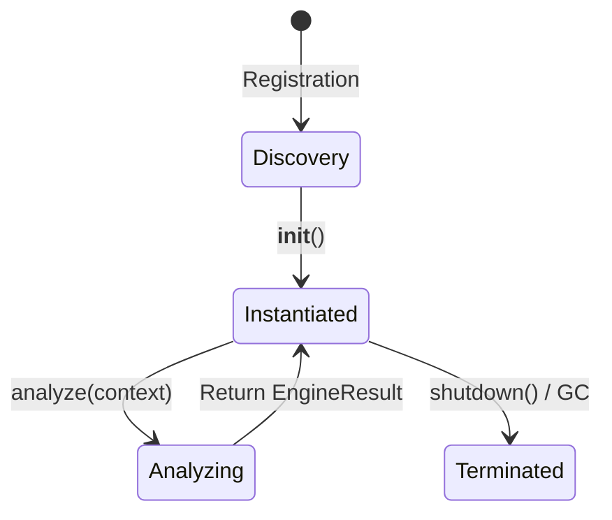

# Engine Lifecycle Specification

This document details the lifecycle, execution pattern, and metrics collection for security engines in NetVisor.

## 1. Lifecycle States

Every engine in NetVisor inherits from `BaseEngine` and goes through the following lifecycle states:



1.  **Discovery & Registration**: The `Registry` scans the engine package path, detects valid subclasses of `BaseEngine`, and indexes them.
2.  **Instantiation**: Engines are instantiated as singletons or thread-safe instances by the Registry.
3.  **Execution (`analyze`)**: The orchestrator triggers `.analyze(context)` on the engine. The execution must be non-blocking and return an `EngineResult` object within specified timeouts.
4.  **Metrics Update**: On completion of each execution, internal performance metrics (execution time, finding count) are updated in-memory.

---

## 2. Interface Contract

All engines must strictly adhere to the following signatures:

```python
class BaseEngine(ABC):
    @property
    @abstractmethod
    def name(self) -> str:
        """Unique string identifier for the engine (e.g. 'device')."""
        pass

    @property
    @abstractmethod
    def version(self) -> str:
        """Semver string indicating logic version (e.g. '1.0.0')."""
        pass

    @abstractmethod
    def analyze(self, context: dict) -> EngineResult:
        """Execute logic synchronously or asynchronously without blocking."""
        pass

    def metrics(self) -> dict:
        """Return execution stats (executions, findings_generated, avg_execution_ms)."""
        pass
```

---

## 3. Metrics Specification

The `.metrics()` API returns a dictionary tracking execution performance:

*   `executions`: Total number of times `analyze()` was called.
*   `findings_generated`: Total number of `Finding` instances yielded across all executions.
*   `avg_execution_ms`: Arithmetic mean of the wall-clock execution time for `analyze()` in milliseconds.
