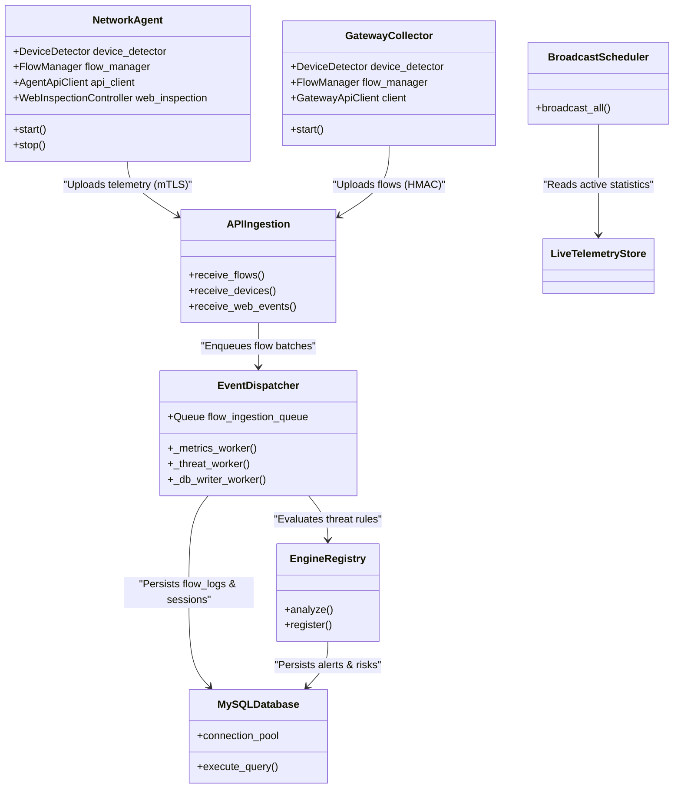
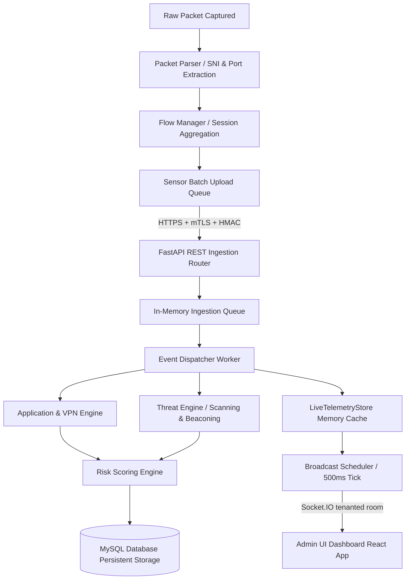
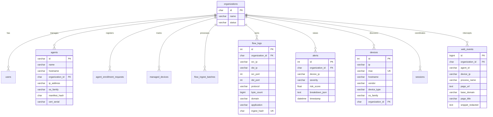
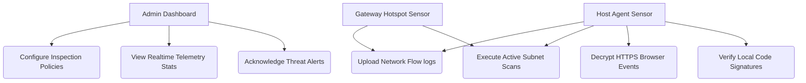
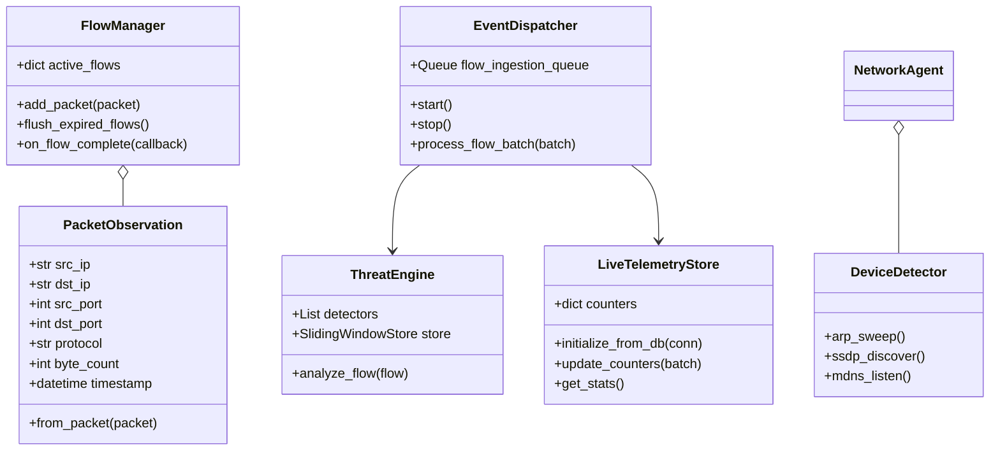
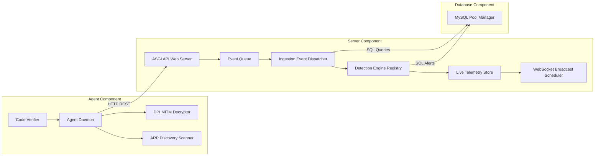
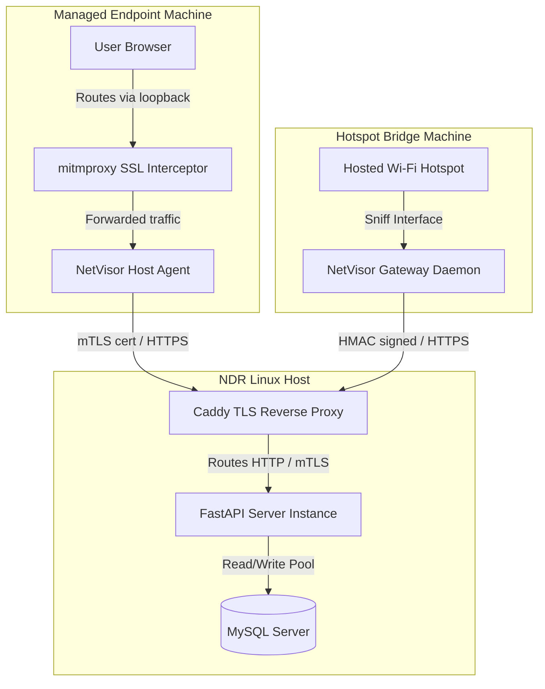
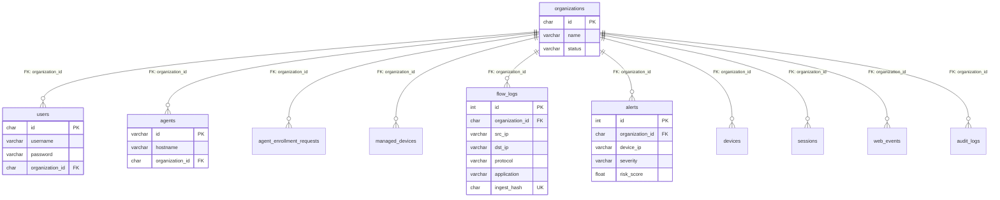

# NetVisor: Distributed Network Detection, Response (NDR), and Performance Monitoring Platform
## Complete Technical Architecture and Software Design Specification Document

---

### 1. Abstract
NetVisor is a distributed, multi-tenant Network Detection and Response (NDR) and Network Performance Monitoring (NPM) system. By deploying secure host-based agents and gateway-level hotspot sensors, NetVisor passively sniffs subnet traffic, maps active network assets, profiles application usage, runs stateful threat detection rules, and decrypts selected HTTPS payloads via a local MITM proxy. Telemetry is collected, validated, and processed asynchronously via a central server event bus, where it is aggregated into an in-memory cache and streamed in real-time to administrative dashboards. This document details the end-to-end design, database structures, security boundaries, and detection algorithms of the NetVisor platform.

---

### 2. Introduction
Modern enterprise network security requires continuous visibility into active assets, protocol usage, and internal lateral movements. Traditional intrusion detection systems (IDS) and NetFlow collectors often operate in isolation, lacking the correlation mechanisms required to link IP addresses to physical devices across dynamic DHCP changes, or to profile encrypted SaaS application traffic. NetVisor addresses these challenges by merging agent-based endpoint telemetry and gateway-level bridge sniffing into a unified analytical backend, delivering real-time threat intelligence and traffic explainability.

---

### 3. Problem Statement
Corporate IT administrators and security teams struggle with several critical visibility and security gaps:
* **Asset Visibility Gaps**: Dynamic DHCP environments and MAC address randomization make tracking persistent hosts difficult. Without physical fingerprinting, static IP mappings quickly become obsolete.
* **Encrypted Blindspots**: The widespread adoption of TLS 1.3, ESNI, and HTTP/3 (QUIC) obscures traditional deep packet inspection (DPI) signatures, rendering perimeter gateway sniffing blind to application-level behaviors.
* **Shadow IT and AI Proliferation**: Unmonitored employee use of generative AI tools, cloud storage, and developer APIs poses significant data loss prevention (DLP) risks.
* **Lateral Threats**: Internal attacks, such as port scanning, brute-forcing internal SSH/RDP servers, DNS tunneling, and local data exfiltration, often bypass perimeter firewalls entirely.
* **Complex Orchestration**: Existing security frameworks (like Zeek or Suricata) require heavy configuration, high compute resources, and lack integrated, real-time administrative dashboards for unified alerting and forensics.

---

### 4. Objectives

#### Functional Objectives
* **Subnet Asset Profiling**: Passive and active discovery of local devices, tracking their hardware MACs, manufacturers, hostnames, and OS details.
* **Application Classification**: Dynamic categorization of traffic flows into specific applications (e.g. YouTube, ChatGPT, Tor) using SNIs, JA4 TLS fingerprints, destination ports, and ASNs.
* **Encrypted Web Inspection**: Intercept and decrypt HTTPS traffic on managed hosts to audit page titles, domains, and queries, with local redaction of sensitive credentials.
* **Threat Alerting**: Auto-detect scanning, periodic C2 beaconing, DNS tunneling, brute-force logins, and exfiltration.
* **Real-time Visualization**: Multi-tenant dashboard streaming live bandwidth, alert feeds, and device state charts.

#### Non-Functional Objectives
* **High Ingestion Performance**: Process thousands of flows per second asynchronously without blocking active collection APIs.
* **Security & Tamper Resistance**: Enforce mutual TLS (mTLS) for sensor-to-server communications and verify local agent integrity on startup.
* **Privacy Guard**: Redact cookies, tokens, and authorization headers at the sensor layer prior to transmission.
* **Multi-Tenant Isolation**: Partition database records, alerts, and socket streams strictly by Organization ID.
* **System Reliability**: Maintain stable memory consumption using sliding-window pruning and database batch writers.

---

### 5. Existing System
Existing network monitoring frameworks include:
* **Zeek (formerly Bro)**: Excellent for protocol analysis but requires high compute, lacks an integrated dashboard, and does not support host-side SSL decryption.
* **Snort / Suricata**: Signature-based IDS engines that do not correlate device identities over time or handle TLS-encrypted traffic natively.
* **NetFlow / IPFIX Collectors**: Provide basic metadata (IPs, ports, bytes) but cannot extract hostnames, mDNS services, or run granular app rules.
* **Endpoint Detection and Response (EDR)**: Focuses on process memory and host logs rather than real-time network traffic flows.

---

### 6. Proposed System
NetVisor introduces a hybrid network-endpoint security framework:
* **Distributed Sensors**: Deploys lightweight [NetworkAgent](file:///c:/Users/prem/Network/agent/main.py#L112) nodes on hosts and [GatewayCollector](file:///c:/Users/prem/Network/gateway/main.py#L128) nodes on hotspot bridges to capture local packets.
* **Central Ingestion Queue**: Processes batches asynchronously via a server event bus, preventing network spikes from dropping data.
* **Multi-Engine Pipeline**: Resolves device types, applications, and threats concurrently using a modular plugin engine registry.
* **Real-Time Memory Cache**: Aggregates metrics in-memory (`LiveTelemetryStore`) to drive WebSockets, minimizing database read overhead.

---

### 7. System Requirements

#### Hardware (Server Node)
* **Processor**: 4-Core CPU (Minimum 2.0 GHz)
* **Memory**: 8 GB RAM
* **Storage**: 50 GB SSD (High I/O capacity for database logs)

#### Software (Server & Sensors)
* **OS**: Linux (Ubuntu 22.04 LTS recommended) or Windows 10/11
* **Runtime**: Python 3.10+
* **Database**: MySQL 8.0+
* **Sensor Dependencies**: Npcap (Windows) or libpcap (Linux) for packet capturing; `mitmproxy` for SSL/TLS decryption.

---

### 8. Technology Stack

| Component / Layer | Technology | Description |
| :--- | :--- | :--- |
| **Programming Language** | Python 3.10+ | Primary language for backend server, agents, and gateways. |
| **Backend Web Framework**| FastAPI (ASGI) | Drives the REST API, lifespan workers, and routers. |
| **Real-time Communication**| Socket.IO (ASGI) | Manages multi-room client dashboard updates. |
| **Database Engine** | MySQL 8.0 | Persists configuration, metrics, and alerts. |
| **Packet Capture Engine** | Scapy / Npcap / libpcap | Performs raw packet sniffing and ARP scans. |
| **SSL/TLS Decryption** | mitmproxy | Local proxy daemon for HTTPS interception. |
| **Cryptography / Signing**| Ed25519 & HMAC-SHA256 | Validates code integrity and signs sensor requests. |
| **Frontend Dashboard** | React, HTML, CSS, JS | Renders the real-time admin interface. |

---

### 9. Overall Architecture

The system operates across three tiers: Sensor nodes capture network metadata and decrypted web logs, the Server Ingestion layer validates and queues incoming batches, and the Processing Event Bus runs classification engines before persisting data and broadcasting updates.

```
Internet
   │
   ▼
Gateway Node (GatewayCollector / Caddy mTLS Proxy)
   │
   ▼
Agent Node (NetworkAgent / mitmproxy SSL Interceptor)
   │
   ▼
NetVisor Server Ingest (FastAPI Routers)
   │
   ▼
Async Event Queue (flow_ingestion_queue)
   │
   ▼
Dispatcher (EventDispatcher Worker)
   │
   ▼
Detection Engines (Device, Application, VPN, Threat)
   │
   ▼
Risk Engine (device_risks Scoring)
   │
   ▼
Database (MySQL Storage) & Broadcast Scheduler (Socket.IO Rooms)
   │
   ▼
Dashboard (React Client UI)
```

---

### 10. Complete Folder Structure
Below is the folder structure of the NetVisor repository located in `c:\Users\prem\Network`:

* **`agent/`**: Contains the endpoint sensor code.
  * [device_detector.py](file:///c:/Users/prem/Network/agent/device_detector.py): Discovers local subnet assets via UPnP, SSDP, mDNS, and NetBIOS.
  * [main.py](file:///c:/Users/prem/Network/agent/main.py): Primary orchestrator for the endpoint service.
  * [traffic_metadata.py](file:///c:/Users/prem/Network/agent/traffic_metadata.py): Local packet analyzer and flow assembly callbacks.
  * **`dpi/`**: HTTPS decryption interceptor hooks and CA certificates.
  * **`security/`**: Ed25519 signature checks and manifest verifiers.
* **`gateway/`**: Contains the gateway hotspot bridge code.
  * [main.py](file:///c:/Users/prem/Network/gateway/main.py): Captures traffic from hosted AP virtual interfaces.
  * **`security/`**: Local credentials and HMAC signing utilities.
* **`app/`**: Contains the central backend server code.
  * [main.py](file:///c:/Users/prem/Network/app/main.py): Sets up FastAPI application, lifespans, and WebSockets.
  * [realtime.py](file:///c:/Users/prem/Network/app/realtime.py): Handles Socket.IO connections, authentication, and multi-tenant rooms.
  * **`api/`**: Routers for authentication, devices, flows, alerts, and DPI monitoring.
  * **`core/`**: Environment configurations and FastAPI security dependencies.
  * **`db/`**: Session wrappers and schema boots.
  * **`engines/`**: Detection plugins (Device, Application, VPN, Threat, and Risk).
  * **`middleware/`**: mTLS validation, CSRF, context mapping, and TLS transport security.
  * **`services/`**: Ingestion queues, event dispatchers, and business logic.
* **`shared/`**: Common libraries shared between server, agent, and gateway.
  * **`collector/`**: Flow management, packet analysis, and preflight configurations.
  * **`security/`**: Shared cryptographic definitions and key protocols.
* **`infra/`**: Configuration templates and deployment scripts.
  * **`database/`**: [init.sql](file:///c:/Users/prem/Network/infra/database/init.sql) database schema and migrations.

---

### 11. Module Architecture

The following diagram illustrates the key modules and their interaction boundaries:



---

### 12. Data Flow Architecture

The data flow within NetVisor proceeds as follows:



1. **Packet Capture**: Packets are intercepted using Scapy/libpcap/Npcap.
2. **Feature Extraction**: Protocol headers, DNS queries, TLS Client Hello records, and payload sizes are extracted.
3. **Session Assembly**: Intercepted packet observations are structured into bidirectional TCP/UDP flow logs.
4. **Queueing**: Flows are aggregated into batches and posted over HTTP.
5. **Ingestion API**: FastAPI validates request headers (authenticating agents via HMAC/mTLS) and pushes payloads onto the queue.
6. **Async Dispatching**: The dispatcher processes queued flows, executing the classification and threat detection pipelines.
7. **Storage & Live Update**: Database tables are updated, and telemetry is pushed to administrators in real time.

---

### 13. Database Design

The `network_security` database schema is designed for multi-tenancy, using `organization_id` as the tenant isolation key. Performance is optimized through indexes, unique hashes, and strict foreign keys.



---

### 14. Detection Engines

1. **Device Engine** ([app/engines/device/engine.py](file:///c:/Users/prem/Network/app/engines/device/engine.py)): Integrates active ARP sweeps, SSDP XML discovery parsing, UPnP friendly names, mDNS query caching, and DHCP Option 55 parameter fingerprinters.
2. **Application Engine** ([app/engines/application/engine.py](file:///c:/Users/prem/Network/app/engines/application/engine.py)): Combines TLS JA4 fingerprints, DNS resolution mapping, CDN base IP matching, and port checks to tag application names.
3. **VPN Engine** ([app/engines/vpn/engine.py](file:///c:/Users/prem/Network/app/engines/vpn/engine.py)): Identifies proxy tunnels and Tor exits using:
   - **WireGuard**: Pattern matches specific UDP handshake exchanges.
   - **OpenVPN**: Shifts header bytes to evaluate raw opcodes (`opcode >> 3 & 0x1F`).
4. **Threat Engine** ([app/engines/threat/engine.py](file:///c:/Users/prem/Network/app/engines/threat/engine.py)): Runs stateful detectors (Port Scanning, C2 Beaconing, DNS Tunneling, brute forcing, data exfiltration) using sliding-window stores.

---

### 15. Security Architecture

NetVisor implements a Zero-Trust security boundary across all distributed nodes:
* **mTLS Authentication**: Enforces client certificates for sensitive paths, verified against an administrative CRL on startup.
* **Payload HMAC Signing**: All Rest APIs use HMAC-SHA256 signatures validated against active keys stored in the database.
* **Nonce Replay Prevention**: Unique nonces are stored in `agent_request_nonces` and verified to prevent request replay attacks.
* **Secure Boot manifest signing**: Computes hashes of python source files and validates them against an Ed25519-signed manifest (`manifest.sig`) on boot.

---

### 16. Gateway Architecture
The [GatewayCollector](file:///c:/Users/prem/Network/gateway/main.py) is a network-layer monitoring bridge:
* **Interface Resolution**: Auto-detects virtual AP/hotspot interfaces (on subnets like `192.168.137.0/24`) to intercept client packets.
* **Passive Sniffing**: Uses Scapy/libpcap to passively extract DNS queries, HTTP host headers, and TLS SNIs, preserving gateway routing performance.
* **Active ARP Sweep**: Broadcasts ARP requests on the subnet periodically to identify and profile active devices.

---

### 17. Agent Architecture
The [NetworkAgent](file:///c:/Users/prem/Network/agent/main.py) is deployed on managed end-user systems:
* **Local Browser Proxy**: Installs a local Root CA certificate and configures browser settings to intercept HTTPS traffic via `mitmproxy`.
* **Snippet Redaction**: Uses regex rules locally to scrub cookie values, bearer tokens, passwords, and authorization headers, uploading only safe url logs and page titles.
* **Integrity Self-Check**: Verifies local python file hashes against a signed secure boot manifest before spawning worker loops.

---

### 18. Server Architecture
The server ([app/main.py](file:///c:/Users/prem/Network/app/main.py)) orchestrates ingestion and streaming:
* **Lifespan Manager**: Boots up resources, validates environment configurations, ensures database schemas are bootstrapped, and starts background threads.
* **Middlewares Stack**: Sequentially handles transport security overrides, client certificate validation, CSRF checks, and request context maps.
* **Real-time Event Dispatcher**: Emits live statistics to tenants isolated by Socket.IO rooms.

---

### 19. Dashboard Architecture
The dashboard UI contains 8 primary workspaces:
1. **Login Screen**: Handles administrator credentials and issues JWT session tokens.
2. **Overview Dashboard**: Renders live bandwidth utilization charts, active alert feeds, and quick system stats.
3. **Devices Inventory**: Lists MAC, IP, hostname, vendor, OS, and active threat levels of all discovered assets.
4. **Alerts Panel**: Lists detected anomalies, providing severity filters and historical audit trails.
5. **VPN Monitor**: Pinpoints active encrypted tunnels, showing connected client IPs and data usage.
6. **Applications Workspace**: Displays bandwidth consumption categorized by application (e.g. YouTube, ChatGPT).
7. **Logs Workspace**: Provides system audit logs and diagnostic console logs.
8. **Settings Workspace**: Manages agent enrollment requests, CA files, and inspection policies.

---

### 20. API Design

#### A. Flow Telemetry Batch Ingestion
* **Endpoint**: `POST /api/v1/gateway/flows/batch`
* **Headers Required**:
  - `X-Agent-Id`: Unique identifier of the sensor.
  - `X-Agent-Key-Version`: Key identifier for rotating secret key.
  - `X-Agent-Timestamp`: UTC timestamp ISO format.
  - `X-Agent-Nonce`: Cryptographic nonce.
  - `X-Agent-Signature`: HMAC-SHA256 hex string.
* **Request Payload**:
  ```json
  {
    "organization_id": "default-org-id",
    "flows": [
      {
        "src_ip": "192.168.1.105",
        "dst_ip": "8.8.8.8",
        "src_port": 51234,
        "dst_port": 53,
        "protocol": "UDP",
        "byte_count": 85,
        "packet_count": 1,
        "domain": "google.com",
        "analysis_signals": ["dns_query"],
        "duration": 1.5,
        "agent_id": "agent-uuid-here",
        "organization_id": "default-org-id",
        "start_time": "2026-06-28T14:38:00Z",
        "last_seen": "2026-06-28T14:38:01.5Z",
        "average_packet_size": 85.0
      }
    ]
  }
  ```
* **Response Payload**:
  ```json
  {
    "status": "success",
    "server_time": "2026-06-26T15:32:00Z",
    "count": 1,
    "backend_tls_pins": ["SPKI-SHA256-HASH-1"]
  }
  ```

#### B. Decrypted Web Events Upload
* **Endpoint**: `POST /api/v1/agents/web-events/batch`
* **Request Payload**:
  ```json
  [
    {
      "agent_id": "agent-uuid",
      "device_ip": "192.168.1.105",
      "process_name": "chrome.exe",
      "browser_name": "Chrome",
      "page_url": "https://github.com/user/repo",
      "base_domain": "github.com",
      "page_title": "GitHub Repo",
      "content_category": "dev",
      "request_bytes": 1024,
      "response_bytes": 4096
    }
  ]
  ```
* **Response Payload**:
  ```json
  {
    "status": "success",
    "server_time": "2026-06-26T15:32:00Z",
    "count": 1
  }
  ```

---

### 21. Sequence Diagrams

#### A. Device Discovery Sequence
```
Agent Node               Server API              Device Service          Socket.IO Room          Admin UI
    │                         │                         │                         │                  │
    ├─► Active ARP Scan ─────┐│                         │                         │                  │
    │   NetBIOS port 137 query│                         │                         │                  │
    │   SSDP XML friendly name│                         │                         │                  │
    │◄────────────────────────┘                         │                         │                  │
    │                         │                         │                         │                  │
    ├─► POST /devices/batch ─►│                         │                         │                  │
    │   (JSON payload)        ├─► touch_device_seen ───►│                         │                  │
    │                         │   (MySQL Insert/Update) │                         │                  │
    │                         │                         ├─► device_event ────────►│                  │
    │                         │                         │   (Socket Broadcast)    ├─► Push Update ──►│
    │                         │                         │                         │   (UI Rerender)  │
```

#### B. VPN Detection Sequence
```
Gateway Node             Server API              Event Dispatcher            VPN Engine             Database
      │                        │                         │                        │                      │
      ├─► Sniff UDP Packet ───┐│                         │                        │                      │
      │   (Match sizes)       │                         │                        │                      │
      │◄──────────────────────┘                         │                        │                      │
      │                        │                         │                        │                      │
      ├─► POST /flows/batch ──►│                         │                        │                      │
      │   (analysis_signals)   ├─► Enqueue Ingest Queue ─►│                        │                      │
      │                        │                         ├─► Run VPN Pipeline ───►│                      │
      │                        │                         │   (Sum weights)        ├─► Score >= limit ───┐│
      │                        │                         │                        │   (Flag VPN)        ││
      │                        │                         │                        │◄────────────────────┘│
      │                        │                         │                        │                      │
      │                        │                         │                        ├─► INSERT INTO alerts─┼─┐
      │                        │                         │                        │   (Severity: HIGH)   │ │
      │                        │                         │                        │◄─────────────────────┘ │
      │                        │                         │                        │                      │
```

#### C. Threat Detection Sequence
```
Agent/Gateway            Server API              Event Dispatcher          Threat Engine          Socket.IO
       │                       │                         │                        │                    │
       ├─► POST /batch ───────►│                         │                        │                    │
       │   (Flow summary)      ├─► Enqueue Ingest Queue ─►│                        │                    │
       │                       │                         ├─► Run Threat Engine ──►│                    │
       │                       │                         │   (Evaluate detectors) │                    │
       │                       │                         │                        ├─► Beaconing / Scan─┐
       │                       │                         │                        │   (Finding created)│
       │                       │                         │                        │◄───────────────────┘
       │                       │                         │                        │                    │
       │                       │                         │                        ├─► emit alert_event─┼─┐
       │                       │                         │                        │   (Dashboard Push) │ │
       │                       │                         │                        │◄───────────────────┘ │
       │                       │                         │                        │                    │
```

#### D. SSL/TLS Decryption and Web Ingestion Sequence
```
Browser                  mitmproxy (Agent)         Local Redactor          FastAPI Server           Dashboard
   │                             │                        │                       │                     │
   ├─► HTTPS GET request ───────►│                        │                       │                     │
   │   (Intercepted with CA)     ├─► Redact sensitive ───►│                       │                     │
   │                             │   headers / payload    │                       │                     │
   │                             │◄───────────────────────┘                       │                     │
   │                             ├─► Send redacted URL ───┼──────────────────────►│                     │
   │                             │   and page title       │                       ├─► Update telemetry ─┼─► Stream update
   │                             │                        │                       │   & write to DB     │   to React UI
   │◄────────────────────────────┤                        │                       │                     │
```

---

### 22. Use Case Diagram



---

### 23. Class Diagram



---

### 24. Component Diagram



---

### 25. Deployment Diagram



---

### 26. ER Diagram



---

### 27. Data Dictionary

#### A. Table: `organizations`
Stores system tenants.
* **`id`**: `CHAR(36)` (Primary Key).
* **`name`**: `VARCHAR(100)` (Unique, Tenant name).
* **`status`**: `VARCHAR(20)` (Tenant state, default: `'active'`).
* **`created_at`**: `DATETIME` (Record creation time).

#### B. Table: `users`
System administrators.
* **`id`**: `CHAR(36)` (Primary Key).
* **`username`**: `VARCHAR(50)` (Unique, credentials).
* **`password`**: `VARCHAR(255)` (Salted bcrypt hash).
* **`email`**: `VARCHAR(100)` (Unique admin email).
* **`role`**: `VARCHAR(20)` (`admin`, `viewer`, etc.).
* **`status`**: `VARCHAR(20)` (`active`, `suspended`).
* **`organization_id`**: `CHAR(36)` (Foreign Key $\rightarrow$ `organizations.id`).

#### C. Table: `agents`
Managed endpoint sensors.
* **`id`**: `VARCHAR(100)` (Primary Key).
* **`name`**: `VARCHAR(100)` (Friendly identifier).
* **`hostname`**: `VARCHAR(100)` (System hostname).
* **`api_key`**: `TEXT` (Encrypted API key).
* **`organization_id`**: `CHAR(36)` (Foreign Key $\rightarrow$ `organizations.id`).
* **`ip_address`**: `VARCHAR(50)` (Last reported IP).
* **`os_family`**: `VARCHAR(50)` (Operating system family).
* **`version`**: `VARCHAR(50)` (Agent software version).
* **`inspection_enabled`**: `BOOLEAN` (True if HTTPS decryption active).
* **`manifest_hash`**: `CHAR(64)` (Hash of files on secure boot).
* **`cert_serial`**: `VARCHAR(64)` (mTLS Certificate serial number).
* **`last_seen`**: `DATETIME` (Timestamp of last report).

#### D. Table: `flow_logs`
Network flow summaries.
* **`id`**: `INT AUTO_INCREMENT` (Primary Key).
* **`organization_id`**: `CHAR(36)` (Foreign Key $\rightarrow$ `organizations.id`).
* **`src_ip` / `dst_ip`**: `VARCHAR(50)` (Endpoints, Indexed).
* **`src_port` / `dst_port`**: `INT` (Port indices).
* **`protocol`**: `VARCHAR(10)` (TCP, UDP, ICMP).
* **`packet_count`**: `INT` (Total packet count).
* **`byte_count`**: `BIGINT` (Total byte count).
* **`duration`**: `FLOAT` (Connection duration in seconds).
* **`domain` / `sni`**: `VARCHAR(255)` (Target hostname).
* **`application`**: `VARCHAR(50)` (Classified app name, default: `'Other'`).
* **`ingest_hash`**: `CHAR(40)` (Unique SHA1 of endpoints and packet hashes, prevents duplicate records).

#### E. Table: `alerts`
Security warnings.
* **`id`**: `INT AUTO_INCREMENT` (Primary Key).
* **`organization_id`**: `CHAR(36)` (Foreign Key $\rightarrow$ `organizations.id`).
* **`device_ip`**: `VARCHAR(50)` (Anomalous IP).
* **`severity`**: `VARCHAR(20)` (`INFO`, `MEDIUM`, `HIGH`, `CRITICAL`).
* **`risk_score`**: `FLOAT` (Numeric threat evaluation score).
* **`breakdown_json`**: `TEXT` (Details of anomaly triggers).
* **`timestamp`**: `DATETIME` (Trigger timestamp).

#### F. Table: `web_events`
Redacted decrypted web logs.
* **`id`**: `BIGINT AUTO_INCREMENT` (Primary Key).
* **`organization_id`**: `CHAR(36)` (Foreign Key $\rightarrow$ `organizations.id`).
* **`agent_id`**: `VARCHAR(100)` (Source agent).
* **`device_ip`**: `VARCHAR(50)` (Client IP).
* **`process_name`**: `VARCHAR(100)` (Process spawning traffic, e.g. `chrome.exe`).
* **`page_url`**: `TEXT` (URL, query parameters redacted).
* **`base_domain`**: `VARCHAR(255)` (Target domain).
* **`page_title`**: `VARCHAR(255)` (Redacted title text).
* **`snippet_redacted`**: `TEXT` (Scrubbed parameters summary).
* **`first_seen` / `last_seen`**: `DATETIME` (Rolling window timestamps).

---

### 28. Algorithms

#### A. Port Scan Detection Algorithm
```python
# Stateful scanning check (app/engines/threat/port_scan.py)
def analyze_port_scan(flow, observed_at, store, config):
    src_ip = flow.src_ip
    dst_port = flow.dst_port
    
    # Store connection attempt in memory
    store.add(key=(src_ip, "port_scan"), timestamp=observed_at, value=dst_port)
    
    # Prune elements outside configuration window (e.g. 60 seconds)
    bucket = store.get_and_prune(key=(src_ip, "port_scan"), observed_at=observed_at, window=config.port_scan_window)
    
    unique_ports = {port for timestamp, port in bucket}
    if len(unique_ports) >= config.port_scan_threshold:
        return Finding(type="port_scan", severity="HIGH", confidence=0.90)
    return None
```

#### B. C2 Beaconing Detection Algorithm
```python
# Heartbeat beacon calculation (app/engines/threat/beaconing.py)
def analyze_beaconing(flow, observed_at, store, config):
    key = (flow.src_ip, flow.dst_ip, flow.dst_port, "beaconing")
    
    store.add(key=key, timestamp=observed_at)
    bucket = store.get_and_prune(key=key, observed_at=observed_at, window=config.beaconing_window)
    
    if len(bucket) < config.beaconing_min_events:
        return None
        
    timestamps = sorted([ts for ts in bucket])
    intervals = [(timestamps[i] - timestamps[i-1]).total_seconds() for i in range(1, len(timestamps))]
    
    avg_interval = mean(intervals)
    interval_stdev = pstdev(intervals) if len(intervals) > 1 else 0.0
    cov = interval_stdev / avg_interval if avg_interval > 0 else 0.0
    
    # Target regular heartbeats (CoV < threshold or jitter < 1s)
    if 5 <= avg_interval <= 600 and (cov <= config.beaconing_cov_threshold or interval_stdev <= 1.0):
        return Finding(type="beaconing", severity="HIGH", confidence=0.90)
    return None
```

#### C. DNS Tunneling Detection Algorithm
```python
# Entropy & Frequency Analysis (app/engines/threat/dns_tunneling.py)
def _calculate_entropy(text: str) -> float:
    if not text:
        return 0.0
    counts = defaultdict(int)
    for char in text:
        counts[char] += 1
    entropy = 0.0
    length = len(text)
    for count in counts.values():
        p = count / length
        entropy -= p * math.log2(p)
    return entropy

def analyze_dns_tunneling(flow, observed_at, dns_subdomain_counts, config):
    domain = flow.domain.lower()
    if not domain or domain.count(".") < 2:
        return None
        
    parts = domain.split(".")
    subdomain = parts[0]
    parent_domain = ".".join(parts[-2:])
    
    # Check 1: Label length and Shannon entropy of subdomain
    entropy = _calculate_entropy(subdomain)
    if len(subdomain) > config.dns_tunneling_label_length and entropy > config.dns_tunneling_entropy_threshold:
        return Finding(finding_type="dns_tunneling", severity="CRITICAL")
        
    # Check 2: Dynamic Subdomain query rate limits
    subdomain_dict = dns_subdomain_counts[flow.src_ip][parent_domain]
    subdomain_dict[subdomain] = observed_at
    
    # Prune expired keys
    expired = [sub for sub, ts in subdomain_dict.items() if (observed_at - ts).total_seconds() > config.dns_tunneling_ttl]
    for sub in expired:
        del subdomain_dict[sub]
        
    if len(subdomain_dict) > config.dns_tunneling_bloom_threshold:
        return Finding(finding_type="dns_tunneling", severity="CRITICAL")
    return None
```

#### D. Multimodal Device Discovery Pipeline
```python
# Multi-protocol profile resolver (agent/device_detector.py)
def resolve_device(mac, ip, hostname, ssdp_name, mdns_services):
    # Heuristics-based profile resolver
    vendor = OUI_lookup(mac[:8])
    
    # Hostname & SSDP keywords matching
    profile = "Workstation"
    os = "Unknown"
    
    combined_name = f"{hostname} {ssdp_name}".lower()
    if "iphone" in combined_name or "ipad" in combined_name:
        profile, os = "Smartphone", "iOS"
    elif "android" in combined_name:
        profile, os = "Smartphone", "Android"
    elif "chromecast" in combined_name:
        profile, os = "Media Player", "CastOS"
    elif "printer" in combined_name or "laserjet" in combined_name:
        profile, os = "Printer", "Embedded Firmware"
    elif "windows" in combined_name or "win-" in combined_name:
        profile, os = "Workstation", "Windows"
    elif "darwin" in combined_name or "macbook" in combined_name:
        profile, os = "Workstation", "macOS"
        
    return {"vendor": vendor, "device_type": profile, "os_family": os}
```

#### E. Client-Side Privacy Redactor
```python
# Local URL scrubber (agent/dpi/redactor.py)
import re

def redact_url(url: str) -> str:
    # 1. Redact query parameters
    scrubbed = re.sub(r"\?.*$", "?[REDACTED]", url)
    # 2. Redact passwords / auth values from path
    scrubbed = re.sub(r"(?i)(token|pass|auth|key|secret)/[a-zA-Z0-9_\-\~\.]+", r"\1/[REDACTED]", scrubbed)
    return scrubbed
```

---

### 29. Detection Logic

NetVisor maps traffic to endpoints through a multi-layered detection matrix:

| Signal Type | Evaluator / Method | Alert Trigger Level | Action Taken |
| :--- | :--- | :--- | :--- |
| **Port Scan** | Count of unique destination ports in $T$ window. | $\ge 25$ unique ports in 60s. | Raise Alert & Increment IP Risk. |
| **Beaconing** | CoV of intervals between subsequent connections. | $\text{CoV} \le 0.15$ (min 5 events). | Raise Alert, tag destination IP. |
| **DNS Tunneling**| Subdomain entropy and label size check. | $\text{Entropy} > 4.5$ & Length $> 30$. | Raise Alert, log domain query. |
| **Tor Exit IP** | Compares destination IP with Tor exit list. | Direct match. | Raise Alert (Severity: HIGH). |
| **OpenVPN UDP** | Shift header evaluation of first byte. | `opcode == 0x01` or `0x02`. | Classify application as "OpenVPN". |

---

### 30. Performance Optimizations

#### A. In-Memory Ingestion Buffers
Telemetry is uploaded from sensors using bulk batches rather than single records. Upon hitting the server, the FastAPI route writes the JSON data directly into the `flow_ingestion_queue` memory list, returning an instant `202 Accepted` response to the sensor. This keeps route handling fast and prevents request timeouts under heavy load.

#### B. Suppressing DB Writes via Ingest Hashes
The `flow_logs` table enforces a unique key constraint on the `ingest_hash` column. The server computes this hash from the flow parameters (`src_ip`, `dst_ip`, `ports`, `packet_count`, `byte_count`). If the flow is already registered, the database discards the insert statement, preventing unnecessary disk I/O.

#### C. Live Cache overview stats
To prevent the Socket.IO broadcast scheduler from running heavy `SUM` and `COUNT` queries on the MySQL database every 500ms, the [LiveTelemetryStore](file:///c:/Users/prem/Network/app/services/live_telemetry_store.py) updates in-memory counters (e.g., active device IP list, rolling bytes count, recent alerts queue). The scheduler reads directly from this cache, minimizing database read overhead.

---

### 31. Scalability

NetVisor scales to support large enterprise workloads through several key architectural features:
* **Decoupled Worker Modes**: The database writer worker can be run in `embedded` mode for small deployments or offloaded to `external` workers (e.g., Celery/Redis) in high-traffic enterprise environments.
* **Database Partitioning**: The `flow_logs` and `web_events` tables are partitioned by `organization_id` and indexed by `last_seen` timestamps. This ensures that query execution times remain fast even as tables grow to millions of rows.
* **Worker Pools**: Ingestion, metrics updating, and threat detection run in separate thread groups to maximize multi-core CPU utilization.

---

### 32. Security Analysis

#### Confidentiality
* **Transport Encryption**: All REST API and WebSocket connections are wrapped in TLS 1.3 encryption.
* **Tenancy Isolation**: Database queries and Socket.IO rooms are partitioned using `organization_id` to prevent data leakage between tenants.
* **DPI Redaction**: The proxy manager scrubs authentication headers, cookies, and tokens locally before uploading events.

#### Integrity
* **Request Signing**: Sensor uploads are signed using rotating HMAC-SHA256 keys derived from `settings.AGENT_MASTER_KEY`, preventing request spoofing.
* **Replay Prevention**: Validates unique request nonces and timestamp skews.
* **Secure Boot**: The agent checks the local file manifest against an Ed25519 signature on startup to block execution if files have been modified.

#### Availability
* **Backpressure Management**: Ingestion queues absorb network traffic spikes, preventing the server from running out of memory.
* **Stateful Pruning**: Prunes sliding-window stores in memory automatically to control RAM consumption.

---

### 33. Limitations

* **SSL Decryption Limits**: HTTPS decryption requires manual Root CA cert installation on the endpoint, limiting visibility for unmanaged BYOD devices.
* **Private MAC Randomization**: MAC randomization on mobile devices can occasionally split a single host into multiple device profiles in the inventory.
* **Scale Bottlenecks**: High-traffic deployments using single-server setups will eventually hit CPU/disk I/O bottlenecks on the MySQL database, requiring distributed database nodes.
* **IPv6 Support**: Sniffers and flow aggregators currently optimize for IPv4 addresses; IPv6 tunnels are mapped but run limited profiling heuristics.

---

### 34. Future Scope

* **Correlation Engines**: Implement cross-flow heuristic correlation to map threats to the Mitre ATT&CK matrix.
* **Distributed Message Queues**: Transition from in-process queues to Redis or Apache Kafka to support multi-node server scaling.
* **AI/ML Security Profiler**: Add User and Entity Behavior Analytics (UEBA) to identify anomalous lateral movements.
* **Encrypted Payload Analysis**: Train machine learning models to identify traffic types (e.g., voice, video, file transfers) in encrypted tunnels without decryption.

---

### 35. Conclusion

NetVisor is a modular, high-performance Network Detection and Response platform. Its hybrid design balances passive flow analysis with endpoint-level decryption, and its decoupled event bus architecture ensures scalability under heavy ingestion loads. By combining rotating HMAC request signing, Ed25519-signed manifest verification, and local privacy redaction, NetVisor provides comprehensive network visibility while maintaining strict data confidentiality and system integrity.
